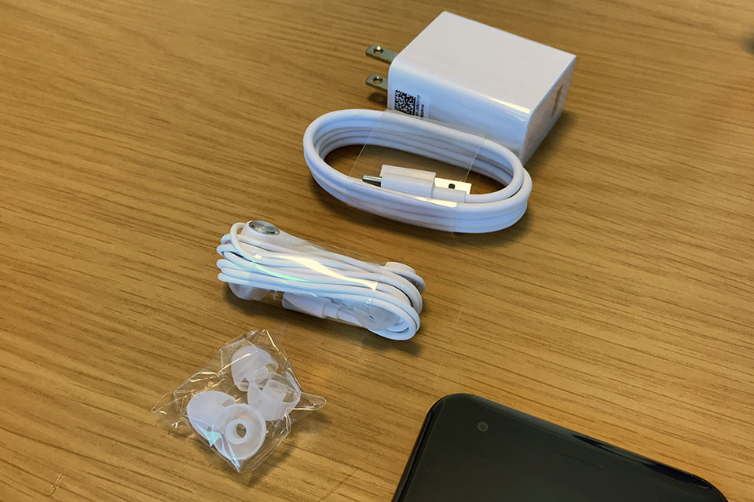

iPhone7Plus を使い続けているが、これとは別に初の Android 端末として __Asus ZenFone 4__ を買った。

  

    
  

  

    

      <a href="https://www.amazon.co.jp/dp/B075L6XM9Z?tag=neos21-22&amp;linkCode=osi&amp;th=1&amp;psc=1">ASUS ZenFone4 SIMフリー スマートフォン (ホワイト/5.5インチ)【日本正規代理店品】(オクタコアCPU/6GB/64GB/3300mAh) ZE554KL-WH64S6/A</a>
    

  

- [ZenFone4!!](https://www.instagram.com/p/BbeneI3gn-c/)

見た目はかなり iPhone7 を意識している。

- [左が Zenfone4、右が iPhone6Plus。](https://www.instagram.com/p/BbenwSjg3IE/)
- [下が iPhone6Plus、上が Zenfone4。よく似てる](https://www.instagram.com/p/BbennJJgQEt/)

主なスペックは以下のとおり。

- カラーバリエーション：ムーンライトホワイト or ミッドナイトブラック
- 内蔵ストレージ：64GB (Google ドライブ 100GB 付き・microSD は 2TB まで可能)
- CPU：Qualcomm Snapdragon 660 (オクタコア)
- GPU：Adreno 512
- メモリ：6GB
- 800万画素・120度広角のカメラ搭載
- nano SIM スロット2つ (2つ入れる場合は microSD が使えなくなる)
- OS：Android 7.1.1
- ※参考：[ZenFone 4 (ZE554KL) | スマートフォン | ASUS 日本](https://www.asus.com/jp/Phone/ZenFone-4-ZE554KL/Tech-Specs/)

iPhone7 そっくりのデュアルカメラ搭載だが、コチラは望遠ではなく120度の広角レンズを用意している。iPhone がポートレート向けの望遠レンズを備えているのとは異なり、セルフィ方面に力を入れているのが Asus な感じ。事実、この ZenFone 4 と同じラインナップに、_Asus ZenFone 4 Selfie Pro_ という自撮りがしやすい機種もある。

なお、上位機種の __ZenFone 4 Pro__ はセカンドカメラが望遠レンズなので、コチラの方が iPhone に近いかも。

付属品はこんな感じ。__「36分で約50％まで急速充電可能」__という BoostMaster テクノロジーを取り入れた急速充電器が付属している。本体側のポートは USB-C なのだが、急速充電用のケーブルの端子が異なる。ネット上の情報を見ると、普通の充電器だと上手く充電できない不具合に遭遇している人もいるっぽいので、ひとまず公式の機材で使うことにする。

さすがオクタコアに 6GB メモリ、GPU も高性能なだけあって、高スペックを要求するスマホゲー「__Fate/Grand Order__」もヌルヌル動く。

iPhone に双子の兄弟が出来たみたいで面白い。Asus は Apple クローンみたいな Windows・Android が揃っていて良いですね。
