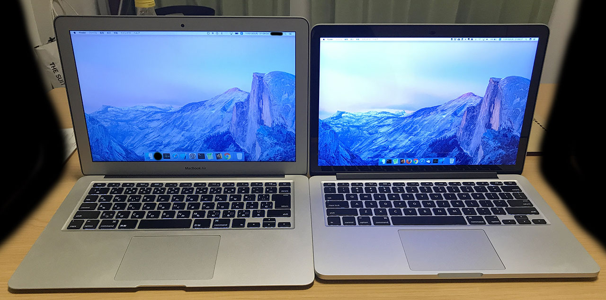
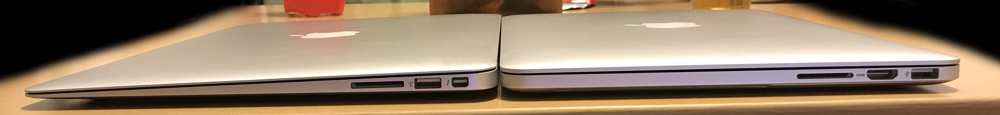
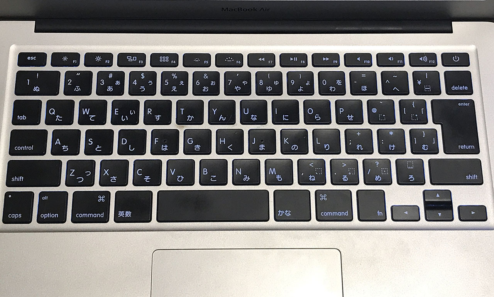
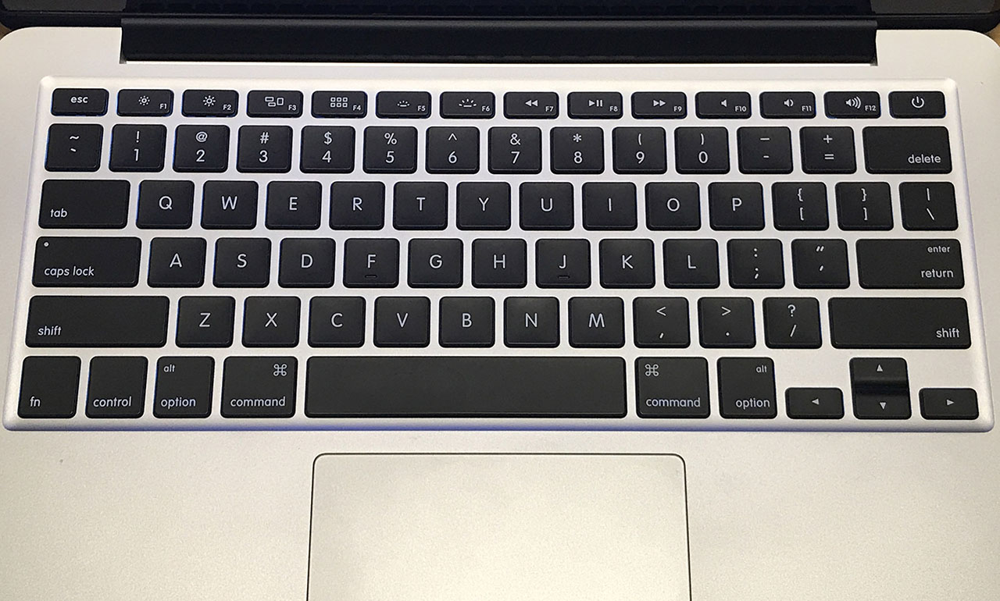

会社で使っている *MacBookAir 13インチ Early 2015* を自宅に持って帰っていたので、自分の **MacBookPro 13インチ Early 2015** と外観を比べてみた。

どちらも13インチで2015年モデルなので、どんな違いがあるかなぁ～と思っていたら、意外な事実が…。

  

    
  

  

    

      <a href="https://www.amazon.co.jp/dp/B08N6MMJX5?tag=neos21-22&amp;linkCode=osi&amp;th=1&amp;psc=1">最新 Apple MacBook Pro Apple M1 Chip (13インチPro, 8GB RAM, 256GB SSD) - スペースグレイ</a>
    

  

*左が Air*・**右が Pro**。(部屋が汚いので周りを黒く塗り潰しています)

…

**… Air の方が大きくね？**

白ベゼルが Air で、黒ベゼルになると Pro という区別は自分の中にあったのだけど、まさか Air の方が大きいとは思わなかった。

改めてスペックを並べてみると、以下のとおりだった。

| -    | MacBookAir   | MacBookPro |
|------|--------------|------------|
| 幅   | 32.5cm       | *31.4cm*   |
| 奥行 | 22.7cm       | *21.9cm*   |
| 高さ | 0.3～*1.7cm* | 1.8cm      |
| 重量 | *1.35kg*     | 1.58kg     |

- 参考：[MacBook Air (13-inch, Early 2015) - 技術仕様](https://support.apple.com/kb/SP714?locale=ja_JP&viewlocale=ja_JP)
- 参考：[MacBook Pro (Retina, 13-inch, Early 2015) - 技術仕様](https://support.apple.com/kb/SP715?locale=ja_JP&viewlocale=ja_JP)

高さ (厚さ) だけは Air の方が若干薄いが、それでも1ミリ差。幅と奥行きは Air の方が1センチずつ大きくてビックリした。重さはさすがに Air の方が 230g 軽い。

*左が Air*・**右が Pro**。

ついでに、*Air は JIS (日本語) キーボード*、**Pro は US (英語) キーボード**だったので、キー配列についても比較してみた。

↑コチラが *Air・JIS 配列*。

↑コチラが **Pro・US 配列**。

日本語配列の「英数」「かな」あたりのキーって要らないよなぁ…。Fn キーも左側にないと、Fn + Delete キーの操作がしづらい。加えて Mac の日本語配列は CapsLock と Ctrl の位置が気持ち悪いので絶対選ばない。会社でも US キーボードを外付けして使っている。

---

というワケで、**Air は意外と大きかった**、というのが今回の発見でした。

ちなみに、*11インチの Air も、12インチ MacBook より大きく、重い。*

- 参考：[MacBook 2017 買ってみました。MacBookAir 11インチと比べて思うこと。 - talblo 良いもの+ひとりごと](http://www.talblo.com/entry/2017/07/30/macbook2017_macbookair)
- 参考：[MacBook 12とMacBook Air 11の外観を詳しく比較してみた | SmCo memory](http://smcomemory.com/macbook-5892)
- 参考：[軽いMacならどっち？MacBook12インチ・MacBookAir11インチを徹底比較](https://www.ex-it-blog.com/MacBook-or-Air)
- 参考：[新型MacBook 12インチとMacBook Airを購入するならどちらがいい？ - Apple製品を購入する前に要チェック！！](http://appleinfo.hateblo.jp/entry/2016/03/06/130133)

コチラは両方とも実機を見たことしかないが、数値で比べてみると以下のとおり。

| -    | MacBookAir (11インチ Early 2015) | MacBook (12インチ 2015～2017) |
|------|----------------------------------|-------------------------------|
| 幅   | 30cm                             | *28.05cm*                     |
| 奥行 | *19.2cm*                         | 19.65cm                       |
| 高さ | 0.3～1.7cm                       | 0.35～*1.31cm*                |
| 重量 | 1.08kg                           | *0.92kg*                      |

- 参考：[MacBook Air (11-inch, Early 2015) - 技術仕様](https://support.apple.com/kb/SP713?locale=ja_JP&viewlocale=ja_JP)
- 参考：[MacBook (Retina, 12-inch, 2017) - 技術仕様](https://support.apple.com/kb/SP757?viewlocale=ja_JP&locale=ja_JP)

あぁ… 920g の MacBook ほすぃ…。
