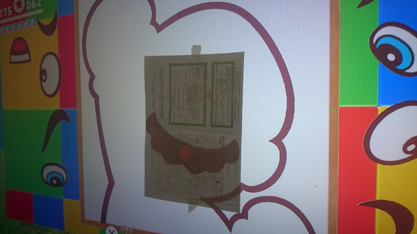

発売日当日に Amazon で定価購入できた、**Nintendo Switch スーパーマリオオデッセイセット**。暇を見付けてはチマチマやっている。

- [Nintendo Switch スーパーマリオオデッセイセットを買った](/blog/2017/10/30-01.html)

  

    
  

  

    

      <a href="https://hb.afl.rakuten.co.jp/hgc/g00pukw2.waxycf8e.g00pukw2.waxyd3c6/?pc=https%3A%2F%2Fitem.rakuten.co.jp%2Fjism%2F4902370537789-54-40560-n%2F&amp;m=http%3A%2F%2Fm.rakuten.co.jp%2Fjism%2Fi%2F12699000%2F">【Switch】スーパーマリオ オデッセイ 任天堂 [HAC-P-AAACA NSWスーパーマリオ オデッセイ]</a>
    

    

      <a href="https://hb.afl.rakuten.co.jp/hgc/g00pukw2.waxycf8e.g00pukw2.waxyd3c6/?pc=https%3A%2F%2Fwww.rakuten.co.jp%2Fjism%2F&amp;m=http%3A%2F%2Fm.rakuten.co.jp%2Fjism%2F">Joshin web 家電とPCの大型専門店</a>
    

    
価格 : 5850円

  

1週間程度でシナリオクリアはできたけど、それからのパワームーン集めが大変でコツコツやっている。9割は自力で見付けられるけど、残り1割は攻略サイトとか頼っている感じ。

今回は攻略情報の探し方と、自分がやってみて難しかったパワームーンの攻略ヒントをいくつか紹介しようと思う。

## 目次

## マリオオデッセイ攻略情報がまとまっているサイト

僕がマリオオデッセイの攻略情報を最初に探すのは以下のサイト。

- [スーパーマリオオデッセイ攻略まとめwiki【マリオスイッチ】](https://wiki.denfaminicogamer.jp/marioodyssey/)

電ファミ Wiki はパワームーンの攻略情報が一番ちゃんとまとまっている。画像も多く、手順解説が丁寧で分かりやすい。

ただ、ローカルコイン情報はちょっと少なめ？

- [スーパーマリオ オデッセイ 攻略Wiki : ヘイグ](https://wiki3.h1g.jp/mario_odyssey/)

ということで、*ローカルコインの情報はコチラの Wiki を中心に見ている。*

大体はこの2サイトで十分。…もう自分のサイトでマリオの攻略情報とか載せてもついていけないもんなぁ…w

- [マリオランド - Neo's World](/games/mario.html) … 僕のマリオ攻略サイト。一応 Yahoo! カテゴリに載っていたりする…。

## 個人的に難しかったパワームーン3選

まだフルコンプしているワケではないけど、ココまでの攻略で取得が難しかったパワームーンと攻略ヒントを紹介する。

### 滝の国 ダイナフォー 15「ワンワンベリーナイスショット！」

滝の国 ダイナフォーにある、ワンワンをぶつけて連鎖していく地下面。14 の「ワンワンナイスショット！」はすんなりクリアしたが、この「*ワンワンベリーナイスショット！*」はそのステージを見つけるのにまず手間取った。

「ワンワンナイスショット！」をクリアしてパワームーンが置いてある部屋に行ったら、*その手前右端にある隠し通路を抜ける*。コレに気付かなかった…。

- 参考 : [【滝の国ダイナフォー】パワームーンNo.15「ワンワンベリーナイスショット！」【マリオオデッセイ】 - スーパーマリオオデッセイ攻略まとめwiki【マリオスイッチ】](https://wiki.denfaminicogamer.jp/marioodyssey/%E3%80%90%E6%BB%9D%E3%81%AE%E5%9B%BD%E3%83%80%E3%82%A4%E3%83%8A%E3%83%95%E3%82%A9%E3%83%BC%E3%80%91%E3%83%91%E3%83%AF%E3%83%BC%E3%83%A0%E3%83%BC%E3%83%B3No.15%E3%80%8C%E3%83%AF%E3%83%B3%E3%83%AF%E3%83%B3%E3%83%99%E3%83%AA%E3%83%BC%E3%83%8A%E3%82%A4%E3%82%B9%E3%82%B7%E3%83%A7%E3%83%83%E3%83%88%EF%BC%81%E3%80%8D%E3%80%90%E3%83%9E%E3%83%AA%E3%82%AA%E3%82%AA%E3%83%87%E3%83%83%E3%82%BB%E3%82%A4%E3%80%91)

### 砂の国 アッチーニャ 76「東の石柱にて」

砂の国 アッチーニャの端にある光る岩。壊し方が分からずググったら、意味分からん動きしないといけないことが判明…。

[【マリオオデッセイ】砂の国76 : 東の石柱にて](https://youtube.com/watch?v=1F0bEEay39M)

キラーを誘導しつつ、離れた柱まで飛び移り、キラーが爆発する寸前でキャプチャして岩に向かってダッシュする。

まず離れた柱まで普通には飛び移れないので、帽子投げホールドを利用した2段ダイブが必要になる。

ジャンプ → 帽子投げホールド (Y ボタンを押しっぱなし) → **帽子はホールドしたままダイブ** → 帽子にダイブしてジャンプ → また帽子投げホールド → ダイブ、と操作する。

この動きが最初は結構シビアなのだが、覚えられるとノコノコレースなんかで大ショートカットできるようになったりするので、ぜひ覚えたい。

んでなんとか離れた柱に飛び乗れたら、タイミングを見極めてキラーを爆発ギリギリのところでキャプチャする。タイミングがかなりシビアなので根気よくトライするしかない。

- 参考 : [【砂の国アッチーニャ】パワームーンNo.76「東の石柱にて」【マリオオデッセイ】 - スーパーマリオオデッセイ攻略まとめwiki【マリオスイッチ】](https://wiki.denfaminicogamer.jp/marioodyssey/%E3%80%90%E7%A0%82%E3%81%AE%E5%9B%BD%E3%82%A2%E3%83%83%E3%83%81%E3%83%BC%E3%83%8B%E3%83%A3%E3%80%91%E3%83%91%E3%83%AF%E3%83%BC%E3%83%A0%E3%83%BC%E3%83%B3No.76%E3%80%8C%E6%9D%B1%E3%81%AE%E7%9F%B3%E6%9F%B1%E3%81%AB%E3%81%A6%E3%80%8D%E3%80%90%E3%83%9E%E3%83%AA%E3%82%AA%E3%82%AA%E3%83%87%E3%83%83%E3%82%BB%E3%82%A4%E3%80%91)

### キノコ王国 ピーチ城 24「そっくり！絵合わせマリオ」

絵合わせの中でも最難関。パーツを置いたそばから透明になっていくので、自分が配置したパーツを基準に配置を確認できない。何か良い方法はないかと思って調べたら…

- 参考 : [『スーパーマリオ オデッセイ』絵あわせ簡単攻略法【福笑い】](https://omoson.com/game/marioo_eawase/) (画像を引用させていただきました)

**絵合わせ開始直前にディスプレイに紙 (トレーシングペーパー) を貼り、パーツをトレースしておく。**

Switch 本体のディスプレイでプレイすれば、小さな紙を重ねるだけでトレースできる。物凄くアナログだが、確実な方法だった。ゲーム内でカメラ位置が固定されているのはこうした原始的な救済措置のためだろうか。

  

    
  

  

    

      <a href="https://www.amazon.co.jp/dp/B075K69SYN?tag=neos21-22&amp;linkCode=osi&amp;th=1&amp;psc=1">スーパーマリオ オデッセイ|オンラインコード版</a>
    

  

今日はココまで。

フルコンプまでもう少しなので、じっくりプレイしようと思う。
