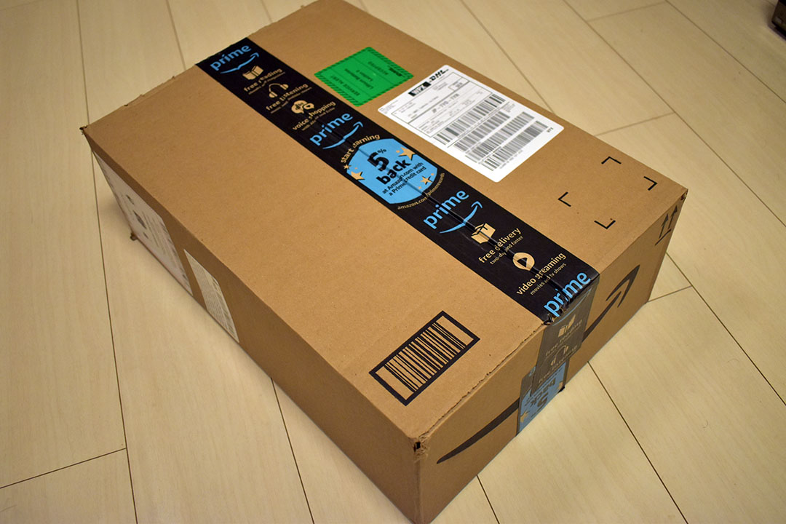
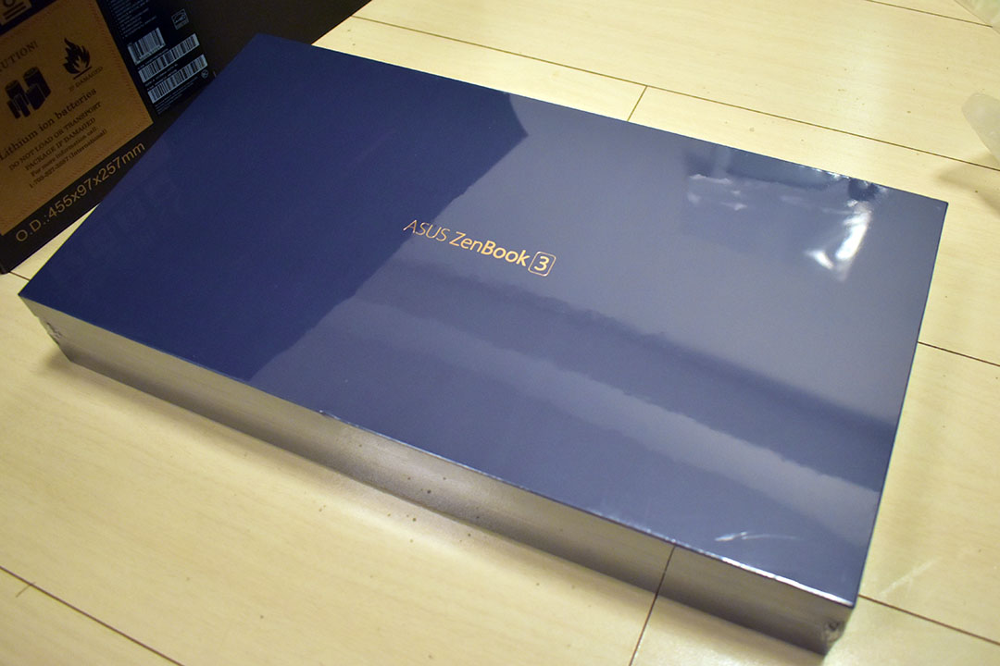
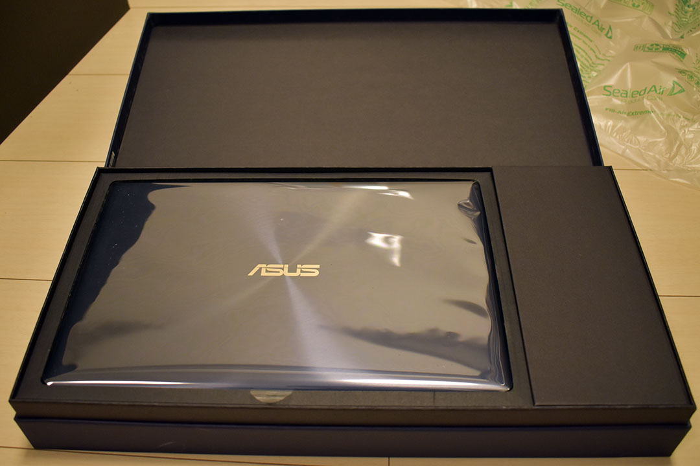
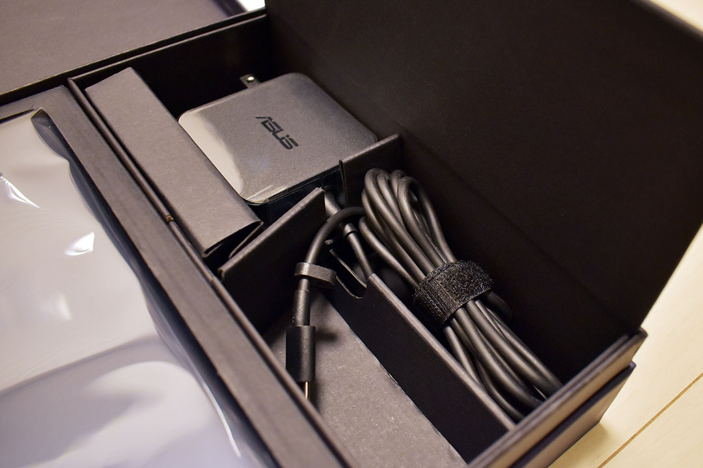
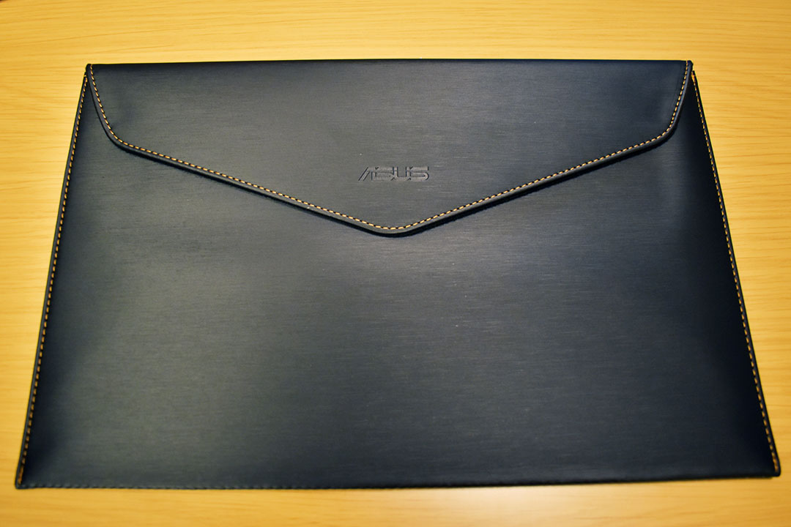
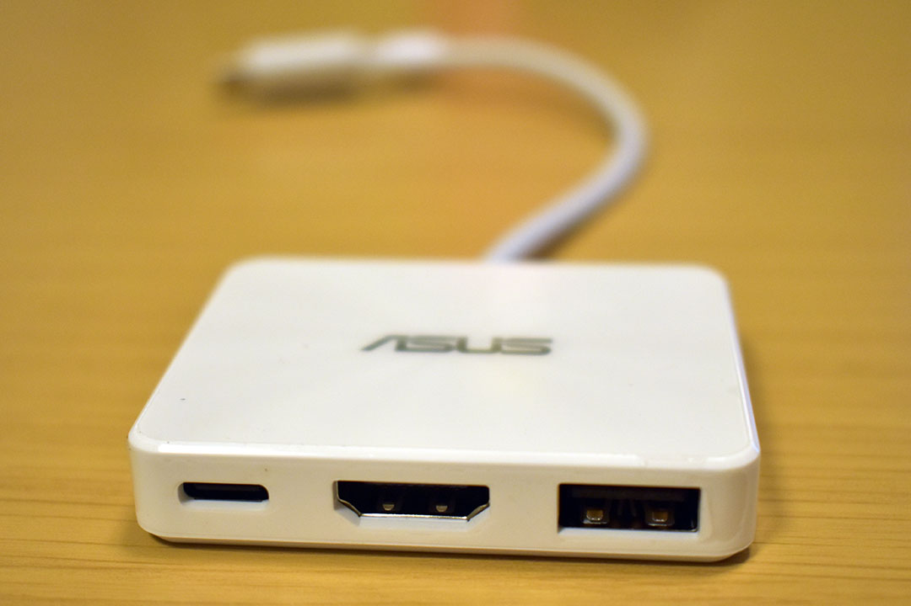
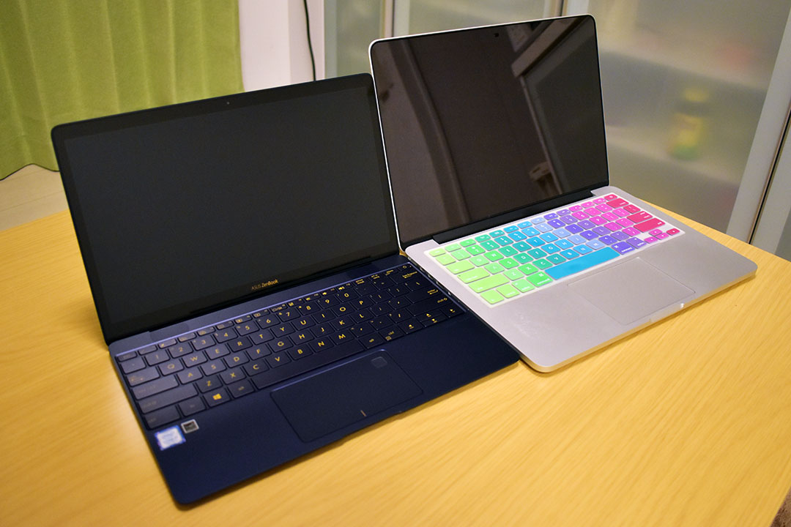

__Asus ZenBook3 UX390UA-512GP__ というノートパソコンを買ったので購入レポート。

- [Asus ZenBook3 ｷﾀ! めっちゃ軽い！](https://www.instagram.com/p/BcHf806gOhT/)

## スペック

自分が買った _UX390UA-512GP_ は ZenBook3 UX390UA の中でも最高スペックのモノで、__Amazon.com より米国版を取り寄せた。__スペックは以下のとおり。

- ディスプレイ：12.5インチ フル HD (1920x1080)
- CPU：__Core i7__ 7500U (Kaby Lake) 2.7GHz / 2コア
- SSD：512GB
- RAM：__16GB__ LPDDR3 PC3-17000
- GPU：_Intel HD Graphics 620_
- OS：_Windows 10 Pro_
- 寸法：幅 29.6cm × 奥行 19.12cm × 高さ 1.19cm
- 重量：__910g__
- キーボード：__英字配列__
- カラー：ロイヤルブルー
- インターフェース：USB3.1 Type-C
- その他：指紋認証・Web カメラ

MacBook 12インチのクローンみたいなスペックだ。重さは 910g で、自分が持っている同じ Asus の ChromeBook Flip と 20g しか変わらない (ChromeBook Flip は 890g)。

- [Asus ChromeBook Flip C100PA-DB02 を買いました](/blog/2016/11/07-01.html)

それなのに Core i7、16GB RAM なのだ。実際に持ってみると滅茶苦茶軽くて驚く。12.5インチのディスプレイもモバイル向けで丁度良い。

- 参考：[ASUS ZenBook 3 UX390UA | ノートパソコン | ASUS 日本](https://www.asus.com/jp/Laptops/ASUS-ZenBook-3-UX390UA/)

この最高機種はロイヤルブルーのみだが、下位機種はカラーバリエーションがある。

## 驚きの値段

どうしても英字配列のモノが欲しかったので Amazon.com で米国版を買ったのだが、購入時の値段が破格の __$999__！日本円にして約11万2000円程度だ。どうやらブラックフライデーのセールだったらしく、期間限定の値下げだった。セール期間が終わると値段は $1249 以上になっていた。ちなみに_日本では16万5千円程度_なので、かなり安く買えたと思う。

## そもそも何故欲しかったの？

そもそも何故ノートパソコンが欲しかったのかというと、__単なる気分的な物欲__に他ならなかった。

MacBookPro 13インチ Early 2015 の重さに辟易してきて、MacBook 12インチが欲しくなっていたのだが、ふと「MacBook くらい軽い Windows ノートはないのかな？」と思って調べ始めたところ、意外と MacBook に迫るスペックのノートパソコンがなかった。

つまり、自分が調べていたのは以下のようなスペックの Windows ノートパソコンだった。

- CPU：Core i7
- RAM：16GB
- SSD：256GB 以上
- ディスプレイ：12インチ程度
- キーボード：英字配列 (日本で買えるとなおよし)
- 重さ：920g 程度

20機種くらいスペックを調べて「MacBook クローンや MacBook を超えるスペックのマシンってないもんなんだなぁ」と思っていたところ、この ZenBook3 を見付け、まさに求めていたスペックだ〜と興奮してしまい、さらに Amazon.com で格安セールをやっていたのでテンションが上がって勢いでポチってしまった、という次第。

## 開封の儀

2017年11月25日に Amazon.com でポチって、11月29日の夜に届いた。

海外な感じのダンボール。

厳重に収められた箱。

スタイリッシュな本体！

付属の AC アダプタ。ChromeBook Flip 付属の AC 電源もそうだったけど、Asus の電源アダプタはどうしてプラグをたためるようにしてくれないんだろう。ちなみに ChromeBook のヤツよりは大きめ。

ケースが付属。頑丈ではないがカバンの中でボディにこすり傷とかが付くのは防げそう。

それとミニドックが付属。

MacBookPro と。ウーン早く触りたい！

## 使用感レビュー

使ってみて第一に感じたのは、とにかく_動作が快適_。動画を見たり Office を触ったり、Node.js や Git を操作したりしてみたけど、ガレリアのデスクトップ PC や MacBookPro と同じようにキビキビ動く。全くストレスがない。さすが Core i7、16GB RAM だ。GPU もモバイルにしては高性能な部類なので寄与しているのだろう。

少し負荷の高い操作を続けると、CPU のファンが回り出す。搭載されているファンは激薄のモノで、騒音というレベルではないが、静かな図書館で使っていると周りの人は気になるかも？といった感じ。部屋のテレビが付けてあれば紛れるレベルだが、ファンレスではないという点は人によっては気にするかも？

_キーボードは_12インチ MacBook よりも押し心地がある。英字配列でスペースキー周辺もスッキリしているし、右端の方のキーもフルサイズで使いやすい。

個人的に Windows の英字配列が初めてで、さらにノート PC の若干圧縮された配列なので、そこはまだ慣れが必要かな。左下が「Ctrl」「Fn」「Windows」「Alt」キー、と並んでいて、Mac を使っていると Cmd キーのつもりで Alt や Win キーを押してしまいがち…ｗ。以下の商品が英字配列用のキーボードカバーっぽいので、買ってみようかな？

_トラックパッド_もそこそこ使いやすい。今のところ大きなストレスはない。保護シールはお好みで。

_ディスプレイ_は反射しやすいタイプ。個人的には光沢感のあるこういうモニタの方が好みなので上出来。使用し始めてすぐに画面表示がおかしくなった (瞬間的に何度か暗転したりした) のだが、一度ディスプレイを閉じて開き直すと解消して、それ以来問題ないので気にしなくて良いかな…？反射しやすいタイプなので、対応品として売られている液晶保護シートはいずれも光沢感を押さえるタイプのモノ。

家でも無線 Wi-Fi でネットするし、写真の取り込みとかはデスクトップ PC でやるので、_USB Type-C ポートが1つ_しかない点は全然気にならない。ただの充電口として見なしている。ただし、「このポートが壊れたら充電すらできなくなる」という怖さはあるので、USB Type-C ポートを MagSafe 化する、マグネット式のアダプタは買おうかなと思う。_以下の商品は UX390UA で充電が出来たというレビューがあった_ので、コレを信頼して買ってみようかと。

本体の強度は、さすがに薄くて少し心配になる。心配しすぎなだけなのかもしれないが、混雑した電車に乗ってカバンが押された時とか結構不安だ。できれば付属のスリーブだけではなく、固めのバッグなり、頑丈なケースなりを購入した方が精神衛生的に安全かなと思う。

あと本体の仕上げの問題か、指紋が付きやすいｗ。これはしょうがないのでこまめに拭くなり、何かシールを貼って誤魔化すなりした方が良いか。

2017-12-13 : この辺のアクセサリを買った記事は以下。

- [Asus ZenBook3 UX390UA-512GP のアクセサリを色々買った](/blog/2017/12/13-02.html)

## 全体評価

自分の用途に合わせて調べに調べて買ったので、今のところ不満やデメリットはない。高性能でコレだけ軽量だと本当に持ち運びやすい。電車や昼食の時だけ自分の端末を使う程度であれば充電も全然持つし、それでいて自宅と同じ作業がストレスなくできて最高である。

コレは12インチ MacBook も買わざるを得ないか…？ｗ

## 別途するつもりの話

- 他に購入を迷った軽量・ハイスペックなノート PC の情報は一覧表にしたモノがあるので別途紹介しよう。
  - [軽量・ハイスペックノートパソコンまとめ (2017年11月頃・独自調べ)](https://neos21.github.io/frontend-sandboxes/2017-11-light-laptop-comparison/index.html)
- 今回は海外版の PC を買ったので、英語版の Windows 10 Pro が起動した。英語版の Windows 10 を日本語化するまでの話は別途しようと思う。
  - [英語版の Windows 10 Pro を日本語化した](/blog/2017/12/31-04.html)

今回は以上。
