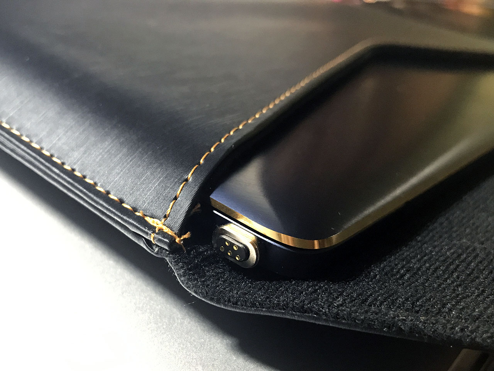

この前 **Asus ZenBook3 UX390UA-512GP の米国版 (US キーボード)** を買った。今回はこの ZenBook3 のアクセサリをいくつか買ったので紹介。

- [Asus ZenBook3 UX390UA-512GP を買いました](/blog/2017/12/06-01.html)

## 目次

## 液晶保護シート

まずは液晶保護シート。以下の PDA 工房の「Perfect Shield」という商品を買った。

  

    
  

  

    

      <a href="https://www.amazon.co.jp/dp/B01M74V1R8?tag=neos21-22&amp;linkCode=osi&amp;th=1&amp;psc=1">PDA工房 ASUS ZenBook 3 UX390UA Perfect Shield 保護 フィルム 反射低減 防指紋 日本製</a>
    

  

  

    
  

  

    

      <a href="https://hb.afl.rakuten.co.jp/hgc/g00po6p2.waxyc859.g00po6p2.waxyd60a/?pc=https%3A%2F%2Fitem.rakuten.co.jp%2Fpda%2F120pda60033571%2F&amp;m=http%3A%2F%2Fm.rakuten.co.jp%2Fpda%2Fi%2F10020589%2F">【ポスト投函送料無料】Perfect Shield ASUS ZenBook 3 UX390UA 【RCP】【smtb-kd】</a>
    

    

      <a href="https://hb.afl.rakuten.co.jp/hgc/g00po6p2.waxyc859.g00po6p2.waxyd60a/?pc=https%3A%2F%2Fwww.rakuten.co.jp%2Fpda%2F&amp;m=http%3A%2F%2Fm.rakuten.co.jp%2Fpda%2F">PDA工房</a>
    

    
価格 : 1870円

  

元々ギラッギラに反射していたのが少し軽減されて、画面が見やすくなった。

気泡が入りにくくなっているが、ホコリは避けきれないので、少し湿気を飛ばした風呂場とかでホコリを落としながら貼り付け作業すると良いかと。

## キーボードカバー

次にキーボードカバー。**TopACE の商品がレビューどおり US キーボード用だった**のだが、現在は Amazon や楽天で見当たらなくなってしまった。

薄くて違和感なくカバーできる。両面シールも付いているので、ちょっと不格好にはなるが四隅にシールを貼って固定した。

少し白っぽいので「カバーしてます」感が強いかな。

  

    
  

  

    

      <a href="https://hb.afl.rakuten.co.jp/hgc/g00s5bq2.waxyca19.g00s5bq2.waxydb4e/?pc=https%3A%2F%2Fitem.rakuten.co.jp%2Fcasemania55%2Fkey-k0000912542%2F&amp;m=http%3A%2F%2Fm.rakuten.co.jp%2Fcasemania55%2Fi%2F10733920%2F">ASUS ZenBook 3 UX390UA [12.5インチ] キーボードカバー キーボード保護 メール便送料無料</a>
    

    

      <a href="https://hb.afl.rakuten.co.jp/hgc/g00s5bq2.waxyca19.g00s5bq2.waxydb4e/?pc=https%3A%2F%2Fwww.rakuten.co.jp%2Fcasemania55%2F&amp;m=http%3A%2F%2Fm.rakuten.co.jp%2Fcasemania55%2F">液晶保護フィルムとカバーケース卸</a>
    

    
価格 : 2145円

  

## USB Type-C マグネットアダプタ

ZenBook3 はインターフェースが USB Type-C の1ポートのみで、USB ポートを多用することはないものの、ココが壊れてしまうと充電すらできなくなってしまうので、あまり頻繁に抜き差ししたくないなと思っていた。

調べてみると、USB Type-C ポートを MagSafe のようにマグネット式にしてくれるアダプタがあるのを発見。Kpux や Baseus というメーカの商品には *ZenBook3 で充電できたというレビューがあった*。

<ins class="ins-block">

2017年時点ではこのような製品が少なかったのだが、2020年現在は USB-C のマグネットアダプタも増えているので、どれでも大丈夫だと思われる。

</ins>

  

    
  

  

    

      <a href="https://www.amazon.co.jp/dp/B086DWR5WK?tag=neos21-22&amp;linkCode=osi&amp;th=1&amp;psc=1">Magsafe 磁気 マグネット USB-Cアダプター 20ピン 100W急速充電 10Gb/sデータ転送 4Kビデオ出力 MacBookPro/Airおよびその他のUSB Cデバイス対応</a>
    

  

本体に挿す側はほとんど飛び出ないので、このまま付属のケースにしまうことができた。

マグネットでカチャンとケーブルを接続でき、ちゃんと充電もできたので大満足。これは便利だ。

-----

以上3点、ZenBook3 ライフを満喫するためのアクセサリを買ってホクホクである。

  

    
  

  

    

      <a href="https://www.amazon.co.jp/dp/B01M8QNRFO?tag=neos21-22&amp;linkCode=osi&amp;th=1&amp;psc=1">エイスース 12.5型ノートパソコン ASUS ZenBook UX390UA ロイヤルブルー【Core i5/メモリ 8GB/SSD 256GB】 UX390UA-256G</a>
    

  

