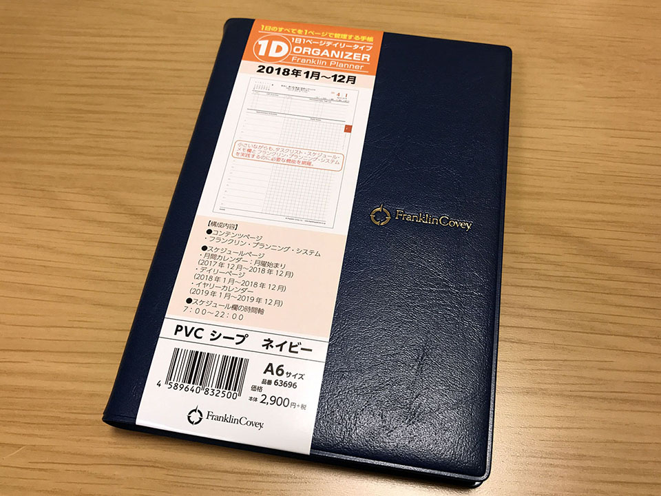

それは、2018年のシステム手帳を買おうとした時のことだった…。

## 目次

## 僕は日曜始まり派

僕は小さい頃から**日曜始まり**派だ。コレには理由らしい理由はなく、「昔から家にあったカレンダーが全て日曜始まりの環境で育ったから」という慣れでしかない。

しかし、この「慣れ」こそが最も重要で、僕の場合は*月曜始まり*のカレンダーを見ても正しく情報が読み取れない (「月曜始まりだと分かって見ているのに誤読が多い) ので、割と深刻な問題に発展しかねないのだ。

## フランクリン・プランナー愛用者

僕は2016年から、フランクリン・プランナーというシステム手帳を使っている。

- 左が2016年 : スターターパック・1日2ページタイプ・クラシックサイズ。
- 右が2017年 : オーガナイザー・1日1ページ・B6 サイズ。

「エンジニアのための時間管理術」というオライリー本で存在を知り、2016年はバインダー式のスターターパックで「1日2ページ」タイプのモノを買った。当時の上司が同じフランクリン・プランナーを使っていて、二人で「良いですよねコレ！」と話したのを覚えている。

- [「フランクリン・プランナー」を使い始めて1週間の感想と使い方](/blog/2016/01/14-01.html)

2017年になり、バインダー式は少々かさばるのと、1日2ページも使わないことが増えてきたので、綴じ手帳である「*フランクリン・プランナー・オーガナイザー*」に移行。1日1ページタイプに 0.38 の3色フリクションという組合せが板に付いてきた頃合いだった。先述の上司もこの年にオーガナイザーに移行していて、「やっぱりバインダーより機動力高いっすよね！」と話したりした。ｗ

2016年版も2017年版もカレンダーページは日曜始まりで、快適に使っていた。

そして2018年もフランクリン・プランナーを買おうと思っていたのだが…。

## カレンダーが月曜始まりになっている…

2018年のフランクリン・プランナーのラインナップを見ると、何やら色々とアップデートが行われた様子。一週間コンパスがブックマーク式ではなく、ページ内に取り込まれたりして、個人的には「改悪じゃないか？」と思わざるを得ない変更が入っていた。

- 参考：[コンパス・ポーチ・ページファインダー｜オンライン・ショップ｜フランクリン・プランナー・ジャパン](http://www.franklinplanner.co.jp/shopping/accessory/06/index.html) … 「一週間コンパス」という、こういうブックマークを使っていたが、ページ内に埋め込みになった…。

中でも、*これまで日曜始まり*だった月間カレンダーページが**月曜始まり**に変更されたのは、個人的には致命的な改悪だと感じた。

## どうする…

バインダー式のリフィルだと日曜始まりのリフィルもまだ用意されているが、来年 (2019年以降) も用意されるとは限らないし、1年だけしのぐっていうのもなんだかなぁ…。

好きだったフランクリン・プランナーだが、ココで使うのを止めて他のシステム手帳に移行するか？いやしかし…。

などと悩んでいた。

## 今から「月曜始まり脳」になれるか

僕は、月曜始まり派が「メリット」として列挙する理由に納得しないし、そもそも「理由」を挙げて話をしようとするのにムカついている。「仕事は月曜から始まるから」とか、自分個人の便益を中心に考えて周りを説得しようとしている視野の狭さがバカバカしく感じる。

月曜始まりは国際化標準機構が1971年に標準と定めたらしいが、そんなこと知ったこっちゃない。どちらが優位とか便利とかではなく、自分は日曜始まりに慣れているのだから、僕は日曜始まりのカレンダーが見たいのだ。僕の中で閉じた話なのだ。

…とはいっても、日曜始まりに脳が凝り固まっていることも自覚しているし、月曜始まりを取り入れられる柔軟さが自分にあっても良いような気もする。

というワケで、今から月曜始まり脳になるための、自分なりの落としどころというか、慣れ方を考えてみる。

## フランクリン・プランナーが月曜始まりを取り入れた理由

フランクリン・プランナーは、なぜ今年から月曜始まりのカレンダーを導入したのだろうか。個人的な推測だが、コレはデイリーページのページ構成に合わせたのではないかと考えている。

> 一週間を8ページ構成に変更。  
> **土曜日と日曜日のデイリーページを横並びにすることで、週末のスケジュールが立てやすくなりました。**

そう、これまでの手帳では、デイリーページは「1日」から順に始まるので、土日がページをまたいだり、またがなかったりするのだが、2018年のフランクリン・プランナーはコレを回避し、*必ず土日が見開き2ページになる*ようにしているのだ。

日曜始まり脳とはいえ、「土日の2日間で休日」という感覚はあるので、土日を並べて見られるところに重点を置いたのは納得。

コレに合わせて月間カレンダーページも土日が並ぶ月曜始まりにしたのは、設計としては腑に落ちる。意図が腑に落ちれば、個人的には何となく使えそうな気がしてきた。デイリーページも月間ページも、「次のページから月曜！仕事！」「次の行から月曜！仕事！」となることだし、理にかなっているかもしれない。

逆に言うと、この「ページ設計のため」という理屈以外は、どんな理由を聞いても納得がいかないと思う。1週間コンパスを週はじめのページに埋め込んだのは「月曜以外見なくなる」可能性が高くて失敗だと思うし、コレは単なるコストダウン絡みの改変じゃないかなと思っている。

## 慣れるかどうか…

というワケで、**2018年は A6 サイズのフランクリン・プランナー・オーガナイザー (1日1ページタイプ)** を買った。

個人的に月曜始まりに切り替える納得感は得られたが、慣れるかどうか分からない。2018年が始まるより前から目を通すようにして、慣れておこうと思う。

  

    
  

  

    

      <a href="https://hb.afl.rakuten.co.jp/hgc/g00ssyp2.waxyc9f2.g00ssyp2.waxyd034/?pc=https%3A%2F%2Fitem.rakuten.co.jp%2Fmrpostman%2F13035752949%2F&amp;m=http%3A%2F%2Fm.rakuten.co.jp%2Fmrpostman%2Fi%2F25189702%2F">【送料無料】フランクリン・プランナー・オーガナイザー 1日1ページ PVC 2021年1月 A6 ブラック 65138</a>
    

    

      <a href="https://hb.afl.rakuten.co.jp/hgc/g00ssyp2.waxyc9f2.g00ssyp2.waxyd034/?pc=https%3A%2F%2Fwww.rakuten.co.jp%2Fmrpostman%2F&amp;m=http%3A%2F%2Fm.rakuten.co.jp%2Fmrpostman%2F">ミスターポストマン楽天市場支店</a>
    

    
価格 : 4127円

  

