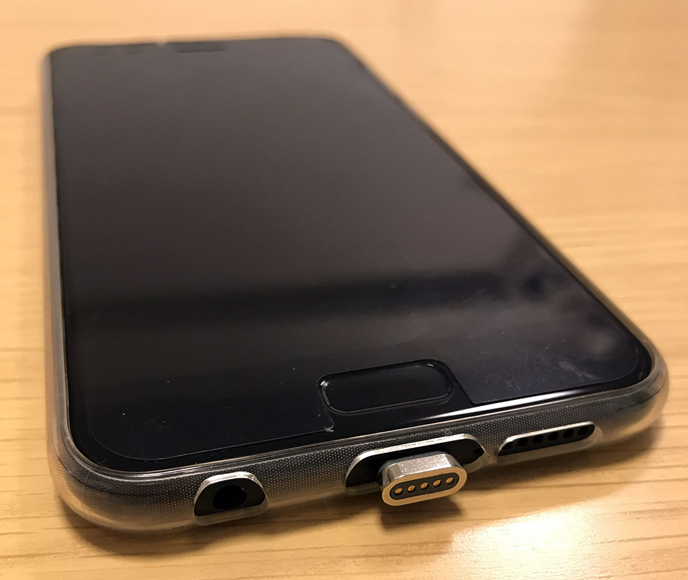
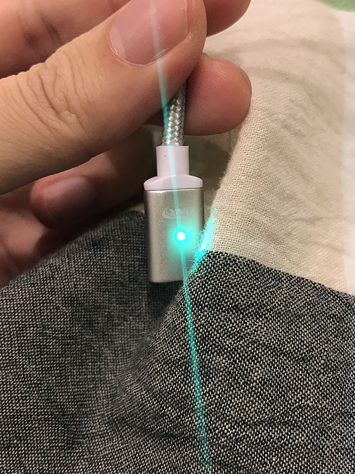
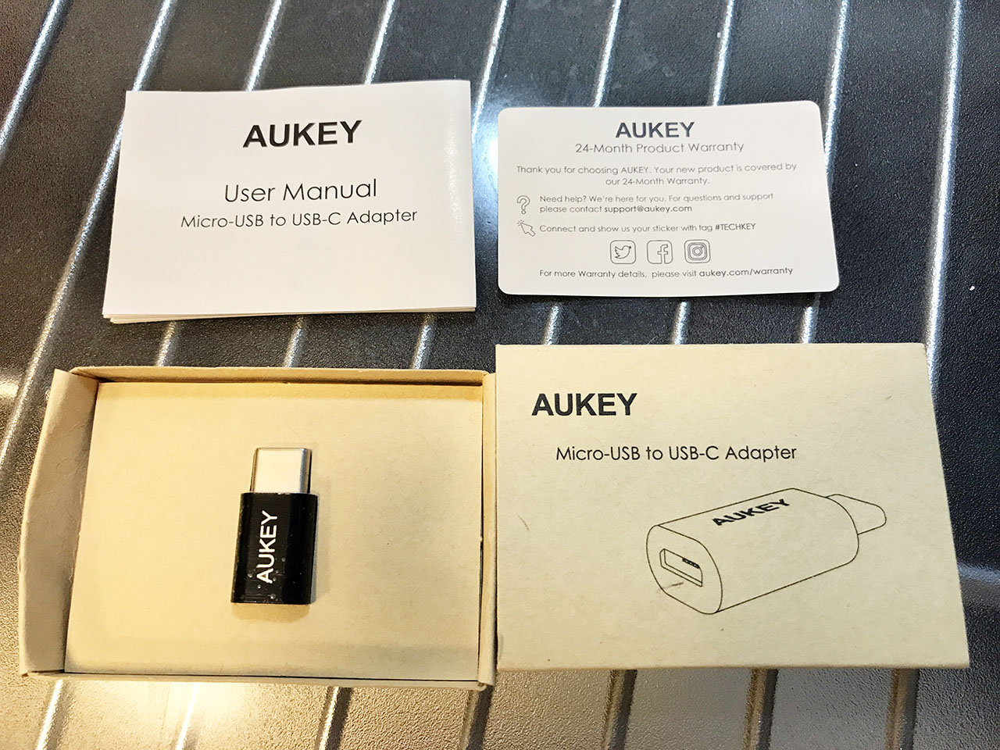
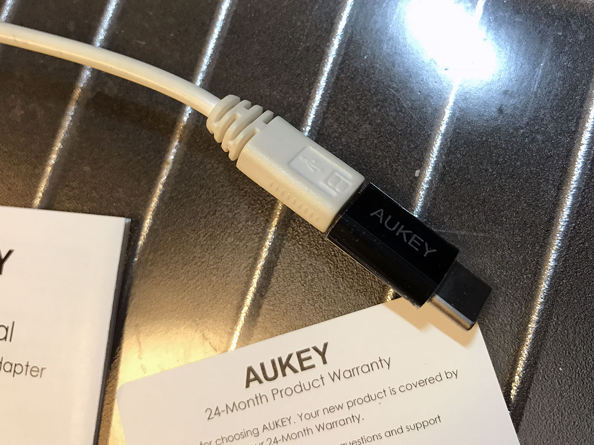

**Asus ZenFone4** で使えたアクセサリを紹介する。

- [Asus ZenFone 4 を買った](/blog/2017/11/25-02.html)

## 目次

## マグネット式 USB Type-C ケーブル

まずは、マグネットで接続できる USB Type-C ケーブルを買った。Zinx というメーカーのモノ。_コレできちんと充電も出来た。_

マグネットの先端は ZenFone4 に挿しっぱなしでも良いかもしれない。持つときにこの端子部分に指を引っ掛けて支えたりできて便利。

ケーブル側には LED が付いていて、通電していると_緑色_、端子がくっついて充電が開始されると青色に光る。これが結構眩しいので、枕元で充電したい人は考えものかも…。

  

    
  

  

    

      <a href="https://www.amazon.co.jp/dp/B07XSNVPSW?tag=neos21-22&amp;linkCode=osi&amp;th=1&amp;psc=1">マグネット 充電ケーブル 3in1ケーブル 3A急速充電 データ転送 月形のLEDランプ付き USB-A to USB-C マイクロUSB アイフォン各種スマホ/タブレット対応（1m）</a>
    

  

ちなみに、Asus ZenBook3 用には以前コチラを買った。

- [Asus ZenBook3 UX390UA-512GP のアクセサリを色々買った](./13-02.html)

## Micro USB → USB Type-C 変換アダプタ

ついでに、元々持っていた Micro USB ケーブルを充電用に使い回すために、USB Type-C に変換するアダプタを買った。Aukey というメーカーのモノ。

  

    
  

  

    

      <a href="https://www.amazon.co.jp/dp/B01AHKYIRS?tag=neos21-22&amp;linkCode=osi&amp;th=1&amp;psc=1">【2個セット】Anker USB-C &amp; Micro USB アダプタ （Micro USB → USB-C変換アダプタ）【56Kレジスタ使用 / Quick Charge対応】新しいMacBook、ChromeBook Pixel、Nexus 5X、Nexus 6P、Nokia N1、OnePlus 2 他対応 （ブラック）</a>
    

  

先述のマグネットケーブルとは何も関係のない、互換性のないアダプタだが、出先で使う用なので気にしない。

コレで元々使っていたモバイルバッテリーを繋いで ZenFone4 が充電できるようになった。

