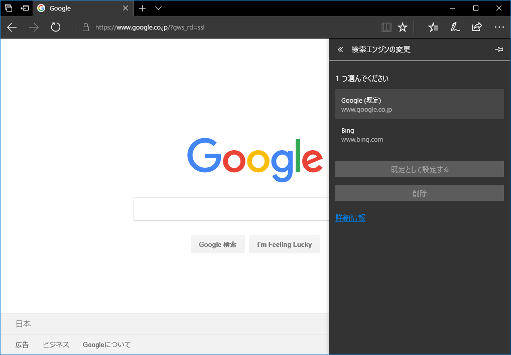

Edge ブラウザのデフォルトの検索エンジンは Bing で、これ以外の検索エンジンの導入方法が分からなかったので調べた。

_「Google (google.co.jp)」のトップページを開いた状態で_、「設定」→「詳細設定を表示」→「検索エンジンの変更」と進むと、「Google」が検索プロバイダの候補に登場しているので、コレを既定に設定したりすれば良い。

Bing は消せないので放置。とりあえずコレで Google 検索が気軽に使えるようになった。

- 参考：[Microsoft Edge で既定の検索エンジンを「Google」に変更する方法 - enjoypclife.net](https://enjoypclife.net/2017/12/23/microsoft-edge-default-search-engine-change-to-google/)
- 参考：[Microsoft Edge - デフォルトの検索エンジンを Google に変更 - PC設定のカルマ](https://pc-karuma.net/microsoft-edge-search-engine-google/)
