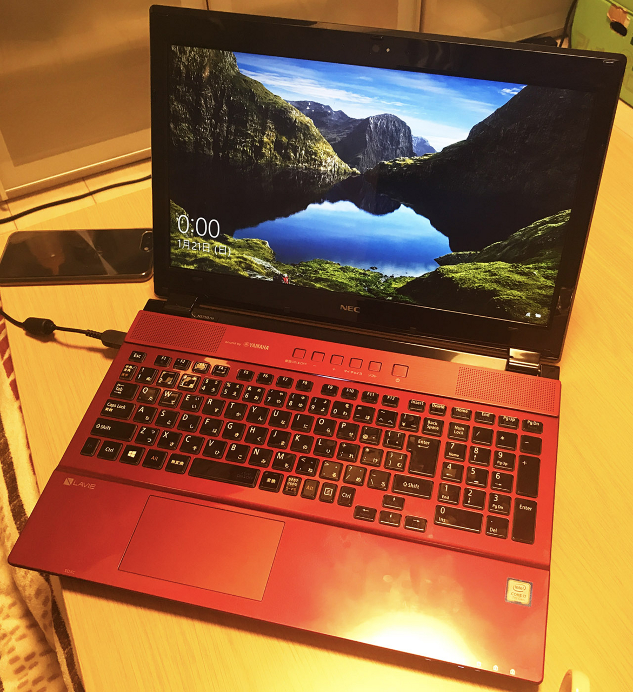
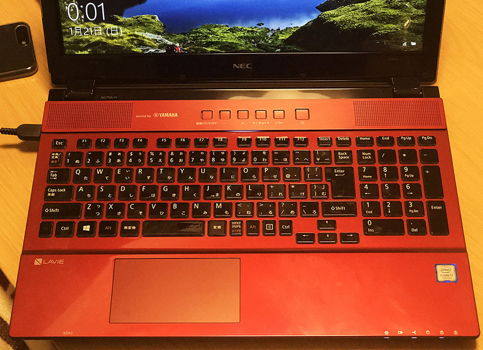
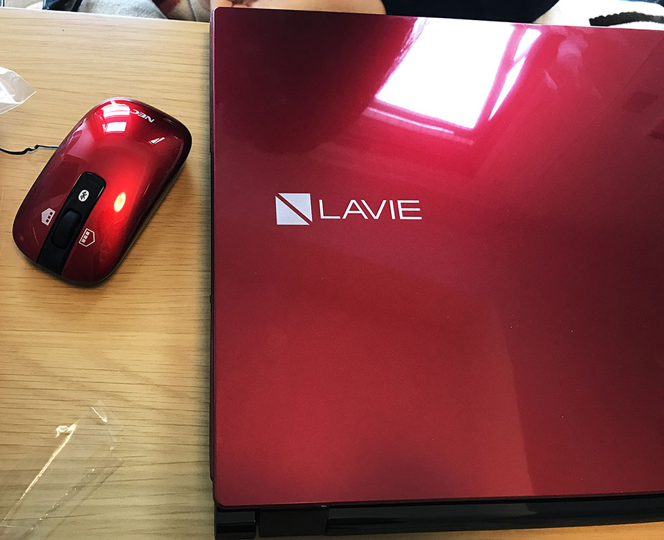

2018年1月、彼女がノート PC を買い替えた。**NEC LAVIE Note Standard PC-NS750GAR** という、**クリスタルレッド**カラーが特徴のマシンだ。

スペックはこんな感じ。

- Windows 10 Home 64bit
- 15.6 インチ
- Core i7 7500U (Kaby Lake) 2.7GHz 2コア
- 1TB **SSHD** (HDD + NAND 型フラッシュメモリ)
- 8GB RAM
- ブルーレイドライブ

SSHD というのが気になるところだが、今のところ不満はない様子。SSHD というのは、64～128GB 程度の SSD と HDD の組み合わせで、Mac における Fusion Drive みたいなもの。

あと *YAMAHA のスピーカーが内蔵*されていて、音質が Good。キーボードも日本語配列にしては綺麗にまとまっていて使いやすそう。

TDS 15周年の**クリスタル・ウィッシュ・ジャーニー**にならって**クリスタルレッド**カラーを選択したようだ。光沢があるが、指紋が付きやすいのがタマにキズ。

- [ディズニーはプログレ](/blog/2017/02/11-01.html)

ディズニーの余韻を残しつつ、快適な PC ライフが始まる…！

  

    
  

  

    

      <a href="https://www.amazon.co.jp/dp/B07V1MMCQX?tag=neos21-22&amp;linkCode=osi&amp;th=1&amp;psc=1">NEC 15.6型ノートパソコン LAVIE Note Standard NS700/NAシリーズ（カームレッド）［Core i7 / メモリ 8GB / HDD 1TB / Microsoft Office 2019］LAVIE 2019年夏モデル PC-NS700NAR</a>
    

  

