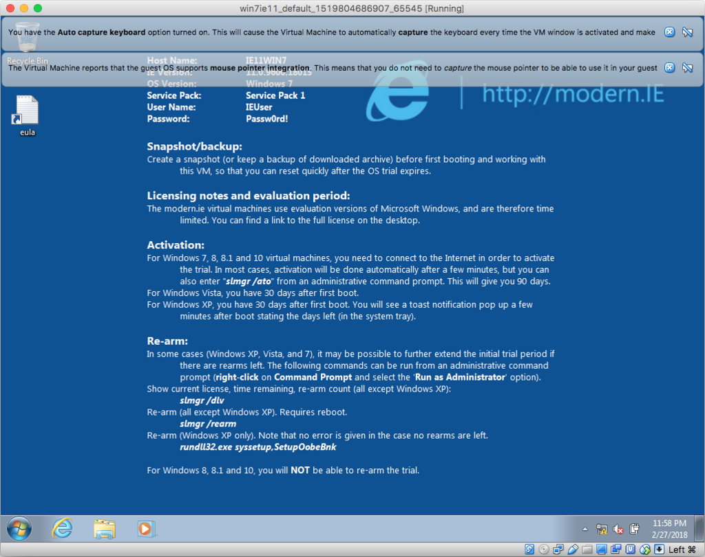

MacOS Sierra 上に、VirtualBox + Vagrant を利用して、Windows7 の仮想環境を構築してみようと思う。

## 目次

## VirtualBox をインストールする

まずは、Vagrant で操作する VirtualBox をインストールする。

- [Downloads – Oracle VM VirtualBox](https://www.virtualbox.org/wiki/Downloads)

検証時は v5.2.6 だったが、現在は v5.2.8 が出ている模様。`VirtualBox-5.2.6-120293-OSX.dmg` をダウンロードしてインストールする。

## Vagrant をインストールする

次に Vagrant をダウンロード。

- [Vagrant by HashiCorp](https://www.vagrantup.com/)

執筆時点のバージョンは v2.0.2 だった。`vagrant_2.0.2_x86_64.dmg` を開いてインストールする。

## Windows イメージをダウンロードする

仮想環境を扱うための準備ができたので、Windows OS のイメージを用意しよう。

Windows OS のイメージをどうやって手に入れるかだが、Microsoft がブラウザのテスト用に、_90日間の使用制限付きだが無料_でイメージを提供してくれている。コレを利用しよう。

元は「Modern.IE」というプロジェクト名で管理していたものなので、他の文献を探す時は「Modern.IE」といった文言を含めて検索すると色々見付かるかと。

- 参考：[消滅してしまったmodern.IEの代わりとなるものは？ | ワイヤード・パンチ](https://wiredpunch.com/%E6%B6%88%E6%BB%85%E3%81%97%E3%81%A6%E3%81%97%E3%81%BE%E3%81%A3%E3%81%9Fmodernie%E3%81%AE%E4%BB%A3%E3%82%8F%E3%82%8A%E3%81%A8%E3%81%AA%E3%82%8B%E3%82%82%E3%81%AE%E3%81%AF/)

現在は以下のページからダウンロードできる。

- [Free Virtual Machines from IE8 to MS Edge - Microsoft Edge Development](https://developer.microsoft.com/en-us/microsoft-edge/tools/vms/)

このサイトでダウンロードできる環境は以下のとおり。

- IE8 on Win7 (x86)
- IE9 on Win7 (x86)
- IE10 on Win7 (x86)
- IE11 on Win7 (x86)
- IE11 on Win81 (x86)
- MSEdge on Win10 (x64) Stable (16.16299)
- MSEdge on Win10 (x64) Preview (17.17074)

このうち、今回は _IE11 on Win7 (x86)_ を利用する。

イメージの種類もいくつか選べる。

- VirtualBox
- Vagrant
- HyperV (Windows)
- Parallels (Mac)

今回は _Vagrant_ を選択し、Vagrant Box をダウンロードする。

ファイルは 4GB 超。`IE11.Win7.Vagrant.zip` がダウンロードできたら解凍…しようと思ったが、どうも「その操作は許可されていません」というエラーが出てしまい解凍できない。仕方がないので App Store より __StuffIt Expander__ というフリーソフトをインストールして、コレを使って解凍した。

解凍して `IE11 - Win7.box` というファイルが取り出せた。スペース等が入っていてコマンドラインで扱いづらいので、`Win7IE11.box` とリネームしておく。

## Vagrant Box を登録する

適当な作業ディレクトリを用意し、先程の `Win7IE11.box` を格納しておく。ターミナルでそのディレクトリに移動し、Vagrant Box を登録する。

```bash
# 指定した Vagrant Box ファイルを「win7ie11」という名前で登録する
$ vagrant box add ./Win7IE11.box --name win7ie11
==> box: Box file was not detected as metadata. Adding it directly...
==> box: Adding box 'win7ie11' (v0) for provider: 
    box: Unpacking necessary files from: file:///Users/Neo/vms/Win7IE11.box
==> box: Successfully added box 'win7ie11' (v0) for 'virtualbox'!
```

## Vagrantfile を設定する

次に、Vagrantfile を生成して、各種設定を書き込んでおく。

```bash
# Vagrantfile を生成する
$ vagrant init
```

生成された Vagrantfile をテキストエディタで開き、内容を以下のとおり直す。

```
Vagrant.configure("2") do |config|
  # VirtualBox の設定
  config.vm.provider "virtualbox" do |vb|
    vb.gui = true
    vb.memory = "2048"
  end
  
  # 使う Vagrant Box 名
  config.vm.box = "win7ie11"
  
  # ゲストの OS を指定しておかないとマウント設定などがうまく行かない
  config.vm.guest = "windows"
  
  # ユーザ名
  config.ssh.username = "IEUser"
  
  # パスワード
  config.ssh.password = "Passw0rd!"
  
  # ゲストに SSH 鍵を配置しない (false)
  config.ssh.insert_key = false
  
  # SSH ログインシェルを変更しておく
  config.ssh.shell = 'sh -l'
  
  # Windows に sudo の概念がないので空白に直しておく
  config.ssh.sudo_command = ''
  
  # 共有フォルダ (以下の設定だと無効)
  config.vm.synced_folder ".", "/vagrant", disabled: true
  # 有効にするには以下に書き換える (後述)
  # config.vm.synced_folder "./vagrant", "c:\\vagrant"
end
```

設定内容は以下のサイトの受け売り。

- 参考：[MS公式提供のWindows7のvagrant boxでWindows７の仮想環境を構築する – せろとにんぱわー.](https://www.serotoninpower.club/archives/379)

Microsoft が配布するイメージの「ユーザ名/パスワード」は、__`IEUser/Passw0rd!`__ になっている。ログオン時に利用することもあるので覚えておこう。

## Vagrant で起動する

設定が終わったので、いよいよ Vagrant で起動してみる。

```bash
# Vagrant で起動する
$ vagrant up
Bringing machine 'default' up with 'virtualbox' provider...
==> default: Importing base box 'win7ie11'...
==> default: Matching MAC address for NAT networking...
==> default: Setting the name of the VM: win7ie11_default_1519804686907_65545
==> default: Clearing any previously set network interfaces...
==> default: Preparing network interfaces based on configuration...
    default: Adapter 1: nat
==> default: Forwarding ports...
    default: 22 (guest) => 2222 (host) (adapter 1)
==> default: Running 'pre-boot' VM customizations...
==> default: Booting VM...
==> default: Waiting for machine to boot. This may take a few minutes...
    default: SSH address: 127.0.0.1:2222
    default: SSH username: IEUser
    default: SSH auth method: password
==> default: Machine booted and ready!
==> default: Checking for guest additions in VM...
    default: The guest additions on this VM do not match the installed version of
    default: VirtualBox! In most cases this is fine, but in rare cases it can
    default: prevent things such as shared folders from working properly. If you see
    default: shared folder errors, please make sure the guest additions within the
    default: virtual machine match the version of VirtualBox you have installed on
    default: your host and reload your VM.
    default: 
    default: Guest Additions Version: 5.0.4
    default: VirtualBox Version: 5.2
```

「Starting Windows」的な黒い画面が表示され、デスクトップ画面が表示された。



## 共有フォルダ設定をしてみる

とりあえず Windows 環境が開始できたので、仮想環境にデータを持ち込みやすくするため、共有フォルダを設定する。

先程の Vagrantfile があるディレクトリに、`vagrant` ディレクトリを作っておく。

そして Vagrantfile を開き、

- `config.vm.synced_folder ".", "/vagrant", disabled: true`

この部分を、

- `config.vm.synced_folder "./vagrant", "c:\\vagrant"`

と変え、`$ vagrant reload` で再起動する。

すると、Vagrantfile があるディレクトリに置いた `vagrant` ディレクトリが、`C:\vagrant\` フォルダとして参照できるようになる。

起動時に警告らしきメッセージが表示されたが、特に問題なく共有フォルダが利用できている。

- 参考：[vagrant-windows/Vagrantfile at master · samrocketman/vagrant-windows · GitHub](https://github.com/samrocketman/vagrant-windows/blob/master/windows8/Vagrantfile)

## Windows を日本語化してみる

Windows OS のイメージは全て英語表示になっている。そのままでも使えるが、とりあえず日本語化しておく。

Windows Update を利用したりして言語パックを入れても良いが、言語パックのインストーラファイルを用意してインストールする方法をとってみる。

- 参考：[VMware上の modern.IE (Windows7) をネットに繋ぐ前に | modern.IE | 3u3.org](https://3u3.org/968#mui)

このサイトに従い、以下の MUI のインストーラ (KB2483139) をダウンロードする。

- [windows6.1-kb2483139-x86-ja-jp_bc46078938ae9129c7ce86a9c176fa517e4c0a3d.exe](http://download.windowsupdate.com/msdownload/update/software/updt/2011/02/windows6.1-kb2483139-x86-ja-jp_bc46078938ae9129c7ce86a9c176fa517e4c0a3d.exe)

ゲストの Windows にファイルを移し、管理者権限で実行しインストールする。

インストールが終わったら、コントロールパネル内の設定より「日本語」を選択する。一度ログオフすると反映され、日本語表示されるようになる。

その他、以下の設定を変えておく。

- システムロケールを日本にしておく。こちらは再起動になるが、VirtualBox・Vagrant であっても自動的に再起動してくれる。
- 「日付と時刻の設定」で日本のタイムゾーンを選んでおく。
- 「テキストサービスと入力言語」で「日本語 (日本) - Microsoft IME」を選べば、日本語入力もできるようになる。
- あとは使用しているキーボードの種類に応じて、お好みで日本語配列に設定したり、キー設定しておけば OK。

## 完了

コレでひととおりの環境構築は完了。あとはココに好きなツールを入れて、よきところで再度 Box 化しておくと良いだろう。

- 参考：[Vagrantのboxに少しだけ手を加えたものをboxとして取っておきたい - Qiita](https://qiita.com/t_cyrill/items/ef9cb2b615bfb326f79c)

`$ vagrant package` で、変更を入れた環境を Box 化できる。

90日間の使用期限はあるものの、環境構築を1日で済ませて Box 化しておけば、89日・およそ四半期に一度、スナップショット時点に戻すだけ。さほど困ることもないだろう。

その他参考。

- [Vagrant で Windows 7 + IE8 の環境を構築する: ある SE のつぶやき](http://fnya.cocolog-nifty.com/blog/2015/12/vagrant-windows.html)
- [Official Windows VM download URL archive, from https://dev.modern.ie/tools/vms/mac/ — scratch that — https://developer.microsoft.com/en-us/microsoft-edge/api/tools/vms/ · GitHub](https://gist.github.com/zmwangx/e728c56f428bc703c6f6)
- [【忘備録】Vagrantでローカルのboxを追加する流れ＆modern.IE使うまで | degitekunote2](http://degitekunote.com/blog/2017/03/18/how-to-vagrant-add-box/)
- [modern-ie vagrant config: 1. install virtualbox and vagrant, 2. run "vagrant up edge-Win10" or another version as listed below. · GitHub](https://gist.github.com/mpalpha/6ab88418974349fa3bb2b3f4311acaa0)
