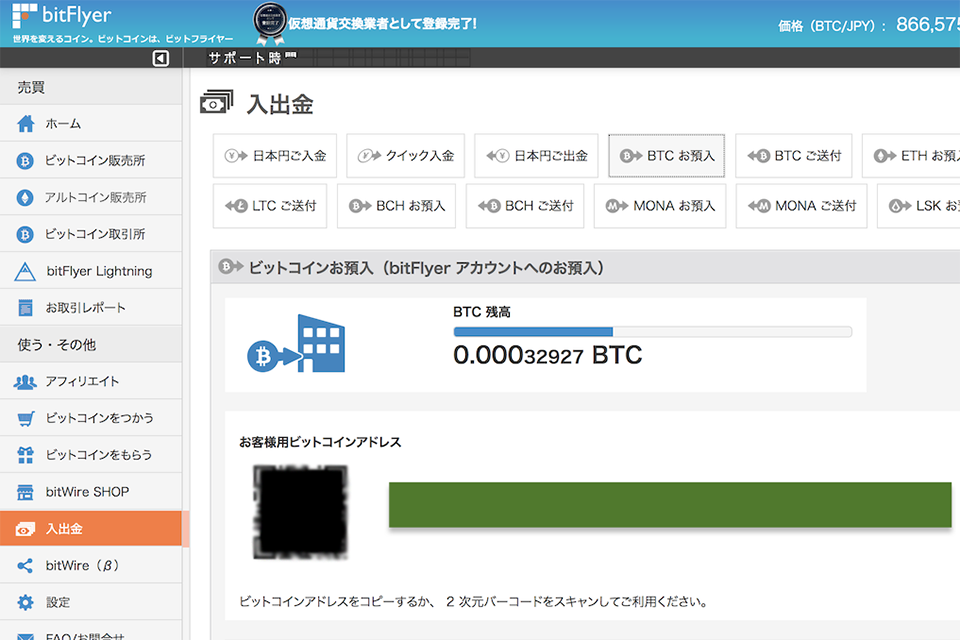
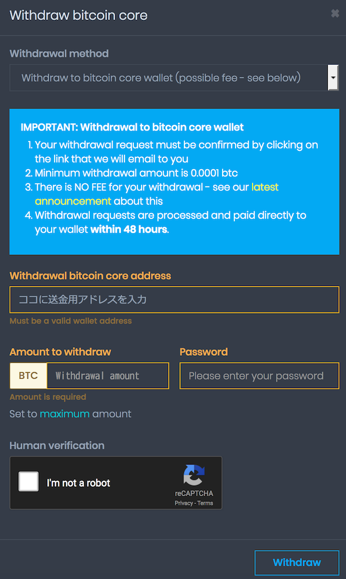

以前、無料で仮想通貨がもらえる「*Faucet*」と呼ばれるサービスの一つである、**CoinPot** とその関連サービス群を紹介した。

- **CoinPot**・[_Moon Bitcoin_](http://moonbit.co.in/?ref=f9b82c79d5bf)
  - [CoinPot 連携 Faucet で BitCoin を稼ぐ : 1 … CoinPot と Moon Bitcoin](/blog/2018/01/12-02.html)
- [_Bit Fun_](http://bitfun.co/?ref=65677056A129)
  - [CoinPot 連携 Faucet で BitCoin を稼ぐ : 2 … Bit Fun](/blog/2018/01/13-02.html)
- [_Bonus Bitcoin_](http://bonusbitcoin.co/?ref=54A2A05201F7)
  - [CoinPot 連携 Faucet で BitCoin を稼ぐ : 3 … Bonus Bitcoin](/blog/2018/01/14-02.html)
- [_Moon Litecoin_](http://moonliteco.in/?ref=0553f25d53f2)
  - [CoinPot 連携 Faucet で LiteCoin を稼ぐ : Moon Litecoin](/blog/2018/01/15-02.html)
- [_Moon Dogecoin_](http://moondoge.co.in/?ref=5692e4aa57c7)
  - [CoinPot 連携 Faucet で DogeCoin を稼ぐ : Moon Dogecoin](/blog/2018/01/16-02.html)
- [_Moon Dash_](http://moondash.co.in/?ref=CBF4DA6E3BDC)
  - [CoinPot 連携 Faucet で Dash を稼ぐ : Moon Dash](/blog/2018/01/17-02.html)
- [_Moon Cash_](http://moonbitcoin.cash/?ref=BF4702B9C6E4)
  - [CoinPot 連携 Faucet で BitCoin Cash を稼ぐ : Moon Cash](/blog/2018/04/28-02.html)

あれからチマチマ貯めたり、しばらくサボったりしていて約3ヶ月経った。デイリーボーナスを犠牲にしたので貯まりは悪かったのだが、少し見直してみた。

CoinPot にログインして各仮想通貨のダッシュボードを見てみると、「*Convert Bitcoin core to...*」といったボタンがあった。どうも CoinPot 内で扱える仮想通貨同士を、**手数料なしで相互に両替できる**ようだ。早速、LiteCoin、DogeCoin、DashCoin を BitCoin Core に移し替えてみた。

- 参考 : [Moon系Faucet(フォーセット)で仮想通貨を無料で手に入れよう！コツコツ貯めていればいいことあるかも？ – その日暮らし](https://platzblog.com/archives/3539)

これで 0.00032927btc になっていたので、最終的に日本円に換金できそうな別のサービスに移せないか試してみた。

なんと今は CoinPot のキャンペーン中みたいで、*最低送金可能額が大幅に引き下げられ、手数料が無料に*なっているので、このチャンスを逃してはならないと、送金に踏み切った。

> ## Good news! Changes to bitcoin core wallet withdrawal limit and fees
> 
> Posted: 2018-02-26 19:30 UTC
> 
> As you may know, due to recent significant improvements to the bitcoin network the current mining fees are extremely low and appear to remain so for the foreseeable future.  
> Therefore we are very happy to announce that we have made the following changes to CoinPot bitcoin core wallet withdrawal limit and fees... - The minimum withdrawal limit has been reduced from 0.00025 btc (25,000 satoshi) down to 0.0001 btc (10,000 satoshi) - Withdrawal fees have been completely removed! Previously there was a 0.00002 btc (2,000 satoshi) fee for withdrawals of less than 0.001 btc (100,000 satoshi) PLEASE NOTE: If the network mining fees rise again then we will of course have to review this and we may need to re-introduce withdrawal fees and/or raise the withdrawal limit again.
> 
> - 参考 : [CoinPot | Cryptocurrency microwallet](https://coinpot.co/news) … CoinPot 公式のアナウンス。

自分は [BitFlyer](https://bitflyer.jp?bf=u42vxfle)、[CoinCheck](https://coincheck.com/?c=aepHhqen_W8)、[Zaif](https://zaif.jp?ac=3pevwrz04e) のアカウントを持っているが、今回は **[BitFlyer](https://bitflyer.jp?bf=u42vxfle)** のアカウントに送金してみることにした。

> このCoinPot は Zaif (ザイフ) や bitFlyer (ビットフライヤー) など他の取引所に送金できることを当メディア編集者が確認済み。
> 
> - 参考 : [CoinPot (コインポット) – 無料でもらえてマイニングもできる仮想通貨ウォレット | COIN BIBLE（コインバイブル）](https://coin-bible.com/coinpot)

まずは [BitFlyer](https://bitflyer.jp?bf=u42vxfle) にログインし、左メニューの「入出金」→「BTC お預入」と進み、BitCoin の入金用アドレスをコピーする。

↑上のキャプチャはモザイクをかけてあるが、緑色の部分に入金用アドレス文字列があるのでコレをコピーする。

CoinPot のダッシュボードに戻り、「Withdraw bitcoin core」ボタンを押下する。送金画面で先程の入金用アドレスと送金額を入力し、「Withdraw」ボタンで送金手続きを始める。

CoinPot から確認用メールが届くので押下すると、送金依頼が確定できる。あとは48時間以内に送金が完了するのを待つのみ。自分の場合は2時間弱で、[BitFlyer](https://bitflyer.jp?bf=u42vxfle) から「入金されました」というメールが届き、無事送金が完了した。

0.00032927btc は、現在の日本円にして283円程度…。だが、元手0円で始めて、サボりながらもポチポチしていただけで、300円弱の BitCoin を手に入れていた、という点は重要。デイリーボーナスや紹介者精制度を活用できればもっと稼げるだろうし、元手がかかっていないので何かあっても損した気はしないだろう。

今後も合間を見てポチポチしていき、仮想通貨を貯めていこうと思う。
