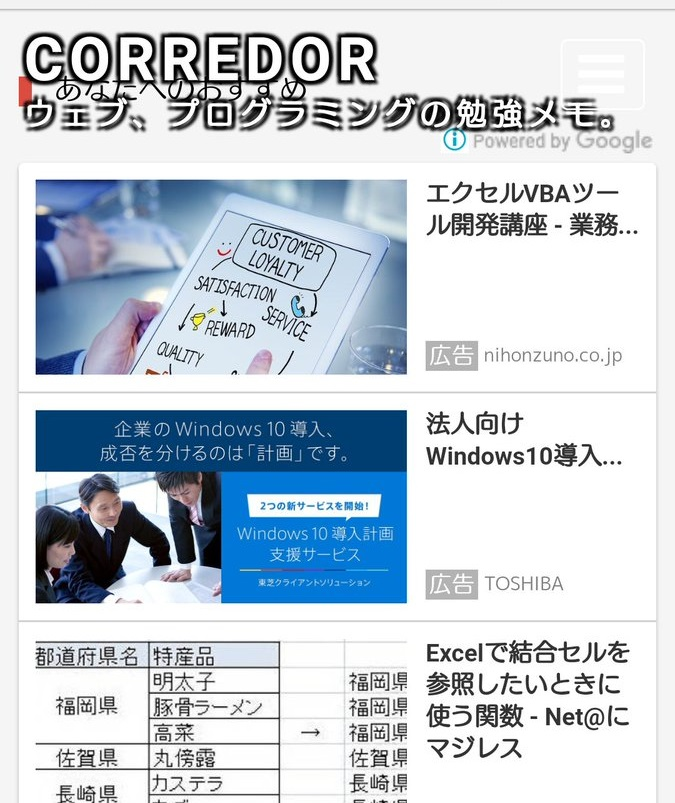

Google AdSense に導入された_「自動広告」_のうち、__「アンカー広告」__という広告ユニットが、ページ全体を押し下げてしまう、という話を以前書いた。

- [Google AdSense 自動広告の画面上部から出てくる広告がページ全体を押し下げる件](/blog/2018/02/27-01.html)

以前の記事では、コンテンツ全体を `position: absolute` でフローティングすることで、「アンカー広告」にページを押し下げられても逃げられる方法を紹介した。

しかしこの方法だと、「関連コンテンツ」という別の自動広告ユニットの配置に影響があることが分かった。

「関連コンテンツ」は、本来_ページ最下部_に表示されるのだが、コンテンツ全体がフローティングしているので、結果的にページの最上部から、_コンテンツに重なって表示_されてしまうのだ。




↑このように、「あなたへのおすすめ」という見出しが付くのが「関連コンテンツ」広告ユニット。ヘッダ部分から重なってしまい、コンテンツの冒頭が読めなくなってしまっている (提供：[@Rurux](https://twitter.com/Rurux/status/978162156850982912))。

この事象、なぜか iPhone では遭遇せず、手元で確認できなかったのだが、Android 端末の Chrome ブラウザでは発生したようだ。

そこで改めて「アンカー広告」の仕組みを調べ、対処法を考えることにした。

iPhone で「アンカー広告」が表示されている状態で Mac に USB 接続し、Safari ブラウザの Web インスペクタでデバッグしてみた。すると、「アンカー広告」が `body` 要素に `style` 属性を埋め込み、動的に `padding` を変更していることが分かった。これによってページ最上部に隙間ができ、コンテンツが押し下げられていたのだ。

ということは、コンテンツが押し下げられないようにするには、`style` 属性での `padding` 指定を上回るよう、`!important` 指定で CSS を定義しておけば良い。

```css
body {
  padding: 0 !important;  /* 「アンカー広告」がページを押し下げないように指定 */
}
```

そしてコンテンツ全体に適用していた `position: absolute` は外し、自然に配置するように戻した。

こうすることで、「アンカー広告」によるページの押し下げは回避しつつ、「関連コンテンツ」はページ最下部に自然に表示させられるようになった。
