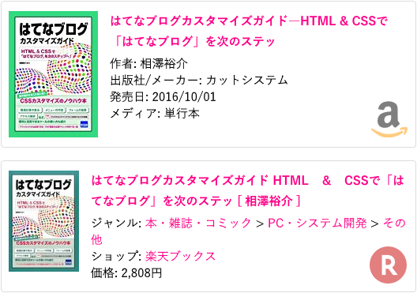
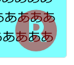
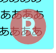

はてなブログの Amazon 商品リンク枠と、楽天商品リンク枠に、それぞれのサービスのロゴを表示させるカスタマイズ、第2弾。

## 目次

## 経緯

以前、こんな記事を書いた。

- [はてなブログの Amazon と楽天の商品リンクにアイコンを付けた](/blog/2017/08/20-01.html)

はてなブログにおける、Amazon や楽天の商品リンクの右下にそれぞれのサービスのロゴを配置しよう、というもの。このカスタマイズを行うと、デフォルトでは「Amazon 商品リンク」なのか「楽天商品リンク」なのかの区別が付きづらいところ、一目で区別が付くようになる。


↑コレが以前の記事で紹介したアイコンのサンプル。

この時のサンプルは背景画像に Data URL を埋め込んでおり、「CSS のみで実装」とは書いていたが、実質的には*画像を組み合わせて*作っていた。

## 発展版を作成した

今回作った**発展版**は、はてなブログにデフォルトで組み込まれている `blog.css` の中に含まれる「BlogIcon」フォントを利用している。よって、新たに画像を用意することなく実装しており、コード量も減らせている。

## 動作サンプル

実はもうこのブログには発展版を適用してある。商品リンクが以下のキャプチャのように表示されているはずだ。以前のサンプルと見た目はほぼ変わらない。



以下に旧サンプルとの比較ができるモノを作った。コチラもご覧いただきたい。

- デモ : [Hatena Blog Amazon Rakuten Icon](https://neos21.github.io/frontend-sandboxes/hatena-blog-amazon-rakuten-icon/index.html)
- コード : [frontend-sandboxes/index.html at master · Neos21/frontend-sandboxes](https://github.com/neos21/frontend-sandboxes/blob/master/hatena-blog-amazon-rakuten-icon/index.html)

## CSS コードを公開

コードは上述のとおり。繰り返しになるが、このコードを動作させるには、はてなブログが提供する [`blog.css`](https://cdn.blog.st-hatena.com/css/blog.css) を読み込んでいることが前提となる。

```css
/* Amazon・楽天 共通 : 基準設定 */
.hatena-asin-detail {
  position: relative;
  border-radius: 4px;
}

/* Amazon・楽天 共通 : 右下に余白を開けコンテンツを配置する準備をしておく */
.hatena-asin-detail::before {
  position: absolute;
  right: .6rem;
  bottom: .6rem;
  font-size: 55px;
  font-family: blogicon;  /* blog.css で読み込まれる blogicon フォントを利用する */
  line-height: 1;
}

/* Amazon : 円形グラデーションで色を分けマスクすることで「a」部分を黒色・矢印を黄色にする */
.hatena-asin-detail:not(.hatena-rakuten-detail)::before {
  content: "\f034";  /* Amazon アイコン */
  color: transparent;
  background: radial-gradient(ellipse farthest-corner at 50% 20px, rgba(0, 0, 0, .5) 50%, rgba(255, 153, 0, .5) 50%) 50% 50% / 60px 50px no-repeat;
          background-clip: text;
  -webkit-background-clip: text;
}

/* 楽天 : アイコンに合わせて白い円を作り、透過されている「R」部分を白色にする */
.hatena-asin-detail.hatena-rakuten-detail::before {
  content: "\f722";  /* 楽天アイコン */
  border-radius: 50%;
  width: 48px;
  height: 47px;
  line-height: 42px;
  color: rgba(200, 0, 0, .5);
  background: rgba(255, 255, 255, .5);
}

/* ==============================
 * Amazon : IE11 用 Polyfill
 * ============================== */

/* IE11 だと background-clip が効かないため、黄色ベースでアイコンを置いておく・この上に黒色の「a」部分を半透明で重ねる */
_:-ms-lang(x)::-ms-backdrop, .hatena-asin-detail:not(.hatena-rakuten-detail)::before {
  color: rgba(255, 153, 0, .5);
  background: none;
}

/* .hatena-asin-detail-foot は空の要素・黒色の「a」部分をクロップするため幅・高さを指定して配置する */
_:-ms-lang(x)::-ms-backdrop, .hatena-asin-detail:not(.hatena-rakuten-detail) .hatena-asin-detail-foot {
  position: absolute;
  right: calc(9px + .6rem);
  bottom: calc(15px + .6rem);
  width: 32px;
  height: 40px;
  line-height: 1;
  overflow: hidden;
}

/* .hatena-asin-detail-foot の擬似要素でアイコンを配置し、「a」部分の左側の余白を削る */
_:-ms-lang(x)::-ms-backdrop, .hatena-asin-detail:not(.hatena-rakuten-detail) .hatena-asin-detail-foot::before {
  content: "\f034";  /* Amazon アイコン */
  position: absolute;
  left: -5px;
  color: rgba(0, 0, 0, .6);
  font-size: 55px;
  font-family: blogicon;
}
```

IE11 向けの Polyfill が3ブロックほど最後にまとまっているが、IE11 を無視して良ければ実にシンプル。

## 実装詳細

以下、実装の詳細を紹介する。

### Amazon アイコンの作り方

Amazon のアイコンは、`BlogIcon` フォントで `\f034` 文字を指定すると表示できる。Unicode の U+E000 から U+F8FF は私用領域、つまり「好きに使ってね」という領域で開けられており、その中の文字に Amazon アイコンが当てられている。

- 参考 : [Unicode文字のマッピング - Wikipedia](https://ja.wikipedia.org/wiki/Unicode%E6%96%87%E5%AD%97%E3%81%AE%E3%83%9E%E3%83%83%E3%83%94%E3%83%B3%E3%82%B0#%E7%A7%81%E7%94%A8%E6%96%87%E5%AD%97)

通常どおりアイコンとして利用する場合は、以下のように使う。

```css
<i class="blogicon-amazon"></i>
```

この文字を擬似要素で配置しているワケだが、問題は文字色。Amazon のロゴアイコンは、「a」部分が黒色、下の矢印部分が黄色 (`#ff9900`) である。

- 参考 : [Amazon Colour Palette (Hex and RGB) – Design Pieces](https://www.designpieces.com/palette/amazon-colour-palette-hex-and-rgb/)

単純に `color` で文字色を指定してしまうと、「a」部分も「矢印」部分も同色になってしまうため、どうにかして「矢印部分だけ黄色」にしたかった。

最初は「`::before` 擬似要素と `::after` 擬似要素を組み合わせて1つのロゴを作ろうか…」と試行錯誤していたが、`overflow: hidden` によるクロップが限界で断念。そして辿り着いたのは、`-webkit-background-clip: text` を使い、背景指定を文字列でマスク表示させる方法だった。`radial-gradient` で円形のグラデーションを作り、「a」部分だけを丸く囲んで黒色を当て、グラデーションする範囲を作らずすぐに外周に黄色を当てるようにした。


↑ `-webkit-background-clip: text` 指定を外すと、こんな風に見える。

こうして*1文字に2色*の文字色を付けられた。

### IE11 は `background-clip: text` が効かない

せっかく頑張って作ったのだが、IE11 は `background-clip: text` に対応しておらず、マスク化ができなかった。

そこで、当初考えていた `::before` 擬似要素と `::after` 擬似要素を組み合わせる方法に戻り、なんとかならないか挑戦してみたのだが、IE11 は `overflow: hidden` を指定して `border-radius` で要素を丸めた時、はみ出た部分にも文字がはみ出て表示されてしまい、うまくクロップできなかった。

試行錯誤したが、IE11 の場合は残念ながら、苦肉の策で*半透明の黄色ベースでアイコン全体を配置し、その上に「a」部分のみを上手くクロップした要素を重ねる*ことにした。そのため、IE11 で見た時だけ「a」部分が若干黄ばんでいる…。


IE11 のみ CSS を適用する CSS ハックは以下で紹介したモノを使用した。

- [IE11 のみ CSS を適用させる CSS ハック](/blog/2018/03/11-01.html)

### 楽天アイコンの作り方

楽天アイコンの場合は Amazon アイコンよりは簡単だったが、一つ拘ったところがある。

まずは通常のアイコンを表示させてみる。文字コードとしては `\f722` で表示できる。

```css
<i class="blogicon-rakuten"></i>
```

楽天アイコンの場合、丸い囲み部分に色が付いており、中央の「R」部分は透過されている。円の部分に色を付けるのは `color` プロパティで良いのだが、このままだと「R」部分は透明なので、このアイコン部分に文字が重なった時に、重なった文字が薄く表示されないのである。また、商品リンク枠全体に白以外の背景色が付いた時も、不格好なのである。



↑「R」部分の後ろに見える「あ」の文字が通常の濃さで見えている上に、背景色が白色以外だと「R」字がその色になってしまう。

そこで、`border-radius: 50%` で円を作り、白色の背景色を付けることで、**白い円の土台に丸文字を重ねた**状態を作った。



完璧には縁取り出来ていないので、若干ハミ出す感もあるが、ご愛嬌…。基本は白背景で使ってもらう想定なので…。

コレで、「R」字部分に重なる文字があっても、半透明で表示されることになる。

## コードの縮減率は…？

さて、今回のサンプルでどのくらいコード量が減らせたか、圧縮したコード同士で比較してみよう。

```css
/* 前回の旧サンプル : 1957文字 */
.hatena-asin-detail{border-radius:4px;background:linear-gradient(to right,rgba(255,255,255,.2),rgba(255,255,255,.2)),url("data:image/png;base64,iVBORw0KGgoAAAANSUhEUgAAADAAAAAwCAYAAABXAvmHAAACkElEQVRoge2YybGjMBCGOwRCIARdbHHUxRYn6BAcgjMgBEJwCFRZfmdCIARCIISeg9ozeJEMBci8GrqqTyD4P/WiBWCzzTbb7G5CYbQ/ZoXU+UXqvJY6b6TOO6nzVuq8ss/wLBRG39b6YEmKSuqsZLE00KtVgEiN5xGin71LUlS/VXwfIv6t4u/efgEgb2YEoKBRsEXrFVTvDiiEwihJMR4Srf0xK4IBcJt0iMlKB/TpU1cKCdCOLUihMFpNHeyPiPLfYtWHufjGecBJ6rwLpf+tCYXRp4Vp1QBDbNUAdh+EyFuKmttsy971fF0AtjhH74PWAcD9farw7wDMvJUIC8Bt1DfzrdRZmaR42h1QJCnGA9aBcABcpC4htaudrgKAZ98lwntIWQUAd5y3IvZHRNe43QHFSgDyyiXCtyUeUvShANqxAFzAvrr5OAFzAjiFuPb0vrR7dDwHAPgkxl6bCIWRzfuh4m0dLB6FBRawlza8KMCAbjLZA0TBd6T0pwjf3Pne8R6KZjHuKs5u5BZv1wn3+Tgrg93WMcTQSNS7A4r+ePm4nnRBOtA7ezofs5i8kzpv9seseBbeNx7TJSmeAkpe1qiCiAwUZKAhAx0ZILpBSwaG3xuRgZpu8PZ+Z2mjG1zYS7pBSQaqO8TYD5U88CsgD1psNJrxA69wIgPEXpEB525zLiMDqpdCDQDA6BR6+OAPCP4Y/XUbHUUVTG55nPPYE33/T00/IPj/RD/gbAbDfnSFE88EPXnH0Sk4YorhYvaIKohZCPI7BRmoXybGetOPNBkoZk1jusLZATLVa7rC+TmqdIPLHJF+BbmHfRpMQwaKyekxGaaCmCNz4dSoe2Ade0MGKq4fXGRWN9vsP7Q/PeTs283e6DMAAAAASUVORK5CYII=") no-repeat right 10px bottom 10px/48px 48px}.hatena-asin-detail.hatena-rakuten-detail{background:linear-gradient(to right,rgba(255,255,255,.5),rgba(255, 255,255,.5)),url("data:image/svg+xml;base64,PHN2ZyBpZD0iTGF5ZXJfMSIgZGF0YS1uYW1lPSJMYXllciAxIiB4bWxucz0iaHR0cDovL3d3dy53My5vcmcvMjAwMC9zdmciIHZpZXdCb3g9IjAgMCA1MC41OCA1MS4wNiI+PGRlZnM+PHN0eWxlPi5jbHMtMXtmaWxsOiNiZjAwMDA7fS5jbHMtMntmaWxsOiNmZmY7fTwvc3R5bGU+PC9kZWZzPjx0aXRsZT7jgqLjg7zjg4jjg5zjg7zjg4kgMTwvdGl0bGU+PHBhdGggY2xhc3M9ImNscy0xIiBkPSJNNTAuNTgsMjUuNzhBMjUuMjksMjUuMjksMCwxLDEsMjUuMjkuNDgsMjUuMjksMjUuMjksMCwwLDEsNTAuNTgsMjUuNzhaIi8+PHBhdGggY2xhc3M9ImNscy0yIiBkPSJNMjEuOTQsMzkuMzZWMzAuOTNIMjUuNmw2LjMyLDguNDNoNi40N0wzMC43NSwyOS4xOWE5LjM3LDkuMzcsMCwwLDAtNS40My0xN0gxNi43OFYzOS4zNmg1LjE2Wm0wLTIyaDMuMzdhNC4yMSw0LjIxLDAsMSwxLDAsOC40M0gyMS45NFoiLz48L3N2Zz4=") no-repeat right 10px bottom 10px/48px 48px}

/* 今回の新サンプル : 1186文字 */
.hatena-asin-detail{position:relative;border-radius:4px}.hatena-asin-detail::before{position:absolute;right:.6rem;bottom:.6rem;font-size:55px;font-family:blogicon;line-height:1}.hatena-asin-detail:not(.hatena-rakuten-detail)::before{content:"\f034";color:transparent;background:radial-gradient(ellipse farthest-corner at 50% 20px,rgba(0,0,0,.5) 50%,rgba(255,153,0,.5) 50%) 50% 50% / 60px 50px no-repeat;background-clip:text;-webkit-background-clip:text}_:-ms-lang(x)::-ms-backdrop,.hatena-asin-detail:not(.hatena-rakuten-detail)::before{color:rgba(255,153,0,.5);background:0}_:-ms-lang(x)::-ms-backdrop,.hatena-asin-detail:not(.hatena-rakuten-detail) .hatena-asin-detail-foot{position:absolute;right:calc(9px + .6rem);bottom:calc(15px + .6rem);width:32px;height:40px;line-height:1;overflow:hidden}_:-ms-lang(x)::-ms-backdrop,.hatena-asin-detail:not(.hatena-rakuten-detail) .hatena-asin-detail-foot::before{content:"\f034";position:absolute;left:-5px;color:rgba(0,0,0,.6);font-size:55px;font-family:blogicon}.hatena-asin-detail.hatena-rakuten-detail::before{content:"\f722";border-radius:50%;width:48px;height:47px;line-height:42px;color:rgba(200,0,0,.5);background:rgba(255,255,255,.5)}

/* 今回の新サンプル … IE11 で Amazon を「黄色一色」にしたら : 754文字 */
.hatena-asin-detail{position:relative;border-radius:4px}.hatena-asin-detail::before{position:absolute;right:.6rem;bottom:.6rem;font-size:55px;font-family:blogicon;line-height:1}.hatena-asin-detail:not(.hatena-rakuten-detail)::before{content:"\f034";color:transparent;background:radial-gradient(ellipse farthest-corner at 50% 20px,rgba(0,0,0,.5) 50%,rgba(255,153,0,.5) 50%) 50% 50% / 60px 50px no-repeat;background-clip:text;-webkit-background-clip:text}_:-ms-lang(x)::-ms-backdrop,.hatena-asin-detail:not(.hatena-rakuten-detail)::before{color:rgba(255,153,0,.5);background:0}.hatena-asin-detail.hatena-rakuten-detail::before{content:"\f722";border-radius:50%;width:48px;height:47px;line-height:42px;color:rgba(200,0,0,.5);background:rgba(255,255,255,.5)}
```

旧サンプルは Data URL 文字列がかさんで*1957文字*。それに対し、今回の新サンプルでは**1186文字**と、*771文字 (バイト) 削減*できた。さらに、IE11 で Amazon ロゴの2色表示を諦め、「黄色一色」にしてみたとしたら、`.hatena-asin-detail-foot` 要素への指定が削れるので**754文字**になる。これなら*1203文字、約 1.2kb も削減*できており、CSS のサイズ縮小に貢献できたであろう。
