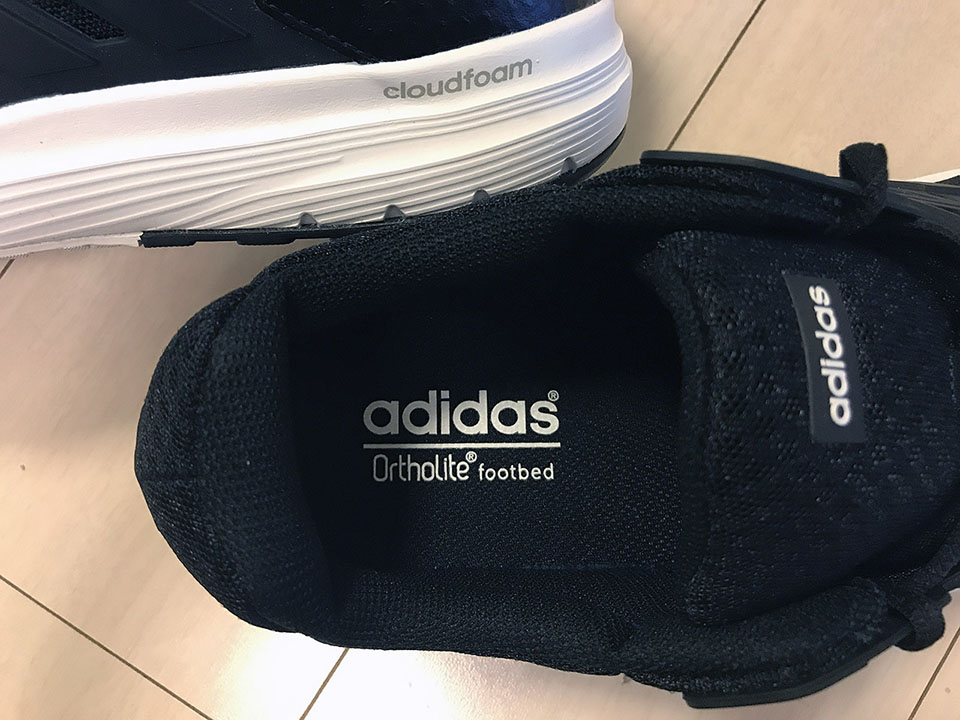

ジムに行くための準備計画、第2弾。

当たり前だが、トレーニングジムは室内なので、室内用の靴が別途必要になる。トレーニングシューズを調べると様々な種類があることを知り、大分迷った。以下、色んな文献を漁って自分なりに調べた結果をまとめておく。

- 一口に「トレーニングシューズ」といっても、用途に応じて色々な特性がある。
- トレーニング器具を使う時は、踏ん張りが利くよう靴底の滑り止めが強化されているタイプの靴がある。が、素人が運動を始める程度ならトレーニング器具に特化したような靴でなくても大丈夫そう。
- 走ることに特化した「ランニングシューズ」と呼ばれる靴も、練習やジョギング用にクッションがしっかりしているタイプと、本番・競技用に極限まで軽量化されたクッションの少ないタイプとがある。
- ルームランナーで走ったりする際は、脚に負担がかからないよう、_軽さよりもクッションの質を重視する_べき。つまり、本番・競技用のクッションがない靴は選んではいけない。
- 靴のサイズは、足のむくみを考慮して、普段よりも若干ゆったりさせる方が良いらしい。だいたい __1cm ぐらい大きめ__の靴を選ぶと良いんだとか。ピッタリキツキツは NG ということ。
- ネット上の商品レビューは、レビュアーがどういうトレーニングをしているかバラバラなので、その人の立場や求めるものによって、同じ商品でも絶賛されたり酷評されたりしていて、イマイチ参考にならない。気に入った靴が酷評されていても気にしない。

そんなこんなで、僕は __Adidas の Cloudfoam Galaxy 3 Wide U__ という靴を選んだ。

  

    
  

  

    

      <a href="https://www.amazon.co.jp/dp/B07RFNDLLY?tag=neos21-22&amp;linkCode=osi&amp;th=1&amp;psc=1">[アディダス] ランニングシューズ ギャラクシー 4 DBF15 メンズ トレースブルーF17/トレースブルーF17/ハイレゾイエローS19 (EE7915) 26.5 cm</a>
    

  

最近は Adidas の靴が気に入っていて、普段外履き用の靴として _Ultra Boost (水色のヤツ)_ を使っている。

ただ、靴の違いが分かるほどの人間ではないので、今回は

- 持ち運びを考えて比較的軽めで、
- かつクッションはしっかりしているモノ
- そしてあまり高くない (1万円以内)

という条件で靴を選んだ。

Adidas Galaxy 3 は自分が買った時は4,437円とお安く購入でき、普段も5,000円前後で購入できる。レビューサイトで見ても比較的高評価。靴底に Adidas 特製の何やら発泡スチロールみたいな雰囲気のフカッフカしたクッションが敷かれていて Good (語彙力のなさ…)。履き心地はかなり良い。

色違いで黒一色のヤツと白ベースのヤツもある。

---

実はまだジムでは試せていないので、ジムに行ったら改めてレビューしてみようと思う。
