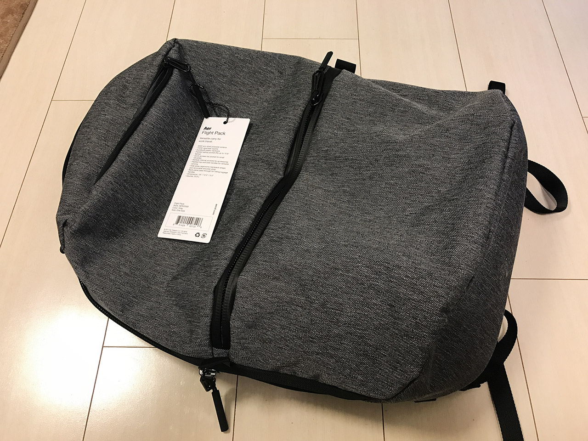
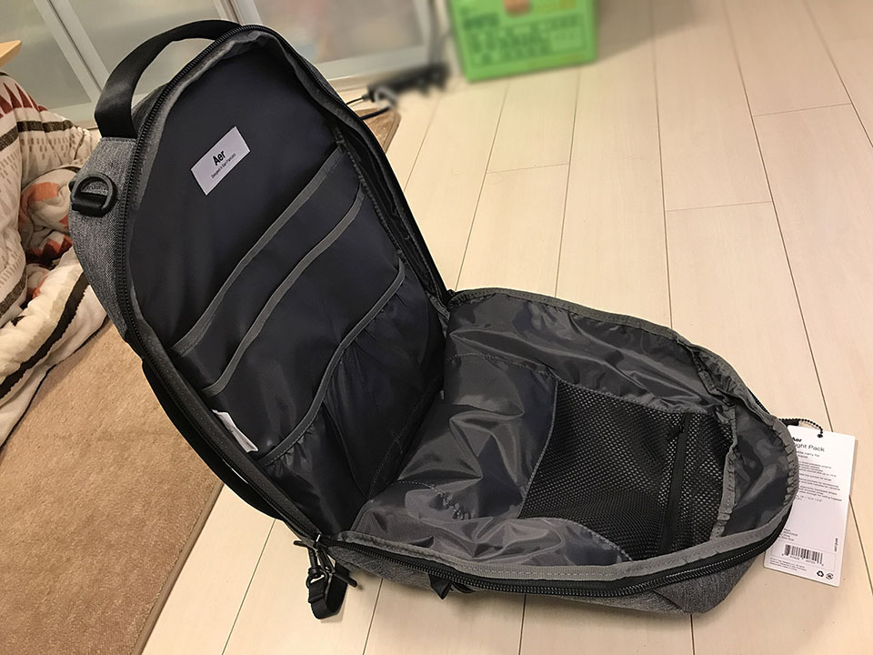

ジムに行くための準備計画、第4弾。今回はリュックを買いました。

## 目次

## ノート PC を入れられて、ジム通いができるビジネスリュックが欲しい！

会社帰りにジムに行くには、会社に持っていくカバンやリュックの中に、着替えやトレーニングシューズなどを入れていく必要がある。そうすると、書類を入れるような通常のビジネスバッグでは容量も足りないしツラい。

最近はビジネス用のリュックも出ているということで、ジム用品を入れられる程度に大きいビジネスリュックを探すことにした。

恐らくジムに行くときはジム用品オンリーにすると思うが、仕事柄ノート PC を持っていく日もあると思うので、ジムに行かない日も、ノート PC を入れて通勤できるような、万能タイプのリュックを探していた。

あと、リュックというと途端にゴチャゴチャとヒモが飛び出て見た目が汚らしいのが多いので、NorthFace のボックス型リュックみたいな感じで、四角くて広く、ゴチャゴチャとヒモが出ていないヤツがいいなーと思っていた。

ただ、NorthFace のようなボックス型リュックは、確かに容量は多いのだが、スポーツ用に特化しているのでペラペラで、ノート PC を入れるには耐久性に不安があった。また、30L 近い容量になると、確かに荷物を入れる時にゆとりはできるが、荷物が少ない時もリュックの大きさが邪魔になり、逆に通勤に不便かな、とも思った。

容量を潤沢に取るよりは、必要な容量ギリギリを見極めて、リュックの厚みをなるべく抑えた方が、混雑した電車などでの利便性は高まるであろう。

## Aer (エアー) というブランド

理想に合うリュックがあるかなーと、ネットで「ノート PC ジム リュック」などと調べていたところ、よくヒットしたのが**「Aer」**というブランドのリュックだった。なるほど、ノート PC を安全にしまえる収納を用意しながら、シューズの収納エリアを別に設けていたりなど、PC の持参とジム通いを両立させるための商品であった。

元来天邪鬼な僕は、当初このブランドを「ゆーても値段も張るし、こんな紹介記事多いのステマじゃね？」なんて思っていた。

が、近所の百貨店で実物を見て、また他の商品も比べてみて、なるほど Aer の良さを実感してしまった。

商品にはいくつか種類があるが、どの商品**十分な収納量・ファスナーの位置や仕切りの利便性・(3 Way タイプの場合) どの持ち方をしてもスタイリッシュ・頑丈でいて軽量**、というように、非の打ち所がないのだ。

値段は2〜3万円と、若干高い。1万円未満で探していたので予算オーバーだったのだが、Aer のリュックを実際に見てからは、他のどのリュックもイマイチな点が目立ち、値段の安さだけでは選べなくなってしまった。

結局迷いに迷って、Aer の **Flight Pack** という商品を買うことにした。お値段は*2万3000円*と安くないが、一番自分の理想に近い商品なので、後悔はない。

僕はグレーを買ったが、ブラックも出ている。

  

    
  

  

    

      <a href="https://hb.afl.rakuten.co.jp/hgc/g00pmr42.waxyce35.g00pmr42.waxyd88c/?pc=https%3A%2F%2Fitem.rakuten.co.jp%2Fmb%2Faer22010-gray%2F&amp;m=http%3A%2F%2Fm.rakuten.co.jp%2Fmb%2Fi%2F10198857%2F">エアー Aer バックパック リュックサック グレー メンズ カジュアル バッグ aer22010 flightpack2 gray FLIGHT PACK 2【あす楽対応_関東】【返品送料無料】【ラッピング無料】</a>
    

    

      <a href="https://hb.afl.rakuten.co.jp/hgc/g00pmr42.waxyce35.g00pmr42.waxyd88c/?pc=https%3A%2F%2Fwww.rakuten.co.jp%2Fmb%2F&amp;m=http%3A%2F%2Fm.rakuten.co.jp%2Fmb%2F">モダンブルー楽天市場店</a>
    

    
価格 : 18000円

  

  

    
  

  

    

      <a href="https://www.amazon.co.jp/dp/B086SPDKK9?tag=neos21-22&amp;linkCode=osi&amp;th=1&amp;psc=1">(エアー) Aer バックパック FLIGHT PACK 2 [並行輸入品]</a>
    

  

## Aer Flight Pack を使ってみて

楽天で注文してすぐ届いた。

ウ～ンカッコイイ。

実際にジムに行くときを想定して荷物を入れてみた。今回収納したのは以下のとおり。

- ジム用のトレーニングシューズ
- ジム用のタオル
- ジム用のトレーニングウェア (半袖半ズボン)
- 帰りにジム用品をしまうビニール袋など小物
- Asus ZenBook3 (12インチのノート PC)・MacBookPro 2015 13インチでも試してみた
- 折りたたみ傘
- 会社で使う小物
- 昼飯の弁当箱

実際に収納してみると、やはり靴がかさばるが、トレーニングウェアやタオルはコンパクトなモノを選んだおかげでなんとかなっている。お弁当箱まで詰めてちょうど、という感じ。さらに13インチの MacBookPro を入れるとギリギリで重さも出てきた。Asus ZenBook3 のような薄い PC をセミハードケースなしで入れるのは、普通に背負って歩く分には良さそうなのだが、混雑した電車の中で押されるのがちょっと怖いかも。

PC も持って行くとなると、ネックは靴だろうか。靴さえ別で持ち運ぶことにしてしまえば、リュック内はだいぶゆとりができるので安心。靴だけ諦めて別に持つか、ジムに行くときは PC を諦めるか、だろうなぁ…。

とはいえ、このリュックで大変満足している。周りにもゴチャゴチャ紐が出ていないし、それでいて小物の収納の仕分けも適切なのだ。

3 Way タイプで手持ちしても収まりが良く、あらゆる点で使い方を考え尽くされていて感心する。

## より大容量を望むなら Flight Pack 2

今回選んだ Flight Pack の容量は *23.6L* とそれなりに容量がある。しかしこれよりも大容量を望むなら、*Duffel Pack* というモデルがオススメ。24.6L と、Aer の商品の中では一番大容量なリュックだ。

## これでジムに通える！

トレーニングウェア、トレーニングシューズ、スポーツタオル、そしてビジネスリュック。これでひととおりジムで必要なものが揃えられたと思う。

今度早速ジムに行ってみようと思う。
