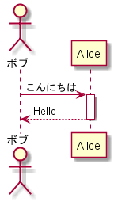

テキストベースで UML が描ける *PlantUML* というツールがある。これは元々 Java 製なのだが、Node.js でも使える **node-plantuml** というパッケージが用意されている。

- [node-plantuml - npm](https://www.npmjs.com/package/node-plantuml)

これを使って UML を描くための素振り環境を作ってみた。

- [GitHub - Neos21/practice-node-uml: Node.js 環境で UML を描く素振りリポジトリ。](https://github.com/Neos21/practice-node-uml)

## 目次

## node-plantuml の導入

まずは以下のコマンドで node-plantuml をプロジェクトローカルにインストールする。

```bash
$ npm install node-plantuml --save
```

次に `package.json` に以下の npm-scripts を追加する。

```json
{
  "scripts": {
    "puml": "puml"
  }
}
```

これで、`npm run puml` と叩いて node-plantuml を使えるようになった。ちなみにグローバルインストールした時は直接 `puml` で実行できるようになる。

## PlantUML を記述する

PlantUML は DSL (ドメイン特化言語) で記述する。平たくいえば PlantUML が用意する専用言語ということで、構文は覚えないといけないが、とりあえずネットで拾った簡単なサンプルスクリプトを利用して以下のように書いてみる。

```
actor ボブ participant Alice
ボブ->Alice : こんにちは activate Alice
Alice-->ボブ : Hello deactivate Alice
```

コメントは `/' コメント '/` という風に書ける。ファイル名は適当に `example-plantuml.md` としておいた。

こうして記述したファイルは、Shift-JIS エンコードを指定して保存しておこう。UTF-8 だと変換時に日本語が文字化けしてしまうためだ。Shift-JIS エンコードを指定しておくと、日本語を含んでいても文字化けしなくなる。

## UML 図を描画させる

こうして用意したファイルをインプットに、PNG 形式で図を描画させてみる。

```bash
$ npm run puml -- generate --png --output output-plantuml.png example-plantuml.md
```

`npm run` で実行する際にオプションを渡すため、`--` を間に置いている。

これで `example-plantuml.md` に書かれたテキストをインプットに、`output-plantuml.png` というファイルを生成できる。



ついでにコレも npm-scripts に追加しておこう。

```json
{
  "scripts": {
    "puml": "puml",
    "generate-plantuml": "puml generate --png --output output-plantuml.png example-plantuml.md"
  }
}
```

## 以上

PlantUML を簡単に試せる環境が作れた。あとは構文を覚えてもっと使ってみよう。

- 参考 : [PlantUML Cheat Sheet - Qiita](https://qiita.com/ogomr/items/0b5c4de7f38fd1482a48)
