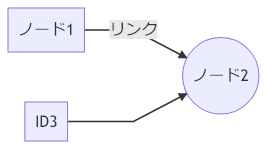

昨日の PlantUML (node-plantuml) に引き続き、Node.js 環境で UML 図を描くツールを試してみる。次は _mermaid.js_ と、それをコマンドラインで実行できる **mermaid.cli** というツールを使ってみる。

- [mermaid.cli - npm](https://www.npmjs.com/package/mermaid.cli)

今回も以下のリポジトリに素振り環境を作ってみたので、コチラもよかったらご覧いただきたい。

- [GitHub - Neos21/practice-node-uml: Node.js 環境で UML を描く素振りリポジトリ。](https://github.com/Neos21/practice-node-uml)

## 目次

## mermaid.cli のインストール

まずは mermaid.cli をプロジェクトローカルにインストールする。

```bash
$ npm install mermaid.cli --save
```

そして `npm run` で mermaid を使えるよう、`package.json` の npm-scripts に以下のスクリプトを追加しておく。

```json
{
  "scripts": {
    "mmdc": "mmdc"
  }
}
```

これで準備は OK。

## mermaid 用のファイルを用意する

次に、mermaid で扱うテキストファイルを用意する。ネットで拾った適当なスクリプトを利用する。

```
graph LR
  ID1[ノード1] -- リンク --> ID2((ノード2))
  ID3 --> ID2
```

これを `example-mermaid.md` といった名前で保存する。エンコーディングは UTF-8 (BOM なし) で問題なし。

## mermaid を使って UML 図に変換する

インプットとなるファイルを用意したので、mermaid.cli を使って PNG 形式の図に書き出してみる。

```bash
$ npm run mmdc -- --input example-mermaid.md --output output-mermaid.png
```

`--input` は `-i`、`--output` は `-o` と省略可能。これで `output-mermaid.png` という PNG ファイルが書き出せる。



ついでにコレを npm-scripts に追加しておこう。

```json
{
  "scripts": {
    "mmdc": "mmdc",
    "generate-mermaid": "mmdc --input example-mermaid.md --output output-mermaid.png"
  }
}
```

これで `$ npm run generate-mermaid` と実行すれば図が書き出せるようになった。

## 以上

PlantUML を使うか mermaid.js を使うか、もう少しそれぞれを使ってみて、使いどきを見極めてみたい。

- 参考：[会社でフロー図を書こうと思って PlantUML と mermaid.js を比べてみる - Qiita](https://qiita.com/suzuki-hoge/items/2cc68666511d6bc65e3f)
- 参考：[mermaid.jsが素晴らしいけどなかなか使ってる人見かけないので実例晒す(追記あり) - Qiita](https://qiita.com/uzuki_aoba/items/a01f8b0b52ced69c8092)
