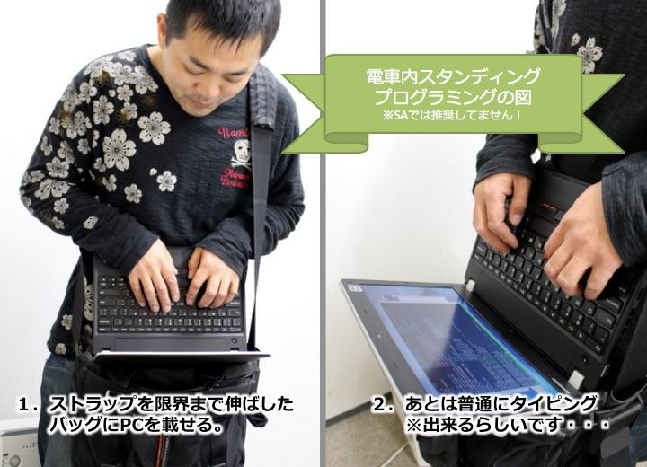

僕は毎日山手線に片道30分乗って通勤している。毎日往復1時間は電車の中で過ごすのだから、何かしら有益なことがしたいと思うもの。そこで、**通勤電車内でプログラミングができるか？**「通勤プログラミング」「電車内コーディング」の方法を考えてみたいと思う。

## 席に座れたらノート PC も広げられるが…

席に座れれば、ノート PC を広げてカタカタできると思うが、山手線で30分まるまる座れることはほぼない。

運が良ければ10分くらいは座れることもあるが、いつ座れるか分からないとなると、ノート PC に両手を付けてガッツリプログラミング、というのは難しそうだ。

## 立ったままノート PC？

そうなると、次に考えるのは*立ったままノート PC をイジれないか*、ということ。

ネットで調べてみると、**ショルダーバッグの上に PC を置き、真下を向くようなスタイルでキーボード操作をする**人の記事が出てきた。

- 参考：[【シックス・アパートの勉強法】 電車内で立ったままプログラミングする仰天の方法-Six Apart ブログ｜オウンドメディア運営者のための実践的情報とコミュニティ](https://blog.sixapart.jp/2014-01/how-sakk-employees-study.html)

「電車内の端にもたれかかって姿勢をキープ」とのことだが、大変そうだ。慣れたらコレで解決できるかもしれないが、満員電車だと厳しいだろう。

## 満員電車でもキーボードを操作するには…

「電車内プログラミング」で求めるべきは*タイピング*、つまりキー入力操作をなるべく普段と同じ速度でできるような環境だと思う。

立ったまま、満員電車でもキー操作を素早く行う方法はないものか。

調べてみると、**Gest** というデバイスが見つかった。これは、デバイスを指出しグローブのようにはめると、マウスやキーボードの操作ができるというものだ。

- [via GIPHY](https://giphy.com/gifs/rn5bkK7mOxU08)
- 参考：[マウスやキーボードは、もう不要になるかもしれない・・・ | TABI LABO](https://www.google.com/amp/s/tabi-labo.com/amp/206111)

Kickstarter で発表されたプロトタイプかと思いきや、国内でも販売されていたらしく、以下のような販売終了のページが見つかった。

- 参考：[GEST｜手のジェスチャーでPC操作可能なウェアラブルデバイス「ジェスト」 - ガジェットの購入なら海外通販のRAKUNEW(ラクニュー)](https://www.rakunew.com/items/72420)

コレなら、キー入力は空中でできそうだから、満員電車でもできるだろう。タイプ速度も十分素早くできる可能性がある。しかし、両手をキー入力に使ってしまうと、ディスプレイにあたるモノを見られない。どうしたものか。

## 両手を使わずディスプレイを眺めるには…

Gest みたいなグローブ式のデバイスでキー操作をするとして、両手を使わずディスプレイを眺めるにはどうしたらいいか…。

すぐ思い付いたのは、一昔前に話題になった *Google スマートグラス*みたいな、メガネ型デバイスだ。

- [120670535536](https://youtube.com/watch?v=BrbAHDFlKHk)
- 参考：[EPSON BT-200AV シースルーモバイルビューア スマートグラス通販｜ソフトバンクセレクション](https://www.softbankselection.jp/cart/ProductDetail.aspx?sku=4988617193642) … EPSON BT-200AV

こんな商品があった。コレならスマートフォンの画面をグラスに映せそうだ。だが、iPhone が対応している気配がなく、すんなり使える感じがなくて、現実的ではないかと…。

次に見つけたのは、*VR ゴーグル*だ。調べてみると、VR 内に仮想のキーボードが表示されて、キー操作まで VR で操作できそうな「Punchkeyboard」というモノも見つけた。

- 参考：[VRで快適にテキスト入力！VRキーボードが登場 | Mogura VR - 国内外のVR/AR/MR最新情報](https://www.moguravr.com/punchkeyboard/)

**電車に VR ゴーグルをかけて乗り込めば、周りの人も避けてくれるかもしれない**、と思う一方、ここまで視界を遮られたら満員電車でバランスを保てない恐れがある。

## スマホに外部キーボード？

*スマートグラスや VR ゴーグルにグローブ型デバイス*、という出で立ちは、「レディ・プレイヤー1」で描かれた未来のようで夢がひろがりんぐではあるが、現実的に厳しいかなと感じた。

もう少し現実的なところで考えると、せいぜいスマホに外部キーボードくらいか？と思った。

最近はスマホで GitHub に Push したり、クラウドサービスを使えばスマホからコーディングはある程度できるだろう、あとはタイプ速度をあげる工夫ができないか、というところだ。

スマホ向けのキーボードはあるのだが、満員電車でスマホをキーボードに固定しつつ使えるキーボードは少なさそうだ。

- 参考：[ASCII.jp：知っておきたい！ スマホで使うBluetoothキーボード選び (1/2)｜売り場で迷わない！ スマホ周辺機器の選び方](http://ascii.jp/elem/000/000/706/706024/)

スマホに装着するタイプで、こんな斬新なレイアウトのデバイスも考えられているらしい。

- 参考：<https://kickstarter.likeplus1.net/立ったままでも入力出来る！斬新なデザインの次/> … TREWGrip

キーボードにスマホを置くスペースがあるモノとなると、タブレット向けのモノになり、少し大きくなる。

- 参考：[移動中にwindowsタブレットでブログ記事を書く | ホームページ制作 会社 トレボのブログ](https://www.trevo-web.com/staffdiary/cat277/windows-ｔablet-keyboard.html)

いずれもスマホやキーボードを握りながらのタイプになるので、タイピングは親指のみで行うことになりそう。やはりノート PC のような速度でタイプすることは無理か…

## ソフトウェアキーボードで何とかならない？

ならばいっそ、スマホに外部キーボード、というやり方は諦めて、スマホ内のソフトウェアキーボードを優秀にして対応出来ないか考えた。

コーディングのために作られたソフトウェアキーボードアプリはなくはないが、どうしてもブレース `{}` やブラケット `[]`、セミコロン `;` などの記号が打ちやすいアプリが見つからなかった。

## 結論：今のところ無理が多い

ここまで調べていて、文献の合間合間に見えた反論を無視してきていたのだが、*やっぱりそもそも電車内で立ったままコーディングは無理なのでは*、と思い始めた。

少なくとも、座ってノート PC をイジっている時と同じ速度で作業することは無理だと思った方が良いだろう。

最新のデバイスに頼るとしても、2018年時点ではまだまだ厳しいものがあった。

## 考え方を変える：必ず座れるようにする

次に、考え方を変えてみる。電車の中でも座りさえすればノート PC がそれなりに触れるのであれば、*必ず座れる電車に乗ればいい*のである。

始発電車など空いている時間帯に通勤するか、金銭的に厳しいが、グリーン車を毎度予約したりすれば、座ることはできる。

…これも現実的に無理だなぁ…。絶対そんな早く起きたりできない。

## 電車でやることを「入力作業」にしない

最終結論。電車の中でやることを変える。通勤時間を「キーボード入力する作業時間」に当てないことだ。

プログラミングは座って腰を据えてやることにして、その設計をする時間にするのだ。

もしくは「ドットインストール」を見て勉強する時間とするのもアリか。

あとは、コーディングにせよブログ執筆にせよ、「読むこと」に専念して、前日に書いたコードの見直しだったり、ブログのアクセス解析をしたりする時間とするのだ。

あとは、スマホも見ず、潔く目をつぶる……。睡眠・休息の時間にするしかないか…。

---

結局、**通勤電車内プログラミングは無理。スマホでできることにフォーカスしろ**、しかないのかな…。残念。

- 参考：[/.Jに聞け：電車内で効率的にコードやドキュメントを打つ方法は？ | スラド Slashdotに聞け](https://askslashdot.srad.jp/story/13/09/26/0933240/)
- 参考：[記述中 通勤プログラミングの検討 - Awesome Hacks!](http://tamaking01.hatenablog.com/entry/2015/05/07/210318)
- 参考：[通勤電車ではドットインストールがいい感じ（プログラミング学習） : ハリネズミ 30代からのプログラミング](http://harinezumi.doorblog.jp/archives/10495109.html)
- 参考：[nexus7用のbluetoothキーボード付きケース買ってみた - グロブ](http://typea.info/blg/glob/2014/01/nexus7bluetooth.html)
- 参考：[通勤電車で Android プログラミング - グロブ](http://typea.info/blg/glob/2014/01/-android-1.html)
- 参考：[/.Jに聞け：電車内で効率的にコードやドキュメントを打つ方法は？ | スラド Slashdotに聞け](https://askslashdot.srad.jp/story/13/09/26/0933240/)
- 参考：[移動中にwindowsタブレットでブログ記事を書く | ホームページ制作 会社 トレボのブログ](https://www.trevo-web.com/staffdiary/cat277/windows-ｔablet-keyboard.html)
- 参考：[アコーディオン？いえこれ、iPad用の背面キーボードです ― 電車や飛行機の中でタッチタイプできる「T-BLADE」、先行予約販売開始 インターネットコム](https://internetcom.jp/201361/t-blade-back-typing-keyboard-for-ipad)
- 参考：[電車内で効率良くブログ書きたい！最強のキーボードを作ったぜ！小型、静音、縦横固定可！ | デイリーもち.COM](https://dailymochi.com/bluetoothkeyboard-with-iphone)
- 参考：[SAGAweb : リュウドのBluetoothキーボードRBK-2100BTJ で電車内オフィスとAdobe Ideas](http://blog.livedoor.jp/saga521/archives/50176181.html)
