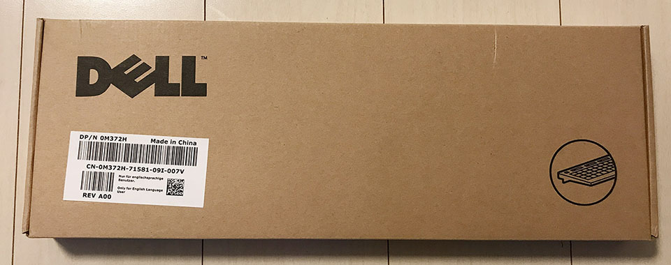
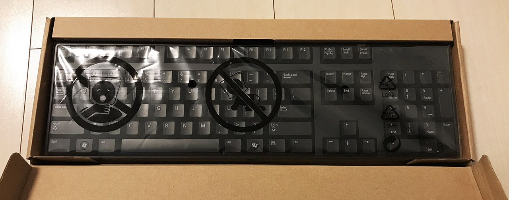
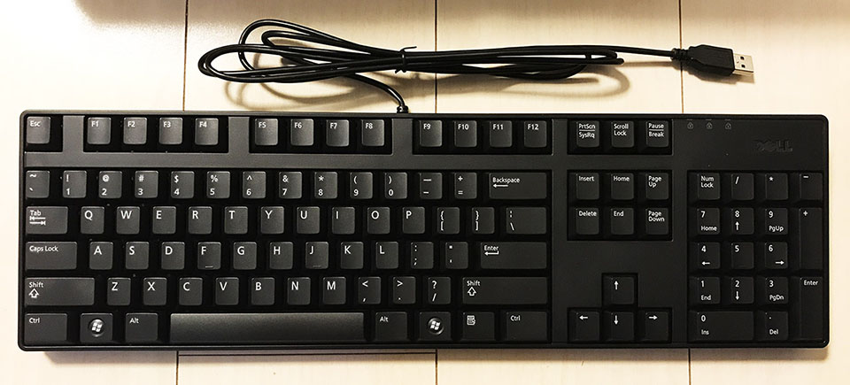
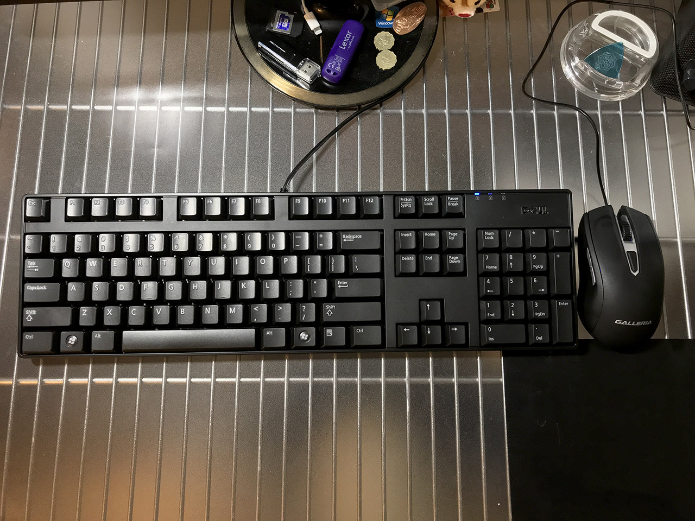

ついに自宅のデスクトップ PC も US キーボードに。

## 目次

## 経緯

これまで自宅のデスクトップ PC「ガレリア XG」には、サンワサプライの日本語配列の無線キーボードを使っていた。

- [ドスパラのデスクトップゲーミング PC「Galleria XG」を買った！](/blog/2017/08/08-03.html)
- [日本語109配列の無線キーボード & マウス！「Sanwa Supply SKB-WL24SETBK」を買った](/blog/2017/02/23-02.html)

だが、MacBook も ZenBook も US 配列で、会社でも US 配列キーボードが当たり前になってきた今日この頃、自宅のガレリアだけが JIS キーボードなのは使いづらく、US 配列のキーボードがほしいと思っていたところだった。

- [MacBook Pro Retina 13インチ (Early 2015) 届きました！](/blog/2016/05/08-01.html)
- [Asus ZenBook3 UX390UA-512GP を買いました](/blog/2017/12/06-01.html)

僕がキーボードに求めるスペックは、*日本語配列の場合は 109 配列のフルキーボード*であったが、英字配列の場合はどうかというと、日本語 109 配列と同様、*Windows キーが左右に2つあること*が必須だった。要するに `Fn` キーなどではない *104 キーボード*が僕の望む US キーボードになるワケだが、コレが大変だった。

今使っているサンワサプライのモノは、キーボードとマウスが1つの Bluetooth 受信機で扱える無線仕様で、できればこの仕様のまま、無線 US キーボードが欲しかった。

しかし、*英語配列のフルキーボードで無線*のモノ、というスペック自体が極端に少なく、*Filco Majestouch2* ぐらいしか見付からなかった。

Filco Majestouch2 もマウスセットではなく、さらに1万円以上して高い。ただ、テンキーレスのモデルは面白いなと思った。

- 参考：[DIATEC｜ダイヤテック株式会社 製品情報](http://www.diatec.co.jp/products/det.php?prod_c=2642)

テンキーは実際そうそう使わないものの、KeyCode が違ったりして JavaScript の検証で必要になる他、AutoHotKey との組合せで面白い使い方もできそうなので、安易にテンキーをなくすのも嫌だった。

## Dell の「普通の」キーボードを発見

…だんだんキーボード選びがつらくなってきたので、無線を諦めて有線の US キーボードで、Windows キーが左右に2つあるモノであればよし、ということにした。

最初は Amazon なんかを見ていたのだが、ふと思い立ってヤフオクで調べてみると、**よくパソコン本体に付属しているような、ありふれたキーボード**が安値で出品されていることに気が付いた。

*そう！僕が欲しいのは、変に拘った作りではない、PC 本体に付いてくるような、何の特徴もない、こういう普通のキーボードなのだ！*

その中でも一番良かったのが、キーの周りに余計なスペースのない、Dell のキーボードだった。中古なら4・500円のモノも出品されていたが、ちょうど新品の出品もあったので、故障を嫌って新品のモノを1700円程度で購入した。

## 商品到着・開封

コチラが現物。ホントに何かの PC 本体に付属していたようなキーボードそのままである。

左右に Windows キーがあり、アプリケーションキーもあり、その他の配列も「ドノーマル」で素晴らしい。コレを求めていたんだよ！

パームレストなどもなく本当にキー部分しかくっついていないので、フルキーボードながらスペースを取らない。助かる。

そして実際に使ってみて感じたのだが、**物凄く打ち心地が良い！！！！！**

それまで使っていたサンワサプライと比べると、もう少しヌコヌコと押せる感覚。「赤軸」とか「茶軸」とかよく分からないけど、ネットでの解説を見るに「青軸に近い」と表現すると伝わりやすいのかな？と思う。「カタカタ」とか「パチパチ」ではなく、「ヌコヌコヌコヌコ」という擬音で表現するのが適切な感じ。打ち心地は店頭で試した HHKB や RealForce よりも好みだ。

有線なのも、よくよく考えたらデスクトップ PC だし別に構わなかった。サンワサプライの無線マウスは先に壊れてガレリア付属の有線マウス使ってたし。w

*トータルで一つも不満なし！大変良い買い物をした！！*

## Windows10 で英字配列キーボードを使うための設定は？

さて、キーボード自体は USB を挿せばすぐ使えるのだが、認識されるキーボードの配列が JIS 配列のままなので、コレを直さなくてはいけない。

以前はレジストリをいじったりして面倒だった記憶があるのだが、Windows10 では簡単で、

- 「PC 設定」アプリ → 「時刻と言語」 → 「地域と言語」メニュー → 「日本語」言語を選択し「オプション」ボタン → 「ハードウェアキーボードレイアウト」の「レイアウトを変更する」ボタン → 「英語キーボード (101/102 キー)」を選択し「サインアウト」

コレだけで反映できる。

- 参考：[日本語Windows 10で英語キーボードを使う方法 - 価格.comマガジン](https://kakakumag.com/pc-smartphone/?id=11863)

英字配列で認識されてからの **IME 切替は ``Alt + ` (バッククォート)``** で行える。日本語キーボードでいうところの `Alt + 全角/半角` な押し方に似ている。だから昔の Windows で IME 切替する時って `Alt + 全角/半角` って押してたのかなぁ？コレの名残？

- 参考：[日本語Windows 10で英語キーボードを使う方法 - 価格.comマガジン](https://kakakumag.com/pc-smartphone/?id=11863)
- 参考：[Windows 10 USキーボードで日本語IMの全角と半角を切り替えるショートカット一覧](https://qiita.com/moutend/items/07a7bd19783234bd4159) … 上の文章中に、バッククォートを含むインラインコードを書いたのだが、その書き方。中で使うバッククォートより多い数の連続バッククォートで囲めば良い。

あとは Microsoft IME なり Google 日本語入力なりの設定から、*`Ctrl + Space`* などで IME 切替ができるように設定しておけば、普段はより押しやすくなるだろう。僕はコレに加えて AutoHotKey でもいくつか日本語切替の設定を入れたので、別途記事にしてみようと思う。

---

以上。かなり安物の、普通の US キーボードを買ったが、コレが大正解だった。いよいよ JIS キーボードを使わなくなったので、心置きなく US キーボーダーになりきろう。w

  

    
  

  

    

      <a href="https://hb.afl.rakuten.co.jp/hgc/g00rxoa2.waxyc671.g00rxoa2.waxyd53d/?pc=https%3A%2F%2Fitem.rakuten.co.jp%2Ftheater%2Fya1004854295%2F&amp;m=http%3A%2F%2Fm.rakuten.co.jp%2Ftheater%2Fi%2F16208421%2F">スーパーセール全商品ポイント10倍:Genuine デル M372H, N242F, T347F, SK-8175, KB1421, L30U ブラック スリム Quiet キー USB Keyboard for ノート and デスクトップ Systems with USB Ports (海外取寄せ品)</a>
    

    

      <a href="https://hb.afl.rakuten.co.jp/hgc/g00rxoa2.waxyc671.g00rxoa2.waxyd53d/?pc=https%3A%2F%2Fwww.rakuten.co.jp%2Ftheater%2F&amp;m=http%3A%2F%2Fm.rakuten.co.jp%2Ftheater%2F">シアター</a>
    

    
価格 : 9070円

  

