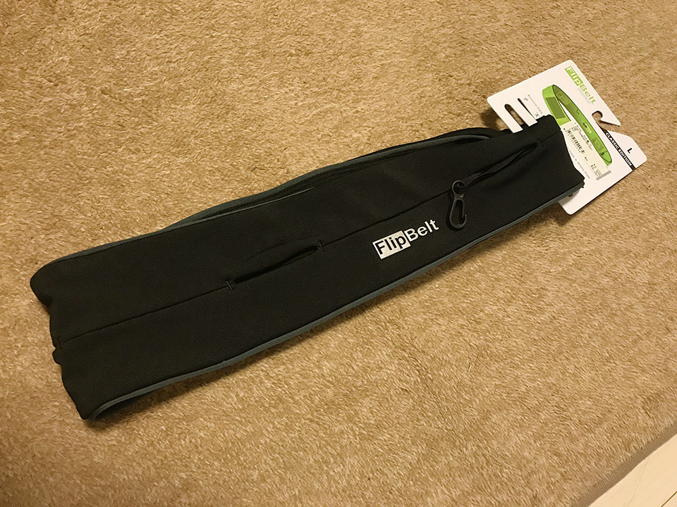

"ランニング用アームバンドやガサガサ揺れるウエストポーチにさようなら！" な商品を見付けたので紹介。

  

    
  

  

    

      <a href="https://www.amazon.co.jp/dp/B00JF9DWWU?tag=neos21-22&amp;linkCode=osi&amp;th=1&amp;psc=1">FlipBelt(フリップベルト) ウエストポーチ フリップベルト クラシック FBB ブラック M</a>
    

  

## 目次

## 経緯

ダイエットのため、ジムに通うようになったが、同時に外でのジョギングも始めることにした。

しかし、

- 自宅の鍵
- スマホ (iPhone7Plus なので大きめ)
- 小銭
- ペットボトル
- ハンドタオル

などをどのように持ち歩くかで悩んでいた。

マンハッタンポーテージのようなメッセンジャーバッグを斜めがけするのは邪魔臭いし、リュックも変だろう。ということでベルト式のウエストポーチを探してみたのだが、バックルが当たってコレも邪魔臭い。

どれもこんな感じなのか…と諦めかけていたその時、__FlipBelt__ なる商品を発見。見てみるとどこにもバックルがない。何だコレ？

勢いよく買ってみました。

  

    
  

  

    

      <a href="https://hb.afl.rakuten.co.jp/hgc/g00rl0w2.waxyc679.g00rl0w2.waxydf60/?pc=https%3A%2F%2Fitem.rakuten.co.jp%2Fmetrotrip%2Foth-flipbelt%2F&amp;m=http%3A%2F%2Fm.rakuten.co.jp%2Fmetrotrip%2Fi%2F10002220%2F">【正規取扱店】・FlipBelt (フリップベルト)[全9色]メンズ レディース 11601F(trip)[M便 1/2]新生活</a>
    

    

      <a href="https://hb.afl.rakuten.co.jp/hgc/g00rl0w2.waxyc679.g00rl0w2.waxydf60/?pc=https%3A%2F%2Fwww.rakuten.co.jp%2Fmetrotrip%2F&amp;m=http%3A%2F%2Fm.rakuten.co.jp%2Fmetrotrip%2F">trip</a>
    

    
価格 : 3960円

  

## FlipBelt の仕組み

FlipBelt の理屈は簡単で、_FlipBelt はただの伸縮性がある輪っか。_この輪っかに切れ込みがあり、切れ込みの間からスマホや小銭などを入れられる。

切れ込みにはファスナーなどがないので、「このまんまじゃ間からモノが落ちちゃうのでは？」と思うのだが、心配ご無用。頭からフラフープを通るように FlipBelt を装着してみると、FlipBelt が伸びて身体に密着し、中の荷物が落ちなくなるのだ。

最初はそれでも不安があるが、_しっかり密着していて、全くモノが落ちることはない。_鍵などのために__内部フック__も付いているので本当に貴重な物も安心だ。

## サイズ展開を要確認！

仕組みとしてはコレだけで、どこにもバックルやファスナーの類がないので、FlipBelt のサイズ調整ができないことに注意。

__僕が買ったのは L サイズ__で、各自の体型に合わせてピッタリなモノを買った方が良い。僕の場合は多分 M サイズだとキツすぎて動きづらかったと思うが、XL を選んだら緩くて落ちていたと思う。

## 入れたいモノが全部入れられた

この FlipBelt にどのくらいの荷物が入るか試したところ、最初に挙げたアイテムを全て収納できた。すなわち、

- 自宅の鍵 (内部フックに取付)
- スマホ (iPhone7Plus)
- 小銭数枚
- 500ml のペットボトル
- 30cm 四方ぐらいのスポーツ用ハンドタオル

これらを収納し、FlipBelt ごと身体に密着させておけたのだ。

ペットボトルは L サイズだったから入ったのかも。切れ込みの口がギリギリなので、より小さいサイズはどうなるかちょっと分からない。

## 装着感は全然ない

コレだけモノを詰め込んだら、お腹周りがゆっさゆっさしそうな気もしたが、密着感が強いので、荷物が揺れることがなく、それによって「着けています」感が全然なかった。本当に身体に密着させると、装着感ってなくなるもんなのね…と少し感動した。

荷物に合わせてベルトの位置や向きを調整させて、走っている時の手がポーチに当たらないようにすると、本当に手ブラで走っている感覚だった。

## お値段は少し高いが、十分な機能！

FlipBelt は4000円程度で購入した。「ただの輪っか」にしては値が張ったが、他のバックル式のポーチなどを使ってストレスを覚えるより断然良い。

荷物は十分入るし、装着感もない。さらにスウェットなどと同じポリエステル製なので、そのまま_洗濯機で丸洗いもできる_スグレモノ。

サイズのバリエーションがあるので、心配な人は店頭で確認した方が良いだろう。僕は近所のスポーツ用品店で見付けて買ったので、多分どこにでも売っているとは思う。

ジョギング時の荷物で困っている人は、FlipBelt をぜひ検討してみてほしい。
