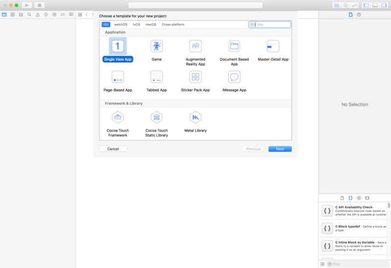
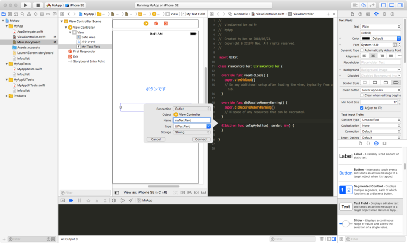

これまで Cordova を利用したハイブリッドアプリとしての iOS アプリは開発してきたが、Objective-C や Swift を書いて iOS アプリを作ったことがなかった。

そこで、Swift を使った iOS アプリ開発の初歩の初歩をやってみようと思う。

ベースとなる記事は以下。

- 参考 : [10分で試せる！ Swiftを使った初めてのiOSアプリ開発入門 - ICS MEDIA](https://ics.media/entry/6439)

ほとんどこの記事をそのままやってみただけ。

## 目次

## 環境情報

iOS アプリ開発は、iOS・Xcode・Swift 言語それぞれのバージョンアップの影響を強く受ける。バージョンが少しでも変わると、iOS の API が変わったり、Xcode の UI が変わったり、Swift の言語仕様や書き方が変わったりする。そこで、Swift に関する記事を書く時は毎回くどくても環境情報を書いておこうと思う。

- 対象 iOS バージョン : v11.3
  - シミュレータ : iPhoneSE … iOS v11.3 (15E217)
  - 実機 : iPhoneSE … iOS v11.3 (15E216)
- Xcode : v9.3 (9E145)
- Swift : v4.1 (swiftlang-902.0.48 clang-902.0.37.1)

## Xcode プロジェクトを作る

それでは早速開始。まずは Xcode プロジェクトを作る。Xcode 本体はインストールしてある前提で。

Xcode を開いたら、「Welcome to Xcode」画面から「Create a new Xcode project」をクリックする。


すると次の画面が開くので、「Single View App」を選択したまま「Next」ボタンをクリックする。



「Choose options for your new project:」画面では、

- Product Name
- Organization Name
- Organization Identifier

を入力する。


「Language」は「Swift」を選択しておき、「Next」ボタンをクリックする。

Xcode プロジェクトをどこに保存するか尋ねられるので、適当なディレクトリを選んで「Create」ボタンを押下する。この時、「Create Git repository on my Mac」にチェックを付けておくと、Xcode プロジェクトを Git 管理できるようになる。


「Create」ボタンを押すと Xcode の編集画面が開く。左のペインから操作したい対象を選ぶと、中央のペインに対象が表示され、右側のペインで詳細を確認したり処理を追加したり、といった流れで操作できる。


コレでプロジェクトの作成は完了。

## ボタンやテキストフィールドを配置する

次に、アプリの画面上に UI 部品を配置してみる。今回は「*Storyboard*」という機能を使って、GUI 上でインタラクティブに UI 部品を配置したりしてみる。Storyboard については GUI 上で直感的に操作できて分かりやすい反面、生成されるコードをバージョン管理しづらくチーム開発には向かない、といった意見もある。今回は初歩の初歩だし、一個人が試すだけなので特に気にせず使ってみよう。

左ペインから `Main.storyboard` を選ぶと、中央ペインにアプリのプレビュー画面のようなモノが表示される。ココに UI 部品を置いていける。


右下のペインから「*Object Library*」タブ (4つのアイコンの内の右から2番目、ホームボタンのようなアイコン) を選び、その中から「Button」を選択する。


コレをドラッグして中央ペインまで持っていくと、ボタンが配置できる。


ボタンを選択状態にしたまま、右上のペインの「*Attributes Inspector*」タブ (6つのアイコンの内の右から3番目、ルーラーのようなアイコン) を選ぶと、そのボタンの UI を変更できる。今回は「Title」に書かれていたデフォルトのラベル「`Button`」を、「`ボタンです`」と書き換えてみよう。


コレでボタンのカスタマイズは一旦終了。

続いてテキストフィールドを配置する。先程と同様に「Object Library」タブから「Text Field」を選択し、Storyboard にドラッグする。「Attributes Inspector」タブを開いて「Text」を「`(初期値)`」と書き換える。


テキストフィールドの幅などは Storyboard 上で直接広げたりして設定できる。

こんな感じで、GUI 上で簡単に画面を作り上げられる。

## ボタンをタップした時の処理を実装する

次に、**「ボタンをタップしたらテキストフィールドの値が変わる」という処理**を書いてみようと思う。

Xcode のウィンドウ右上から「*Assistant Editor*」ボタン (3つのボタングループの中央、円が2つ重なっているアイコン) をクリックすると、左に `Main.storyboard`、右側に `ViewController.swift` が開いた状態になる。


- 思ったようなウィンドウが開かない時は、各ペイン上部の階層メニューから選択すれば良い。

この画面になったら、先程配置したボタンをクリックし、*`Control` キーを押しながら*右側の `ViewController.swift` のコードの空行部分にまでドラッグする。


するとフキダシが表示されるので、次のように設定し、「Connect」ボタンをクリックする。

- Connection : 「Action」を選択
- Name : メソッド名となる。今回は「`onTapMyButton`」とした


すると次のようなコードが挿入される。

```swift
@IBAction func onTapMyButton(_ sender: Any) {
}
```


コレで、`Main.storyboard` 上のボタンをタップした時に、`ViewController.swift` の `onTapMyButton()` メソッドが発火するように紐付けができた。

同様にして、テキストフィールドも `Control` を押しながらコードの空行にドラッグする。


コチラは *Storyboard 上の UI 部品の参照を得たい*ので、フキダシに以下のように設定する。

- Connection : 「Outlet」のまま
- Name : 変数名となる。今回は「`myTextField`」とした



コレで「Connect」ボタンを押下すると、以下のコード行が追加される。

```swift
@IBOutlet var myTextField: UITextField!
```


適当に空行やコメントを入れ、`onTapMyButton()` メソッド内に以下のようにコードを入れてみる。

```swift
// テキストフィールドの参照
@IBOutlet var myTextField: UITextField!

// ボタンが押された時の処理
@IBAction func onTapMyButton(_ sender: Any) {
  // テキストフィールドの値を変更する
  myTextField.text = "ボタンが押されたよ"
}
```


`UITextField` に `.text` というプロパティがあって、ココに代入できる、みたいな API に関しては、徐々に覚えていくしかないと思うが、とりあえず今回はこう書く、とだけ。

## ビルドして実際に動かしてみる

ココまで実装できたら、実際に動かしてみよう。実機でもシミュレータでも良いが、今回はシミュレータを使った。

Xcode ウィンドウの左上、「`MyApp > …`」とある部分で、青いアイコンの「iPhoneSE」を選べば、iPhoneSE の iOS Simulator でアプリを開いてくれる。この状態で、その左側にある再生ボタンみたいな「*Build & Run*」アイコンを押してビルドする。


ビルドができると、iOS Simulator が立ち上がり、先程作った画面が表示されるはずだ。


実際に「ボタンです」というボタンを押してみると、以下のようにテキストフィールドの値が変わったことが確認できるだろう。


コレで完了。

## Git での管理

最後に、Xcode と Git の連携について。Xcode 上からソースのコミットや Push などができる。メニューバーの「Sourcde Control」より、「Commit...」を選択すれば、今回作ったコードをコミットできる。


最初の状態であれば、リモートブランチをどことも紐付けていないので、完全にローカルに閉じた Git 運用となるが、一個人の開発であっても差分管理は有用なので、こうした機能もぜひ使っていきたい。

## 以上

このように、Xcode 上で Swift コードを書きながらも、UI に関しては Storyboard という機能で分かりやすく実装していけた。

今後はより Swift コードを書いていって、「アレをしたいのだけどどうやるんだろう？」といったところをまとめていこうと思う。
