前回 MacBookAir 13インチと MacBookPro 13インチを比較したが、その第2弾、的な。

- [MacBookAir 13インチ Early 2015 と MacBookPro 13インチ Early 2015 の外観を比べてみた](/blog/2017/11/26-02.html)

プライベートで使っている MacBookPro 13-Inch Early 2015 と、仕事で使っている MacBookPro 15-Inch Mid 2015 の外観を比較してみた。

2016年以降のモデルチェンジする直前、USB-C を採用する前の最後のモデルである。

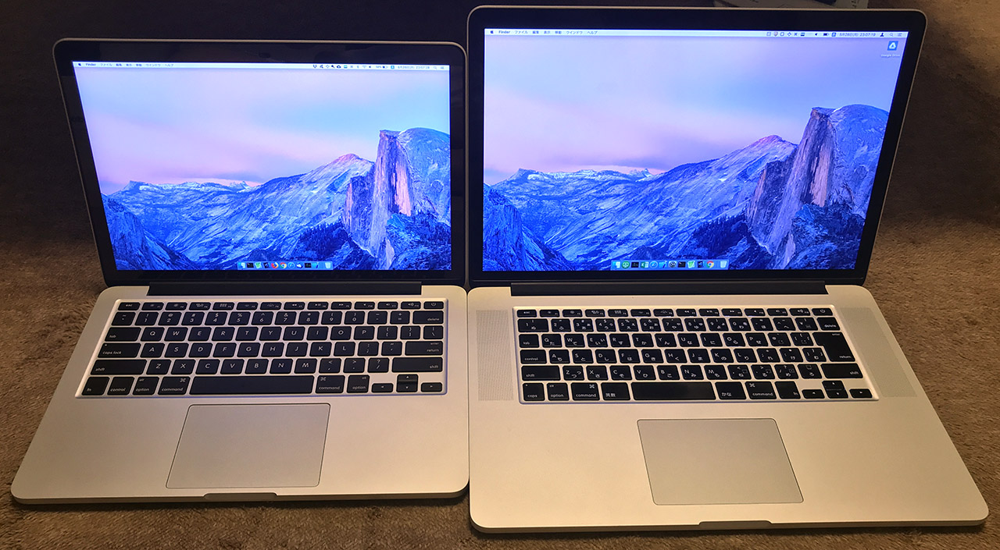

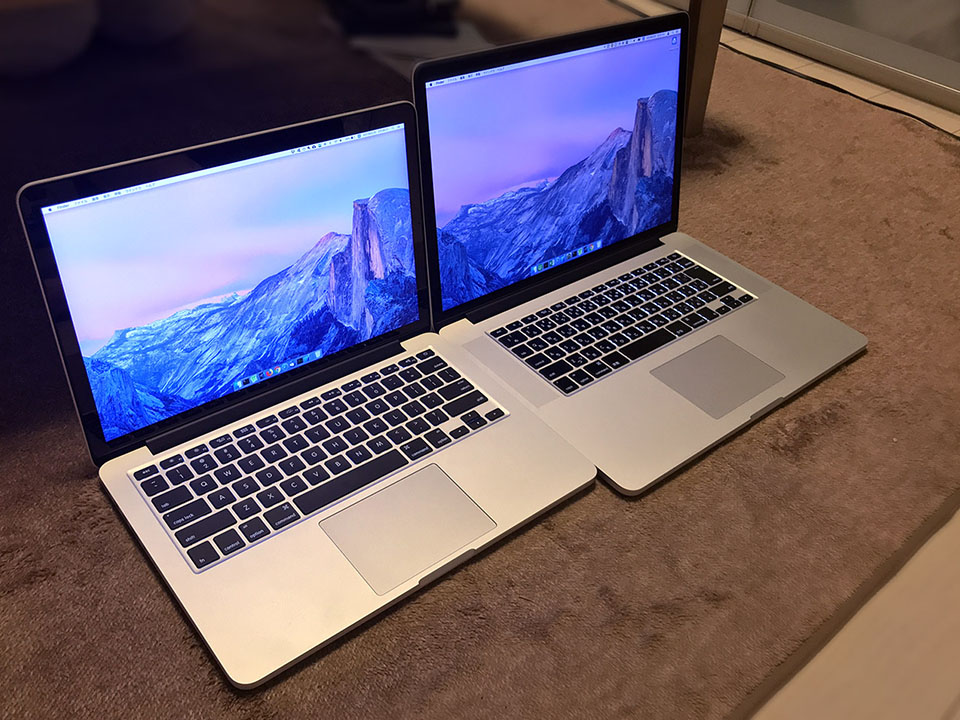

↓正面。

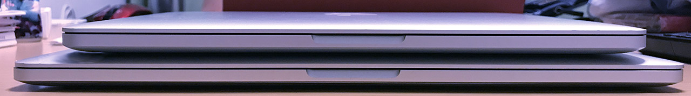

↓背面。

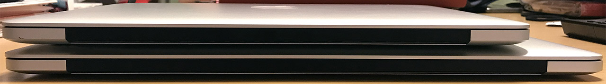

↓向かって左面。ポートの類は13インチも15インチも同じだった。

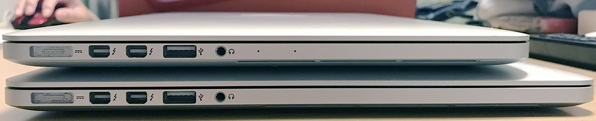

↓向かって右面。

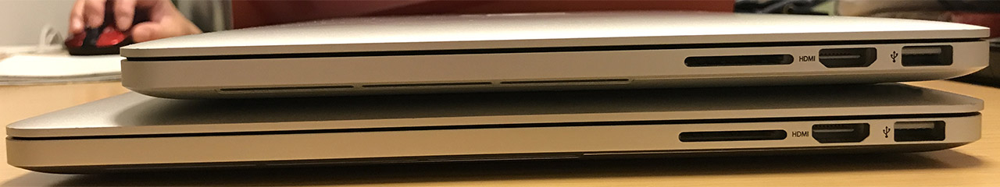

↓重ねてみる。

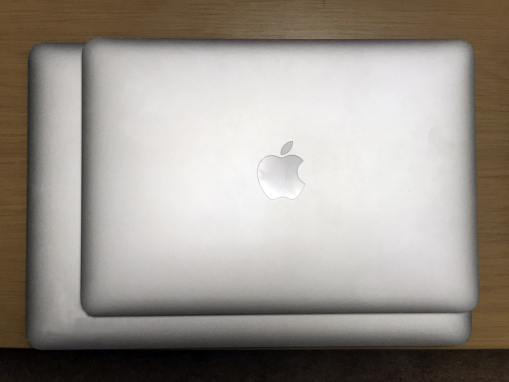

↓天面。

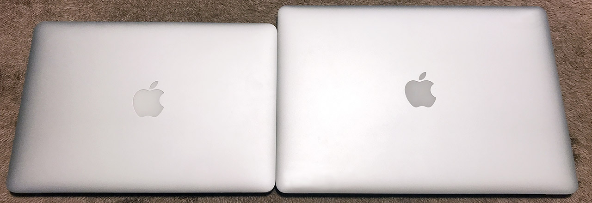

↓裏面。

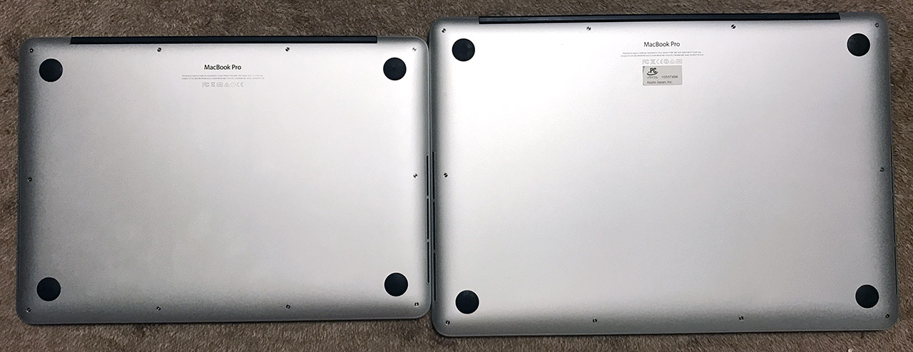

↓キーボードとトラックパッド。15インチの方は JIS 配列だ。

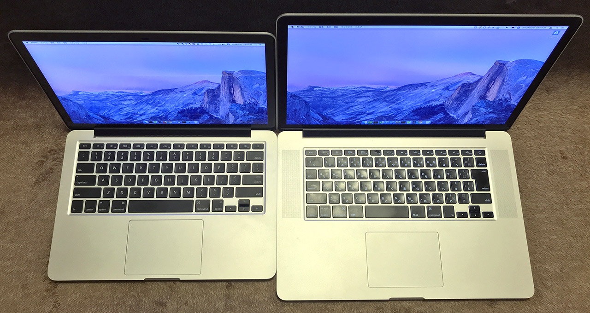

↓キーボードとトラックパッドのサイズは同じ。

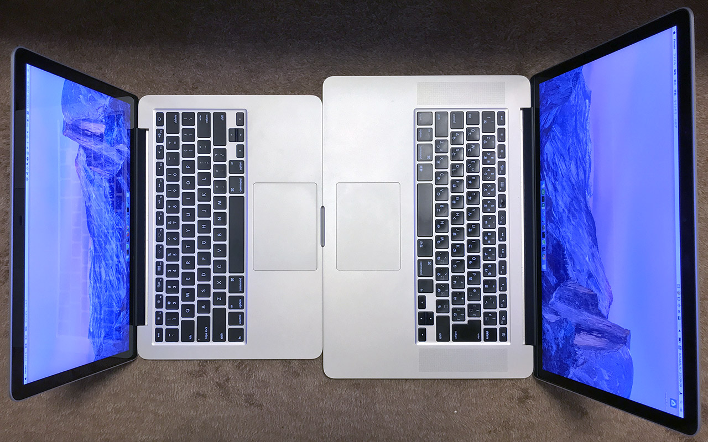

↓スタバでドヤってる時に周りに見せる面。

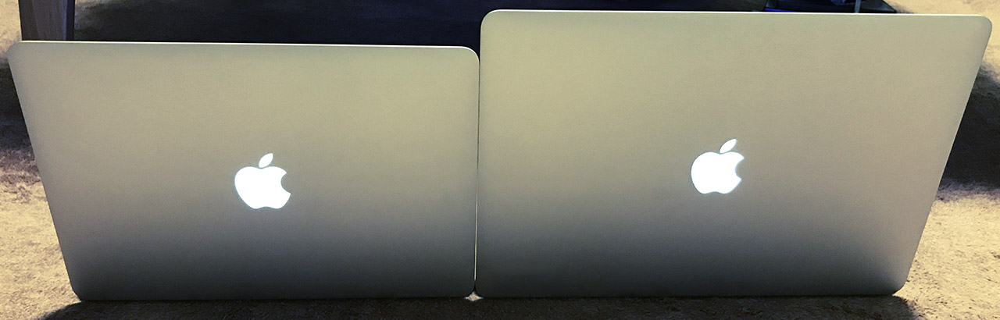

---

外観についてはこんなところ。

スペックについては公式の技術仕様を参照。

- [MacBook Pro (Retina, 13-inch, Early 2015) - 技術仕様](https://support.apple.com/kb/SP715?locale=ja_JP&viewlocale=ja_JP)
- [MacBook Pro (Retina, 15-inch, Mid 2015) - 技術仕様](https://support.apple.com/kb/SP719?locale=ja_JP&viewlocale=ja_JP)

サイズに関してまとめると以下のようになる。

| -    | 13インチ | 15インチ |
|------|----------|----------|
| 幅   | 31.4cm   | 35.89cm  |
| 奥行 | 21.9cm   | 24.71cm  |
| 高さ | 1.8cm    | 1.8cm    |
| 重量 | 1.58kg   | 2.04kg   |

ディスプレイを閉じた時の高さは両者同じ。15インチは2キロ超えだ。ちなみに13インチは2015年3月9日発売、15インチは2015年5月19日と、若干発売日が違う。だから Early 2015 と Mid 2015 なのね。

ついでに、2017年モデルのスペックは以下のとおり。

| -    | 13インチ | 15インチ |
|------|----------|----------|
| 幅   | 30.41cm  | 34.93cm  |
| 奥行 | 21.24cm  | 24.07cm  |
| 高さ | 1.49cm   | 1.55cm   |
| 重量 | 1.37kg   | 1.83kg   |

どちらのモデルも、幅・奥行が1センチ前後ずつ小さくなり、重さも 200g 程度軽くなっている。Touch Bar が好みに合えば買い換えるかもしれないが、今のところは12インチ MacBook 欲しい。ｗ

- [MacBook Pro (13-inch, 2017, Thunderbolt 3ポートx 2) - 技術仕様](https://support.apple.com/kb/SP754?viewlocale=ja_JP&locale=ja_JP)
- [MacBook Pro (13-inch, 2017, Thunderbolt 3ポートx 4) - 技術仕様](https://support.apple.com/kb/SP755?viewlocale=ja_JP&locale=ja_JP)
- [MacBook Pro (15-inch, 2017) - 技術仕様](https://support.apple.com/kb/SP756?viewlocale=ja_JP&locale=ja_JP)

以上。
