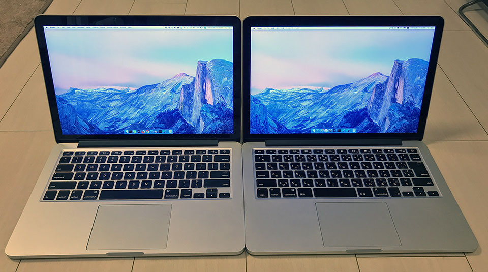

MacBook 外観比較シリーズ第3弾。

- [MacBookAir 13インチ Early 2015 と MacBookPro 13インチ Early 2015 の外観を比べてみた](/blog/2017/11/26-02.html)
- [2015年モデルの MacBookPro の13インチと15インチを比較してみた](09-02.html)

今回は、プライベートで使っている MacBookPro 13インチ Early 2015 モデル _(US 配列)_ と、同モデルの __JIS 配列__ を比較してみた。

同じモデルなので、違いはホントにキーボードのみ。

↑左が US 配列 (私物)、右が JIS 配列 (仕事用)。

キー配列に関する雑感。

- Esc、ファンクションキーの行は同じ。
- US 配列は「1」の左にバッククォート「`\`」キーがある。JIS 配列は「1 ぬ」キーが長い。
- US 配列の方が Delete キーが長く、ホームポジションから小指が届きやすい。
- JIS 配列は実はキーの中心が左に寄っている。「Esc」「F1」キーのすぐ下の「1」「2」キーの位置を見比べてみると分かりやすい。
- よって Tab や Shift など左端のキーは JIS 配列の方が短い。
- JIS 配列は、Tab と Shift の間に Control キーがあり、Shift の下に Caps (Lock) キーがある。Windows に慣れたユーザからするとコレがメチャクチャ気持ち悪いと思う。古い Unix 向けのマシンはこういう配列だったようだが、イマイチ慣れん。ということで JIS 配列を選ぶユーザはよく Caps Lock と Control キーを入れ替えていたりするが、US 配列ならその必要もなし。
- US 配列の場合、fn キーは左下にあるが、JIS 配列は矢印キーのすぐ左、つまり右下のほうにある。`fn + Delete` と押したい時に、US 配列なら左右の手で1キーずつ押せるので押しやすいが、JIS 配列の人は右手をズラして2つのキーを押さないといけないので使いづらい。
- JIS キーには「英数」「かな」キーがあるので、 Command キーが押しづらい。自分は JIS 配列向けに「英かな」と「Karabiner-Elements」を併用して、「Cmd キー単独押しで英数・かなキー代わりにもなる」「英数・かなキーと他のキーのコンボで Cmd キー代わりにもなる」設定にしてある。スペースキーの長さも若干違うので、特に「かな」キーを Cmd キーとして利用する時にポジションが少しおかしくなる (両方の「M」キーの下を見比べると分かってもらえるかも)。
  - [日本語キーボードの MacBook で英数・かなキーと Cmd キーにお互いの機能を持たせる](/blog/2017/04/26-02.html)

僕はこの MacBookPro から US 配列ユーザとなったが、そのメリットはやはり英語を書く時に強いと思う。シングルクォートとバッククォートが右手小指の位置にあって押しやすく、記号キーの配置が JIS 配列よりも「理にかなっている」と思う。Delete と Return (Windows なら BackSpace と Enter) も押しやすい。スペースの左右のワケ分からんキーもないのでシンプルだ。ついでにキーの刻印にひらがながなくてスッキリして見えるという点も。ｗ

Mac の JIS 配列は Windows 系の JIS 配列よりも使い勝手が悪いと感じる。今となっては Tab キーの下に Control キーがあるのは違和感しかないし、fn キーの配置も極めて使いづらい。Windows では JIS 配列の人でも、Mac を買う時は US 配列で良いと思う。実際 Control キーは Windows における「Ctrl」キーの役割ではないので、Mac 向けにキー操作を覚え直すことになるだろうから、あまり気持ち悪い配列を選ばなくても良いかな、と思う。
