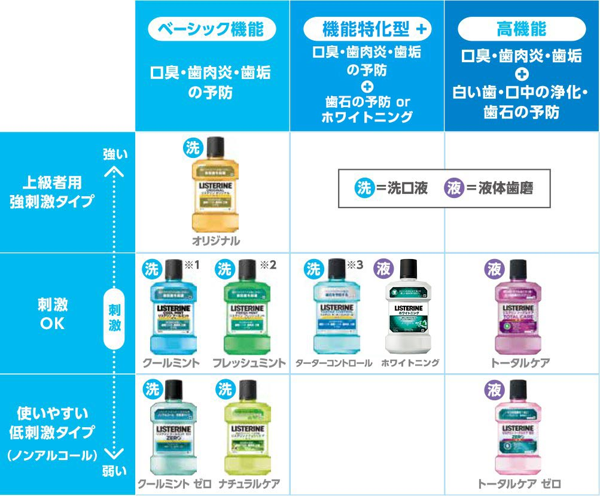

僕は普段、リステリンの「トータルケア」という紫のヤツを使っている。

リステリン出始めの頃は、水色のクールミント、緑色のフレッシュミント、あと辛い黄色のオリジナルの3種類しかなかったが、「トータルケア」というのは全部入りみたいなフレコミで、いつの間にかノンアルコールタイプとかもできていた。

このリステリンのパッケージをよくよく見ていると、商品によって_「洗口液」_と書いてあるものと、**「液体歯磨」**と書いてあるものがあった。この違いは何か調べてみた。

## 「洗口液」は歯磨きした後

まず「洗口液」。コチラは「マウスウォッシュ」と表現されるもので、歯磨きを一通りしたあとに、軽く仕上げとしてクチュクチュペッとするモノだ。リステリンだのモンダミンだの GUM (ガム) だの、といった製品から連想される一般的な使い方だ。

## 「液体歯磨」は歯磨き粉の代わりに使う

そして「液体歯磨」。コチラは**歯磨き粉の代わりに使うモノ**だと云うのだ。つまり、歯を磨く前にコレでクチュクチュペッとして、その後に歯ブラシで歯を磨くのだ。

## リステリンには「洗口液」と「液体歯磨」がある

現在のリステリンのラインナップの中では、

- トータルケア
- トータルケア・ゼロ
- ホワイトニング

という3種類が**液体歯磨**だ。それ以外は_洗口液 = マウスウォッシュ_だ。

- 参考：[薬用リステリン®の選び方 | 口臭、歯肉炎の予防には薬用リステリン®](https://www.listerine-jp.com/brand/choose)

僕は今まで、リステリンというと全て歯磨きをした後に仕上げ的に使っていたが、コレは誤りだったというワケだ。トータルケアはコレを使って歯を磨くのが本来の使い方なのだ。今まで僕は歯磨き粉を口の中にまぶしたまま寝ていたというワケか…。デンタルリンス、奥が深い…。

…しかし、液体で歯磨きするってのは、どうも違和感がある…。モノによっては「液体を口に含んだ状態でブラッシングする」モノもあるみたいだが、これも慣れなのだろうか…。

ひとまず、推奨される使い方に沿って、使い方を正していこうかなと思っている。
