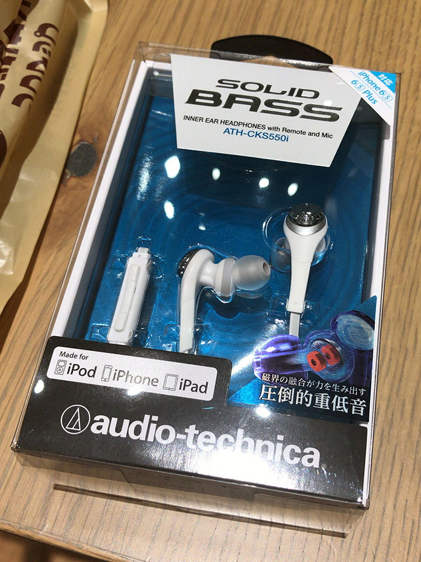
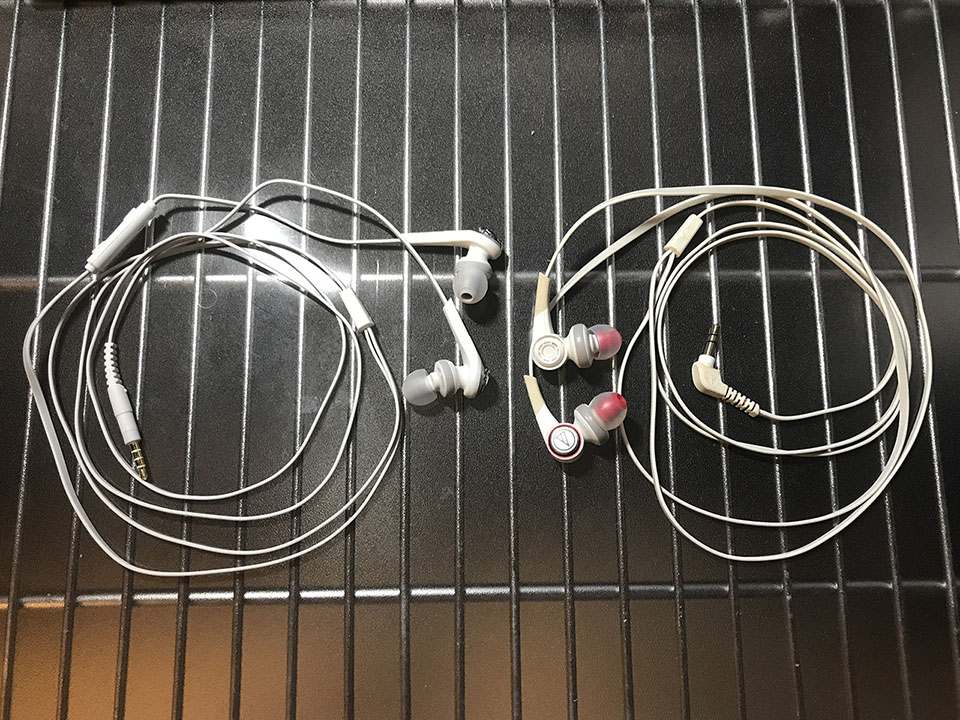

これまで使っていた _Audio Technica CKS770_ というカナル型のイヤホンが、今朝急に左側だけ音が出なくなってしまったので、その日のうちに __Audio Technica CKS550i__ という別のイヤホンを買ってきた。4200円程度だった。

  

    
  

  

    

      <a href="https://www.amazon.co.jp/dp/B016D6S2VI?tag=neos21-22&amp;linkCode=osi&amp;th=1&amp;psc=1">audio-technica SOLID BASS iPod/iPhone/iPad専用カナル型イヤホン 重低音 ホワイト ATH-CKS550i WH</a>
    

  

僕は CKS770 以前も Audio Technica の Solid Bass シリーズのカナル型イヤホンを代々使ってきた。

今回も安定の Soild Bass シリーズである。大体いつも4・5000円程度の Solid Bass シリーズのイヤホンを適当に選んでいる。今回も性能面はそんなに差はない。

CKS770 はケーブルのシリコンの滑りが悪く、束ねているとケーブル同士が絡まって、凄く外れにくくて困っていた。今回買った CKS550i は、CKS770 よりはサラサラとした質感のケーブルで、もう少しほどけやすい感じ。

↑左が今回買った CKS550i、右がこれまで使っていた CKS770。

  

    
  

  

    

      <a href="https://hb.afl.rakuten.co.jp/hgc/g00q37i2.waxycd48.g00q37i2.waxyda4f/?pc=https%3A%2F%2Fitem.rakuten.co.jp%2Fakibamac%2F4961310133849%2F&amp;m=http%3A%2F%2Fm.rakuten.co.jp%2Fakibamac%2Fi%2F10419916%2F">audio-technica(オーディオテクニカ) SOLID BASS(ブルー)ATH-CKS550i BL(iPod/iPhone/iPad用)【リモコン・マイク対応】【重低音モデル】 カナル型イヤホン ATHCKS550IBL</a>
    

    

      <a href="https://hb.afl.rakuten.co.jp/hgc/g00q37i2.waxycd48.g00q37i2.waxyda4f/?pc=https%3A%2F%2Fwww.rakuten.co.jp%2Fakibamac%2F&amp;m=http%3A%2F%2Fm.rakuten.co.jp%2Fakibamac%2F">ソフマップ　デジタルコレクション</a>
    

    
価格 : 4010円

  

あと CKS550i の方は、右側のケーブルに音量調整ボタンが付いている。iPod や iPhone に対応しているようだ。地味に便利かも。

イヤホンジャック部分は、CKS770 は L 字だったが、CKS550i は I 字。この辺は使用している音楽プレイヤーの形状や好みに関わると思うので要注意か。僕は iPod nano 7G を使っていて、あまり気にならない。

よくよく見ると、CKS770 のホワイトな外見がだいぶ黄ばんでいる。いつ買ったかは忘れたがそれなりに長く使ったのだろう。引き続き Solid Bass シリーズを使っていく所存。
