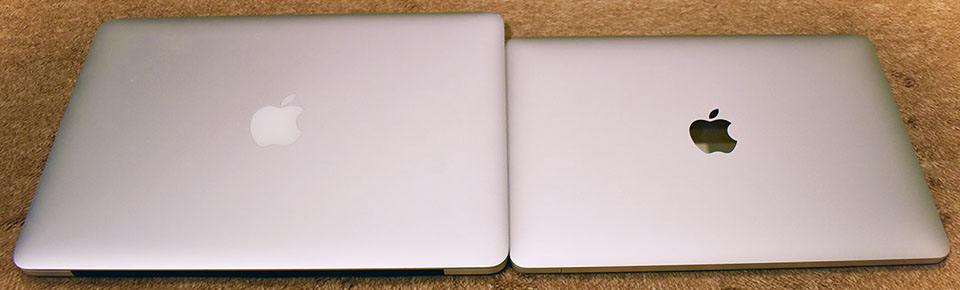
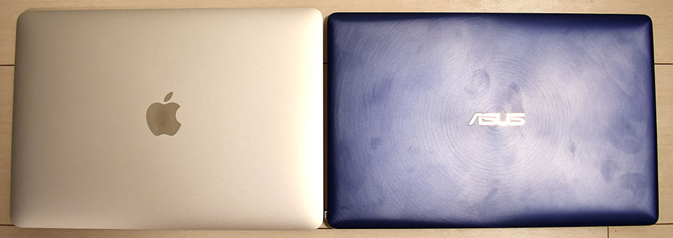
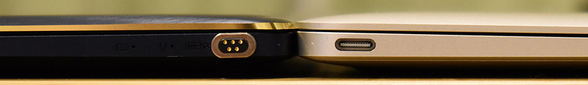

2016年5月1日に MacBookPro 2015年モデルをポチってから約2年4ヶ月。__12インチの MacBook 2017年モデルをポチった。__

- [MacBook Pro Retina 13インチ (Early 2015) 届きました！](/blog/2016/05/08-01.html)

MacBookPro を購入した時も、2016年モデルの発表を待てずに2015年モデルを買ってしまった (当時 2016年6月14日に WWDC が開催されたが、そこで MBP は発表されず、結局2016年10月28日にタッチバー付きの MBP 2016 が発表された)。結局、2016年モデル以降のタッチバーが気に入らなかったので、2015年モデルを買って正解だったと思っている。

2017年6月8日に12インチ MacBook の2017年モデルが発表され、メモリが 16GB 搭載されるようになり、俄然このマシンが気になっていた。気になり過ぎるあまり、2017年11月25日に Asus ZenBook3 をポチってしまった。

- [Asus ZenBook3 UX390UA-512GP を買いました](/blog/2017/12/06-01.html)

サイズ、重量、スペックなど、全てが「12インチ MacBook クローン」な ZenBook を購入し、910g という驚異の軽さを体験して以来、1.5kg 超の MacBookPro はもう持ち運べなくなってしまった。

ZenBook はとても優秀で、Windows 環境を触りたい時は申し分ないのだが、やはり持ち運び可能な Mac 環境も欲しい…。

その思いが拭え切れないでいるまま過ごしたある日、<ins datetime="2021-03-26T00:00Z">元</ins>妻が Surface Go を購入するということで、僕もついに12インチ MacBook をポチることにした。

- [元妻が Surface Go を買いました](06-01.html)

ずっと Yahoo! オークションで自分が欲しいスペックのマシンをウォッチしていたので、決心したその日に即決価格で購入。2018年8月26日にポチって8月28日に届いた。

12インチ MacBook 単品で写真撮るの忘れた。13インチの MacBookPro 2015 と並べて。

_……あぁ、また9月12日に開催予定のイベントを待たずに Mac 製品をポチってしまった…。_

## スペック

スペックは以下のとおり。

- CPU：__Core i7-7Y75__ 1.4GHz (Turbo Boost 使用時最大 3.6GHz) Kaby Lake
- メモリ：__16 GB__ (8 GBx2) 1,866 MHz LPDDR3
- GPU：Intel HD Graphics 615 (CPU 内蔵)
- SSD：_512 GB_ PCIe 3.0x2
- Keyboard：第2世代バタフライ構造 __US 配列__
- カラー：シルバー

やはり個人的に _Core i7・16GB RAM・US 配列_は外せない。SSD は MBP を使ってきて 256GB でも良いかなと思っていたのだが、512GB の特盛りの個体が出品されていたのでそれにした。シルバーというカラーも個人的には MBP そのままとしたかったので良き良き。

Core i7 とはいっても、7Y75 というモバイル向けの CPU で、ZenBook の Core i7-7500U よりスペックとしては劣る。ベンチマーク結果は以前別の記事で紹介したとおりだが、実際に使ってみると、__能力の低さを感じることはほぼない。__むしろ _MBP と比較しても劣っている感じがない_のが凄い。

- [12インチ MacBook 2017年モデルの CPU・Intel Core i7-7Y75 の性能チェック](/blog/2018/08/22-01.html)

## 見た目を比較チェック

自分が持っている MacBookPro 13インチ 2015年モデルと、Asus ZenBook3 (12インチ) と比較してみよう。

13インチ MacBookPro 2015 とサイズ比較。

縦横比較。

厚さ比較。

続いて Asus ZenBook3。

ZenBook はとにかく指紋が付きやすい…。

重ねてみた。ZenBook の方が少し幅がある分、長さが短い。MacBook の方が幅が短く、長さがある。

厚さ比較。

最後に充電器の比較。

ZenBook の専用アダプタは、コンセント端子部分が畳んで収納できない以外は、コードを縛るマジックテープが最初から付いていたりして使いやすい。MacBookPro の AC アダプタはやはりデカいが、MagSafe なのは扱いやすかった。MacBook の AC アダプタは、USB-C ケーブルを挿して使うタイプなので、ケーブルを充電以外の用途にも流用できるのが良い感じ。MBP 用の電源よりコンパクトになって、持ち運びもしやすくなった。

## ZenBook とスペック比較

次はカタログスペックで比較してみよう。

| 項目 | MacBook   | ZenBook   |
|------|-----------|-----------|
| 横幅 | _280.5mm_ | 296.0mm   |
| 縦幅 | 196.5mm   | _191.2mm_ |
| 厚さ | 13.1mm    | _11.9mm_  |
| 重さ | 920g      | _910g_    |

ファンレスな Core i7-7Y75 を搭載している Macbook より、ファン付きの Core i7-7500U が搭載されている ZenBook の方が、縦幅・厚さ・重さの点で優れている。ZenBook の方が 1.6cm 横幅が広いが、重さも 10g 軽いので、両者を持ち比べてみると、ZenBook の方がしっかり軽く感じる。これは意外だった。MacBook はまだまだ軽くできる余地がある？

## 使い心地・性能は？

第2世代バタフライ構造の極薄キーボードは、個人的には問題なし。キーボードの修理プログラムが行われているモデルだが、現状まだ問題なし。

- 参考：<https://www.apple.com/jp/support/keyboard-service-program-for-macbook-and-macbook-pro/>

早速キーボードカバーをポチったので、早いとこ付けておこうと思う。

性能面は、Chrome ブラウザでタブを10個程度開いてもほとんどつっかえることなく、少なくとも ZenBook と同等程度の速度で動いてくれている。YouTube で HD 動画を見ることも問題ない。

僕の主な使い方はフロントエンド開発だが、VSCode 上で Node.js サーバを Watch モードで動かしつつ開発、といった操作は問題なくできている。MacBookPro 2015 と比べても処理性能に見劣りするような点は見受けられない。

Homebrew でソフトをインストールしまくりつつ、rbenv 環境を構築しつつ、インストーラでアプリをインストール、というように、複数のソフトウェアを同時にインストールするようなマルチタスクを試した時は、若干時間がかかっただろうか。それでも、「Y シリーズの CPU はこんなもんかー…」とガッカリするようなことは全くなく、自分が理想とする程度にはキビキビ動いてくれているので嬉しい。コレが CPU ではなくメモリによる恩恵が強いのか、はたまた SSD の速度によるものなのかは判断つかないが、少なくとも特盛モデルなら安心である。

今回買ったのは、ヤフオクに出品されていた中古ではあるが、かなり美品でほとんど問題ない。自分が狙っていたそのものズバリなスペックで、新品価格より5万ほど安く買えたので申し分なし。

ケースやアダプタ類など、付属品もオマケで付けてくださっていた。コレが優秀で使いやすい！

キーボードに問題があるモデルだし、2018年モデルが発表されるかもしれないという時期なので、本当に買うか物凄く迷ったが、結果的に正解だった。これからこの MacBook 向けに周辺機器を揃えていこうと思うので、できたらまた記事にしようと思う。

- [ｷﾀｰ!!!!](https://www.instagram.com/p/BnEHfjuhteP/)

  

    
  

  

    

      <a href="https://www.amazon.co.jp/dp/B00ZZWK896?tag=neos21-22&amp;linkCode=osi&amp;th=1&amp;psc=1">パワーサポート　アンチグレアフィルムセット for MacBook 12inch　PEF-12</a>
    

  

