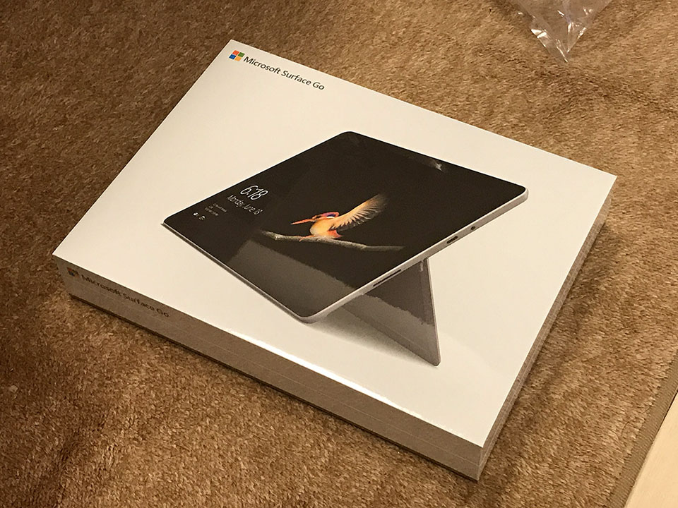
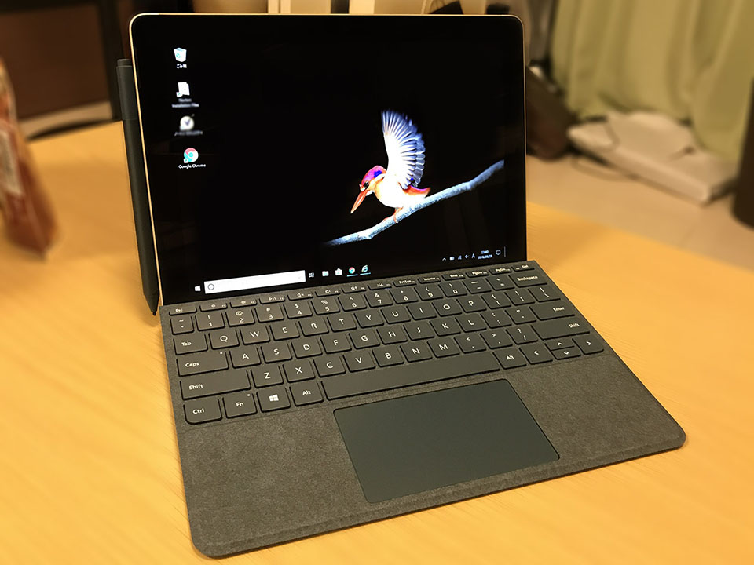
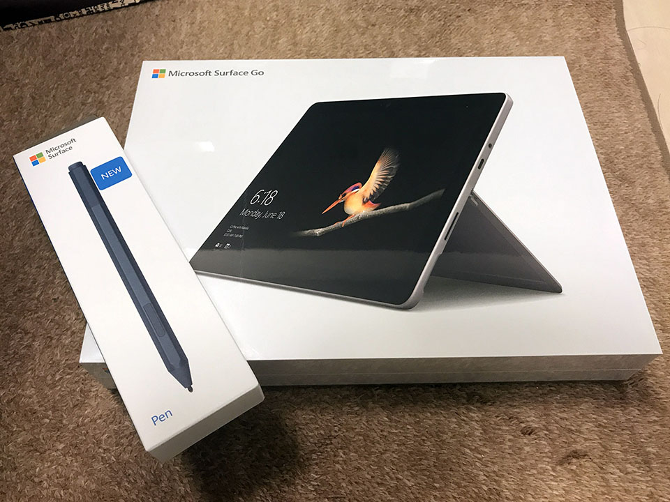
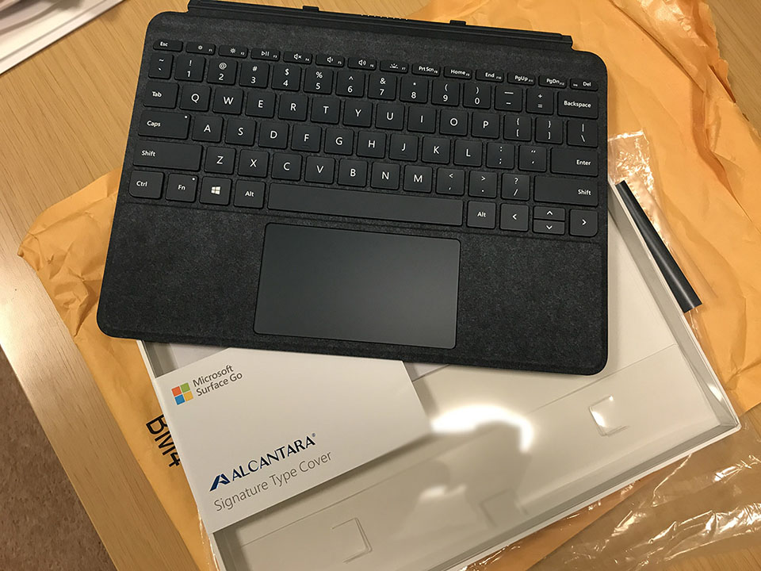
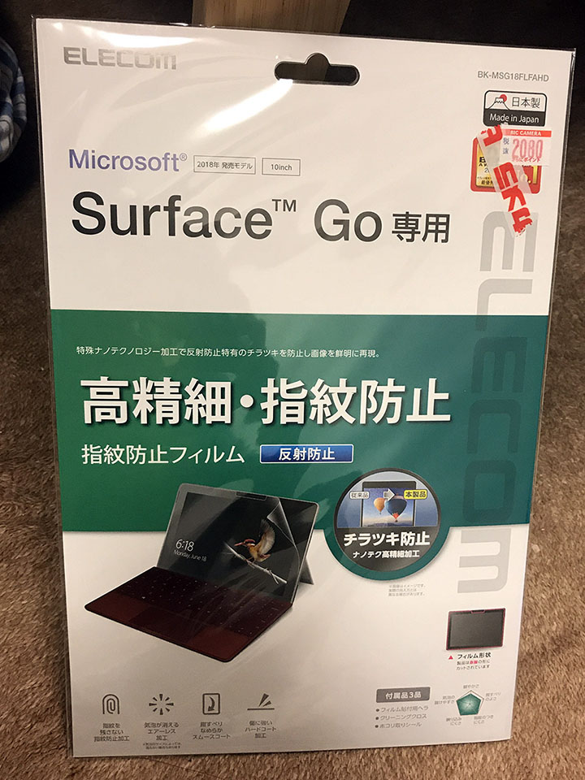
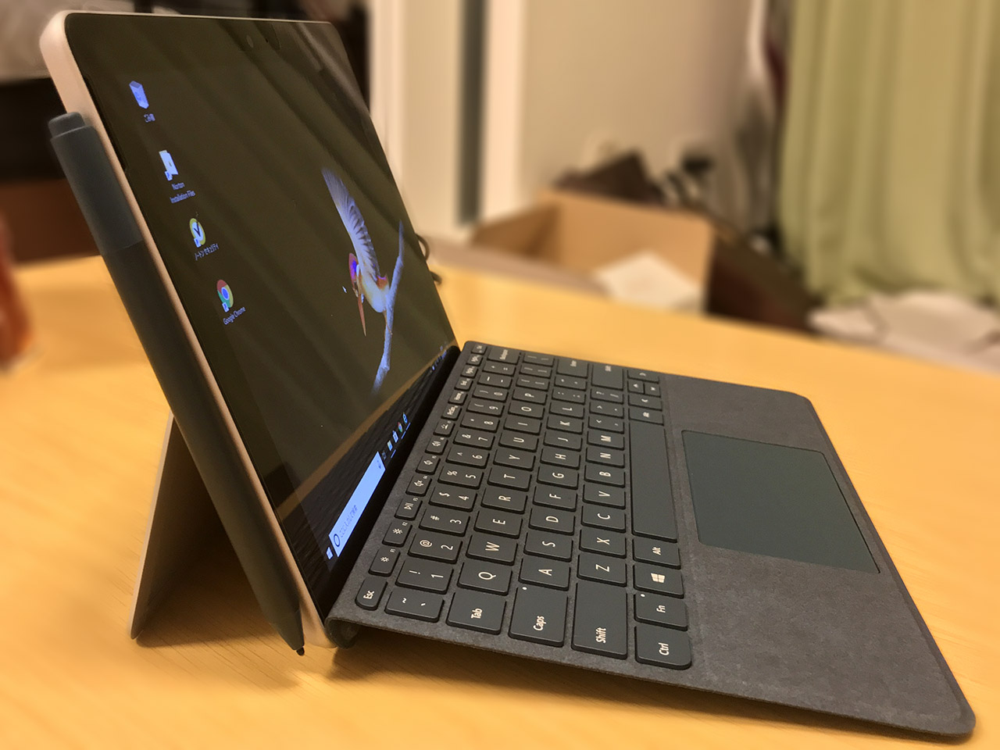

前回、僕が12インチ MacBook をポチってしまった記事を書いた。

- [12インチ MacBook 2017年モデルを買ってしまった…！](05-01.html)

が、実は同日、<ins datetime="2021-03-26T00:00Z">元</ins>妻もある買い物をしていた。それは、**Surface Go**。

  

    
  

  

    

      <a href="https://www.amazon.co.jp/dp/B07MN99CKM?tag=neos21-22&amp;linkCode=osi&amp;th=1&amp;psc=1">マイクロソフト Surface Go(サーフェス ゴー) 10インチ PixelSence ディスプレイ/Windows 10 Home (Sモード)/第7世代 Intel® Pentium® Gold 4415Y/eMMC 64GB/メモリ 4GB/Office Home &amp; Business 2019/シルバー MHN-00017</a>
    

  

ウェブの広告を見てそのスタイリッシュさに一目惚れしたらしく、ビックカメラに足繁く通って発売前の実物を確認し、ついに決断して発売日2日前に予約。2018年8月28日、発売日当日に入手した。

<ins datetime="2021-03-26T00:00Z">元</ins>妻は以前 (結婚前)、**NEC LAVIE Note Standard PC-NS750GAR** という、15.6インチのノート PC を購入していた。今回購入した Surface Go は10インチで、本体のみなら 522g、タイプカバーを付けても 773g と、超軽量。LAVIE は自宅利用、Surface Go は持ち運び用として上手く使い分けできそうだ。

- [彼女が NEC LAVIE Note Standard PC-NS750GAR を買った](/blog/2018/02/28-01.html)

スペックは以下のとおり。

- CPU : Intel Pentium Gold 4415Y (2コア・4スレッド・1.6GHz)
- メモリ : 8GB
- SSD : 128GB

メモリ 4GB・SSD 64GB という下位スペックのモノもあったが、コチラは性能を懸念して選ばず。

8GB・128GB モデルは、海外なら549ドル (本稿執筆時点で60,960円程度) で買えるのだが、日本版は Office が付いて82,800円と割高。さらにタイプカバーとペン、保護フィルムなどを買うと大体3万円。10万円超コースである。

- ※ 海外の Surface Go は Office が付いていなくて安いが、日本で無線通信を許可していることを示す「技適マーク」が付いていないとかで、気になる人は購入注意。日本版の Surface Go には技適マークがちゃんと付いていた。Office はシリアルコードが書かれたカードみたいなのが付いてきて、それを入力することでインストールするので、このシリアルを利用せず、メルカリ等に出品することで出費を抑える、という方法もあるみたい。ｗ

なかなか高い買い物なので、店頭で本体を値切りに値切り、ペンはポイントで購入、タイプカバーは使いやすさも加味して US 版を安く海外で購入していた。

JIS 配列と US 配列のタイプカバーは、以下の記事中に比較画像があるが、日本版は BackSpace と Enter 横のキーだけ小さくなってしまい、スペースキーの行も狭くなっている。

- 参考 : [シリーズ史上最もコンパクトなSurface GoはメインPCになりえるか？ - Engadget 日本版](https://japanese.engadget.com/2018/09/01/surface-go-pc/)

US 配列であれば、左上のバッククォート・チルダキー以外はピッチが一定で使いやすいぞ、とアドバイスして、<ins datetime="2021-03-26T00:00Z">元</ins>妻も US キーボードデビュー。コバルトブルーで US 配列は日本だと珍しいだろうか！ｗ

CPU は Pentium Gold 4415Y というモノで、以下のベンチマーク比較を見ても分かるとおり、Core m3-7Y30 より性能が低いモデルだ。

- 参考 : <http://cpu.userbenchmark.com/Compare/Intel-Pentium-Gold-4415Y-vs-Intel-Core-m3-7Y30/m549016vsm196956>

さすがに複数タブを一気に開いてブラウジングしたりするとモタつく場面はあるが、Excel で図形を挿入して動かしたり、Word 文書を作ったり、といった通常のオフィス作業レベルであれば、ストレスを感じることなく快適に操作できていた。

ベゼルが太い印象はあるが、キーボードのサイズを考えるとコレが妥当だろうか。タイプカバーを付けずにタブレットとして利用する際も、手で持つ部分としてベゼルがある程度用意されていた方が良いと思う。

Windows 10S Home という、S モードな OS が入っているが、Microsoft ストアより無料で通常の Windows 10 Home に切り替えられる。

心配するほど低スペックではなく、必要十分なスペックで、何よりタイプカバー込みで 773g という驚異的な軽さと、10インチという取り回しの良いサイズが素晴らしい。<ins datetime="2021-03-26T00:00Z">元</ins>妻も普段のカバンに入れて持ち運ぶようになったが、全然重さを感じないらしく、毎日使っていて満足そうだ。

自分は軽量タブレットとして ChromeBook を買ったが、890g はタブレットとしては結構重たく、ほとんど使わなくなってしまった。

  

    
  

  

    

      <a href="https://www.amazon.co.jp/dp/B07FDVXWHR?tag=neos21-22&amp;linkCode=osi&amp;th=1&amp;psc=1">Surface Go タイプ カバー ブラック KCM-00019</a>
    

  

  

    
  

  

    

      <a href="https://hb.afl.rakuten.co.jp/hgc/g00quxb2.waxycfbe.g00quxb2.waxydbc2/?pc=https%3A%2F%2Fitem.rakuten.co.jp%2Fksheep1%2F4549576158280%2F&amp;m=http%3A%2F%2Fm.rakuten.co.jp%2Fksheep1%2Fi%2F10103613%2F">【納期約2週間】【お一人様1台限り】Microsoft マイクロソフト STQ-00012 ノートパソコン Surface Go 2 P/8GB/128GB プラチナ プラチナ STQ00012</a>
    

    

      <a href="https://hb.afl.rakuten.co.jp/hgc/g00quxb2.waxycfbe.g00quxb2.waxydbc2/?pc=https%3A%2F%2Fwww.rakuten.co.jp%2Fksheep1%2F&amp;m=http%3A%2F%2Fm.rakuten.co.jp%2Fksheep1%2F">シープワン</a>
    

    
価格 : 76210円

  

