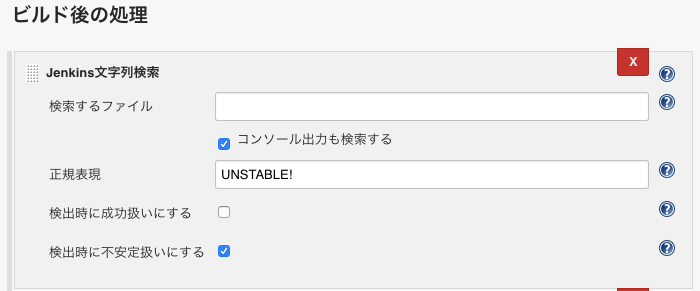

Jenkins ジョブでシェルスクリプトを実行し、その結果に応じて「成功 (SUCCESS)」「失敗 (FAILURE)」に振り分けようと思ったのだが、「失敗 (FAILURE)」はその中身が分かりにくい。つまり、

- 実行したシェルスクリプトに構文エラーがあって失敗したのか、
- `curl` した先のサーバが死んでいて通信エラーになって失敗したのか、
- 「`grep` で何もヒットしないことにより異常終了コードが吐かれる」ことが想定済みのパターンであり、意図的に失敗させているのか、

といったバリエーションの区別が付かないのだ。

そこで、最後の「意図的に失敗させる」場合を、「UNSTABLE (不安定)」というステータスで終了させ、ジョブの実行結果を_「成功」「失敗」「不安定 (UNSTABLE)」_の3種類で表現できるようにしようと思う。

## Text-finder Plugin

ジョブの実行結果を強制的に「不安定 (UNSTABLE)」に変えるため、**Text-finder Plugin** という Jenkins プラグインを導入する。

- [Text-finder Plugin - Jenkins - Jenkins Wiki](https://wiki.jenkins.io/display/JENKINS/Text-finder+Plugin)

コレをインストールすると、ジョブの設定画面「ビルド後の処理」の中に、_「Jenkins 文字列検索」_という項目が表示される。

コレを追加し、以下のように設定する。



- 検索するファイル：(空白)
- コンソール出力も検索する：チェックする
- 正規表現：「UNSTABLE!」 ← ココではこのように設定しておく。
- 検出時に成功扱いにする：チェックしない
- 検出時に不安定扱いにする：チェックする

一方、ジョブとして実行するシェルスクリプトの方は、以下のように実装する。

```bash
# 異常終了することを想定しているので、ジョブの実行結果を「UNSTABLE」に見なしたい処理
# ココでは、$MY_FILE というテキストファイル内に、指定の文言「WARNINGS FOUND」があった場合は、
# シェルスクリプトとしては正常終了させるが、ジョブの実行結果としては「UNSTABLE」にしたい、とする。

if [ "`grep 'WARNINGS FOUND' $MY_FILE`" ]; then
  echo 'UNSTABLE! : 警告が見つかりました'
  exit 0
fi
```

_UNSTABLE と見なしたいところで、`echo UNSTABLE!` と実行し、Jenkins ジョブのコンソール出力に「UNSTABLE!」という文言を表示させている。_

`exit 0` としているので、シェルスクリプトとしては正常終了、本来ならジョブは「成功」扱いになるのだが、先程設定した「Jenkins 文字列検索」(Text-finder Plugin) により、コンソール出力の中から「UNSTABLE!」という文言を見付けて、「不安定 (UNSTABLE)」扱いにしてくれる、というワケだ。

今回は Jenkins ジョブ内でシェルスクリプトを実行するようにしたが、シェルスクリプトに限らず別の方法でコンソール出力できれば、それを対象に「正規表現」で検索できる。それに、「検索するファイル」項目があるとおり、何らかのファイルの中から任意の文字列を探しても良い。

柔軟に使えると思うので、ぜひ Text-finder Plugin を導入して試してみてほしい。

- 参考：[Jenkinsでビルド結果をUnstable(不安定)にする](https://qiita.com/mechamogera/items/4959e921c574d511d6d6)
