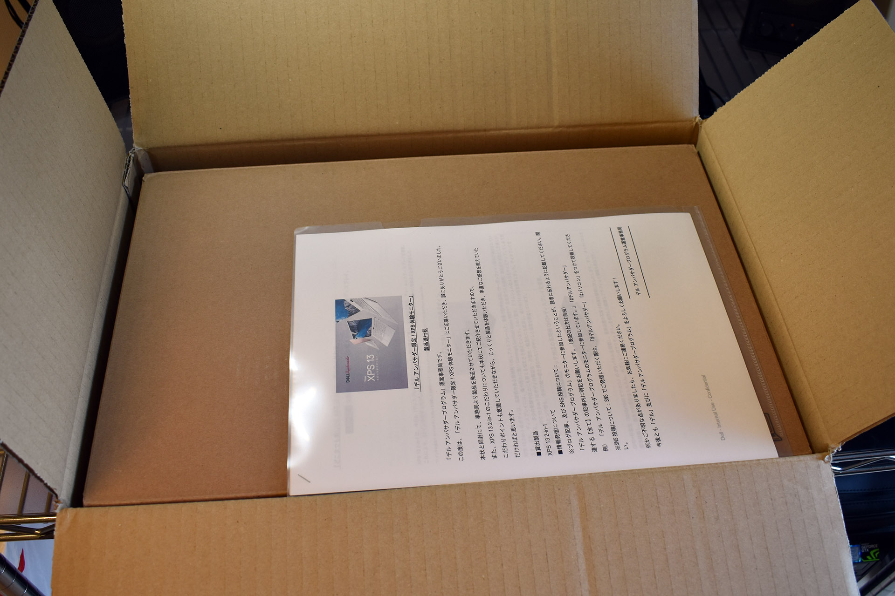
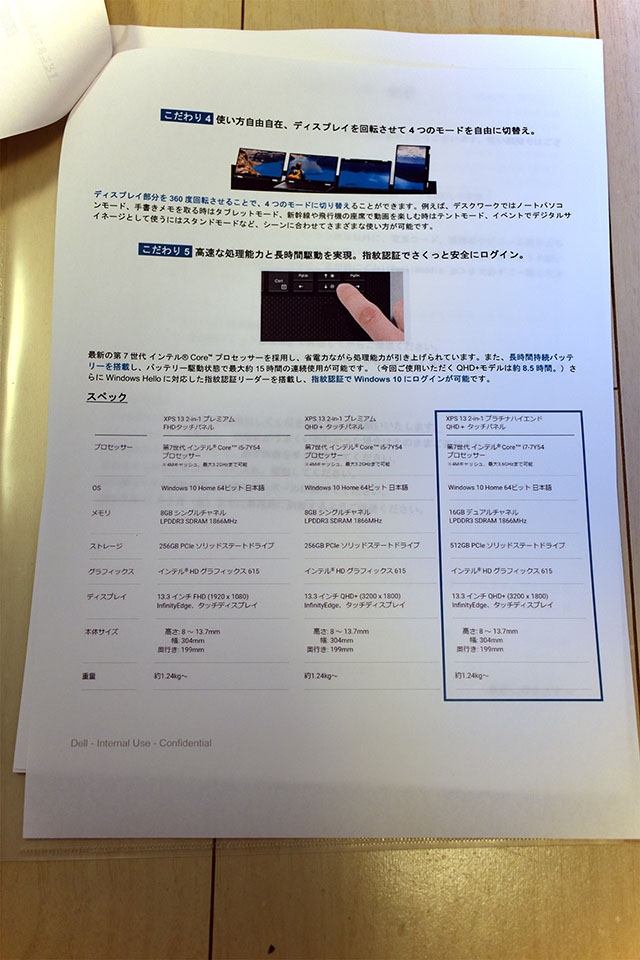
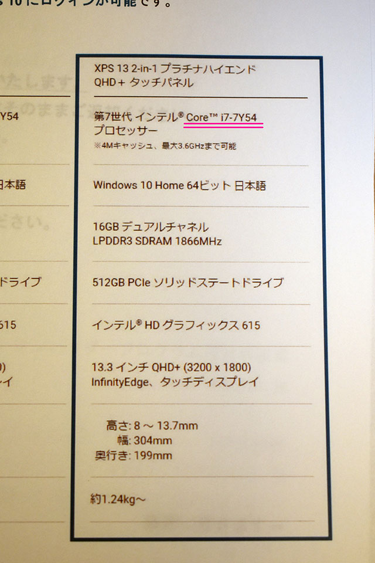
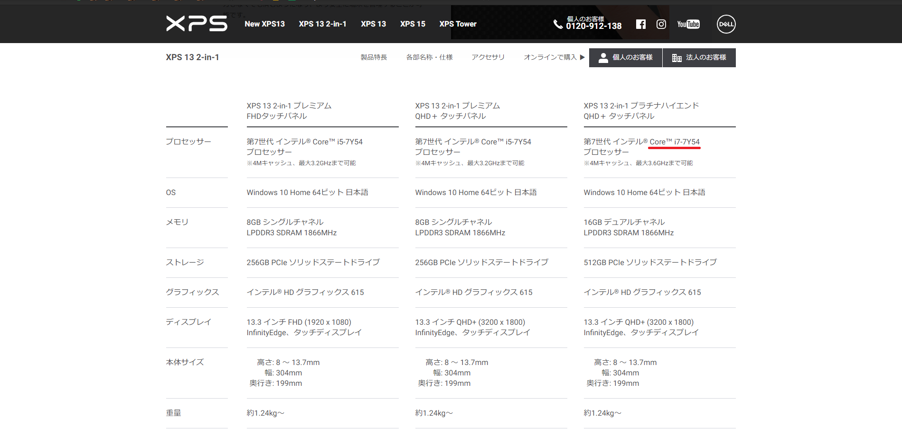
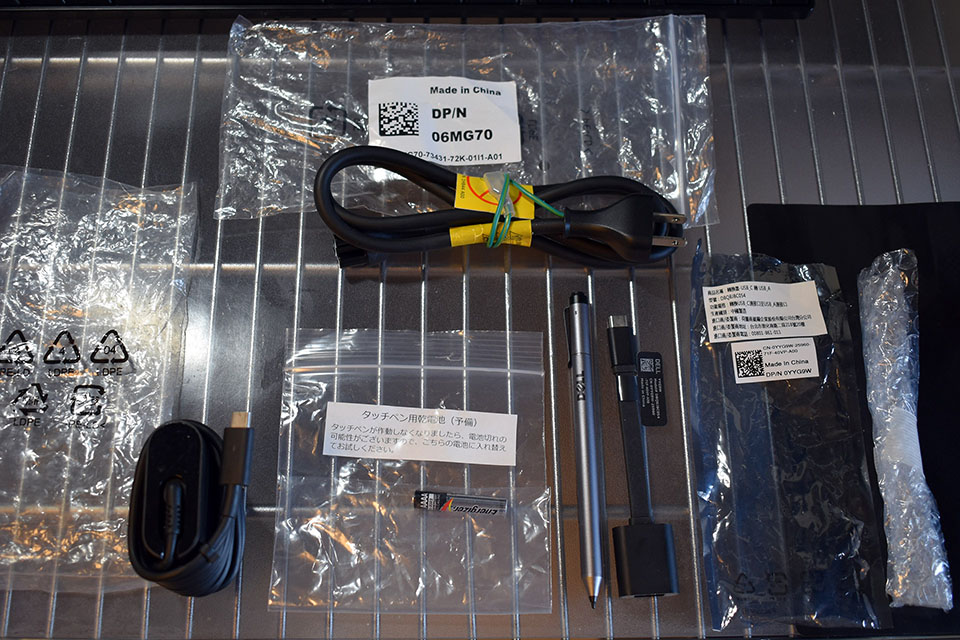
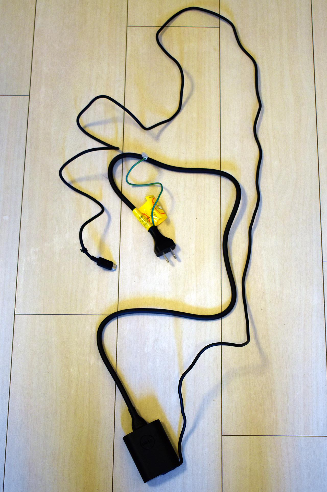
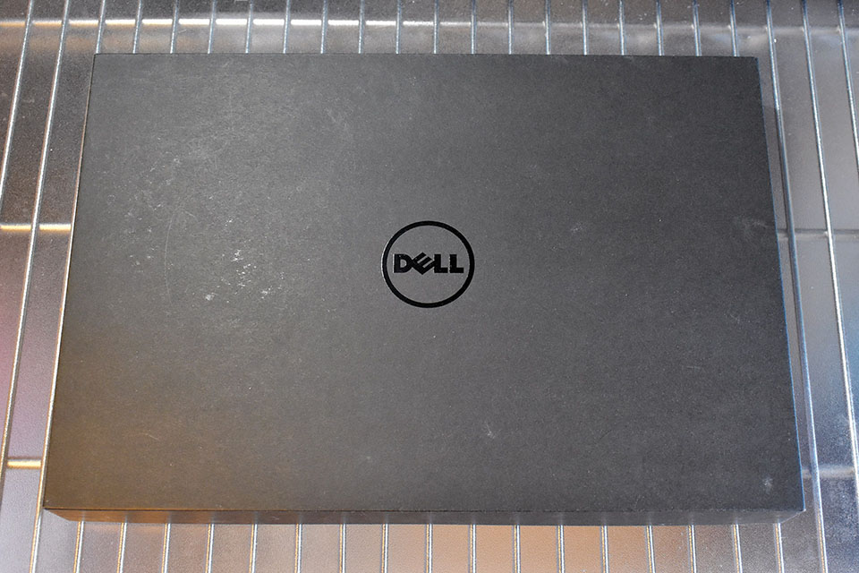
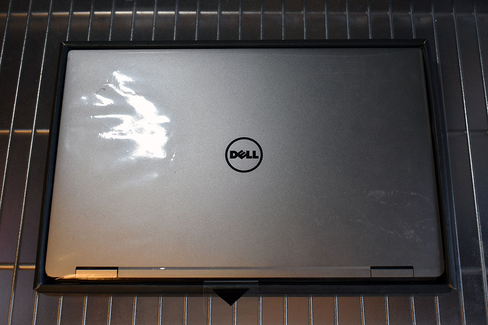
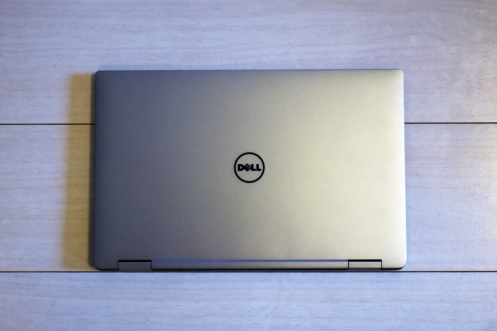
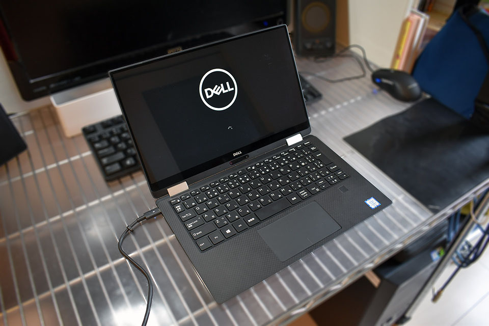

以前、Murga の方で PC 関連のアンバサダープログラムを紹介した。

- [PC 関連のアンバサダープログラムを調べた](/blog/2018/01/04-01.html)

その中の「[デルアンバサダープログラム](https://dell-ambassador.com/)」にこの度当選して、**Dell XPS 13 2-in-1** をお借りできることになった。

↑ 届いた箱。

今回はこの開封の儀をお送りする。

-----

↑ アンバサダープログラムのお決まりごとの他、製品のこだわりを紹介する冊子だが、お借りしたマシンのスペック表を見てみると…

↑ 「Core i7-7Y*54*」というのは、誤りではないだろうか…？Core i7 なら、恐らく「Core i7-7Y**75**」が正かと思われる。

↑ 公式サイト上もこの表記。「54」なのは、お隣の「Core i5」の方のことかと。

- [XPS 13 2in1｜ XPS - Dell Japan](https://dell-ambassador.com/products/xps/13_9365_2in1/)

ただの誤植とは思うが、どんなプロセッサが載っているのかは改めて確認するとしよう。

-----

↑ 先に本体以外の周辺機器を開けてみた。専用タッチペンと、USB-C → USB-A の変換ケーブル。あと電源ケーブルかと思うのだが、USB-C 端子から AC 電源に繋がっていて、コンセントの端子はどこ…？

↑ と思ったら、AC 電源からコンセントまでは、さらに**太い電源ケーブル**を繋ぐスタイルになっていた。コレは持ち運びすることを考えるとちょっと携帯性が損なわれるなぁ…。

↑ 以前 El Mylar の方で [12インチ MacBook 2017 を購入した時](/blog/2018/09/05-01.html)に貼った画像だが、上から Asus ZenBook3、12インチ MacBook、13インチ MacBookPro の AC 電源ケーブル。いずれも AC アダプタをマシンと一緒に持ち運ぶことを考えて、コンパクトに作られている。

コレと比べると、Dell の場合、AC アダプタまでは良かったのだが、そこからコンセント端子に繋がるケーブルが、デスクトップパソコンの電源ケーブルみたいで、太くて取り回しが悪い。2-in-1 スタイルではあるが、外への持ち運びはあまり考えていない、ということなのだろうか？

-----

↑ とりあえず開封の儀に戻る。箱がいちいち高級感漂う。所有欲満たされる… (← 借り物です)。

↑ オープン！おおぉ…！

↑ 床に置いてみた。掴んでみたが、結構軽い。カタログスペックでは*約 1.24kg* とのことで、これなら全然持ち運べる。

↑ 開いて起動してみたところ。コレはなかなか楽しみである！

-----

まだ届いたばかりなので、これから実際に使い倒してみて、この XPS 13 2-in-1 の良さを確かめてみたい。

- [【デルアンバサダー】Dell XPS 13 2-in-1 レビュー : 外観とスペックのチェック](/blog/2018/10/11-01.html)
- [【デルアンバサダー】Dell XPS 13 2-in-1 レビュー : ディスプレイ・キーボード・トラックパッドの使い心地チェック](/blog/2018/10/16-03.html)
- [【デルアンバサダー】Dell XPS 13 2-in-1 レビュー : タブレットモードとタッチペンの使い心地チェック](/blog/2018/11/05-02.html)
- [【デルアンバサダー】Dell XPS 13 2-in-1 レビュー : 総評・お返しします…！](/blog/2018/11/06-02.html)
