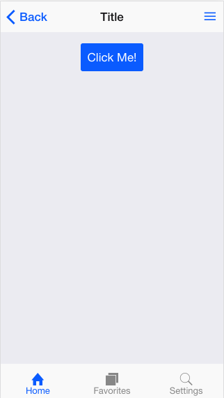
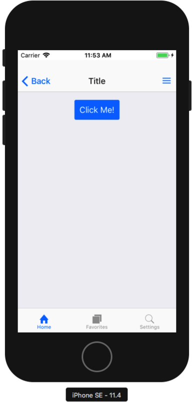

HTML・CSS・JavaScript でスマホ向けアプリを作成することを「ハイブリッドアプリ」と呼ぶが、そんなハイブリッドアプリで Android や iOS のネイティブっぽい UI を実現してくれる、**OnsenUI** というフレームワークがある。

- [Onsen UI 2: HTML5モバイルアプリを速く、美しく - Onsen UI](https://ja.onsen.io/)

「[Monaca](https://ja.monaca.io/)」を展開する、「[アシアル株式会社](https://www.asial.co.jp/)」という日本の企業が作っている、国産のフレームワークなので、ドキュメント群も日本語が存在し、大変分かりやすい。

OnsenUI 本体はピュアな CSS として利用できる他、**ngx-onsenui** というパッケージを利用すると、Angular アプリに最適化された各種コンポーネントが利用できる。

今回は Angular6 系のアプリをベースに、ngx-onsenui を使って OnsenUI を組み込み、それを Cordova でビルドして iOS アプリ化してみようと思う。

- 参考：[Angular 2+ - Onsen UI](https://ja.onsen.io/v2/guide/angular2/)

## 目次

## 環境情報

検証した OS は MacOS High Sierra。Angular CLI v6.1.5 を利用してアプリの雛形を作ろうと思うので、Node.js・npm は予め用意しておこう。

```bash
$ node -v
v10.7.0

$ npm -v
6.1.0

$ ng -v
Angular CLI: 6.1.5
Node: 10.7.0
OS: darwin x64
Angular:
...

Package                      Version
------------------------------------------------------
@angular-devkit/architect    0.7.5
@angular-devkit/core         0.7.5
@angular-devkit/schematics   0.7.5
@schematics/angular          0.7.5
@schematics/update           0.7.5
rxjs                         6.2.2
typescript                   2.9.2
```

最後に iOS シミュレータを利用して Angular + OnsenUI + Cordova 製アプリを動作させたいので、Xcode や iOS シミュレータは予めインストールしておくこと。

## Angular アプリの作成

まずは Angular CLI でアプリの雛形を作る。

```bash
$ ng new ng-cordova-onsen --routing --style=scss
$ cd ng-cordova-onsen
```

## ngx-onsenui のインストール

次に、`onsenui` 本体と、それを Angular にバインディングする `ngx-onsenui` をインストールする。

```bash
$ npm install -S onsenui ngx-onsenui
```

インストール後、AppModule にて OnsenModule をインポートし、`CUSTOM_ELEMENTS_SCHEMA` を設定する。

```typescript
import { BrowserModule } from '@angular/platform-browser';
import { NgModule, CUSTOM_ELEMENTS_SCHEMA } from '@angular/core';

import { OnsenModule } from 'ngx-onsenui';

import { AppRoutingModule } from './app-routing.module';
import { AppComponent } from './app.component';

@NgModule({
  declarations: [
    AppComponent
  ],
  imports: [
    BrowserModule,
    OnsenModule,  // ← 追加
    AppRoutingModule
  ],
  providers: [
  ],
  bootstrap: [
    AppComponent
  ],
  schemas: [
    CUSTOM_ELEMENTS_SCHEMA  // ← 追加
  ]
})
export class AppModule { }
```

最後に、`styles.scss` にて OnsenUI のスタイルシートファイルをインポートする。

```scss
// ./src/styles.scss
@import '../node_modules/onsenui/css/onsenui.css';
@import '../node_modules/onsenui/css/onsen-css-components.css';
```

## OnsenUI コンポーネントを使ってみる

ココまでで OnsenUI のインストールは完了したので、試しに `ons-button` コンポーネントを使ってみよう。

`app.component.html` に以下のように記述し、`$ npm start` でブラウザを起動すると、青地に白文字で「Click!」と書かれたボタンが配置されているはずだ。

```html
<ons-button>Click!</ons-button>
```

クリック時のイベントを設定するなら、`<ons-button (click)="doSomething()">` のように記述し、TypeScript ファイルの方に `doSomething()` メソッドを実装すれば良い。

## スマホアプリ風の UI を実現する

今回は OnsenUI をお試しで使うだけなので、ホントにガワだけ実装してみる。`app.component.html` を次のように作り変えよう。

```html
<ons-page>
  <!-- 上部ツールバー -->
  <ons-toolbar>
    <div class="left">
      <ons-back-button>Back</ons-back-button>
    </div>
    <div class="center">Title</div>
    <div class="right">
      <ons-toolbar-button>
        <ons-icon icon="ion-navicon"></ons-icon>
      </ons-toolbar-button>
    </div>
  </ons-toolbar>
  
  <!-- 下部タブバー -->
  <ons-tabbar>
    <div class="tabbar">
      <ons-tab label="Home" icon="ion-home" active></ons-tab>
      <ons-tab label="Favorites" icon="ion-ios-browsers"></ons-tab>
      <ons-tab label="Settings" icon="ion-ios-search"></ons-tab>
    </div>
  </ons-tabbar>
  
  <!-- 背景色レイヤ -->
  <div class="background"></div>
  
  <!-- コンテンツ -->
  <div class="content">
    <!-- 通常はルータで子ページを表示する -->
    <router-outlet></router-outlet>
    
    <!-- 今回は試しにボタンだけベタで実装した -->
    <p style="text-align: center;">
      <ons-button>Click Me!</ons-button>
    </p>
  </div>
</ons-page>
```

こんな風に作り、Chrome ブラウザの「レスポンシブデザインモード」などで見てみると、次のように表示される。



かなりスマホネイティブっぽい見た目になったが、全て CSS で実装されている。素晴らしい！

## Cordova アプリ化する

最後は、Cordova を使って iOS アプリとしてビルドして、iOS シミュレータで動かしてみよう。

### Cordova のグローバルインストール

Cordova 本体はグローバルインストールする必要がある。現時点では `cordova@8.0.0` が最新版なので、次のようにインストールする。

```bash
$ npm install -g cordova
```

### 雛形ファイルのマージ

次に、Cordova アプリの雛形ファイルを手に入れるため、コレまで作業していた `ng-cordova-onsen` ディレクトリとは別のところに、同名で Cordova アプリを立ち上げてみる。

```bash
# 別の一時作業用ディレクトリを作ってそこに移動する
$ mkdir temp-cordova && cd $_

# Cordova プロジェクトを作る
$ cordova create ng-cordova-onsen com.example ng-cordova-onsen
Creating a new cordova project.
```

こうして生成された `ng-cordova-onsen/` ディレクトリ配下から、`hooks/`・`res/`・`config.xml` をコピーして、先程まで作業していた Angular プロジェクトの方にコピーする。

そしたら、Angular プロジェクト側の `ng-cordova-onsen/src/index.html` と、Cordova プロジェクト側の `ng-cordova-onsen/www/index.html` を開く。Cordova プロジェクト側の `index.html` に記載されているコードの一部を、Angular プロジェクト側に移植する。次のような `src/index.html` に仕上げる。

```html
<!DOCTYPE html>
<html lang="ja">
  <head>
    <meta charset="UTF-8">
    <title>NgCordovaOnsen</title>
    <base href="./">
    <meta http-equiv="Content-Security-Policy" content="default-src 'self' data: gap: https://ssl.gstatic.com 'unsafe-eval'; style-src 'self' 'unsafe-inline'; media-src *; img-src 'self' data: content:;">
    <meta name="format-detection" content="telephone=no">
    <meta name="msapplication-tap-highlight" content="no">
    <meta name="viewport" content="user-scalable=no, initial-scale=1, maximum-scale=1, minimum-scale=1, width=device-width">
    <link rel="icon" type="image/x-icon" href="favicon.ico">
    <script src="cordova.js"></script>
  </head>
  <body>
    <app-root></app-root>
  </body>
</html>
```

いくつかの `meta` 要素と、`cordova.js` を読み込むよう変更を入れている。

ココまでできたら、`cordova create` コマンドで生成したプロジェクトの方は用済み。削除して良い。

- 参考：[GitHub - Neos21/angular-cordova: Angular + Cordova iOS App Boilerplate](https://github.com/Neos21/boilerplate-angular-cordova) … 拙作の Angular4 + Cordova ボイラープレート。今回やっていることとほぼ変わらない。
- 参考：[GitHub - NavCore/ngCordova: Angular 4 + Cordova Boilerplate](https://github.com/NavCore/ngCordova) … コチラも同様のボイラープレート。参考までに。

### Angular プロジェクトの加工

続いて、Angular プロジェクト直下の `angular.json` を編集する。

```json
"architect": {
  "build": {
    "builder": "@angular-devkit/build-angular:browser",
    "options": {
      "outputPath": "dist/ng-cordova-onsen",
```

↑ コレが編集前の抜粋。この `outputPath` を、`www` に変更する。

```json
"outputPath": "www",
```

コレで、`npm run build` 実行時に成果物ファイルが `www/` ディレクトリに出力されるようになる。`.gitignore` に `/www` も追加しておこう。`www` ディレクトリはとりあえず存在させておかないと `cordova` コマンドが動作してくれないので、初回のみは `./www/.gitkeep` を作成し、このファイルだけコミットしておくと良いだろう。

次に以下のコマンドを実行し、`./platforms/` と `./plugins/` ディレクトリを生成させ、`package.json` に Cordova 関連のパッケージを追記させる。

```bash
$ cordova platform add ios
```

最後に、`package.json` に `build:ios` コマンドを追加しよう。

```json
  "scripts": {
    "build:ios": "ng build --base-href . && cordova emulate ios --target=\"iPhone-SE, 11.4\"",
    // 以下略…
```

ココで記述した `cordova emulate` コマンドのターゲットは、次のコマンドで確認できる。

```bash
$ cordova emulate ios --list
```

このコマンドで、そのマシンにインストールされている iOS シミュレータのデバイスとバージョンが分かるので、それを指定する。

- 参考：[iphone - Cordova: start specific iOS emulator image - Stack Overflow](https://stackoverflow.com/questions/22310526/cordova-start-specific-ios-emulator-image)
- 参考：[CordovaでiOS simulatorを指定する](https://qiita.com/kenfdev/items/74bdfcc65317a411df68)

`package.json` 全体としては次のようになるはずだ。

```json
{
  "name": "ng-cordova-onsen",
  "version": "0.0.0",
  "scripts": {
    "ng": "ng",
    "start": "ng serve",
    "build": "ng build",
    "build:ios": "ng build --base-href . && cordova emulate ios --target=\"iPhone-SE, 11.4\"",
    "test": "ng test",
    "lint": "ng lint",
    "e2e": "ng e2e"
  },
  "private": true,
  "dependencies": {
    "@angular/animations": "^6.1.0",
    "@angular/common": "^6.1.0",
    "@angular/compiler": "^6.1.0",
    "@angular/core": "^6.1.0",
    "@angular/forms": "^6.1.0",
    "@angular/http": "^6.1.0",
    "@angular/platform-browser": "^6.1.0",
    "@angular/platform-browser-dynamic": "^6.1.0",
    "@angular/router": "^6.1.0",
    "cordova-ios": "4.5.5",
    "cordova-plugin-whitelist": "1.3.3",
    "core-js": "^2.5.4",
    "ngx-onsenui": "4.2.2",
    "onsenui": "2.10.4",
    "rxjs": "^6.0.0",
    "zone.js": "~0.8.26"
  },
  "devDependencies": {
    "@angular-devkit/build-angular": "~0.7.0",
    "@angular/cli": "~6.1.5",
    "@angular/compiler-cli": "^6.1.0",
    "@angular/language-service": "^6.1.0",
    "@types/jasmine": "~2.8.6",
    "@types/jasminewd2": "~2.0.3",
    "@types/node": "~8.9.4",
    "codelyzer": "~4.2.1",
    "jasmine-core": "~2.99.1",
    "jasmine-spec-reporter": "~4.2.1",
    "karma": "~1.7.1",
    "karma-chrome-launcher": "~2.2.0",
    "karma-coverage-istanbul-reporter": "~2.0.0",
    "karma-jasmine": "~1.1.1",
    "karma-jasmine-html-reporter": "^0.2.2",
    "protractor": "~5.4.0",
    "ts-node": "~5.0.1",
    "tslint": "~5.9.1",
    "typescript": "~2.7.2"
  },
  "cordova": {
    "plugins": {
      "cordova-plugin-whitelist": {}
    },
    "platforms": [
      "ios"
    ]
  }
}
```

## iOS シミュレータで起動する

実際に *`$ npm run build:ios`* コマンドを実行してみると、Angular ビルド後、`./www/` ディレクトリに生成された成果物ファイルを使用して Cordova ビルドが行われ、その後 iPhoseSE のシミュレータが起動する。



実際に iOS 上で動作させると、ホントにネイティブアプリみたいだ。素晴らしい！！

## 以上

OnsenUI 本体は単純なカスタムエレメントと CSS のフレームワークだし、ngx-onsenui もシンプルな Angular コンポーネントなので、自然に使えるようになるだろう。

これで今までよりネイティブに近い UI を実現できるようになったので、ガシガシ使っていこうと思う。
