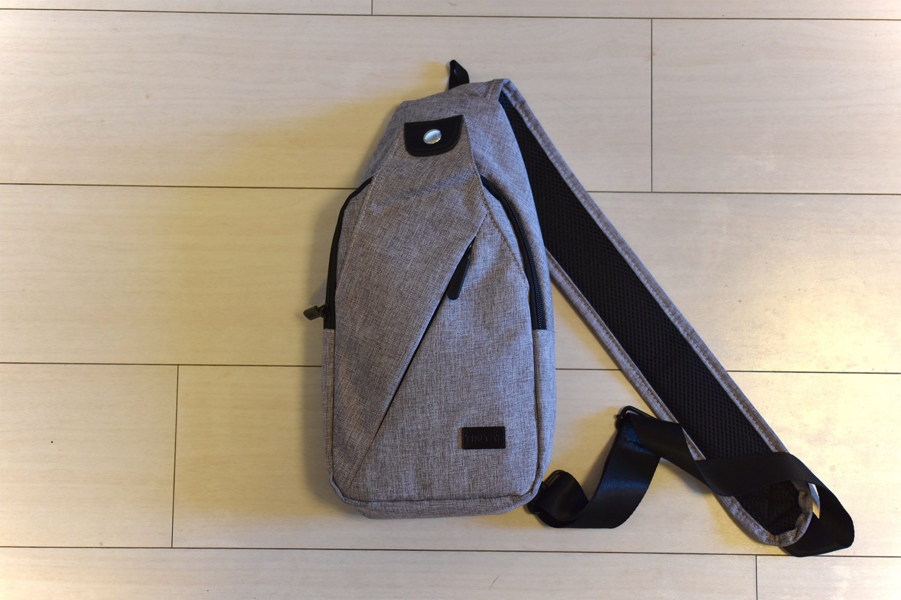
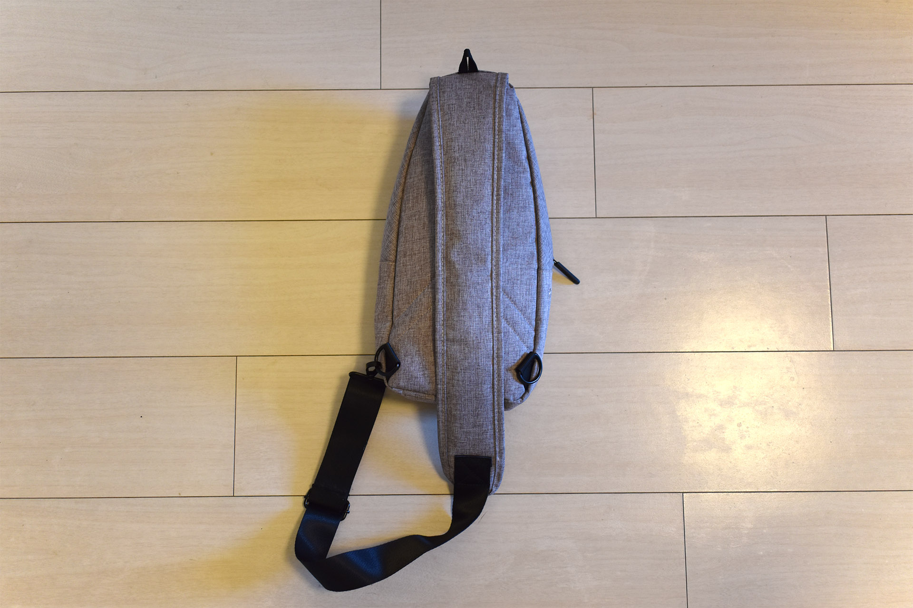
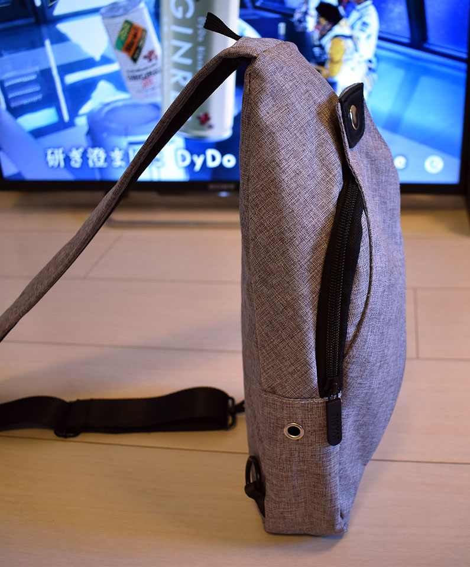
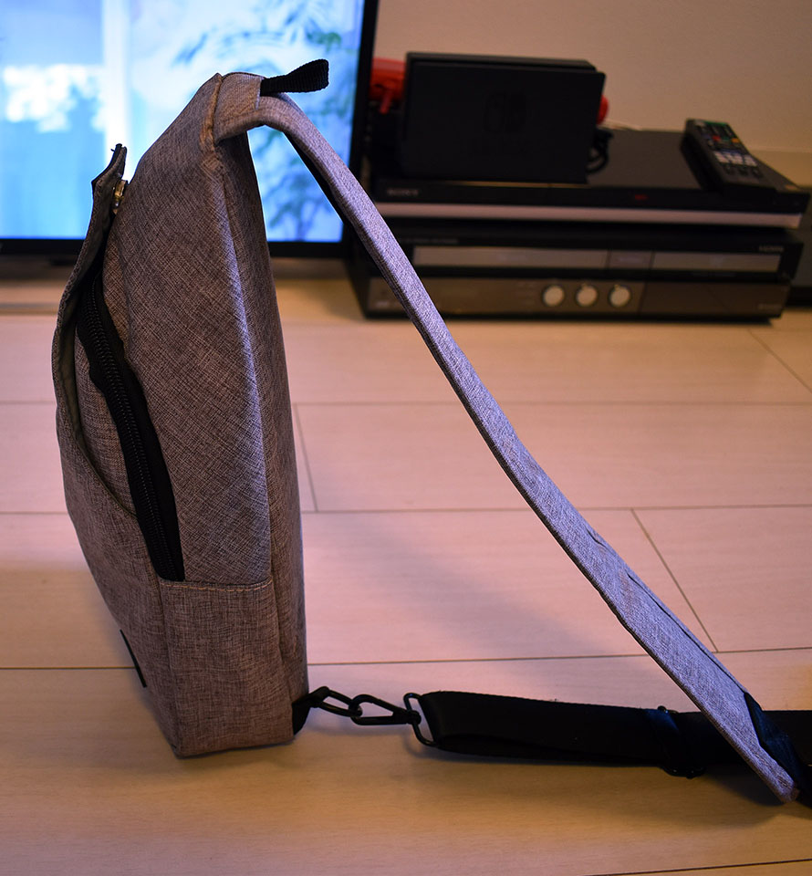
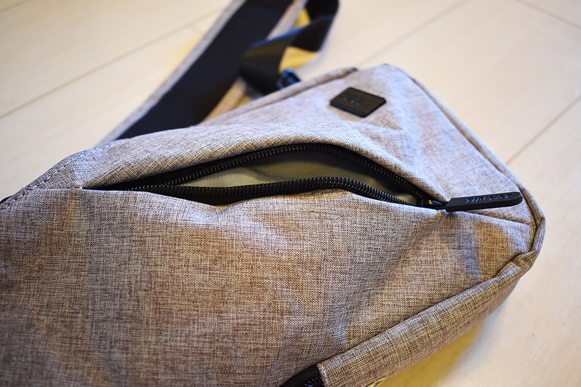
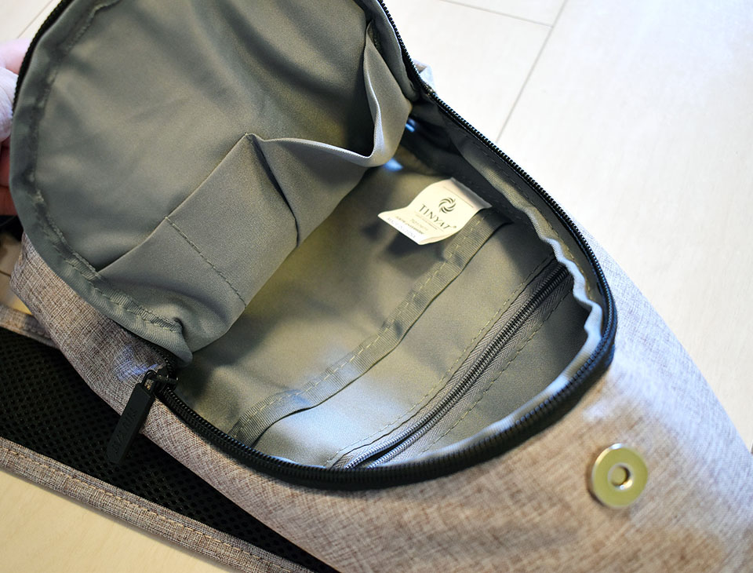
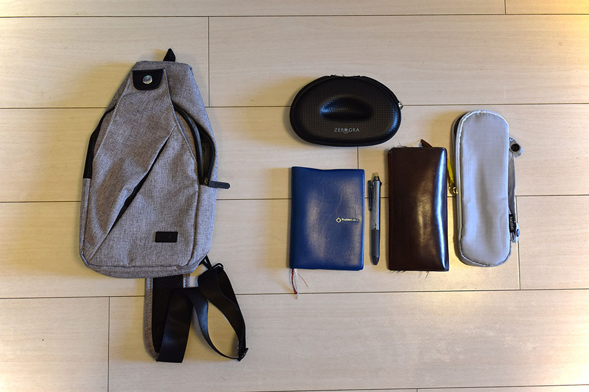

前回、_「w.p.c. Super Air-Light」_という超軽量の折りたたみ傘を購入し、通勤用のリュック_「Aer Flight Pack」_に入れて生活するようになった。特にノート PC を持ち歩くでもない日は、

- 長財布
- 折りたたみ傘
- メガネケース
- 会社の入館証

ぐらいしかリュックに入れる荷物がなく、背負っている重量はだいぶ軽くなった。

しかしそうなると、今度は__リュック自体の重さと占領する空間__が気になってきてしまった。リュックには特にモノが入っていないのに、満員電車の中で背中にスペースを取ってしまい、仕方なくお腹側にリュックを持ってきたりするのが、面倒になってきた。

ノート PC や書類を持ち運ぶ機会は時々あるので、リュックが完全に要らなくなることはないのだが、身軽に通勤できる日がそれなりにあるので、_より小さく、軽量なバッグ・カバン・リュック_を探すことにした。

すると、ネット上で程よいサイズの__ボディバッグ__を見つけた。値段も2000円程度なので買ってみた。

↑ コレ。

購入するにあたって、色々と探し回ったので、同じ商品を選びたい人向けにメモ…。

- Amazon にも同じモノと思われる商品があったのだが、サンプル写真ごとに商品の形状が違った。ボディバッグ側面に USB ポートが付いている写真・付いていない写真があるのだ。何が届くのか怪しかったので選ぶのを止めた。
- ボディバッグ右下に付いているロゴプレートから、_「dxyizu」_というブランド名らしき文字列が見えたが、コレで検索してもイマイチ通販ページが見つからず、さらにはブランド名だけ違って商品の形状は酷似している別の商品も見付けてしまった。どうも「中華製のノーブランドな商品」みたいだったので、楽天で「ボディバッグ」というキーワードで頭から調べて見つけた。
- 今回買った品も、現物を見たら「dxyizu」ではなく__「Tinyat」__というブランドロゴになっていたので、ノーブランドのボディバッグということで紹介しようと思う。

  

    
  

  

    

      <a href="https://www.amazon.co.jp/dp/B07JLHF9LK?tag=neos21-22&amp;linkCode=osi&amp;th=1&amp;psc=1">ボディバッグメンズ 斜め掛け ワンショルダーバッグ USBポートショルダーバッグ イヤホン穴付き 大容量 軽量 防水 肩掛け カジュアル ブラックグレー</a>
    

  

  

    
  

  

    

      <a href="https://www.amazon.co.jp/dp/B075F2CZ2T?tag=neos21-22&amp;linkCode=osi&amp;th=1&amp;psc=1">ROKKES ボディショルダーバッグメンズ グレー 20 x 3 x 31 cm</a>
    

  

  

    
  

  

    

      <a href="https://www.amazon.co.jp/dp/B087JSYXCK?tag=neos21-22&amp;linkCode=osi&amp;th=1&amp;psc=1">[グッシオ ウォーモ]ショルダーバッグ ボディバッグ メンズ 軽量 大容量 通勤 通学 ナイロン 198026(グレー)</a>
    

  

↑似たような商品が沢山ある…。

サンプル画像を見て、「ライトグレー」のボディバッグを買ってみたのだが、届いた現物を見てみると、どうも赤っぽい灰色、という感じ。サンプル画像だと完全なライトグレー、__#bebebe__ みたいな色味に見えているのだが、現物は __#cebebe__ ぐらいな感じ。ちょっと赤が強いので注意。もしかしたらダークグレーの方が良いかもしれない。「Aer Flight Pack」とも合いそうだし。

↑ 裏面。左右両肩対応。

ボディバッグのサイズとしてはほぼ狙いどおり。厚みがなく、折りたたみ傘と長財布ぐらいが入れば良いと思っていたので、それもピッタリ入ってちょうどよい。

↑ 収納はこんな感じ。

メガネケースを仕舞うと、少々キツいか。僕が使っている「ゼログラ」は柄の部分が折り畳めないタイプで、専用メガネケースが通常のメガネケースより大きめなのだ。

このメガネケースと、折りたたみ傘と長財布、となると、少々このボディバッグだとキツく、ゆとりがない感じ。ギリギリだ。もしかしたら長財布はズボンのケツポケットに入れる運用にするか、メガネケースを持ち歩かずメガネはかけっぱなしにするかした方が良いかもしれない。それか、折りたたみ傘をリュックの外側にくくりつけるなどしようか。このへんはもう少し使って検討してみる。

別に荷物が完全に入らないワケではなく、仕舞うとゆとりがないというだけなので、現状は必要なモノを全て仕舞えている。小さめのボディバッグが欲しかったが、人によってはココまで小さいと逆に使えないかもしれないので、要注意だ。

↑ 一応、コレだけのモノが収納できる。パンパンになるので取り出しづらいが、通勤の間をしのげれば良いのなら、コレでも OK か。

背負ってみた感じは、身体にピタッとつく感じでナイス。バッグ下部の左右に2箇所、フックを引っ掛けられる場所があるので、左右どちらの肩にもかけられるようになっている。ボディバッグ自体もちゃんと軽量で、厚みが出ない作りなので良い感じ。満員電車に乗り込んでみたが、背中側に背負ったままで全然邪魔になっていないようだった。

あまりにコンパクトなので、ノート PC を持ち運びたい時は、「Aer Flight Pack」の_インナーバッグ的な感じで、リュックの中にボディバッグをそのまんまブチ込める勢い。_コレなら「入館証をコッチのリュックに移し忘れた」とかいう事故もなく、リュックとボディバッグを使い分けられそう。

かなり安いボディバッグだが、これまでよりさらに身軽になれたので良き良き。
