デルアンバサダーに選んでいただき、モニターすることになった **Dell XPS 13 2-in-1**。開封の儀を執り行った前回から数日使ってみたので、レビューを書いていこうと思う。今回は主に外観のチェックと、インターフェース、スペックをチェックしていく。

- [デルアンバサダープログラムに選ばれました！Dell XPS 13 2-in-1 開封の儀](/blog/2018/10/07-01.html)

## 目次

## 外観を手持ちのノート PC たちと比較する

Dell XPS 13 2-in-1 の大きな特徴の一つは、13インチのディスプレイを11インチサイズの筐体に収めているところ。これにより、筐体のサイズがかさばることもなく、それでいてノート PC として利用する時に最低限欲しい、13インチというディスプレイサイズをクリアしている。

最近はベゼルが細いノート PC も増えてきたが、この XPS 13 が凄いのは、*タッチパネルでいてこの狭ベゼルを実現している点*。通常タッチパネル液晶だと、どうしても部品がかさばるのだが、そうと感じさせないベゼルの細さ、ディスプレイの薄さを実現している。

これがどれだけ凄いことなのかを実感するには、他のモノと比較するのが手っ取り早いだろう。

ということで、今回は僕の手持ちのノート PC である、

- Asus ZenBook3 (12インチ) … 以降「Zen」
- Apple MacBook (12インチ) … 以降「MB」
- Apple MacBookPro (13インチ・Early 2015 モデル) … 以降「MBP」

の3台と、外観を比較してみようと思う。

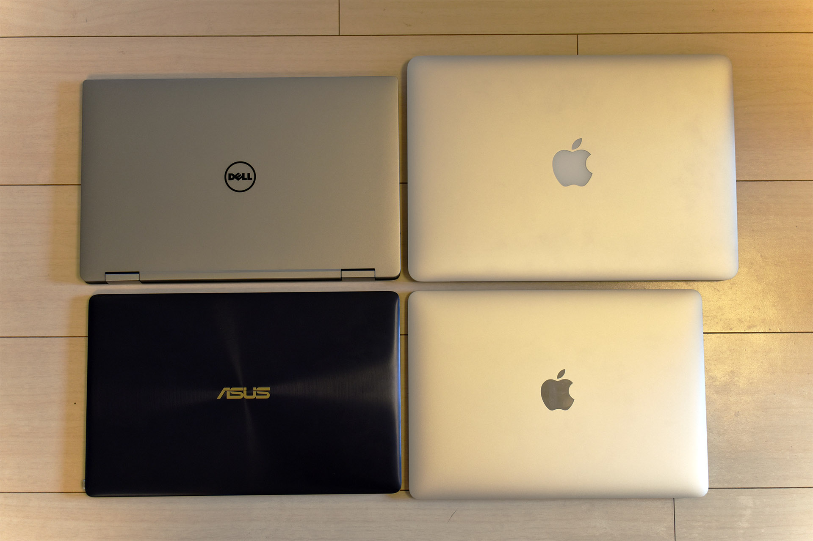

まず4台を並べてみるとこんな感じ。左上が XPS で、左下が Zen、右上が MBP、右下が MB。同じ13インチの MBP より、既に筐体が小さいのが分かるだろうか。横幅も、12インチの Zen とかなり良い勝負。

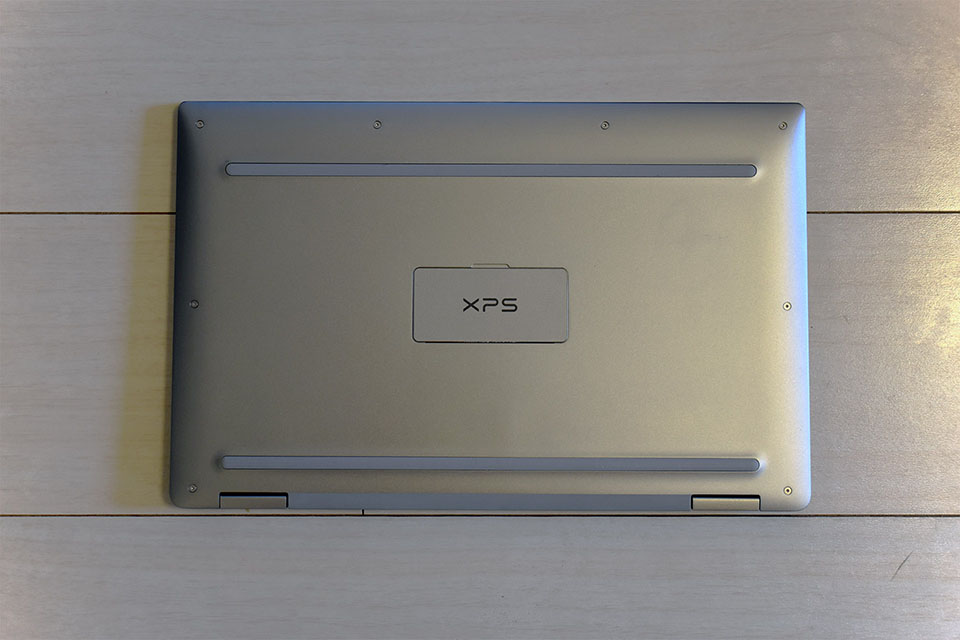

↑ あ、ちなみに裏面はこんな感じ。

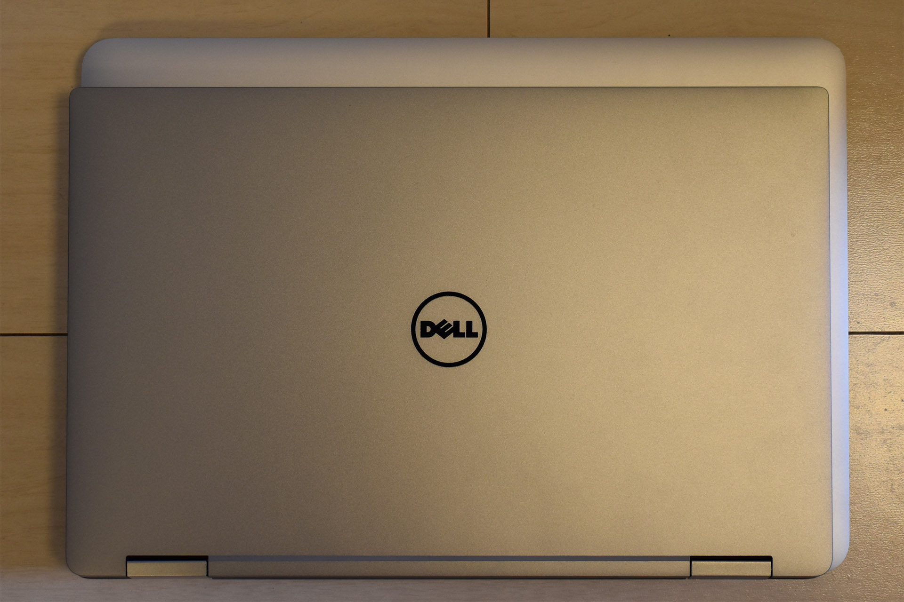

13インチの MBP と重ねてみるとこんな感じ。写真を撮った角度含め、そこまで正確なものではないが、左と下の辺を合わせて重ねたところ、XPS の方が一回り、いや、二回りくらい小さいのが分かるだろうか。それでいてディスプレイサイズは同じ13インチなのだから、これがほぼベゼルの差といえよう。

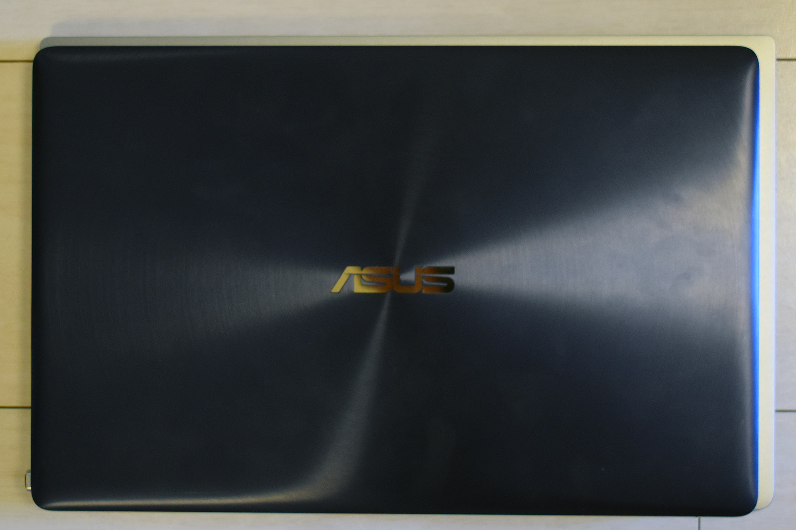

次に12インチの Zen と重ねてみた。下に XPS があるのだが、分かるだろうか。幅・奥行ともに、Zen と XPS で 1cm 程度しか差がない。12インチのマシンとほぼ同サイズの筐体に、13インチのディスプレイが収まっていることが分かる。

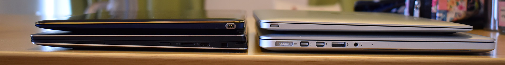

続いて、側面から厚さを比較してみる。左下が XPS、左上が Zen、右上が MB、右下が MBP だ。

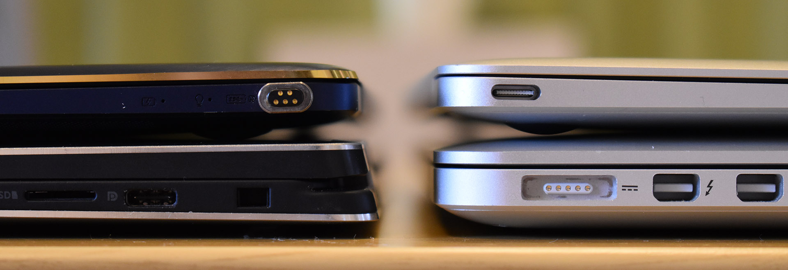

カタログスペックでは、MBP の高さが 18mm で、XPS の一番高さがある部分が 13.7mm とのこと。タッチパネルディスプレイであるにも関わらず、MBP より薄いのは驚き。ただ、ディスプレイ側の厚みは XPS の方があるようなので、キーボード側の筐体の厚みを減らして対応していることが分かる。

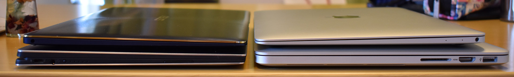

逆向きに置いてみた。

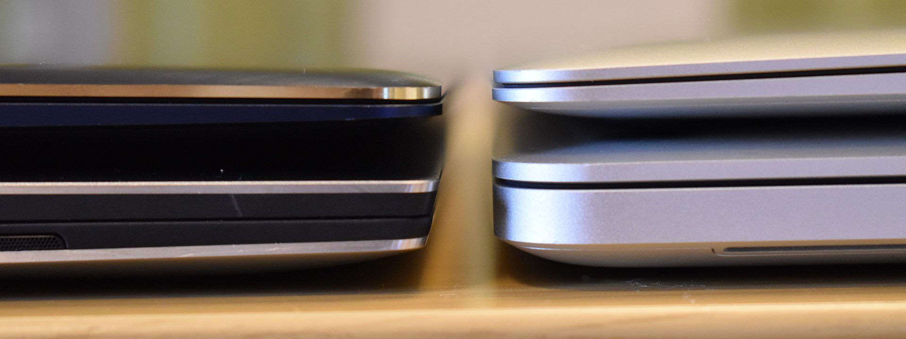

XPS の一番薄い部分は、高さ 8mm。Zen の厚さが 11.9mm、MB の一番厚い部分が 13.1mm なので、手前側はかなり薄い。

このように、筐体は12インチのマシンに匹敵するコンパクトさで、13インチのタッチパネルディスプレイを実現している。

## インターフェースをチェック

続いて、USB ポートなどのインターフェースをチェックしてみる。

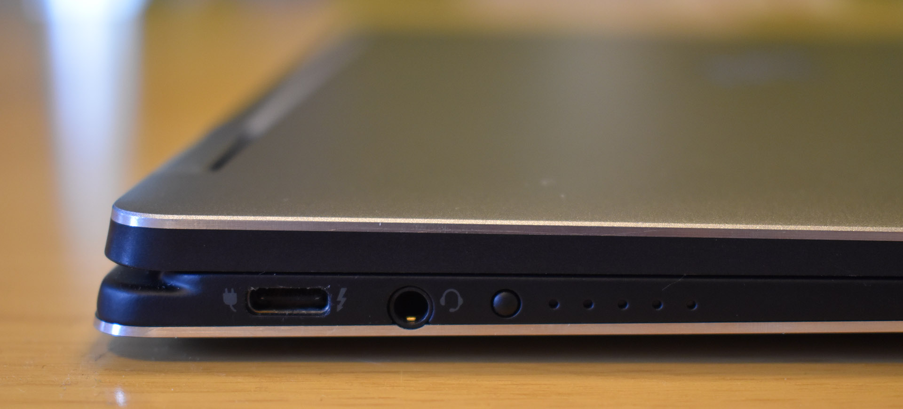

まずは左側面。USB-C ポートが1つ、イヤホンジャック、それから電池残量が分かるボタンとインジケータが付いている。こちらの USB ポートは Thunderbolt3 ポート。

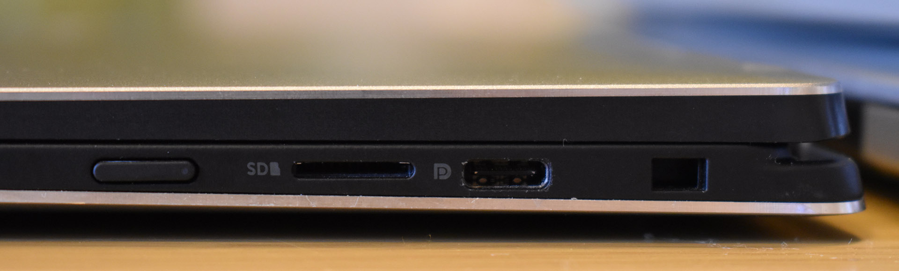

次に右側面。電源ボタンがあり、MicroSD カードリーダがあり、USB-C ポート、それから Noble ロックスロット。Noble ロックスロットとは、セキュリティワイヤーを付けたりするためのスロットで、会社での利用となると盗難防止のために使用を義務付けられることもある。

USB-C ポートは左右に2つ。両方とも USB3.1 対応で、どちらに挿しても充電可能で、どちらも DisplayPort を兼ねている。Thunderbolt3 仕様なのは左側のポートだけなので、高速データ転送など恩恵に預かりたい場合は、左側のポートを使用することになる。

僕が持っている ZenBook は右側面、MacBook は左側面に1つ、USB-C ポートがあるだけなので、左右に2ポートあり、どちら側に挿しても充電ができるのはとても助かる。

ディスプレイ、キーボード、トラックパッドは別途記事にするとして、その他ハード的なところでいくと、そのディスプレイの下部に Web カメラ (左) と赤外線カメラ (右) があり、マイクもステレオのようだ。Web カメラはワイドスクリーン HD (720p) で、iPhone6・7 のインカメラぐらい。それから指紋認証も付いている。個人的には Web カメラも指紋認証も要らないのだが、最近のニーズからするとこの辺は削れないのだろうか。ちなみにこれらを削ったら筐体はもう少しスリムになるのかしら？ｗ

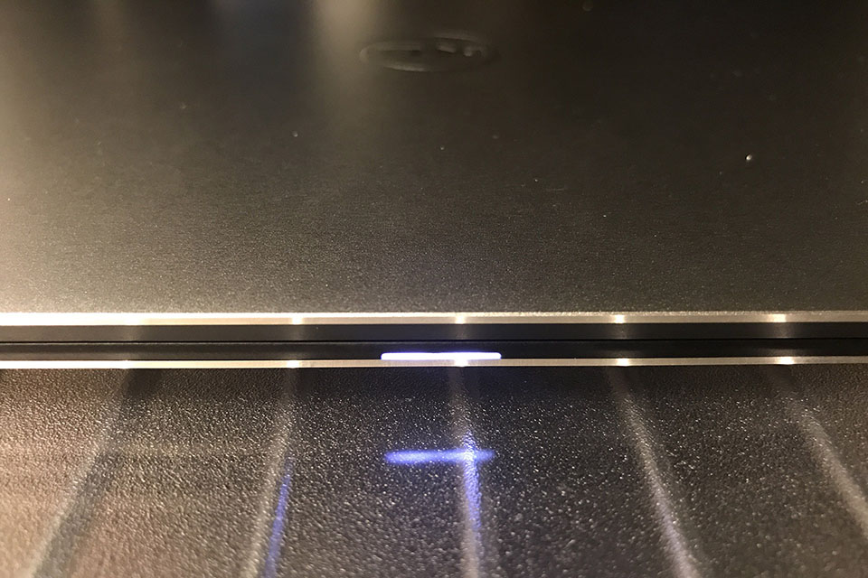

ついでに、トラックパッドの下部には、電源の状況が分かるちょっとしたライトが付いていて、充電中で満充電になっていない時は白色に、電池残量が少なくなってきた時は黄色に光る。

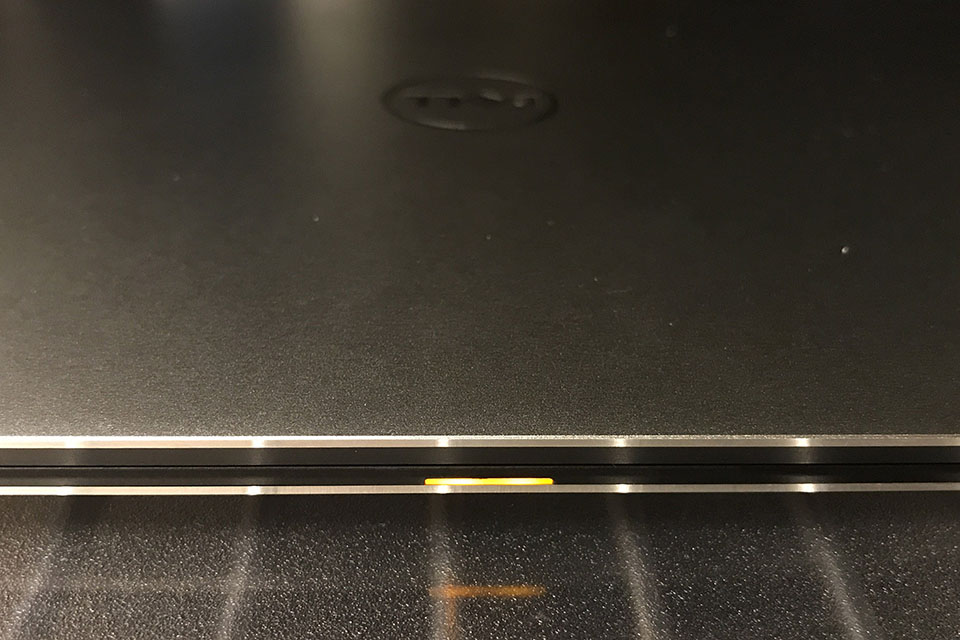

側面のインジケーターよりも簡易的に充電状況が分かる。

## マシンスペックのチェック

さて、お次はマシン内部のスペックを確認してみよう。

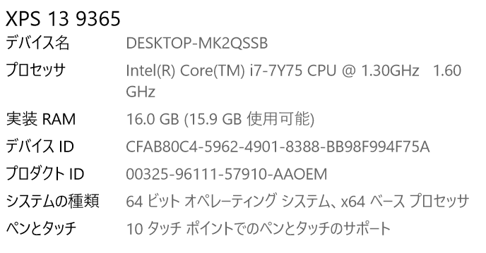

- CPU：Intel Core i7-7Y75 (1.30GHz・TurboBoost 3.60GHz)
- RAM：16GB
- SSD：512GB
- GPU：Intel HD Graphics 615 (CPU 内蔵)
- OS：Windows 10 Home

冊子および公式サイトの「Core i7-7Y*54*」はやはり誤植、「Core i7-7Y**75**」で合っていた。Kaby Lake-Y という7世代目の CPU で、ファンレス対応しているモノ。

ちょうど自分が持っている12インチ MacBook と同じ CPU・RAM・SSD の構成で、OS が macOS と Windows で異なる、という感じ。メモリを 16GB に盛っておけば、Core i7 のパワーを十分に発揮できている感じ。YouTube で 4K 動画を閲覧してもモタつくことはなかった (大容量のストリーミングに追いつかないというネットワーク帯域の都合はあったがｗ)。最高品質の設定でゲームをやるのはキツイと思うが、解像度を HD (720p) 程度に下げ、画質を落とせば十分耐えられると思う。

僕がデスクトップ PC を母艦として使っているので、ノート PC では画像編集や動画編集などはほとんどやらない。どちらかというと、Node.js を動かして Web アプリケーションを開発したり、ブラウジングがメインだったりする。

Chrome ブラウザで10タブ程度、一気に開いてみたりしたが、同等スペックの MacBook でやるよりも動作が快適に感じた。Quad HD という超高解像度なディスプレイを動かしているものの、モッサリ感は全くなく、かなり優秀。

VSCode を使用し、Node.js で Angular アプリをビルドしたりしてみたが、こちらも良い感じ。フロントエンド開発の動作スピードに関しては、母艦の「ガレリア XG」と比べても遜色なく、待たされると感じるようなことは全然なかった。*自分の用途の範囲なら十分なスペック*だ。

高負荷な処理をさせても特に動作音は気にならないが、エクスプローラを開いたりしている時に、**SSD のディスクアクセスっぽい音が少し聞こえる**。フォルダ移動のたびに、キーボードの裏側からかすかに「ジジジッ」という音がする。これは今回のモニタ品が新品ではないなど、個体差によるものなのか、全体的にこういうものなのかは不明。家の窓を開けていたらもう分からなくなるレベルの些細な音で、周りの人からはまず聞こえないと思うが、静かなところで作業している時は本人だけ気になるかもしれない。

## とにかく快適に使える！

筐体の両側に USB ポートがあり、充電環境は困らない。特盛りスペックで動作もサクサク。物凄く快適に操作できている。

今回あえてディスプレイ性能やキーボードなどには触れなかったが、それらは次回、じっくりまとめてみようと思う。

- [【デルアンバサダー】Dell XPS 13 2-in-1 レビュー：ディスプレイ・キーボード・トラックパッドの使い心地チェック](/blog/2018/10/16-03.html)
- [【デルアンバサダー】Dell XPS 13 2-in-1 レビュー：タブレットモードとタッチペンの使い心地チェック](/blog/2018/11/05-02.html)
- [【デルアンバサダー】Dell XPS 13 2-in-1 レビュー：総評・お返しします…！](/blog/2018/11/06-02.html)
