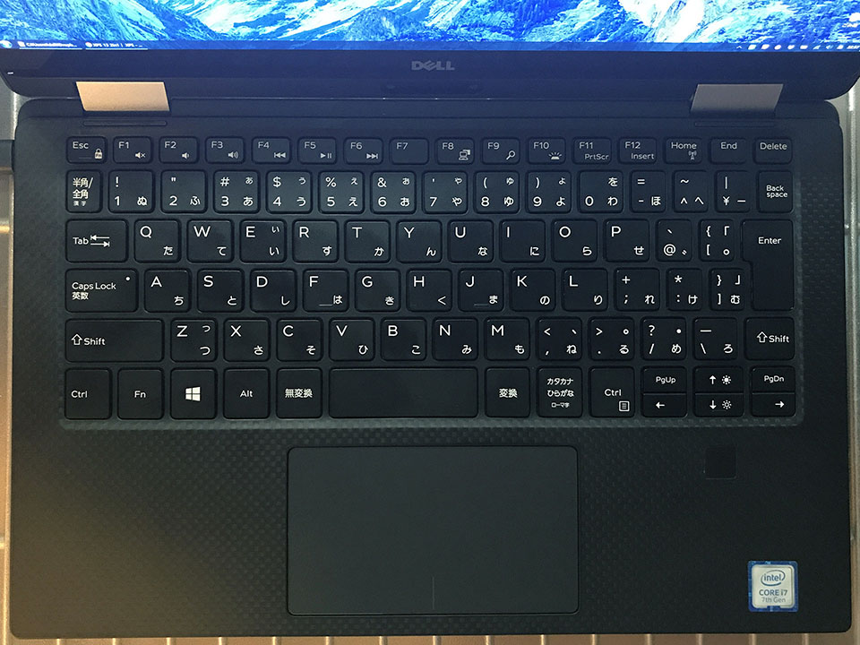

デル・アンバサダー・プログラムに選んでいただき、__Dell XPS 13 2-in-1__ をお借りしている。最近はこのマシンでブログを執筆していて、だいぶ自分の使い方に馴染んできた。

- [デルアンバサダープログラムに選ばれました！Dell XPS 13 2-in-1 開封の儀](/blog/2018/10/07-01.html)
- [【デルアンバサダー】Dell XPS 13 2-in-1 レビュー：外観とスペックのチェック](/blog/2018/10/11-01.html)

今回はこの Dell XPS 13 2-in-1 の、ディスプレイ、キーボード、トラックパッドを中心に、使い心地をチェックしようと思う。

## 目次

## Quad HD ディスプレイは高精細！作業スペースも十分！

これまで自分は、「Mac の Retina ディスプレイは確かに綺麗だけど、Windows マシンを使うならフル HD くらいで十分だなー」なんて思っていた。僕が使っているデスクトップ PC の「ガレリア XG」も、ノート PC の Asus ZenBook3 も、ディスプレイ解像度は 1920x1080px で使っている。

この XPS 13 は Quad HD ディスプレイで、解像度は 3200x1800px まで選択できる。さすがにこれで等倍表示だとあちこち小さくて見えないので、自分は「PC 設定」→「ディスプレイ」→「拡大縮小とレイアウト」→「テキスト、アプリ、その他の項目のサイズを変更する」で _150%_ に拡大して使っている。

これだけ高解像度に設定して文字が小さくなっても、ディスプレイ自体がかなり高精細なおかげで、とてもクッキリハッキリ見える。


12インチ MacBook (左)、Asus ZenBook3 (右) と並べてみても、作業スペースの差は一目瞭然。写真は Twitter を画面いっぱいに開いた様子だが、余白の差が分かる。

  
↑ 12インチ MacBook

  
↑ Asus ZenBook3

  
↑ XPS 13 2-in-1

## 動画も綺麗に見られる

タブレットモードにもできる 2-in-1 なので、動画閲覧などの用途も多いだろう。

YouTube で 1080p の動画や、4K の動画を閲覧してみたが、動画はヌルヌルサクサク見られる。なんと YouTube には 8K という動画もあって、こちらは流石にカク付きが見られたものの、映像のきめ細やかさ、暗所の見やすさなどが凄い。

- 参考：[Peru 8K HDR 60FPS (FUHD) - YouTube](https://www.youtube.com/watch?v=1La4QzGeaaQ)

単なる作業スペースの広さというだけではなく、映像の綺麗さというものを実感してしまった。デスクトップ PC に使っている5年モノの BenQ モニタにはもう戻れない…。そう思わされるくらい、映像が綺麗だ。__Mac じゃなくてもこれだけ綺麗な画面が手に入るぞ。__

- [写真](https://www.instagram.com/p/BolRJVxB9n5/)

ディスプレイは高反射とまではいかないが、アンチグレアみたいな質感ではなく、適度な光沢感があって個人的には好み。

## 狭ベゼルは慣れが要るかも

11インチサイズの筐体に13インチのディスプレイを搭載した本機は、ベゼルが物凄く狭い。これは映像を見ている時は没入感があって良いのだが、ターミナルを開いたり、テキストエディタを使ったりしている時は少々慣れない。


ターミナルを最大化して画面いっぱいに表示させた時、

```
PC の左側に見える風景 | ベゼル | ターミナルのテキスト……
```

と、テキストのすぐ左側がもうディスプレイの外側で、周辺の景色が視界に入ってきてしまうのだ。

ベゼルがもう少し太ければ、「この枠より外側は PC と関係ない世界ですよー」感が出るのだが、ベゼルがほとんどないに等しいので、「テキストの行頭を探そうとしてディスプレイの左後ろにあるモノに焦点が合ってしまった」ということがよくある。

…ウーン、_説明が下手で伝わってないかもしれないが (泣)_、筐体のキワキワまでディスプレイがある、というのは、これまでのベゼルの感覚に慣れているとなかなか意外な感覚がある、ということだ。

## ところで、ディスプレイ、少々開けづらい

ところで、だ。XPS を閉じる時はディスプレイを上から畳むだけだが、開く時は、筐体の中央、トラックパッドの中央あたりに指を差し込んで、ディスプレイを持ち上げるように開きたくなる。

が、この XPS、__ディスプレイを開くときの切り欠きがないのだ。__恐らくは狭ベゼルを実現したことが影響しているものと思われるが、MacBook などによく見られるように、トラックパッド下部に切り欠きを設けられなかったようだ。トラックパッド下部には電池残量を示す LED が仕込まれているが、_ちょうどこの部分に切り欠きがほしい…。_かなり開けづらい…。


↑ 指を差し入れる場所がない…。

## キーボードは十分なピッチで打ちやすい

キーボードのピッチはちょうど良い。2015年以降の MacBook のような平たいペチペチしたキーボードではなく、しっかり押し心地があるタイプ。

ノート PC にありがちな「エンターキー周辺のキーだけ細くなるアレ」も、多少細く作られてはいるが及第点。



今回お借りしたのは JIS 配列 (日本語配列) だが、US 配列 (英語配列) の場合は、左上のバッククォート、右端のバックスラッシュだけが小さめに作られていて、より記号関連のキーのピッチが適切。US 配列なら右側に Alt キーもあるので操作しやすいだろう。日本語配列の「無変換」「変換」「カタカナ / ひらがな」キーってホント要らないんだよなぁ…。


↑公式サイトより、US 配列の画像。やはり合理的な配列。

ちなみに、__US 配列は BTO (カスタマイズ) で選択可能だ。__値段も日本語配列と変わらないので、キーボードを多用する人は、キーピッチ確保のために US 配列を選ぶのも一つかと。

左右の矢印キーの上に「PageUp」「PageDown」キーがあるタイプで、個人的には慣れない。左右にカーソル移動したいだけなのに1画面スクロールしてしまうことがしばしば。「Home」「End」「Delete」キーも右上に並べられており、文章を打っている最中には指が届きにくくて使えない。このあたりは AutoHotKey でカスタマイズするとしよう。

また、Fn キーとのコンビネーションで操作できる各種操作のうち、ディスプレイの明度を上下矢印キーで操作するのはなかなか慣れない。ファンクションキーの並びに欲しかった。Fn キーは AutoHotKey だとうまく認識しなかったりするので、慣れ次第か。

電源ボタンが筐体右側面に配置されていて、キーボード上に電源ボタンがないのは安心感がある。キーボード右上なんかに電源ボタンがあると、設定で無効にしていたとしても、うっかり押してしまった時になんだか心臓に悪い。ｗ

## トラックパッドの反応は普通

トラックパッドについては、可もなく不可もなく。特筆して良い点も、悪い点も感じない。

トラックパッドの左右のパームレスト部分は十分な広さがあり、剛性もある感じだが、キーボード入力中に親指の付け根部分がトラックパッドに触れることがある。このせいか、キー入力直後にトラックパッド操作をしようとすると、一瞬マウスカーソルが動かないことがあったりする。この辺は慣れだろうか。

## 綺麗なディスプレイに使いやすいキーボード！

というワケで今回の総括。

ディスプレイの高精細さには本当にびっくりして、デスクトップ PC 用のモニタを 4K 対応のモノに買い換えようか検討し始めるレベル。ベゼルの狭さには慣れが必要かも？

キーボードも使いやすく、トラックパッドも問題なし。文章入力・プログラミングでの利用も問題ない。

次回は、2-in-1 の真骨頂、タブレットモードでの使い心地と、専用タッチペンの感触をチェックしてみようと思う。

- [【デルアンバサダー】Dell XPS 13 2-in-1 レビュー：タブレットモードとタッチペンの使い心地チェック](/blog/2018/11/05-02.html)
- [【デルアンバサダー】Dell XPS 13 2-in-1 レビュー：総評・お返しします…！](/blog/2018/11/06-02.html)
