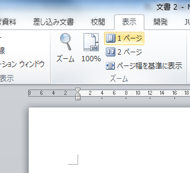

Word 文書を開くと、1・2ページが横並びに1画面に表示されてしまう。コレがメチャクチャ読みづらいので止めて欲しい…。

で、調べてみたら、「表示」リボンタブの中に「**1ページ**」と表示のあるボタンがあるので、コレを押す。すると、複数ページある文書も1カラムで表示されるようになる。

- 参考 : [ワードで画面に表示されるページが１枚だったのが２枚になってしまいまし... - Yahoo!知恵袋](https://detail.chiebukuro.yahoo.co.jp/qa/question_detail/q1163827696)

Word 2016 でも確認できた。簡単なことだったけどそんなボタンがあるとは知らず、ようやく解決できて良かった。
