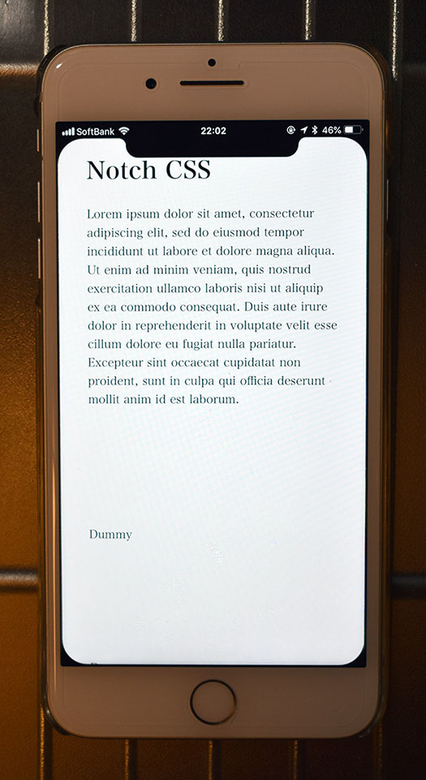

iPhone XS・XS Max・XR が発表され、ついにノッチ付きの iPhone ばかりになったので、未だ iPhone7Plus 使いの私はノッチがあるスクリーンに興味が出てきた。

そこで今日は、CSS でノッチ風の「影」を作り、iPhone7Plus でもノッチがあるスクリーンを体験してみようという次第。

以下のデモページを「ホームに追加」し、フルスクリーンモードで閲覧してみて欲しい。画面上部にノッチ、画面四隅に角丸風な「黒い曲線」が配置されているだろう。

- [iOS Safari Web Test](https://neos21.github.io/poc-ios-safari-web/notch-css.html)

ノッチ部分は `border-radius` で再現した。画面上部になめらかに繋がるよう、ノッチ部分の左上・右上の角のところには `::before`・`::after` 擬似要素で「*逆角丸*」な要素を配置した。

「逆角丸」と勝手に命名したが、`border-radius` を使用した時は、そのボックスの中に背景色が当たるが、今回作成したい「角丸なコーナー」は、`border-radius` で塗られない、丸まった外側の部分に背景色を付けたいのだ。

iPhoneX を CSS で再現した CodePen なども見てみたが、`clip` を使ったサンプルより、今回採用した `radial-gradient()` による実装の方が分かりやすく容易だった。

例えば、ノッチの左上部分の曲線は、以下のようなコードで実現した。

```css
background: radial-gradient(circle at bottom left, transparent, transparent 70%, #000 71%, #000);
```

`radial-gradient()` で円周状のグラデーションを作り、`circle at bottom left` で要素の左下を中心点にする。そして 70% ぐらいのところまで透明にし、アンチエイリアス狙いで 71% のところから黒色に塗る (70% ちょうどから黒色にすると線がギザギザに見えてしまう)。画面四隅の曲線も同様に作っている。

その他詳細は実際のコードを見てみてほしい。

- [ios-safari-web-test/notch-css.html at master · Neos21/ios-safari-web-test · GitHub](https://github.com/Neos21/poc-ios-safari-web/blob/master/notch-css.html)
- [Notch CSS](https://neos21.github.io/frontend-sandboxes/notch-css/index.html) … 同様のサンプルを配置。
- [frontend-sandboxes/index.html at master · Neos21/frontend-sandboxes](https://github.com/neos21/frontend-sandboxes/blob/master/notch-css/index.html)

ノッチや逆角丸のサイズ感は iOS Simulator で iPhoneX を開いて参考にしたが、可変幅にするのがダルかったので固定値にした。

「ホーム画面に追加」する場合、ステータスバーを非表示にはできないので、黒色にしてなじませる方針にした。

---

こうしてノッチ風ページが出来上がったので、iPhone7Plus で開いてみたところ…



…iPhone 側のベゼルが白いと意味分かんないです (涙
