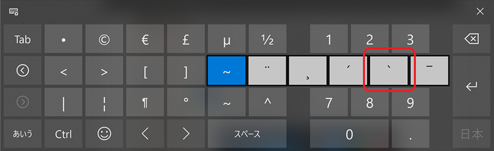

デル・アンバサダー・プログラムに選んでいただき、__Dell XPS 13 2-in-1__ をお借りしている。

- [デルアンバサダープログラムに選ばれました！Dell XPS 13 2-in-1 開封の儀](/blog/2018/10/07-01.html)
- [【デルアンバサダー】Dell XPS 13 2-in-1 レビュー：外観とスペックのチェック](/blog/2018/10/11-01.html)
- [【デルアンバサダー】Dell XPS 13 2-in-1 レビュー：ディスプレイ・キーボード・トラックパッドの使い心地チェック](/blog/2018/10/16-03.html)

今回はこのマシンのタブレットモードとタッチペンの使い心地をチェックしていく。

## 目次

## タッチペンが本体に吸い付く

付属のタッチペン_「Dell アクティブペン」_を使って操作し始めてみた。これまで Windows 端末をタッチペンで操作したことがなかったので初めての感覚なのだが、ペン先が液晶に近付くと、タッチペン用のポインタが画面にも現れて、どこを押そうとしているか分かるようになっている。この辺の操作性は特に問題なし。

で、ふとペンをマシンのパームレスト部分に置いたところ、ペンがパームレストに吸い付くではないか。どうやらパームレスト部分に磁石が入っているらしく、ペンが本体にくっついてくれるのだ。

この磁石はモニタの裏面、つまり上面にも仕込まれていて、フタを閉じている時はこの上面に、フタをひっくり返してタブレットモードで使ったりしている時はモニタの裏側に来るパームレスト部分に、タッチペンを吸い付けて置いておける。

ついついタッチペンを別のところに置いてしまってなくしたりしかねないので、これは親切…。

- [Dell XPS 13 2-in-1 のパームレスト部分、磁石になっててタッチペンがくっ付く！これは便利！ #デルアンバサダー #パソコン](https://www.instagram.com/p/Bo1JzbnBiG1/)

…と思ったら、どうやら妻が買っていた Surface Go も、本体側面に Surface ペンが吸い付くようになっているようで、世間的には普通の機能なのかも…。

## 4K 解像度だとタッチ操作しづらい

タッチペンの操作性には問題ないのだが、4K という高解像度が災いして、「閉じる」ボタンみたいな小さい対象物を押しづらい。

ココは「PC 設定」で「テキスト、アプリ、その他の項目のサイズを変更する」で、175 ～ 250% ぐらいに拡大することで対処できる。普段は 125% くらいの拡大率で使っているが、ペンを使用する時はもう少し拡大しておこう。

## ソフトウェアキーボードはプログラマにとっては使いづらい

タブレットモードにすると、物理キーボードは入力が無効になる。タブレットのように握った時に、裏面でキーをゴリゴリ押しても無視される。

その代わりに、タブレットモードになると_ソフトウェアキーボード_が表示されるのだが、この標準のソフトウェアキーボードが使いづらい…。

僕はプログラミングをするし、ブログは Markdown 形式で記述するので、ブレース `{}` やブラケット `[]`、バッククォート `\`` などをよく入力する。ソフトウェアキーボードは、こうした記号の類が物凄く入力しづらいのだ。バッククォートに至っては、表示されているキー一覧を2ページ進めて、全く別の記号文字のキーを長押ししないと表示されない。コレは困った。

画面に表示されるサイズとしては、タブレットモードのまま筐体を机にでも置けば、ソフトウェアキーボード上でタッチタイピングのフォームで入力することもできた。また、画面左右にキーボードが別れて表示されるモードがあり、コチラなら本体を両手でグリップしたまま、両手の親指でキー入力できた。かなり入力スピードが遅くなるが…。

## 狭ベゼルが誤タッチを招く

Dell XPS 13 2-in-1 は11インチサイズの筐体に13インチのディスプレイを積み込んでいる。そのためベゼルが極めて細いのだが、タブレットモードでこの狭ベゼルが悪さをしてしまうことが多々あった。

タブレットモードにして本体を握ると、ベゼルが狭いためにどうしてもディスプレイの端に指がかかってしまい、時に誤タッチしてしまうのだ。

1.24kg という本体重量も、タブレットとして見るとかなり重たい。安定させるためにしっかり握りたくなるのだが、そうするとモニタを誤タッチしてしまうし、握った指が邪魔で画面が見えなくなってしまったりする。

コレは最近、iPhone XS Max を店頭で試した時にも感じたのだが、__狭ベゼルとかベゼルレスとかって、握った時に隠れてしまうディスプレイ領域が増えてしまい、個人的には好かない。__デザインとしてはスッキリ見えるのかもしれないが、画面の端の方に表示される文字が読みづらかったりして、使い勝手が良いとは思えない。ベゼルは多少あった方が良い。

## Windows10 のタブレットモード自体がイマイチ

しばらくタブレットモードで動画を見たり、ブラウジングに特化した使い方をしてみたりしたのだが、どうもなんかこう、しっくりこない。通常のモードからタブレットモードに移行すると、時々画面表示が真っ白になってしまったりと、動作が不安定なこともあった。

根本的なところなのだが、_Windows10 が提供するタブレットモードの UI 自体がイマイチ_、という、どうしようもない結論に至った。

Windows という OS はタッチデバイス向けに設計されていないし、タッチデバイスへの最適化もまだまだ、ということなのだろう。

何をしていても操作がやりづらく感じてしまい、結局キーボードを手前に戻してきてラップトップのように使う有様だった。

## 個人的には恩恵を得られなかったタブレットモードとタッチペン

そんなワケで、_個人的にはこのマシンの売りであるタッチパネルを活かした機能の恩恵に与れなかった。_ペンよりもタッチパッドの方が使いやすいし、キーボードはやっぱり物理で欲しい。

パソコンでイラストを描く人だったり、キーボード入力は一切行わず動画を見るだけの人であれば、もしかしたら評価が変わるのかもしれない。僕のようなプログラマの場合は、あまりタッチパネルによるメリットを感じられなかったのが正直なところ。

---

というワケで次回、いよいよモニタ期間が終了するので、本体を返送する。最後に総評をしてから、お返ししようと思う。

- [【デルアンバサダー】Dell XPS 13 2-in-1 レビュー：総評・お返しします…！](/blog/2018/11/06-02.html)
