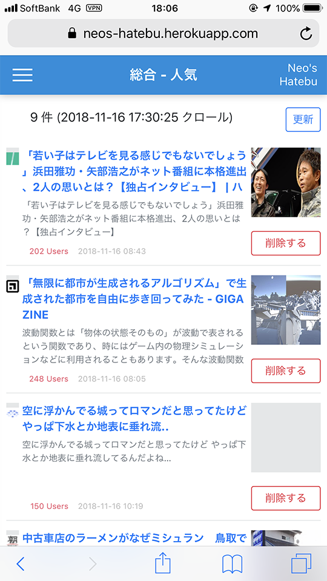
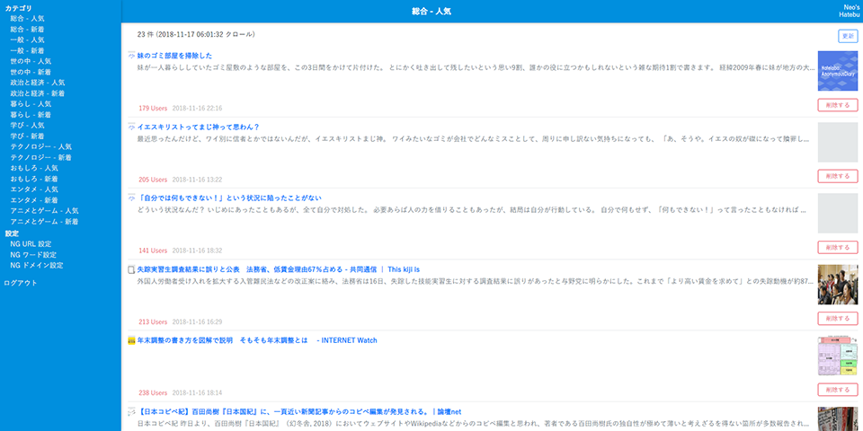
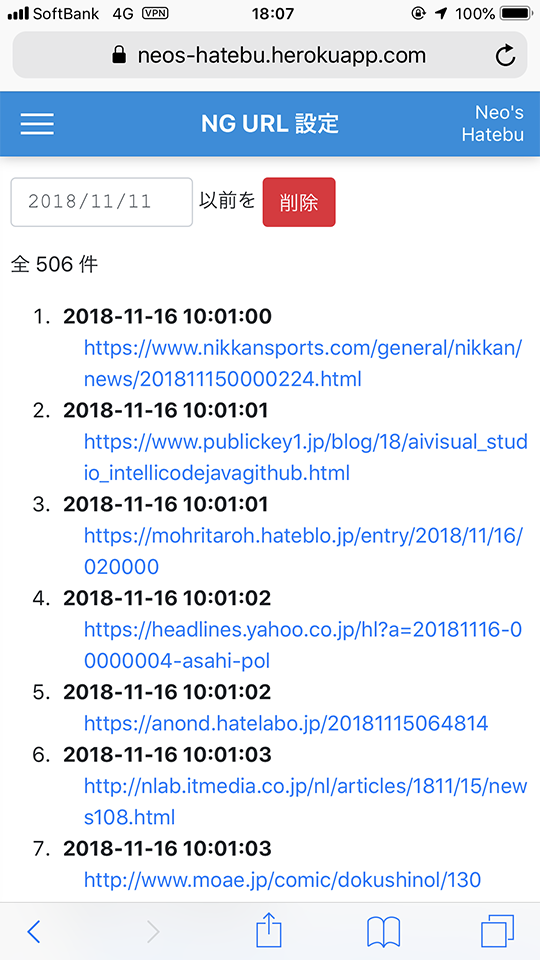

二度と視界に入れたくない記事。

-----

僕は iPhone の「はてなブックマーク」アプリを見るのが日課なのだが、最近どうにもこうにも、見たくない話題に関する記事がホットエントリを占めるようになっていて、気分が乗らない。BTS とかいう知らない連中がどうしたとか、フェミニストがワーワー言ってるとか、そういうことはマジで興味がない。エントリ一覧でタイトルが見えるだけで不愉快になる。*興味のない情報は一切視界に入れたくない。*

しかし iPhone の「はてなブックマーク」アプリには NG 機能がない。外部サービスやブラウザのアドオンとしては NG 機能を実現するモノもあったのだが、自分が思ったそのものズバリなモノがなかったので、今回自分で作ってみることにした。その名も **「Neo's Hatebu」**。

(こういうのって所有格の「s」でいいのかいつも気になっているけど、2002年に「Neo's World」というサイトを立ち上げてしまったばっかりに、僕が作るモノは全て「Neo's」と付いている。)

Neo's Hatebu のサイトは以下のリンクより飛べるが、残念ながら*皆様はこのウェブサービスを利用できない。僕しか使えないアプリなのだ*。つまり今回の記事は一方的な報告に終始するのであしからず。

- [Neo's Hatebu](https://neos-hatebu.herokuapp.com/) … 皆様はログイン画面しか見られませんがサイトの URL。

一応、環境さえ自分で作ればコピーサイトを立ち上げられるよう、Fork の手順だけ紹介しておく。

- [GitHub - Neos21/neos-hatebu: オレオレはてなブックマーク](https://github.com/Neos21/neos-hatebu) … このアプリの GitHub リポジトリ。

## 目次

## はてなブックマークの記事をフィルタリングしたい

はてなブックマークの「新着エントリ」「人気エントリ」はどうも「はてブ特有の流行り」を感じていて、はてブ民がブコメで文句を書きたくなる記事が偏って現れることが多い。これがどうも不快で、その中に紛れている、自分が興味のあるエントリを見つける際のノイズになっている。

はてブ公式には、ユーザ単位での NG 機能はあるようだが、特定のワードなどでフィルタリングする機能は提供されていない。ネットで色々探してみると、[はてなフィルター](http://hatenafilter.com/)というウェブサイトがあり、コレはクッキーでフィルタしたいワードや URL を設定できるようだ。やりたいことはかなりコレに近いのだが、クッキーを使っている都合上、端末やブラウザが違うと設定が無効になる。僕は iPhone メインではてブを見るのだが、PC で見た時もノイズを減らしたいので、*NG 設定はサーバサイドに持たせておく*必要があった。

他に何かないかと思って探してみると、Firefox や Chrome の拡張機能で実現するモノが見つかった。

- Firefox 向け
  - [はてなフィルタ – 🦊 Firefox (ja) 向け拡張機能を入手](https://addons.mozilla.org/ja/firefox/addon/%E3%81%AF%E3%81%A6%E3%81%AA%E3%83%95%E3%82%A3%E3%83%AB%E3%82%BF/)
  - <https://addons.mozilla.org/ja/firefox/addon/hateb-tweak/>
- Chrome 向け
  - [はてなフィルタ - Chrome ウェブストア](https://chrome.google.com/webstore/detail/%E3%81%AF%E3%81%A6%E3%81%AA%E3%83%95%E3%82%A3%E3%83%AB%E3%82%BF/nogcpadcgpkonifnaagfghkaiiojdcap)
  - [はてなNG - Chrome ウェブストア](https://chrome.google.com/webstore/detail/%E3%81%AF%E3%81%A6%E3%81%AAng/mbgdnfmdelffjdhkdggilmphfdihnmcj)

ブラウザ拡張機能なら、Google アカウントなり Sync アカウントなりに情報が同期されたりするかな？と思ったが、iPhone の Firefox・Chrome ブラウザでアドオンを使うことはできないので、これも却下。

やっぱり自分ではてなブックマークをコピーして、サーバサイドに NG 設定を保存できるような Web サービスを作るしかないか…。と思い至って、作った。

## Neo's Hatebu アプリの概要

Neo's Hatebu は最近のブラウザで閲覧できる Web サービスとして立ち上げた。

トップページに遷移するとログイン画面が表示される。前述のとおり、このサイトは僕しかログインできない。

僕がログインすると、最初は「総合 - 人気」カテゴリのエントリ一覧が表示される。この時、エントリ一覧は **NG 設定した記事を除外した状態で**表示されている。

ちなみに、PC で見るとこんな感じ。

で、各記事のサムネイル下に「削除する」というボタンがあり、コレを押すとエントリ一覧からその記事が消える。

同時にサーバに「削除した記事の URL」を送っている。削除した記事の URL はフィルタ対象として記録され、以降二度とエントリ一覧に表示されなくなる。コレで、*一度見かけた記事は二度と視界に入れなくて済む。*

「削除する」ボタンで削除した記事は、サイドメニューより「*NG URL 設定*」画面に飛ぶと確認できる。

1日で全カテゴリに目を通すと、だいたい4・500件ぐらいの URL がココに溜まる。

以上で URL 単位でのフィルタリングはできるようになったが、流行りの話題で色々なページがヒットするのが気に食わない場合は、「*NG ワード設定*」を利用する。ココに除外したいキーワードを入れておくと、そのキーワードがタイトルや本文に含まれているエントリをフィルタリングできる。「豊洲市場」の話題全般もう知りたくない、と思えば、「NG ワード」に「豊洲市場」を入れておけば良い。

また、ホッテントリによく登場するが、一向に興味のない話題ばかり取り上げるブログサイトなんかが特定できていれば、「*NG ドメイン設定*」に追加する。`https://hoge-blog.com/` みたいな URL を登録しておくと、その URL が含まれる記事をフィルタリングできる。

一度見た記事は「削除する」ボタンより「NG URL」として登録してエントリ一覧から消していき、話題やサイト別に二度と見たくないモノは「NG ワード」や「NG ドメイン」に設定していく、というワケ。エントリ一覧を開いたら、記事タイトルを見ながら「削除する」ボタンをバンバン押していって、エントリ一覧が0件になるまで見まくるのだ。気に入らない話題が最初から視界に入らないし、一度見た記事は二度と出てこなくなるので、**「消化した感」が得られて気持ちが良い。**

サイトの使い勝手としてはこんな感じ。

ちなみに、一度ログインしたユーザのログイン情報は LocalStorage に記録されるので、再アクセスした時にその情報を利用して自動的に再ログインしてくれる。自分で明示的にログアウトするか、LocalStorage を削除するまでは、ログイン画面に戻ることなくアプリに戻れるというワケ。すんなりと自動再ログインできるのは我ながら便利だ。

## バッチ処理も作った

Neo's Hatebu に表示されているエントリ一覧は、公式の Web ページをスクレイピングし、DB に投入して保持している。このスクレイピングの処理は、朝・昼・夜と1日3回実行するように設定したので、出社時の通勤電車内、昼休み中、帰りの電車内のタイミングで、新着エントリ (それもノイズ記事を除外した状態で！) を閲覧できるようになっている。

また、「削除する」ボタンを押下すると「NG URL」情報がサーバに溜まっていくのだが、コレが1日で4・500件くらいになる。ホッテントリも新着エントリも、だいたい4・5日もすればその記事は出てこなくなるから、「NG URL」情報を何ヶ月も溜めておく必要はない。そこで、スクレイピングを行うバッチ処理と同時に、「NG URL」情報を蓄えている DB から、*登録日時が5日以上前のデータを一括削除する*ように設定した。

なお、Web アプリ上からでも強制的にスクレイピングさせたり、古い「NG URL」情報を一括削除したりする機能は用意してあるので、自分の好きなタイミングで、スケジューリングしたジョブと同等の操作を行えるようにしてある。

## より技術的な話

サイトの見た目と、バックエンドの表面的な内容は以上のとおり。ココからはもう少し具体的な、技術的な話。

- Neo's Hatebu は Heroku にデプロイしている。
- フロントエンドは Angular 7 で作成。HttpClient を使った非同期通信がメインで、ReactiveForms が少々。外部ライブラリはほとんど使用しておらず、日付の書式を整えるために `moment-timezone` を入れたくらい。
- デザイン周りは Bootstrap 4 を組み込んだ上でゴリゴリ実装しただけ。レスポンシブルに作ったので、PC でもスマホでも大丈夫。
  - 参考 : [iOS Safari で絶対位置指定された要素のスクロールが出来ない件 - Qiita](https://qiita.com/chocolamint/items/67d25933880404c93db0) … iOS Safari のみ、`position: fixed` と `overflow: auto` を併用すると、スクロールができなくなる不具合があるようで、サイドメニューを作っている時にコレに遭遇した。親要素を `position: fixed` し、子要素で `overflow auto` を設定すれば回避できる。
- 要となるフィルタリング機能だが、サーバからエントリ一覧と NG 情報を取得したら、*`Array.filter()` で NG 情報に合致するエントリを除外*しているだけ。つまり全てのフィルタリング機能はクライアントサイドで実装していて、サーバサイドでは `NOT EXISTS` とか一切していない。
- バックエンドは Express。Angular のアプリ部分も Express で静的にファイルを提供している。
- DB は Heroku Postgres を使っていて、Express サーバからの接続には Sequelize (+ node-postgres : `pg`) を使用している。
  - Heorku の無料枠だと、PostgreSQL は1万行までという上限がある。NG URL のデータが数千件くらいすぐに行きそうなので、僕以外のユーザの情報を保持するようにしたらすぐに無料枠を突破してしまうので、この Web アプリを一般開放しないことにした。
- ログイン認証部分は **Passport** と、passport-local の LocalStrategy を使用。パスワードはクライアントサイドで MD5 ハッシュにして POST 送信しており、それを DB と照合している簡素なモノ。
- セッション管理は express-session、cookie-parser で実現している。エントリ一覧の取得などは、事前にログイン認証が済んでいないと 401 エラーになるようにしてある。
  - 多分 Heroku アプリでセキュアに作るなら、Redis をストアに利用したりするんだと思う。全然セキュアじゃないので、それもあって一般開放できるような質じゃない。
  - Angular の HttpClient を使用している時に、クッキーを利用したセッション管理を有効にするには、ログイン時から `withCredentials: true` な設定を渡しておく必要があった。ココがよく分かっていなくてかなり詰まった。
- 「自動再ログイン」機能を実現するため、LocalStorage にユーザ名と MD5 ハッシュ化したパスワード文字列を保存している。Angular アプリ起動時に LocalStorage をチェックして、データがあればそのデータでログイン認証用の POST を自動的に投げるようにしている。OAuth？ソーシャルログイン？やだよそんなもん…。
- はてなブックマークの Web ページのスクレイピングには、**request-promise と cheerio** を使っている。request-promise で UA 偽装しつつ GET 通信して、cheerio で jQuery ライクなオブジェクトに変換したら、記事タイトルや URL などを抜き出して、Heroku Postgres に登録している。
  - *rss-parser* という npm パッケージで、はてブの RSS フィードをスクレイピングしようかとも思ったのだが、取得件数が思った感じにならなかったので、公式の Web ページから拾うことにした
  - CSS クラスとかを指定してゴリゴリ取得してるので、今後はてブ公式の作りが変わったら動かなくなる。また、現時点では request-promise の設定で UA を偽装すれば Web ページが取得できているが、この辺も今後スクレイピング対策されたら別の方法を考えないといけなくなるところ。
- Heroku の環境変数 (Config Vars) と、ローカル開発環境での環境変数の兼ね合いは、*dotenv* という npm パッケージを使っている。コレを使うと `.env` ファイルに環境変数を書いておけるようになる。Heroku とローカル間の環境変数のやり取りは heroku-config というアドオンで行える。
- スクレイピング処理は Web アプリ上からも呼べるようにしてあるが、定期実行するために **Heroku Scheduler** を使った。
- 無料枠の Heroku アプリは、30分間アクセスがないと、Web Dyno (Web サーバ用の仮想環境) が Sleep してしまう。Sleep している状態でサイトにアクセスすると、Web Dyno の再起動が終わるまでレスポンスが返ってこず、2・30秒くらい待たされる。コレを回避するために、[cron-job.org](https://cron-job.org/en/) という外部サービスを利用して、自分が主に利用する平日の朝・昼・夜の時間帯に、Web アプリへ ping を投げて Sleep させないようにした。

それぞれの内容で個別に1記事書けるぐらいにアレコレ試行錯誤したので、さらなる詳細は別記事にしていこうと思う。

## Neo's Hatebu の Fork の仕方

今回作った Neo's Hatebu だが、一般公開するつもりはない。Heroku の無料枠に留めておきたいのが主な理由だ。お金は出したくない。

しかし、ソースコードは全て GitHub に公開しているので、皆様も Heroku の無料アカウントを取得して、GitHub リポジトリを Fork してちょっとだけ設定すれば、このアプリのクローンを作れる。使ってみたい方は、こんな Web アプリで良ければ、以下の手順で Fork してご利用ください。

1. Heroku アカウントを取得し、Heroku プロジェクトを作成する
2. Heroku Postgres アドオンをインストールする
3. Heroku に以下の環境変数 (Config Vars) を設定する
    - `DATABASE_URL` : Herkou Postgres が自動設定
    - `PGSSLMODE` : `allow`
4. Neo's Hatebu の GitHub リポジトリを Fork する
    - [GitHub - Neos21/neos-hatebu: オレオレはてなブックマーク](https://github.com/Neos21/neos-hatebu) ← コチラよりドウゾ
5. `client/environments/environment.prod.ts` の `serverUrl` に、取得した Heroku プロジェクトの URL を設定する
6. Heroku プロジェクトに `git push` する
    - Web アプリ起動時に動作する Sequelize の `sync()` メソッドによって、Heroku Postgres 上に必要なテーブルを生成させる
7. `practices/insert-master-data.js` 中の `INSERT INTO useres` 文に、ログインユーザの名前とパスワードの MD5 ハッシュ文字列を記述する
    - MD5 ハッシュ文字列は「[ＭＤ５ハッシュ計算ツール - phpspot](http://phpspot.net/php/pg%EF%BC%AD%EF%BC%A4%EF%BC%95%E3%83%8F%E3%83%83%E3%82%B7%E3%83%A5%E8%A8%88%E7%AE%97%E3%83%84%E3%83%BC%E3%83%AB.html)」など好きなツールで生成する
8. `$ node practices/insert-master-data.js` を実行し、`users` テーブルと `categories` テーブルにマスタデータを投入する
9. Heroku アプリにアクセスしてログインしてドウゾ！
10. エントリ情報を定期的に自動更新するには、Heroku Scheduler アドオンをインストールし、任意のタイミングで `$ node bin/crawl.js` を実行するようジョブを設定する

はてブ公式ページをスクレイピングしているため、今後はてブの仕様変更により動かなくなる可能性は多分にある。あんまりこのアプリを Fork してバンバンリクエスト投げてスクレイピングしないように注意…。だから自分は Heorku Scheduler で1日3回に絞ってるのです…。Web アプリ上からもスクレイピングさせるボタンを作ってはあるけど普段は使わないのです…。

## 以上

2018年11月6日に「よっしゃ Heroku + Node.js (Express + Angular) で作るか」と思いたち、GitHub リポジトリを作って Heroku アカウントを登録した。1日3時間くらいこねこねしていって、2018年11月11日にひととおり動作する状態で Heorku にデプロイした。ということで*初回リリースまでの開発期間は6日、実作業時間でいうと20時間程度*となる。

その後もデザイン調整や操作性の向上などをチマチマいじり続けているものの、最低限やりたかった当初の目的を実現するのは1週間程度でなんとかなった、ということだ。

今回はサーバサイドもそれなりにいじれたし、セッション管理とかにも手を出してみたので、未経験な分野を個人開発で経験できたかなーと思う。勿論、express-session の本番利用はメモリリークの危険性があったりして推奨されておらず、一般公開する Web サービスではよりセキュアな実装が求められるワケだが、今回そうした課題を発見することができて良かったと思う。サーバサイドはまだまだだ。もっと勉強しよう。

Heroku を触ったのも初めてだったので、クラウドサービスにも興味が湧いた。実務で Azure や AWS にほんの少しだけ触る機会はあるのだが、個人開発では触ったことがなかったので、せめて無料枠内でできることはやってみようかな、と思った。

処女作にしてはやりたいことを全部詰め込めたし、自分一人が使うなら十分なモノになったので、まぁまぁよしとする。

## 参考

今回はてブをスクレイピングしてなんやらかんやらするサービスを作ろうと思った時に参考にした文献。各ライブラリの細かな使い方とかについては、今後詳細な記事を書こうと思うので、その時に紹介する。

- [はてブAPIで作れるwebサービスとは | KABUKI Inc｜株式会社カブキ](https://kabuki-inc.com/A13630908372)
- [はてブAPIでwebサービスを作りたい全ての人に向けて書きました](https://syncer.jp/hatebu-api-matome)
- [PythonでHatenaブックマークのホットエントリを取得して表示する - Stimulator](https://vaaaaaanquish.hatenablog.com/entry/2017/12/25/184237)
- [Pythonスクレイピング再び、RSSからはてブのホットエントリーを取得 - ＷＩＣの中から](https://temcee.hatenablog.com/entry/rssfeed_scraping)
- [これは便利！はてなブックマークの新着エントリーRSSをはてブ数が一定数以上のものだけ取得する方法 | おなじ阿呆なら踊ろう @In0sea](http://in0sea.blogspot.com/2013/06/hatena-bookmark.html)
