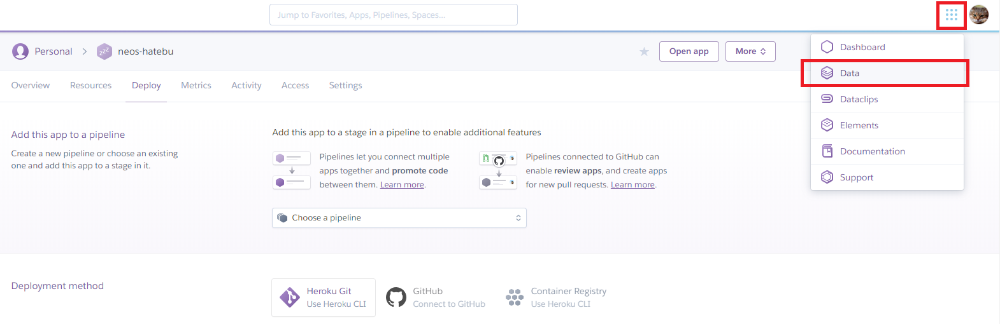

最近 Heroku いじりを始めて、サーバサイドにも触れる機会ができた。サーバサイドといったら DB 使ってデータ永続化でしょ、ということで、今回は **Heroku アプリに PostgreSQL を導入**してみる。

- 参考：[Heroku Postgres | Heroku Dev Center](https://devcenter.heroku.com/articles/heroku-postgresql) … 公式のリファレンス

## 目次

## Heroku Postgres は無料で使える

Heroku の PostgreSQL、公式サイトでは Heroku Postgres と表記されているが、コチラは無料利用も可能だ。無料枠である `hobby-dev` プランでは、全部で1万行のデータまでというデータ容量制限があったり、メモリキャッシュができないなど、Web サービスを本運用するには難しい制限がかかっているが、個人の開発用途なら十分であろう。

プランの詳細はコチラに記載アリ。

- 参考：[Choosing the Right Heroku Postgres Plan | Heroku Dev Center](https://devcenter.heroku.com/articles/heroku-postgres-plans#hobby-tier)

## Web ダッシュボードから PostgreSQL を導入する

今回は試しに、Heroku の Web 上のダッシュボード (管理画面) から PostgreSQL を導入してみた。

PostgreSQL を導入したい Heroku アプリのダッシュボードに行き、右上のメニューから「Data」を選び、「Heroku Postgres」を選択してインストールする。




*…コレだけ*。すごい、メチャクチャ簡単に DB もらえた。

### Heroku CLI から PostgreSQL を導入する

今回試さなかったが、Heroku CLI からも同様のインストール作業ができるようだ。

```bash
$ heroku addons:create heroku-postgresql:hobby-dev
```

PostgreSQL は「Addon」としてインストールするようだ。

## Heroku Postgres の状況確認

PostgreSQL をインストールすると、`heroku pg` コマンドで Heroku Postgres を操作できるようになる。自分のローカル開発環境には既に PostgreSQL をインストールしていたので分からなかったのだが、もしかしたらローカル環境に PostgreSQL をインストールしておかないといけないかもしれない。

インストールした PostgreSQL の状況は以下のように確認できる。

```bash
$ heroku pg:info
=== DATABASE_URL
Plan:                  Hobby-dev
Status:                Available
Connections:           0/20
PG Version:            10.5
Created:               2018-11-06 13:43 UTC
Data Size:             7.6 MB
Tables:                0
Rows:                  0/10000 (In compliance)
Fork/Follow:           Unsupported
Rollback:              Unsupported
Continuous Protection: Off
Add-on:                postgresql-globular-28873
```

`hobby-dev` プラン (無料枠) で、Status は `Available` (有効) なようである。

Web 上の管理画面では、接続情報が確認できる。


また、アプリケーションから DB 接続するための接続文字列が、環境変数 `DATABASE_URL` として自動的に追加されていた。


## Heroku Postgres に接続する

Heroku Postgres にコンソールからアクセスして、直接 `SELECT` 文や `INSERT` 文を流したりもできる。通常の PostgreSQL で使用する `psql` コマンドの代わりに、*`heroku pg:psql` コマンド*で接続できる。

```bash
$ heroku pg:psql
--> Connecting to postgresql-globular-28873
```

違いが分からなかったのだが、**`$ heroku psql`** コマンドでも接続できた。

## このあとやりたいこと

Heroku アプリで PostgreSQL が使えるようになったワケだが、このままではまだ開発がやりづらい。まずはローカル開発環境にも同等の PostgreSQL 環境が欲しい。

そして、Node.js で PostgreSQL に接続してみたいと思う。まずは公式のリファレンスにもある `pg` パッケージを使って操作してみたい。

さらに、ローカルの PostgreSQL と、Heroku Postgres との接続情報を、環境変数で切り替えられるようにしたい。

以降、このあたりを整理してやっていこうと思う。

- 参考：[Heroku Postgres を利用してみよう - Qiita](https://qiita.com/shosho/items/5ebabf11efb1f3b604f7)
