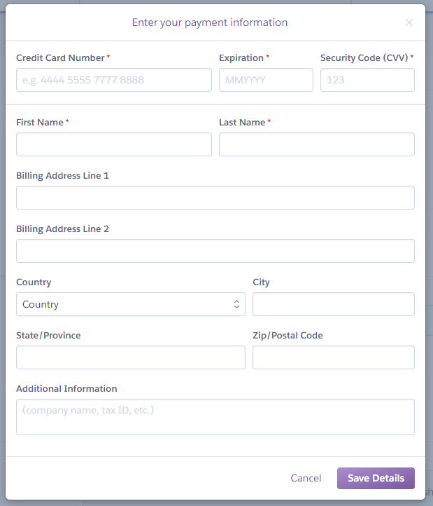
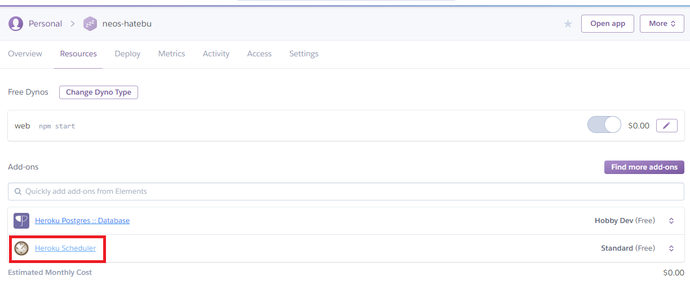
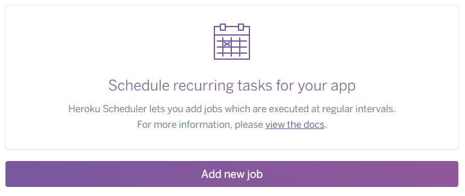
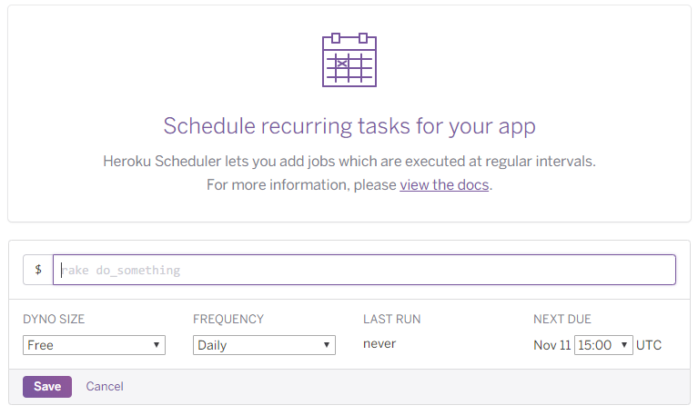

Node.js 製の Heroku アプリを作った。Express + Angular な構成で動作しているのだが、Heroku Postgres に溜め込んでいるデータを定期的に削除したくて、バッチ処理を組み込みたくなった。

調べてみると、Heroku には **Heroku Scheduler** というアドオンがあり、コレを使って指定のタイミングで任意の Node.js スクリプトを実行できるようなので、試してみた。

- [Heroku Scheduler | Heroku Dev Center](https://devcenter.heroku.com/articles/scheduler)

今回、Heroku の無料枠の概要と、「Dyno」と呼ばれる仮想環境の概念も整理してみようと思う。

## 目次

## アドオンのインストールにはクレジットカード登録が必要

Heroku Scheduler アドオンは無料で利用できるのだが、使いすぎると課金対象になるため、無料枠での利用に留めておく場合でも、クレジットカード登録が必要になる。

アカウント登録直後、Heroku CLI でアドオンのインストールを試みると、以下のように「クレジットカード登録してね」と言われる。

```bash
$ heroku addons:create scheduler:standard
Creating scheduler:standard on example-app... !
 !    Please verify your account to install this add-on plan (please enter a
 !    credit card) For more information, see
 !    https://devcenter.heroku.com/categories/billing Verify now at
 !    https://heroku.com/verify
```

仕方がないので、`https://heroku.com/verify` にアクセスしてクレジットカードを登録した。



## ココで Heroku の無料枠・料金体系をおさらい

なんだか課金されそうになっても困るので、ここらで Heroku の料金体系をおさらいしておこうと思う。

Heroku に登録すると利用できるようになる仮想環境は、「Dyno」と呼ばれる。Heroku に登録した直後の無料枠としてもらえる Dyno は _Free-Dyno_ と総称される。この仮想環境は**月550時間分使える。**

Web アプリとして稼動する Dyno のことは _Web Dyno_ と表現する。この無料枠の Web Dyno は、_30分間アプリにアクセスがないと Sleep する。_Sleep している間は利用時間に含まれない。Sleep している状態で Heroku アプリへのアクセスがあると、その場で仮想環境を起動してレスポンスを返すため、その際は仮想環境の起動を待つことになりレスポンスが遅れる。自分の体感では、15〜30秒くらい待たされて Web アプリが開く感じ。

月550時間というと、Heroku アプリを24時間アクティブにしていられるのは22日とちょっと、ということになる。平日のみ稼動していれば良いような個人開発のアプリなら、コレでも良いかもしれない。

さて、クレジットカードを登録すると、勿論有料プランも利用できるようになるワケだが、自分としては有料プランは使う気がない。今回の Herkou Scheduler も、無料の枠内で利用したいのだ。

ただ、クレジットカードを登録すると、アカウントの認証が通ったということになり、Free-Dyno の利用時間が_450時間追加_され、**月1000時間**まで使えるようになる。

月1000時間というと、Heroku アプリを24時間アクティブにしておいても41日間使える。1ヶ月に1アプリはまるまる起動させっぱなしにできるだけの容量がもらえている。

以前は「Free Dyno の場合、1日に6時間は Sleep させないといけない」というルールだったようだが、現在はこのルールはないので、1アプリに限れば、無料枠だけで24時間連続稼動は可能である。なお、「誰もアクセスしていないのに Web Dyno を30分間で Sleep させないようにする」にはテクニックが必要なので、これは別途紹介しようと思う。

- 参考：[Herokuが再度料金体系変更 - flexible free dyno hoursで月1000時間の無料枠（ただし全アプリ横断で） - Qiita](https://qiita.com/tonishi/items/7904dfcdabb7acc8a286)

このような利用状況は、Account の Billing ページで確認できる。

- [Heroku](https://dashboard.heroku.com/account/billing)

## Heroku Scheduler の仕組み

Heroku Scheduler は、Web Dyno とは別の **One-Off Dyno** という仮想環境が立ち上がって実行される。一時的な処理を行うための Dyno で、`$ heroku run` コマンドを利用した時もこの Dyno が立ち上がる。この One-Off Dyno も、実行にかかった時間分だけ、Free-Dyno の利用時間から引かれる。

つまり、Free Dyno の総利用可能時間である月1000時間のうち、One-Off Dyno を500時間分使ったとしたら、Web Dyno が無料枠で起動できる時間は500時間分になるワケである。これでは30日間・24時間立ち上げっぱなしの Web アプリには出来ないので、注意が必要である。

ちなみに、この他に Worker Dyno と呼ばれるバックグラウンド処理を行う Dyno タイプも存在する。今回は扱わないが、Worker Dyno の利用時間も、Free Dyno の総利用時間から引かれるので、1000時間をどの Dyno に割り当てるかは注意が必要である。

これらは `$ heroku ps` コマンドで別々に確認できるとおり、**実行するプロセスが違う**ところが特徴である。実行するプロセスは違うものの、**1つのアプリ内のワークスペースは共用**される。この点は後で詳しく説明する。

- 参考：[One-Off Dynos | Heroku Dev Center](https://devcenter.heroku.com/articles/one-off-dynos)
- 参考：[herokuのworker dynoとweb dynoの違いって何? - ストックドッグ](http://www.stockdog.work/entry/2017/04/08/233848)

## クレジットカード登録完了・Heroku Scheduler をインストールする

さてさて、本筋に戻ろう。Heroku アカウントにクレジットカード情報を登録したので、再度 Heroku Scheduler アドオンをインストールしてみる。

```bash
$ heroku addons:create scheduler:standard
Creating scheduler:standard on example-app... free
To manage scheduled jobs run:
heroku addons:open scheduler

Created scheduler-flat-67591
Use heroku addons:docs scheduler to view documentation
```

このようにインストールできた。Web 上のダッシュボードを見ると、「Resources」タブの中に「Heroku Scheduler」というモノが登録された。



コレをクリックすると、次の URL に遷移する。

- <https://scheduler.heroku.com/dashboard>

ココで、その Heroku アプリの Scheduler を設定できる。



## ワークスペースは Web Dyno と共用できる

今回、既に Express + Angular なアプリを公開している Heroku プロジェクトに対してスケジューラを追加したワケだが、このスケジューラから実行する Node.js スクリプトで `require()` していたりしたら、その依存モジュールはどうやって導入するのだろうか。

ココが分からなくて色々調べていたのだが、どうやらこの Heroku Scheduler は、_Web Dyno にデプロイされているワークスペースのファイルを共用_できるので、プロジェクトルートの `package.json` に依存モジュールを書いておけば良いのだ。

イメージを表すとこんな感じ。

```
example-app/      ← Heroku に上げている Git プロジェクトのルート
├ package.json   ← Express・Angular およびスケジューラで利用する依存モジュールを書いておく
├ node_modules/  ← Heroku にデプロイ時、依存パッケージがインストールされるので、このようなディレクトリができていると推測される
├ server.js      ← Express サーバを起動するファイル。npm start でコレが実行され Web Dyno が動作する
├ src/           ← Angular のソースファイル。postinstall でビルドされ dist ディレクトリができる
├ dist/          ← postinstall で生成され、server.js が配信する Angular の成果物ファイル群
└ bin/           ← スケジューラから実行するスクリプトを置いておくディレクトリを適当に作る
   └ script.js   ← スケジューラから実行するスクリプト。利用する依存パッケージは package.json に記載してある
```

Web Dyno で使われているファイルは `package.json` (デプロイ時の処理)、`server.js`、`dist/` あたりになるが、デプロイ時に `npm install` が実行されることから、ワークスペースには `node_modules/` 相当のディレクトリが存在していることになる。コレによって `server.js` が依存する `express` パッケージが動作しているワケだ。

このような Heroku 上のワークスペースは、Heroku Scheduler 利用時も共用しているので、極端な話、`bin/script.js` から `dist/index.html` などを参照したりすることもできるのだ。依存モジュールも Heroku デプロイ時に実行される `npm install` でインストールされているから、`bin/script.js` から `require('moment')` みたいなこともできるというワケ。

最初この仕組みがよく分からなくて、_Heroku Scheduler 用に別の `package.json` を用意したりしないといけないかしら？とか思っていたのだが、そんな必要はない_ことが分かって良かった。

## サンプルスクリプトの用意

先程のディレクトリ構成のとおり、Express + Angular なプロジェクトに、スケジューラから呼ぶスクリプトを追加しようと思う。

`bin/` というディレクトリ名はただの慣例なので、自由に決められる。`script.js` の内容はお試しで以下のような簡素なモノにしておく。

```javascript
#!/usr/bin/env node

const moment = require('moment');

console.log('バッチ処理', moment());
```

`moment` を `require()` して、ただ現在時刻をコンソール出力するだけのスクリプトにした。

moment.js を使うので、Express サーバや Angular アプリで使用していなければインストールし、`dependencies` に追記しておく。

```bash
$ npm install --save moment
```

`package.json` の `dependencies` は、以下のような内容になるかと思う。

```json
"dependencies": {
  // ↓ Angular で使用するモノたち
  "@angular-devkit/build-angular": "0.10.4",
  "@angular/animations": "7.0.2",
  "@angular/cli": "7.0.4",
  "@angular/common": "7.0.2",
  "@angular/compiler": "7.0.2",
  "@angular/compiler-cli": "7.0.2",
  "@angular/core": "7.0.2",
  "@angular/forms": "7.0.2",
  "@angular/http": "7.0.2",
  "@angular/language-service": "7.0.2",
  "@angular/platform-browser": "7.0.2",
  "@angular/platform-browser-dynamic": "7.0.2",
  "@angular/router": "7.0.2",
  "@types/node": "8.9.5",
  "codelyzer": "4.5.0",
  "core-js": "2.5.7",
  // ↓ Express サーバ
  "express": "4.16.4",
  // ↓ スケジューラで使用する moment
  "moment": "2.22.2",
  // ↓ 以降また Angular で使用するモノたち
  "node-sass": "4.10.0",
  "rxjs": "6.3.3",
  "ts-node": "7.0.1",
  "tslint": "5.11.0",
  "typescript": "3.1.6",
  "zone.js": "0.8.26"
}
```

あとはこのプロジェクトを `$ git push heroku master` で Push して、moment がインストールされており、`bin/script.js` が存在している状態で、Web Dyno が動作しているようなワークスペース状況にしてやれば準備 OK。

## スケジューラの設定の仕方

さて、Heroku Scheduler のダッシュボードをブラウザで開いたら、「Add new job」をクリックしてジョブを定義する。



- `$` の後ろに、実行するコマンドを書ける。_今回はココに `node bin/script.js` と記述する。_
  - `node` コマンドが使えるのは、`package.json` の `engines` プロパティでバージョンを含めて定義しているため。このワークスペース内で、指定のバージョンの Node.js (`node`)、および `npm` コマンドが実行できる、ということだ。
  - Heroku は Linux ベースの仮想環境が起動しているので、`curl` などのコマンドも叩けるし、シェルスクリプトを置いておいて実行することもできる。
- `DYNO SIZE` は「Free」しかないと思うのでこのまま。
- `FREQUENCY` は繰り返し方の指定。
  - `Daily` は1日に1回、指定の時刻に実行。
  - `Hourly` は1時間ごとに、決まった分単位で実行。
  - `Every 10 minutes` は10分ごとに実行。
- `Daily` を選ぶと、UTC で実行時刻を設定できる。毎時 `:00` 分か `:30` 分かの30分単位でしか選べないので、`8:45` に実行、ということはできないので注意。また、**UTC で指定**するので、日本時間 (JST) の朝9時に実行したい場合は、UTC でいうと0時、`0:00` と指定する必要がある。
  - 参考：[UTC/協定世界時とJST/日本標準時の変換と時差の計算](https://www.jisakeisan.com/?t1=utc&t2=jst) … 9時間差の計算で混乱したらツールを使おう。w
- `Hourly` を選択すると、10分間隔で「分」数を指定できる。この設定を使えば、毎時「30分」に実行、といった処理ができる。

今回の自分の用途では、夜間バッチのイメージに近いので、日本時間の夜0時に `bin/script.js` を実行したい。そこで、`FREQUENCY` は `Daily` にし、`NEXT DUE` は「`15:00` UTC」(= JST 0時) とする。コレで「Save」すれば準備完了だ。

今回のサンプルスクリプトはコンソール出力するだけのモノなので、`$ heroku logs` か、ダッシュボード上の「View logs」で、0時頃にジョブが実行されているか確認してみよう。きちんと実行されていれば、Heroku Scheduler ダッシュボードの `LAST RUN` に実行された時刻が表示されるはずだ。

## コレだけで OK

最初色々な懸念点があったが、Web アプリ部分が稼動する Web Dyno と、Heroku Scheduler が稼動する One-Off Dyno とでは、同じ Heroku プロジェクト内のファイルを利用できるので、Web アプリに対する定期的なジョブはほとんど設定要らずで組み込めることが分かった。

1アカウントあたりの無料枠 (Free Dyno) は Web Dyno と One-Off Dyno との合計で、月1000時間分までである。もし Web Dyno を24時間稼動させるとすると、One-Off Dyno は1日あたり8時間分ぐらいまでしか動作させられないことになるので、スケジューラや `$ heroku run` コマンドを使う頻度には注意が必要だ。

とはいえ、自分の場合は現状 Web Dyno を24時間稼動させっぱなしにはしないので、十分余裕をもって利用できているかなと思う。スケジューラによるジョブ設定もイイカンジ。
