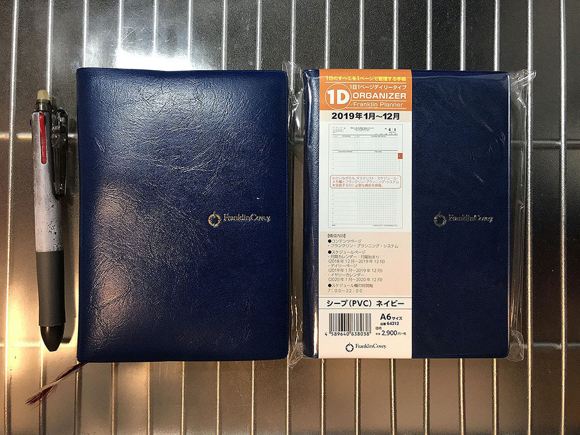
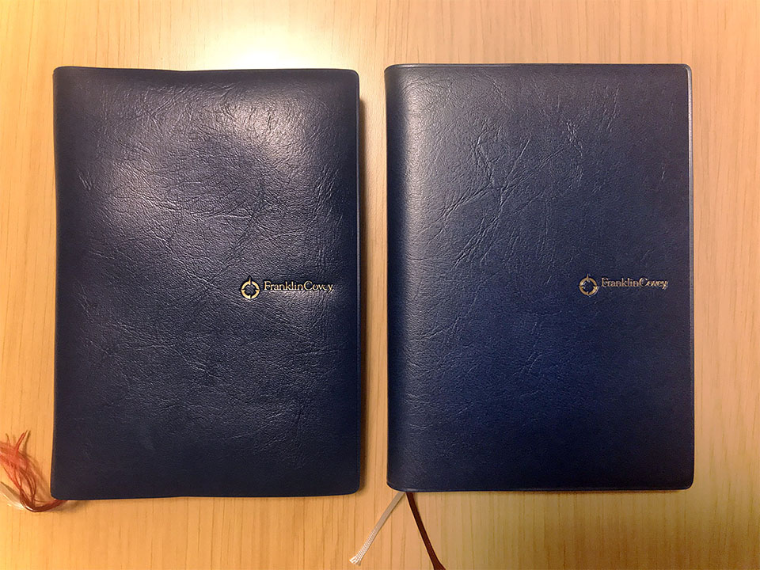

システム手帳も入れ替えの時期ですよ。

## 目次

## 4年目となるフランクリン・プランナー

僕は2016年からフランクリン・プランナーを使っている。

- 2016年 : スターターパック・1日2ページタイプ・クラシックサイズ
- 2017年 : オーガナイザー・1日1ページ・*B6* サイズ
- 2018年 : オーガナイザー・1日1ページ・**A6** サイズ

コレまでブログで紹介してきた記事は以下あたり。

- 2016年時点の使い方や所感。  
  - [「フランクリン・プランナー」を使い始めて1週間の感想と使い方](/blog/2016/01/14-01.html)
- 2017年の終わりに書いた、2018年版からの改変について。  
  - [大好きなフランクリン・プランナーが2018年から月曜始まり推しになっていたので日曜始まり脳からの移行を試みる](/blog/2017/12/29-01.html)
- 2018年に書いた、この手帳を使った仕事の仕方について。  
  - [6年目のエンジニアが日々のスケジュールを立てて予定どおり実行していくためにやっていること](/blog/2018/05/11-01.html)

最初の2016年は、1日2ページのクラシックサイズという大きな版で、バインダータイプのモノを使っていた。

さすがにかさばるのと、1日2ページ使うことが少なくなってきたので、2017年は1日1ページタイプで B6 サイズという少し小さい判の、オーガナイザータイプに変えた。

オーガナイザータイプに変えてからすぐに転職して、さらにシステム手帳の使い方が変わってきて、手書きでのメモ取りがほとんど要らないスタイルになってきた (PC で済ませられる)。そこで、2018年はさらに小さい、A6 サイズのオーガナイザーに移行した、という次第。

## 基本的な使い方は3年間で変化なし

バインダータイプからオーガナイザータイプに変え、サイズも毎年小さくしていったが、使い方は3年間でほぼ変わっていない。フランクリン・プランナー公式の推奨される使い方と、「エンジニアのための時間管理術」というオライリー本で提唱されていたノウハウに沿っている。

- タスクを期限別に A・B・C に分けてタスク一覧に記載し、タイムスケジュールに当てはめていくのが基本。
- 仕事は QI、プライベートは QII という分類にして、業後にやることもタイムスケジュールに当てはめて書き出す。
- タイムスケジュールは縦に2分割しておき、左半分に予定、右半分に実績を記すようにしている。
- 1ヶ月間のカレンダーページは、少し先の予定を書いておく用。カレンダーページに書くと同時に、当日のページのタスク一覧にも書いておくと忘れない。
- 使っているボールペンは、フリクションの3色タイプで、0.38mm の太さのモノ。間違っても消せるし、太すぎずちょうどよい太さで好み。できればもうほんの少しだけ細いモノがあると嬉しいが、細すぎるとすぐかすれるので、このぐらいでいいのかも。
- 「一週間コンパス」は2018年版からオーガナイザー内にページ埋め込みになったので、意識的に見返す癖を付けるようにした。
- 1年間を意識するため、カレンダーページの各行と、一週間コンパスのページに、週番号を書くようにしている。「もう30週も過ぎちゃったの！？」とか思って焦るために書く。

2017年に転職して、手書きでメモしないといけない状況が格段に減ったので、メモのスペースがどんどん不要になってきた。*2018年は全体的に仕事がなかった*ので、さらに書くことがなくなってきていた。

## 月曜始まりは思っていたほど大きな影響はなかった

2018年のオーガナイザーから、カレンダーが月曜始まりになるなど、改悪とも思える仕様変更があった。

僕はカレンダーは日曜始まり派だったので、実際に何回か曜日を取り違えかけたことはあったものの、*2018年は全般的に仕事がなくて、*タイトなスケジュールを求められることが少なかったので、実害はなかった。

1ヶ月のカレンダーページは、金曜と土曜のマスの間に青ペンで縦の罫線を引くことで、「左が平日5日間」「右が休日2日間」と認識しやすくなるよう、工夫はした。

1日ごとのページはぼ問題ないので、カレンダーページを多用する人で月曜始まりに慣れない人は、見間違えないようにする工夫をするなり、カレンダーだけ別に印刷して用意して利用するなりしないとかな。

## 2019年はどのタイプにするか…

さて、2018年師走。翌年2019年の手帳はどうしようか考える時期がきた。

次もフランクリン・プランナーのオーガナイザータイプにしよう、とは思っていたが、どのタイプにするか迷った。

2018年に使ってきた「1日1ページ A6 タイプ」は、*仕事がなかった*こともあり、全体的に余白が目立っていた。メモ欄をほとんど使わなかったのである。そうすると、もう少し小さなタイプでも困らないかもしれない。

そこで、A6 タイプの高さはほぼそのままに、幅を狭めた「スリムタイプ」が候補に挙がった。

「7つの習慣オーガナイザー」というタイプは、7つの習慣の概説集などが付いていて多少分厚いのだが、「ウィークリー・スリム」というタイプは概説集と罫線メモページが取り除かれて薄くなっていた。

もしかしたら、フランクリン・プランナーの中で最軽量の「ウィークリー・スリム」で事足りるのでは？と思ったが、**スリムサイズは両方とも「ウィークリータイプ」**であることに気付いた。幅が狭いスリムタイプで、1週間分のタイムスケジュール表とタスクリストが2ページに押し込められていたので、さすがにギュウギュウ詰め過ぎるかな、と感じた。

**僕は「メモ欄」として用意されている場所以外にメモを書けない性分**なので、何かメモしたいことが出来た時に、インデックスページの空いているところとかに乱暴にメモ書きができないのだ。そうすると「メモ欄」と銘打ったスペースが欲しいのだが、スリムサイズのウィークリータイプにはそれが存在しない。あるとすれば巻末の「罫線メモ」ページぐらいだが、ページ数が少ないのと、日付との紐付けがしづらくなるのが難点だった。

*2018年はとにかく仕事がなくて暇していた*ので、そもそも書くことがなかったので、その感覚からすればスリムサイズでもやっていけたとは思うのだが、2019年は1月から現場が変わることが分かっている。これまでよりはタスクが増えることは明らかなので、よりスペースが狭くなるスリムタイプを選ぶのはリスクと感じ、止めることにした。

スリムサイズは以上の2タイプで、B6 や A5 など大きいタイプは選ぶ気にならず、というところで、結局、**2018年と同じ、1日1ページ・A6 サイズ**に落ち着いた。A6 サイズのオーガナイザーは、この「1日1ページタイプ」しかないので、もう迷う余地なし、である。

サイズ含めて、2018年のモノと全く同じモデルを買ったので、カバーが付いていなくて数百円安い*「カバーなしタイプ」*でも良かったのだが、何故かノリでカバーありのモノを買ってしまった。

外見全く同じ手帳が2冊… (左が2018年使ってきたもの、右が2019年これから使うヤツ)。

## 2019年は実行力を磨こう

何度も書いているが、*2018年は全体的に仕事が暇だった*ので、ついついダラダラと過ごしてしまい、時間があったはずなのにプライベートのことまで予定どおりにこなせない体たらくが目立った。

いくら予定を精緻に立てたところで、実行しなくては意味がない。「あーやらなきゃいけないのにやってないや〜」とイライラするくらいなら、ちゃんとやろう。

来年は*実行力*を磨きます。

  

    
  

  

    

      <a href="https://www.amazon.co.jp/dp/B08HQ6BSKC?tag=neos21-22&amp;linkCode=osi&amp;th=1&amp;psc=1">フランクリン・プランナー・オーガナイザー 1日1ページ PVC 2021年1月 A6 ブラック 65138</a>
    

  

