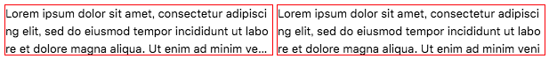

Webkit 系 (Chrome や Safari) でのみしか使えない CSS プロパティだが、__`-webkit-line-clamp`__ というプロパティを使うと、_複数行に折り返されたテキストでも省略表示ができる_ことが分かったので、使ってみた。

## 目次

## `text-overflow: ellipsis` は1行テキストにしか対応していない

CSS だけで実現するテキストの省略表示というと、_`text-overflow: ellipsis`_ プロパティがあるが、こちらはテキストが1行の時しか省略表示してくれない。

```css
.ellipsis-box {
  text-overflow: ellipsis;  /* 省略表示する */
  white-space: nowrap;      /* テキストを折り返しさせないために必要 */
  overflow: hidden;         /* ボックスからはみ出たテキストを隠し text-overflow を適用するために必要 */
  width: 300px;             /* overflow を効かせるために適当なボックス幅を設定しないといけない */
}
```

一緒に書かないといけないスタイルもコレだけあって、理屈は分かるんだけど、なんというかこう、直感的ではない。

複数行に折り返し、最終行の行末で省略表示するような挙動をさせたい場合は、色々なハックを突っ込んだり、結局 JavaScript を併用したりするしかなかった。

## `-webkit-line-clamp` を使ってみる

そこで登場したのが `-webkit-line-clamp` というプロパティ。以下のように使う。

```css
.line-clamp-box {
  display: -webkit-box;          /* line-clamp を有効にするために指定する */
  -webkit-box-orient: vertical;  /* line-clamp を有効にするために指定する */
  -webkit-line-clamp: 3;         /* コレで折り返し表示する行数を指定する・ココでは3行分表示させる */
  overflow: hidden;              /* ボックスからはみ出た分を非表示にする */
  width: 300px;                  /* 必ずしも必須ではないが overflow を効かせるために設定する */
}
```

`display: -webkit-box;` というプロパティでボックスのタイプを変える。`-webkit-box-orient: vertical;` というのはフレキシブルボックス内の子要素の配置方向を指定するモノなのだが、書かないと `-webkit-line-clamp` が有効にならないので書いておく。

お目当ての `-webkit-line-clamp` は、値に行数を整数値で取る。上述の例では `3` と指定したので、3行分表示される。_このプロパティによって、ボックスに `max-height` 相当の高さ制限が作られる。_中のテキストが1・2行の時はその行数を表示できるだけの高さになる。4行を超える時は、3行分を表示したところで広がらなくなる。

`overflow: hidden;` は、設定しなくても省略表示の `...` は表示されるが、ボックスからはみ出たテキストが表示されてしまうため、設定しておく。`width` は折り返しを効かせるために適当に設定。`width` を指定せず、ウィンドウ幅に任せても作用はする。

`-webkit-line-clamp` を適用したコンテンツは、自然な折り返しだけでなく、`br` 要素による強制改行にも対応している。ただし、子要素にブロック要素を配置した場合は、「行数」とはみなされない。

```html
<div class="line-clamp-box">
  <div>子要素1</div>
  <div>子要素2</div>
  <div>子要素3</div>
  <div>子要素4</div>
  テキスト1行目<br>
  テキスト2行目<br>
  テキスト3行目<br>
  テキスト4行目
</div>
```

つまり、このような HTML にした時は、

```
子要素1
子要素2
子要素3
子要素4
テキスト1行目
テキスト2行目
テキスト3行目...
```

と表示される。

## `-webkit-line-clamp` 未対応のブラウザ向けの対応

冒頭に書いたとおり、このプロパティは WebKit 系のブラウザでしか有効にならないので、Firefox 等では上手く動作しない。未対応のブラウザ向けには、_`max-height` を指定して `overflow: hidden` による非表示機能でしのぐしかない_だろう。

```css
.line-clamp-box {
  display: -webkit-box;
  -webkit-box-orient: vertical;
  -webkit-line-clamp: 3;
  overflow: hidden;
  width: 300px;
  max-height: 3.5rem;  /* ← 追加 : テキスト3行が表示できる程度の高さ */
}
```



↑ 左が `-webkit-line-clamp` が適用できているボックスで、右がフォールバック表示しているボックス。

未対応のブラウザでは、省略表示の `...` が表示されないことになるが、ココらへんのクロスブラウザ対応は厳しいので、まだまだ使う際には妥協が必要か。
