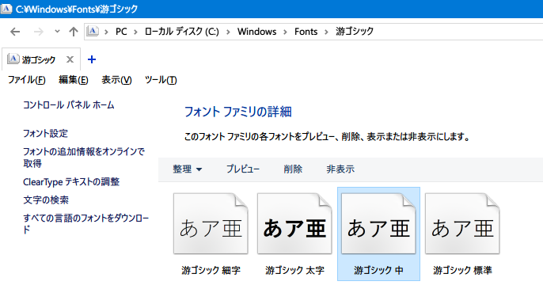
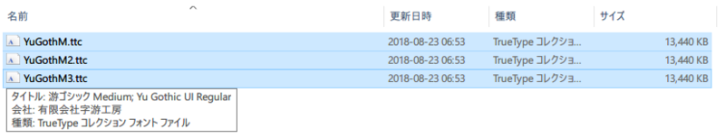
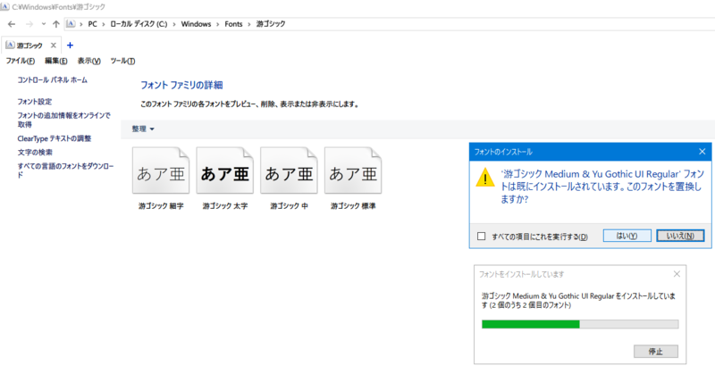
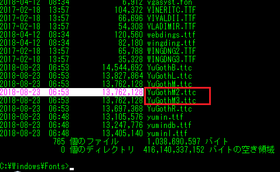
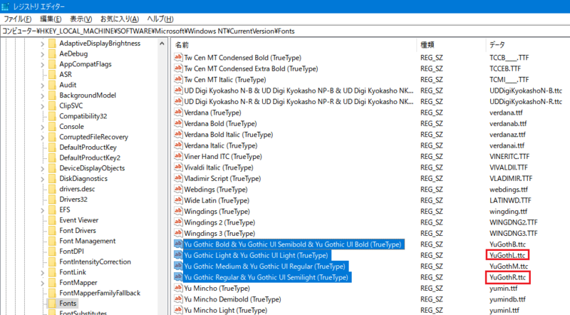
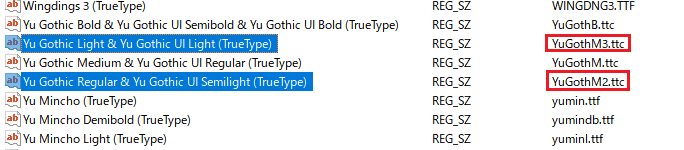
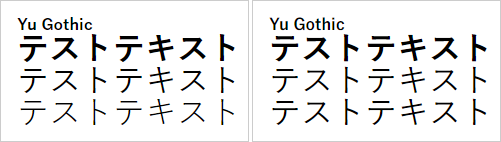

拙作のノーマライズ CSS ライブラリ、__「[Neo's Normalize](https://neos21.github.io/neos-normalize/)」__を見直していたところ、Windows の Chrome ブラウザで適用されている游ゴシックフォントがかすれていた。

「あれ？`@font-face` で游ゴシック Medium を指定してるのにな？」と思い、設定を見直したところ、コレが効かなくなっていた。

当時 Neo's Normalize を作る際、それなりに調査しまくった結果だったのだが、どうも仕様が変わっていたようなので、OS・ブラウザごとに挙動を見直すことにした。今回はその研究結果をまとめる。

## 目次

## 游ゴシックフォントに関する基礎知識のおさらい

まずは、ウェブサイトで游ゴシックフォントを使う際の基礎知識をおさらいする。

- 游ゴシックは、最近の Windows と Mac の両方にプリインストールされているシステムフォント。
  - ようやくシステム標準のフォントで OS 間の差異がなくなるか、と期待されていた。
  - しかし実際は、なかなか差異を埋められない状況にある。
- _Windows には「Light」「Regular」という細めのフォントが搭載されており、コレが細すぎて見づらい。_
  - MacOS にも搭載されている「Medium」を Windows でも使いたいのだが、そのための CSS での指定が大変。
- Windows と Mac とで、CSS での指定方法が異なる。
  - Mac 向けには `"游ゴシック体", YuGothic` と記述する。このように記述すれば Mac では Medium ウェイトが使用されるので、Mac 向けにはもう調整することはない。問題は Windows の仕様。
  - Windows 向けには、`"游ゴシック", "Yu Gothic"` と記述する。このように記述すると、__Medium よりも細い Regular ウェイトが使用されてしまい、見づらい。__みんなが困っているのはこの問題。
- Windows で游ゴシック Medium を使用したいが、ブラウザによって解釈が異なる。
  - `"游ゴシック Medium", "Yu Gothic Medium"` と書けば Medium ウェイトが利用できるブラウザもある。
  - その他、`@font-face` を使う方法もあったが、後述するとおり__この手法が最近の Chrome では効かなくなっていた。__
- `font-weight: 500;` と指定すると、游ゴシック Medium が利用できるが、副作用もある。
  - [Windows で游ゴシックが細く見えないようにする CSS](/blog/2016/02/12-01.html)
  - 游ゴシックフォントを適用せず、「ヒラギノ角ゴ」が適用された場合、`font-weight: 500` 指定のせいで_ヒラギノは太字_で表示されてしまう。
  - 「游ゴシックフォントが適用できた時だけ `font-weight: 500` を指定し、ヒラギノなど他のフォントが指定された時は `font-weight` を指定しない」といった処理分けができれば良いが、JavaScript を組み合わせる必要が出てきて大変。

…というところで、游ゴシックフォントを使うのは主に Windows のせいで大変なのである。

## Chrome で効かなくなっていた `@font-face`

本稿執筆時点の最新版、Chrome 71 で指定していた游ゴシック Medium 指定は、以下のようなもの。

```css
@font-face {
  font-family: "Yu Gothic M";
  src: local("Yu Gothic Medium");
}

@font-face {
  font-family: "Yu Gothic M";
  src: local("Yu Gothic Bold");
  font-weight: bold;
}

html {
  font-family: "游ゴシック体", YuGothic, "Yu Gothic M", "游ゴシック Medium", "Yu Gothic Medium", sans-seif;
}
```

`@font-face` を使い、`Yu Gothic M` という独自フォントを定義している。通常の `font-weight` では「游ゴシック Medium」を、`bold` な時は「游ゴシック Bold」を使うよう指定したもの。

コレとは別に、`@font-face` が効かなかった時のことも考えて、`"游ゴシック Medium", "Yu Gothic Medium"` というウェイトを指定したフォールバックも記述していたのだが、どうもコレも効いていない様子。2018年に検証した以下の記事では効いていたと記録しているのだが、どうも仕様が変わったようだ。

- [2018年以降はコレで決まり！Web サイトで指定するゴシック体・明朝体・等幅の font-family 設定](/blog/2017/11/12-01.html)

`local()` で指定するフォント名が違うかな？と思い、PostScript 名である「`YuGothic-Medium`」なども指定してみたが、それも効かなかった。

また、`@font-face` を使うと、`font-weight: bold` を指定した時に「游ゴシック Bold」がうまく使われず、_游ゴシック Medium を太字にして表示_されてしまう。どうやら、Chrome の最近の仕様変更で、ウェイトを指定したフォント全般がうまく扱われなくなってしまったようだ。仕様変更がコロコロ発生してつらい。

そもそも Windows という OS のフォントレンダリングは、ガンマ補正の仕方の問題で文字が薄く見える傾向にあり、同じ游ゴシック Medium を使ったとしても、Mac より Windows の方がかすれて見えるのはこのためらしい。OS の問題もあるというところがつらい。

この辺の話題は以下の記事にもまとまっていた。

- 参考：[游ゴシックのfont-family指定方法2018年度版！@font-faceは絶対NG！WindowsのChromeでかすれる問題徹底検証 | WEMO](https://wemo.tech/1155)

過去いろいろ検証に使ったデモコードを残しておく。以下はもう更新しない。

- [Perfect Yu Gothic - Testing 03](https://neos21.github.io/poc-perfect-yu-gothic/testing-03.html)
- [Perfect Yu Gothic - Testing 04](https://neos21.github.io/poc-perfect-yu-gothic/testing-04.html)
- [Perfect Yu Gothic - Testing 05](https://neos21.github.io/poc-perfect-yu-gothic/testing-05.html)
- [Perfect Yu Gothic - Testing 06](https://neos21.github.io/poc-perfect-yu-gothic/testing-06.html)
- [English Japanese Sans-Serif Fonts Test](https://neos21.github.io/frontend-sandboxes/font-family-tests/english-japanese-sans-serif-fonts-test.html)
- [font-family Tests](https://neos21.github.io/frontend-sandboxes/font-family-tests/index.html)

## `font-weight: 500` は効いたが、副作用が避けられない

`font-weight: normal` (= `400`) ではなく、`500` を指定すれば、`"游ゴシック", "Yu Gothic"` の記述でも Medium ウェイトが利用されるテクニックは以前から存在していた。

しかし、前述のとおり、游ゴシックが使われなかった時にヒラギノフォントなどが太字で表示されてしまう問題が避けられず、使いづらいと判断した。

## Chrome で游ゴシック Medium を使うのは諦める

Mac の場合は、もともと Regular や Light ウェイトのフォントがインストールされていないので、`"游ゴシック体", YuGothic` と記述するだけで、Chrome・Firefox・Safari のいずれでも、特に問題は起こらない。

また、Windows の場合も、前述の `@font-face` や、`"游ゴシック Medium", "Yu Gothic Medium"` といった指定で、Firefox・Edge・IE では問題なく太めの游ゴシックで表示されるので、問題ない。

__游ゴシックの細さが気になるのは、Windows の Chrome のみ__なのだ。

ということで、_Windows Chrome で游ゴシックを使うのを諦める方向で考えてみた。_

```css
@font-face {
  font-family: "Yu Gothic M";
  src: local("Yu Gothic Medium");
}
@font-face {
  font-family: "Yu Gothic M";
  src: local("Yu Gothic Bold");
  font-weight: bold;
}

html {
  font-family: YuGothic,  /* For Mac */
               "Yu Gothic M", "Yu Gothic Medium",  /* For Windows Firefox, Edge, IE */
               "Hiragino Kaku Gothic ProN", "Hiragino Kaku Gothic Pro",  /* For Mac Fallback */
               Meiryo,  /* For Windows Fallback (Chrome) */
               sans-serif;
}
```

こんな感じで、

1. 最近の Mac は `YuGothic` で游ゴシック Medium を利用
2. Windows の Chrome 以外は `@font-face` 指定か `"Yu Gothic Medium"` で游ゴシック Medium を利用
3. 主に Mac 向けのフォールバックでヒラギノを指定。Windows にヒラギノがインストールされている場合は、Chrome でヒラギノが使用されることになる
4. ヒラギノを入れていない多くの Windows Chrome 向けには、`Meiryo` でメイリオを利用させる

という流れ。

ただ、メイリオは斜体 (イタリック) フォントがないので、`i` 要素などで斜体が実現されないという問題がある。コレは游ゴシックがインストールされていない Windows7 以前の環境でもそうなので、特に気にしないでも良いかな…。

## 別解 : 潔く Regular フォントを使う

別解として、ウェイト指定を諦めて、Windows 環境では Regular ウェイトを利用させる、ということも考えた。

```css
html {
  font-family: YuGothic,     /* For Mac */
               "Yu Gothic",  /* For Windows */
               "Hiragino Kaku Gothic ProN", "Hiragino Kaku Gothic Pro",  /* For Mac Fallback */
               Meiryo,  /* For Windows Fallback */
               sans-serif;
}
```

CSS としてはシンプルになる。そもそも問題だと捉えていた「Regular ウェイトが利用される」ことを、許容するのだから。

日本語のサイトでも割とよく見かけるし、Google など `sans-serif` 指定ぐらいしかされていないようなサイトでは、ブラウザの初期設定で游ゴシック Regular が適用されることもあるから、実はそれなりに見かけているのかな、とも思う。

後述する Chrome 拡張機能を参考に、__フォントを太めに表示する気休めのハック__も考えた。

```css
/* Chrome でのみフォントを太めに表示する */
@media screen and (-webkit-min-device-pixel-ratio: 0) {
  * {
    -webkit-text-stroke-width: .4px !important;
  }
}
```

- 参考：[Chromeにだけ効くCSSハック | AWS構築ハックノート](https://hacknote.jp/archives/11050/)

Chrome ブラウザ全般が、Firefox などよりもフォントが細めに表示されていたので、仮に游ゴシック Medium が適用されたとしても `text-shadow` を利用して少し太めに表示するくらいがちょうど良いかなと思った。

## クライアント側の設定変更で太めの游ゴシックを実現する

ウェブサイト配信者が CSS で操作する話はココまで。ココからは、閲覧者側の環境を変更することで、かすれた游ゴシックを駆逐し、太くてクッキリした游ゴシックを得るための方法を紹介する。

### Chrome 拡張機能で `-webkit-text-stroke-width` を指定する

Chrome 拡張機能で、__Font Rendering Enhancer__ というモノがあり、コレを入れると文字を太めにレンダリングしてくれるようになった。

- 参考：[Font Rendering Enhancer - Chrome ウェブストア](https://chrome.google.com/webstore/detail/font-rendering-enhancer/hmbmmdjlcdediglgfcdkhinjdelkiock?hl=ja)

仕組みは単純で、拡張機能が以下のような CSS をブチ込んでいる。

```css
/* Chrome Font Rendering Enhancer の実装 : 後述する -webkit-text-stroke-width をオススメするので悪例 */
* {
  text-shadow: transparent 0 0 0, rgba(0, 0, 0, 0.68) 0 0 0 !important;
}
```

文字を太めに見せるために、`text-shadow` を使っているのだ。設定部分で、`0.68` 部分の値を変更でき、ココの数値を上げていけばより濃くレンダリングされるようになる。

__ただ、後で調べたところ、文字を太めにする CSS は `text-shadow` ではなく、`-webkit-text-stroke-width` の方がよりキレイだと分かった。__

自分は最終的に、_Stylish 拡張機能_で以下のようなユーザスタイルを作ることにした。

```css
/* 文字を太めにする */
* {
  -webkit-text-stroke-width: .4px !important;
}

/* リンクの下線が切れる問題を回避する */
html {
  text-decoration-skip-ink: none !important;
}

/* 自分が好きな等幅フォントを使わせる */
input, button, select, textarea, pre, code, kbd, samp, var, tt,
.highlight, .highlight * {
  font-family: MeiryoKe_Gothic, "Ricty Diminished", monospace !important;
}
```

- [Windows・Chrome で游ゴシックフォントを少しだけ太く見せる JavaScript と CSS](/blog/2019/01/27-01.html)

…ココまでしたが、まだちょっと細く感じる。

### レジストリをイジって Regular・Light ウェイトのフォントを Medium フォントに置換する

次は、游ゴシック Regular と游ゴシック Light の2つのフォントを削除してしまえば、游ゴシック Medium が利用されるようになるのではないか、と考えたのだが、フォントをアンインストールしてしまうと不具合が多そうなので、別の方法を取ることにした。

- 参考：[Windows10でフォントが汚いのでYuGothicを削除する (不完全版) - PG日誌](https://takachan.hatenablog.com/entry/2017/02/22/083000)

やったことは以下のとおり。

1. エクスプローラで `C:\Windows\Fonts\` ディレクトリに移動し、「游ゴシック 中」フォントを選択してコピーする。  
   
2. エクスプローラで別ディレクトリを表示し、貼り付ける。すると、「`YuGothM.ttc`」というファイルが貼り付けられる。
3. このファイルを2回コピペし、`YuGothM2.ttc`・`YuGothM3.ttc` というファイルを用意する。いずれも中身は `YuGothM.ttc` と同じだ。  
   
4. 再度エクスプローラで `C:\Windows\Fonts\` ディレクトリに移動し、游ゴシックのバリエーションが表示されているところで、`YuGothM2.ttc`・`YuGothM3.ttc` をコピー & ペーストして貼り付ける。
    - 「既にインストールされています」などと表示されるが、構わずペーストする。  
      
    - エクスプローラでの見た目上は変わらないが、コマンドプロンプトで `dir` コマンドなどを叩いて確認すると、ちゃんとこれらのファイルが配置されていることが分かる。  
      
5. レジストリエディタ `regedit` を開き、「`HKEY_LOCAL_MACHINE\SOFTWARE\Microsoft\Windows NT\CurrentVersion\Fonts`」に移動する。  
   
6. 「`Yu Gothic Regular & Yu Gothic UI Semilight (TrueType)`」というキーを見付けたら、値が「`YuGothR.ttc`」になっていると思うので、コレを「`YuGothM2.ttc`」に変更する。
7. 同様に、「`Yu Gothic Light & Yu Gothic UI Light (TrueType)`」というキーを見付けたら、値が「`YuGothL.ttc`」になっていると思うので、コレを「`YuGothM3.ttc`」に変更する。  
   
8. 一度ログオフし、再度ログインして設定を反映させる。

何をしているのかというと、「フォント名」と「フォントファイル」の紐付けを行っているレジストリを書き換えて、Regular・Light が指定された時も Medium ウェイトのフォントファイルが参照されるように変更したのだ。元のフォントファイルは見えなくなるが、`C:\Windows\Fonts\` 配下には残っているので、必要な場合は元に戻せる。一応 Medium ウェイトのフォントファイルのコピーを用意することにしたが、もしかしたら同じフォントファイル名 `YuGothM.ttc` を指定しても問題ないかも？怖いので未検証。

コレでどのくらい変わるのかというと、以下のとおり。`font-weight` を、上から

- `bold` (= `700`)
- `500`
- `normal` (= `400`)

と指定している。

左がレジストリ変更前、右がレジストリ変更後。



レジストリ変更後の3行目、`font-weight: normal` 時の文字が、レジストリ変更前と比べて少し太く表示されていることが分かるだろう。

2019-06-29 追記 : このレジストリ変更を自動で行う VBScript を作成したので、以下を参照してほしい。

- [Windows の游ゴシック Regular・Light を Medium フォントに差し替えて太く見せる VBScript](/blog/2019/02/24-01.html)

### クライアントサイドでできることまとめ

というワケで、自分はクライアント OS から「游ゴシック Regular」「游ゴシック Light」を消し去り、「游ゴシック Medium」のみが存在する状態にした上で、「Font Rendering Enhauncer」拡張機能で `text-shadow` を適用し、文字をより太く表示させるように変更した。

コレでかなり自分が望んだ環境になった。

他の人の Windows PC では未だ細い游ゴシックで表示されると思うが、元々 Chrome 以外では細さがそんなに気にならないし、Chrome ブラウザのコロコロ変わる仕様変更にも付き合っていられないので、コレでいいだろう。

その他参考にした記事は以下。

- 参考：[Fix poor font-rendering in Chrome on Windows (Example)](https://coderwall.com/p/9tecwq/fix-poor-font-rendering-in-chrome-on-windows)
  - `chrome://flags` より、「Accelerated 2D Canvas」を無効にすると良いとか。あまり効果を感じなかった。
