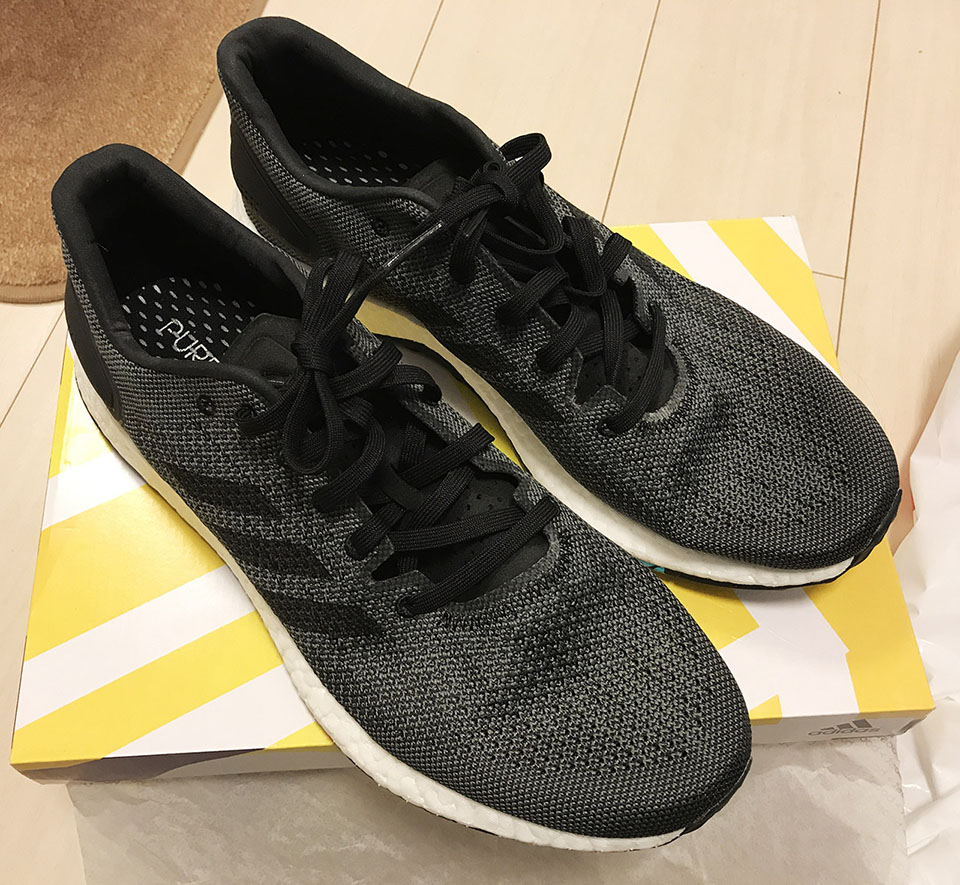

3年ほど履いていたアディダスのスニーカーがいい加減汚くなってきたので、買い換えることにした。

今回買ったのは「**Pure Boost DPR**」というヤツで、どんな服にも合わせやすいグレーカラー。

  

    
  

  

    

      <a href="https://www.amazon.co.jp/dp/B07LGXRHNT?tag=neos21-22&amp;linkCode=osi&amp;th=1&amp;psc=1">[アディダス] メンズ レディース ランニングシューズ ピュア ブースト Pure BOOST DPR カーボン/ブラック/ホワイト BBA75 B37790 28.0cm</a>
    

  

  

    
  

  

    

      <a href="https://hb.afl.rakuten.co.jp/hgc/g00qato2.waxyc827.g00qato2.waxyd02e/?pc=https%3A%2F%2Fitem.rakuten.co.jp%2Feiko-sp%2Frun0217%2F&amp;m=http%3A%2F%2Fm.rakuten.co.jp%2Feiko-sp%2Fi%2F10008385%2F">【★】adidas/アディダス PureBOOST DPR ピュアブースト (B37790) ランニングシューズ</a>
    

    

      <a href="https://hb.afl.rakuten.co.jp/hgc/g00qato2.waxyc827.g00qato2.waxyd02e/?pc=https%3A%2F%2Fwww.rakuten.co.jp%2Feiko-sp%2F&amp;m=http%3A%2F%2Fm.rakuten.co.jp%2Feiko-sp%2F">エイコースポーツ楽天市場支店</a>
    

    
価格 : 7700円

  

外反母趾の位置ぐらいに、オレンジと青緑のアクセントカラーが入っている。コレ、なんかガム踏んだみたいで嫌なんだけど…。他にカラーがなかったので妥協した。

履き心地は「いつものアディダスの*ブースト*」って感じで、安定。「ブースト」ってのは白い発泡スチロールみたいな靴底の素材のことで、ココのクッションが好きでアディダスを履いている。

この Pure Boost は若干ランニング向けだが、普段履きもできる感じで良い。
