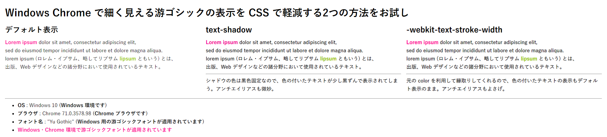
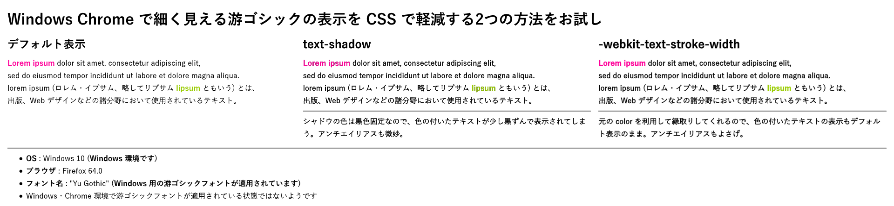
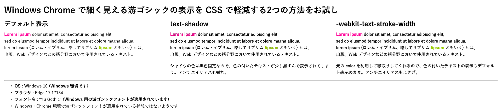
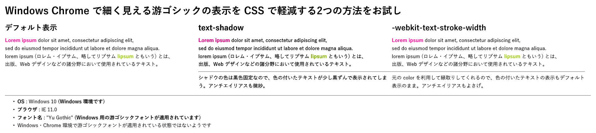

以前、「[ウェブサイトに適用する游ゴシックフォントを見直しまくった最終解](/blog/2019/01/05-02.html)」という記事を書いた。

おかげさまで、はてブで77ブクマ (本稿執筆時点) いただき、皆様もこの件について苦労なさっていることが伺い知れた。

今回はこの続報。**Windows・Chrome 環境で、游ゴシックフォントが適用されている場合のみ、フォントを少しだけ太く表示させる JavaScript と CSS** を作ったので紹介する。開発者が自分のサイトに組み込んで調整いただけるだろう。

## 目次

## 前回のおさらい

「Windows の游ゴシックフォントが細くて見づらい問題」の概要と、前回の記事で紹介した対処法をおさらいする。

### 問題の概要

- 「游ゴシック」フォントは Windows と Mac にプリインストールされており、OS 間で表示差異がなくせるのでは、と期待されたが、上手くいっていない。
- MacOS にインストールされている「游ゴシック体」は、「Medium」ウェイトが一番細いフォントなので、特に調整する必要はない。
- Windows には、「Medium」より細い「Light」「Regular」というフォントが搭載されており、標準では「Regular」が適用されてしまう。OS のガンマ補正の違いもあり、コレが**細く、かすれて見づらい。**
- Windows で「Regular」ウェイトではなく「Medium」ウェイトの游ゴシックを使わせたいのだが、そのための CSS 指定が大変。

### ウェブサイト開発者ができる対処法

- *`font-family` に `"游ゴシック Medium", "Yu Gothic Medium"`* とウェイト込みで指定する (`@font-face` を使う手法も込み)
  - **最近の Windows Chrome ではウェイト込みで記述すると無効になってしまう。**
  - 他のブラウザでは Medium ウェイトになるのだが、`font-weight: bold` 指定している要素に対して「游ゴシック Bold」が適用されず、「游ゴシック Medium」を太くレンダリングして表示されるので、少々違和感がある。
- `font-family: "游ゴシック", "Yu Gothic"` と同時に **`font-weight: 500`** と指定する
  - Windows のどのブラウザでも、「游ゴシック Medium」が適用されるので、一見すると問題が解決したように見える。
  - もし游ゴシックが適用されないユーザ環境で、「ヒラギノ角ゴ」が適用されてしまうと、*`font-weight: 500` 指定のせいで太字のヒラギノ角ゴで表示*されてしまう。コレによって Mac ユーザが困る事態がわりかしあるので、使いづらい。
- 次の CSS で、フォントを少し太めに表示する
  - Chrome であることの判定は CSS ハックでできるが、OS 判定をしていないので、Mac Chrome でも太く見えてしまう。また、`text-shadow` で黒色のシャドウをかぶせているため、**黒以外の文字色に適用すると色が若干くすんで見える。**

```css
/* Chrome でのみフォントを太めに表示する */
@media screen and (-webkit-min-device-pixel-ratio: 0) {
  * {
    text-shadow: transparent 0 0 0, rgba(0, 0, 0, .7) 0 0 0 !important;
  }
}
```

- **游ゴシック Medium を使うことを諦める**
  - 自分のサイトはこの方針にした。単に `font-family: "Yu Gothic"` とだけ指定しており、「游ゴシック Regular」が使われることを諦めた。

### クライアントサイドでできる対処法

- Chrome 拡張機能の「[Chrome Font Rendering Enhancer](https://chrome.google.com/webstore/detail/font-rendering-enhancer/hmbmmdjlcdediglgfcdkhinjdelkiock?hl=ja)」をインストールする
  - 前述の `text-shadow` を追加するモノ。OS 判定をしないこと、黒以外の文字色に対して使うと汚く見える点は同じ。
  - 自分は「[Stylish](https://chrome.google.com/webstore/detail/stylish-custom-themes-for/fjnbnpbmkenffdnngjfgmeleoegfcffe?hl=ja)」拡張機能でこの指定を入れるようにして使っていた
- **レジストリをイジって Regular・Light ウェイトのフォントを Medium フォントに置換する**
  - 「游ゴシック Regular」というフォント名が利用するフォントファイルを、「游ゴシック Medium」のフォントファイルに差し替えてしまう、というモノ。やり方は前回の記事で詳しく紹介しているのでドウゾ。
  - クライアント OS 全体で「游ゴシック Regular」「游ゴシック Light」フォントが実質存在しなくなり、全てが「游ゴシック Medium」ウェイトで見えるようになるので、効果はてきめんだが、ユーザが自分の環境を調整する必要がある。
- 「MacType」というフリーソフトを使う
  - **Chrome には効かない。**
  - 参考：[Google Chrome · snowie2000/mactype Wiki · GitHub](https://github.com/snowie2000/mactype/wiki/Google-Chrome)
  - 参考：[DirectWrite · snowie2000/mactype Wiki · GitHub](https://github.com/snowie2000/mactype/wiki/DirectWrite)
  - 参考：[Chrome で MacType を効かせる MacTypePatch がすごい のこと - ウィンドウズをカスタマイズしたりゲームコントローラーを改造したまとめ](https://uwagakisimasuka.blog.fc2.com/blog-entry-4781.html)

---

おさらいココまで。

## `text-shadow` ではなく `-webkit-text-stroke-width` を使う

途中で紹介した `text-shadow` による太字化は、若干レンダリング結果が汚く見えてしまう。

そこで調べていると、**`-webkit-text-stroke-width`** という、WebKit 向けのプロパティを使うテクニックを見つけた。

```css
body {
  -webkit-text-stroke-width: .4px !important;
}
```

*コレがなかなかキレイに見える*。要素に指定した `color` を利用して上手く縁取りしてくれるので、`text-shadow` のように文字色が濁ったりはしない。**クライアントサイドの拡張機能で `text-shadow` 指定を使っていた人は、よりキレイに見える `-webkit-text-stroke-width` 指定に切り替えることをオススメする。**

`.4px` (= `0.4px`) 部分の指定を少しだけ増やせば、もう少し太く見えるが、やりすぎは禁物。

- 参考：[2018/10/07 Google Chrome＋MacTypeで綺麗に表示させたい - カチュア はてなBLOG](http://kachua.hatenablog.com/entry/2018/10/07/202006)

`text-shadow` 指定とどのくらい違いがあるのかは、以下のデモページで確認できるだろう。

- [Perfect Yu Gothic - Testing 05](https://neos21.github.io/poc-perfect-yu-gothic/testing-05.html)

ついでに、各ブラウザで `text-shadow` 指定と `-webkit-text-stroke-width` 指定とを比較してみた。`text-shadow` 指定はギザギザしがちなのに対して、`-webkit-text-stroke-width` はもう少しなめらかに表示される。

- **Chrome** : デフォルト表示が他のブラウザと比べてもより細く見えていることが分かるだろう
  - 
- **Firefox** : `text-shadow` の、色付きの文字が特に滲んで見える
  - 
- **Edge** : WebKit 系ではないのだが `-webkit-stroke-width` 指定が効く
  - 
- **IE** : `-webkit-stroke-width` 指定が効かないので、デフォルト表示と同じ
  - 

このとおり、`-webkit-text-stroke-width` はなかなか太く・キレイに見えるのだが、このような指定をしなくても普通に見えている Firefox や、なぜか `-webkit` なプロパティを認識できる Edge でも有効になってしまう他、游ゴシックフォント以外に適用すると今度は太すぎて文字が潰れて見えてしまう。

ということは、この CSS を適用する OS・ブラウザを特定し、さらに「**実際に游ゴシックフォントでレンダリングされているのかどうか**」を調べてからでないと、`-webkit-text-stroke-width` を指定して良いかどうか、判断できないということだ。

## `window.getComputedStyle()` では使われているフォントが分からない

OS・ブラウザ判定は、`navigator.userAgent` の文字列を見ていけば分かりそうだが、実際に使われているフォント名を知るのは、一筋縄では行かない。

以前紹介したが、DOM 要素に実際に指定されているスタイル定義を取得できる、`window.getComputedStyle()` という API がある。しかし、*`font-family` については、この API を使っても正確な情報が分からない*のだ。

- [window.getComputedStyle を今更知った](/blog/2017/08/08-04.html)

どういうことか確認できるサンプルを用意した。

- [Detect Actual Font Family](https://neos21.github.io/frontend-sandboxes/detect-actual-font-family/index.html)

上のデモページの「チェック 1」ボタンを押下すると、`window.getComputedStyle()` を使って、ある要素の `font-family` 値を取得する。対象の要素の CSS は、`font-family: "デタラメゴシック", "游ゴシック";` と指定されており、**`window.getComputedStyle()` は `"デタラメゴシック", "游ゴシック"` という文字列を取得してしまう。**

もちろん、「デタラメゴシック」なんてフォントは存在しない。それなのにこのフォント名が取得できてしまうし、「游ゴシック」という文字列も一緒に取れてしまう。それぞれのフォントが実際に使われてレンダリングされているのかどうかは、`window.getComputedStyle()` では分からないのだ。

## `canvas` 要素を使ってフォントレンダリングをチェックする

そこで見つけたのが、`canvas` 要素にそのフォント名を使ってテキストを描画し、ピクセル単位でレンダリング状況をチェックするというコード。

- 参考：[javascript - How to get the actual rendered font when it's not defined in CSS? - Stack Overflow](https://stackoverflow.com/a/38910481)

少し今っぽいコードに調整したのが以下。

```javascript
/**
 * 指定の要素に実際に適用されているフォント名を特定する
 * 
 * https://stackoverflow.com/a/38910481
 * 
 * @param {*} element DOM 要素
 * @return {string} フォント名
 */
function detectFontName(element) {
  // スタイル未指定時のブラウザデフォルトフォント名を取得する
  const detectDefaultFonts = () => {
    const iframe = document.createElement('iframe');
    document.body.appendChild(iframe);
    iframe.contentWindow.document.open();
    iframe.contentWindow.document.write('<html><body>');
    const subElement = iframe.contentWindow.document.createElement(element.tagName);
    iframe.contentWindow.document.body.appendChild(subElement);
    const defaultFonts = getComputedStyle(subElement)['font-family'];
    document.body.removeChild(iframe);
    return defaultFonts;
  };
  
  const fonts = getComputedStyle(element)['font-family'] + ',' + detectDefaultFonts();
  const fontsArray = fonts.split(',');
  const canvas = document.createElement('canvas');
  const context = canvas.getContext("2d");
  const testString = "abcdefghijklmnopqrstuvwxyz!@#$%^&*()ñ";
  let prevImageData;
  document.body.appendChild(canvas);
  canvas.width = 500;
  canvas.height = 300;
  fontsArray.unshift('"Font That Doesnt Exists ' + Math.random() + '"');
  
  for(let i = 0; i < fontsArray.length; i++) {
    const fontName = fontsArray[i].trim();
    context.clearRect(0, 0, canvas.width, canvas.height);
    context.font = '16px ' + fontName + ', monospace';
    context.fillText(testString, 10, 100);
    const imageData = context.getImageData(0, 0, canvas.width, canvas.height);
    const data = imageData.data;
    if(prevImageData) {
      for(let j = 0; j < data.length; j += 3) {
        if(prevImageData[j + 3] !== data[j + 3]) {
          document.body.removeChild(canvas);
          return fontName;
        }
      }
    }
    prevImageData = data;
  }
  
  document.body.removeChild(canvas);
  return 'monospace';
}
```

使い方は以下のとおり。

```css
/* こんな CSS 指定があったとして */
.example {
  font-family: "デタラメゴシック", "游ゴシック", sans-serif;
}
```

```html
<!-- こんな要素が配置されていたとして -->
<div class="example">テキストテキスト</div>
```

```javascript
// 前述の関数を以下のように呼び出す
const targetElement = document.querySelector('.example');
const actualFontName = detectFontName(targetElement);
// → '游ゴシック' と取得できる
```

このように、「デタラメゴシック」という指定は効いていないので無効、次の「游ゴシック」という指定はちゃんとフォントが変わって適用されているので、このフォントが有効だろう、と上手く判断できている。

このコードも完璧ではなく、対象の要素の CSS 指定によっては、`sans-serif` など総称ファミリが返ってくる場合もあるし、完璧ではないのだが、「*実際に游ゴシックでレンダリングされているか否か*」を判断するシチュエーションに限れば、今のところ特に問題はない。

コードを見て分かるとおり、`canvas` 要素や `iframe` 要素を埋め込んで各種判定をするので、DOM を一時的に汚す点はご容赦。

## UA から OS とブラウザを判定する

さて、実際に游ゴシックでレンダリングされているのかどうかは、以上の方法で調べられそうだ。あとは OS とブラウザ判定である。

お手軽なのは [ua-parser-js](https://github.com/faisalman/ua-parser-js) などの npm パッケージを使う方法だが、`navigator.userAgent` から取得した文字列から `String.prototype.match()` で判定するだけでも十分だ。

```javascript
function bolderYuGothicOnWindowsChrome() {
  // User-Agent 文字列を取得する
  const ua = navigator.userAgent;
  
  // Windows かどうかの判定
  const isWindows  = ua.match(/Windows/);
  // Chrome ブラウザかどうかの判定
  const isChrome   = ua.match(/Chrome/) && !ua.match(/Edge/);
  
  // 前述の関数を使って、body 要素に「Yu Gothic」か「游ゴシック」(いずれも Windows 向けの游ゴシックフォント名) が適用されているか判定する
  const fontName = detectFontName(document.body);
  const isYuGothic = fontName.match(/Yu Gothic/) || fontName.match(/游ゴシック/);
  
  // Windows・Chrome ブラウザで游ゴシックフォントが使われていれば、文字を太くする
  if(isWindows && isChrome && isYuGothic) {
    // 文字を太くするためのコード…
  }
```

Chrome ブラウザかどうかの判定がちょっと変わっているところ。実は、Edge のユーザエージェント文字列は、次のようになっている。

```
Mozilla/5.0 (Windows NT 10.0; Win64; x64; ServiceUI 13.1) AppleWebKit/537.36 (KHTML, like Gecko) Chrome/64.0.3282.140 Safari/537.36 Edge/17.17134
```

なんと、Edge ブラウザの UA なのに、*`AppleWebKit` やら `Chrome` やら `Safari` やら*という文言が登場する。コレは、WebKit 系のブラウザと互換性を持たせるための策らしいが、なんとも鬱陶しい。

- 参考：[Microsoft Edgeのユーザーエージェントがカオスなので注意 - Qiita](https://qiita.com/tonkotsuboy_com/items/7b36bdfc3a9a0970d23b)
- 参考：[Edge のユーザーエージェントがいろいろとひどい - Qiita](https://qiita.com/Tzalik/items/980316d11c55acecbfa5)

とりあえず、コレで、クライアント環境を「Windows かつ Chrome ブラウザかつ、指定の要素に游ゴシックフォントが適用されていること」という条件で絞り込むことができた。

## Windows・Chrome・游ゴシック適用済の場合のみ、フォントを少し太くするコード

ということで、次のコードを突っ込めば、**Windows Chrome で游ゴシックフォントが使われている時のみ、`-webkit-text-stroke-width` プロパティを利用して文字を少し太く表示する**ことができるようになる。

- CSS は次のような要領で設定しておく

```css
/* ページ全体には游ゴシックを指定しておく */
body {
  font-family: YuGothic, "游ゴシック体", "Yu Gothic", "游ゴシック", sans-serif;
}

/* 等幅フォント指定など… */
code, kbd, samp, var, pre, textarea {
  font-family: MeiryoKe_Gothic, "Ricty Diminished", Osaka-mono, "MS Gothic", "Courier New", monospace;
}
```

- JavaScript は次のように記述する

```javascript
document.addEventListener('DOMContentLoaded', () => {
  // Windows・Chrome で游ゴシックを指定していれば太く見せる
  bolderYuGothicOnWindowsChrome();
});

/**
 * Windows・Chrome で游ゴシックを指定している場合に
 * -webkit-text-stroke-width を指定してフォントを少し太くする
 * 
 * OS・ブラウザ・body 要素に指定しているフォントが条件に合致しなかった場合は何もしない
 */
function bolderYuGothicOnWindowsChrome() {
  const ua = navigator.userAgent;
  
  const isWindows  = ua.match(/Windows/);
  const isChrome   = ua.match(/Chrome/) && !ua.match(/Edge/);
  
  // Windows 環境ではないか、Chrome ブラウザでない場合は処理を中止する
  if(!isWindows || !isChrome) {
    return;
  }
  
  const fontName = detectFontName(document.body);  // body 要素に游ゴシックが適用されているかどうかで判定する
  const isYuGothic = fontName.match(/Yu Gothic/) || fontName.match(/游ゴシック/);
  
  // 游ゴシックフォントが適用されていないようであれば太字化しないで終了する
  if(!isYuGothic) {
    return;
  }
  
  const bolderStyle = `
    <style id="bolder-style">
      /* 太字化する */
      body {
        -webkit-text-stroke-width: .4px;
      }
      
      /* 等幅フォントなど、游ゴシックを使わない要素には指定しない (この辺の調整はお好みで…) */
      code, kbd, samp, var, pre, textarea {
        -webkit-text-stroke-width: 0;
      }
    </style>
  `;
  // head 要素の末尾に style 要素を追加する
  document.getElementsByTagName('head')[0].insertAdjacentHTML('beforeend', bolderStyle);
}

/**
 * 指定の要素に実際に適用されているフォント名を特定する
 * 
 * https://stackoverflow.com/a/38910481
 * 
 * @param {*} element DOM 要素
 * @return {string} フォント名
 */
function detectFontName(element) {
  // スタイル未指定時のブラウザデフォルトフォント名を取得する
  const detectDefaultFonts = () => {
    const iframe = document.createElement('iframe');
    document.body.appendChild(iframe);
    iframe.contentWindow.document.open();
    iframe.contentWindow.document.write('<html><body>');
    const subElement = iframe.contentWindow.document.createElement(element.tagName);
    iframe.contentWindow.document.body.appendChild(subElement);
    const defaultFonts = getComputedStyle(subElement)['font-family'];
    document.body.removeChild(iframe);
    return defaultFonts;
  };
  
  const fonts = getComputedStyle(element)['font-family'] + ',' + detectDefaultFonts();
  const fontsArray = fonts.split(',');
  const canvas = document.createElement('canvas');
  const context = canvas.getContext("2d");
  const testString = "abcdefghijklmnopqrstuvwxyz!@#$%^&*()ñ";
  let prevImageData;
  document.body.appendChild(canvas);
  canvas.width = 500;
  canvas.height = 300;
  fontsArray.unshift('"Font That Doesnt Exists ' + Math.random() + '"');
  
  for(let i = 0; i < fontsArray.length; i++) {
    const fontName = fontsArray[i].trim();
    context.clearRect(0, 0, canvas.width, canvas.height);
    context.font = '16px ' + fontName + ', monospace';
    context.fillText(testString, 10, 100);
    const imageData = context.getImageData(0, 0, canvas.width, canvas.height);
    const data = imageData.data;
    if(prevImageData) {
      for(let j = 0; j < data.length; j += 3) {
        if(prevImageData[j + 3] !== data[j + 3]) {
          document.body.removeChild(canvas);
          return fontName;
        }
      }
    }
    prevImageData = data;
  }
  
  document.body.removeChild(canvas);
  return 'monospace';
}
```

実際にこのようなコードを埋め込んだサンプルを以下に作った。「有効にする」ボタンで効き目をトグルできるので、確認してほしい (Windows マシンで、Chrome ブラウザ上で確認すること)。游ゴシックフォントが使われていない `pre` 要素は、ボタンを押しても文字が太くならないことを確認できるだろう。

- [Perfect Yu Gothic - Testing 06](https://neos21.github.io/poc-perfect-yu-gothic/testing-06.html)

## 以上

結局、JavaScript を組み合わせないとうまいことフォントの判定ができなかったが、ココまで組み込めば、游ゴシックフォントが細く見えてしまう Windows 環境向けに、かなり良い感じの調整を効かせることはできた。

今回は特に細く見えてしまう Chrome ブラウザに絞ったが、UA 判定を調整すれば IE でも Edge でも Firefox でも適用することはできる。`-webkit-text-stroke-width` で指定する数値についても、お好みで太さを調整してもらえればと思う。
