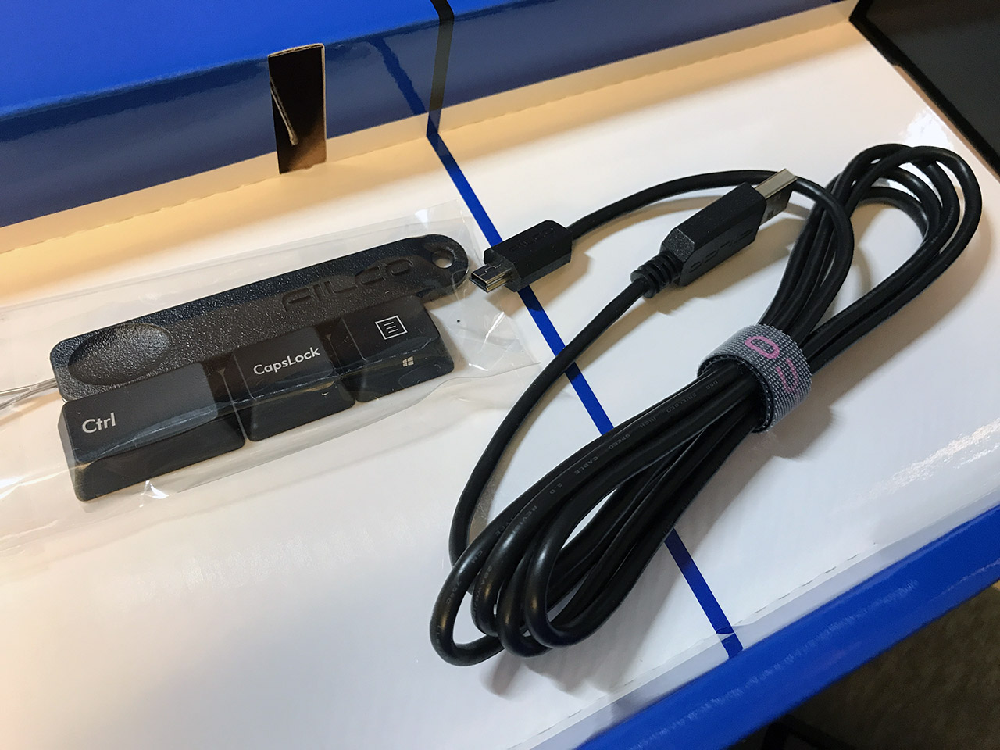
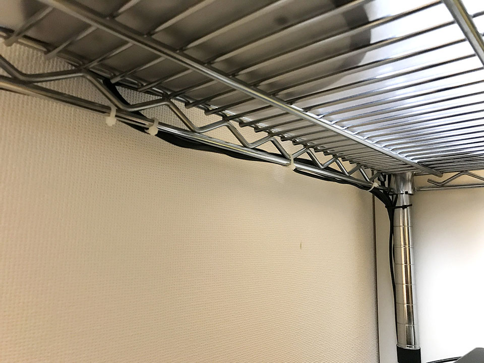

以前、「私のブログ環境」という記事でも紹介したが、僕はメタルラックを机にして、デスクトップ PC を使っている。

- [いつの間にか月間10万 PV 突破していた #わたしのブログ環境 を語る](/blog/2018/04/29-01.html)

一時期は無線のマウスやキーボードを使っていたこともあったのだが、無線マウスが壊れただの、英字配列で好みのキーボードがなくて仕方なく有線のヤツを買っただの、ということで、いつの間にかデスク上はケーブル類が目立つようになってしまった。

それと同時に、床に置いているデスクトップ PC 周辺に散乱するケーブル類も目障りで、いよいよ整理しようという気になった。

今回は、Bluetooth による周辺機器の無線化と、ケーブル整理に関する試行錯誤の一部始終をお届けする。

## 目次

## 整頓前のデスクトップ

作業を始める前に、整頓前のデスクトップをご覧いただこう。

- [Before](https://www.instagram.com/p/Btac4WfAJcR/)

断捨離・ミニマリズムのニワカとして、なるべくモノを置かないようにしているので、深刻なグチャグチャさ加減ではないと思う。が、だらしないケーブル類が視界に入ると、ゲンナリする。

モニタを照らすライトを左上に備え付けているのだが、これの電源ケーブルが雑に垂れ下がっていたりするのも気に入らない。

床周りも、複数の外付け HDD を適当に繋いでいるので、コートが散乱している。

これらの状況を打破すべく、まずはデスクトップ無線化計画からスタートである。

## デスクトップ PC で Bluetooth を受信できるようにする : Newiy Start Bluetooth アダプタ

さて、メインで使っているデスクトップ PC の「ガレリア XG」だが、大抵のデスクトップ PC と同様、本体には Bluetooth を受信する機構がない。

そこで、USB で接続すると Bluetooth 機器が受信できるようになる、*Bluetooth アダプタ*を買うことにする。

以前は Logicool 製品で無線接続していたが、その時は Unifying という専用のレシーバが付属していた。コレは普通の Bluetooth とは互換性がないらしく、それでいて Bluetooth アダプタとは無線が競合するんだとか。ということは、普通の Bluetooth 製品と、Unifying を使用する製品は、併用はできなさそうだ。製品を選ぶ際も気を付けねば。

今回は、Amazon で安めに売られていた「**Newiy Start Bluetooth アダプタ**」というヤツを買った。

↑今回買った製品群。一番左がレシーバ。

取っ手が付いているので、USB ポートから取り外しやすい反面、デスクトップ PC の裏面のようにポートが密集していると、取っ手が隣のポートに干渉しかねないので要注意。スリム型のデスクトップ PC の人なんかは、もしかしたら取っ手がないような Bluetooth アダプタの方が安全かも。

製品を取り付けると、Windows10 のタスクトレイに、Bluetooth のアイコンが表示されるようになった。ココから機器の接続などを行えるようだ。

Bluetooth レシーバのメーカなどに限らず、**Bluetooth の規格自体としては、1つのレシーバにつき最大で7台までの機材を接続できる**ようなので、マウス・キーボード・スピーカーの3台くらいなら接続できるかな？と考えた。

  

    
  

  

    

      <a href="https://www.amazon.co.jp/dp/B07NQ5YGDW?tag=neos21-22&amp;linkCode=osi&amp;th=1&amp;psc=1">TP-Link Bluetooth USBアダプタ ブルートゥース子機 PC用/ナノサイズ / Ver4.0 / 3年保証 UB400</a>
    

  

## シンプルな無線マウス : Logicool M336

さて、レシーバを買ったので、次はコレとペアリングさせる、無線マウスから。

現在使用している有線マウスは、ガレリア XG に付属のモノ。マウスの感度を変更出来るボタンが付いているのが素敵だった。

これの代わりとなる無線マウスは、**Logicool M336** というマウスにした。

↑左の小さいマウスがそれ。右端はサイズ比較用の iPhone6Plus。

  

    
  

  

    

      <a href="https://www.amazon.co.jp/dp/B014S6AXEY?tag=neos21-22&amp;linkCode=osi&amp;th=1&amp;psc=1">ロジクール ワイヤレスマウス 無線 マウス M336BK Bluetooth 6ボタン Windows/Mac/Android対応 M336 ブラック 国内正規品 2年間無償保証</a>
    

  

Logicool 製品だが、Unifying 規格ではなく、通常の Bluetooth で接続できる。以前購入して、現在は会社の Mac 用に使用している、*M558* の後継機のようなモデルだ。

- [MacBookPro 用に Logicool M558 Bluetooth マウスを買った](/blog/2017/03/11-01.html)

M558 は単三電池2本で駆動したが、この M336 は単三電池1本で駆動するので、本体は少し軽め。ペアリングもサクッとできた。

  

    
  

  

    

      <a href="https://hb.afl.rakuten.co.jp/hgc/g00rtgf2.waxyc01f.g00rtgf2.waxyd93a/?pc=https%3A%2F%2Fitem.rakuten.co.jp%2Fd-shop1one%2F4943765042921%2F&amp;m=http%3A%2F%2Fm.rakuten.co.jp%2Fd-shop1one%2Fi%2F10221570%2F">Logicool ロジクール Bluetooth マウス M336 ブラック M336BK</a>
    

    

      <a href="https://hb.afl.rakuten.co.jp/hgc/g00rtgf2.waxyc01f.g00rtgf2.waxyd93a/?pc=https%3A%2F%2Fwww.rakuten.co.jp%2Fd-shop1one%2F&amp;m=http%3A%2F%2Fm.rakuten.co.jp%2Fd-shop1one%2F">ディーショップワン</a>
    

    
価格 : 4380円

  

## テンキーレスの US 無線キーボード : Filco Majestouch Convertible 2 Tenkeyless 茶軸

次に無線キーボード。現在使用しているのは、Dell の標準的な104レイアウトの英字キーボードで、1000円くらいで買ったモノにしては優秀で、使い勝手には何の不満もなかった。

- [Dell の US キーボード KB1421 を買った](/blog/2018/05/26-02.html)

ただ、コレもケーブルが邪魔なので、似たような無線キーボードを買うことにした。

以前から気にはしていたが、値段が高くて選ばなかった「** Filco Majestouch Convertible 2 Tenkeyless**」というキーボードを買うことにした。

  

    
  

  

    

      <a href="https://www.amazon.co.jp/dp/B01LXLQN68?tag=neos21-22&amp;linkCode=osi&amp;th=1&amp;psc=1">FILCO Majestouch Convertible2 Tenkeyless CherryMX茶軸 英語 US ASCII 無線/有線両対応 マルチペアリング4台対応 ブラック FKBC87M/EB2</a>
    

  

コレは、フルサイズキーボードからテンキー部分だけを切り取ったようなレイアウトとなる。テンキーは使わないが、「Insert」や「Delete」キー、矢印キーなどをちっこくしたくない人向けのレイアウトだ。

個人的には「アプリケーションキー」をデフォルトで使いたいのだが、コイツはマルチペアリング機能の切り替えとかもあるので、普段は `Fn` キーとして動作するようになっている。ココだけ、ドノーマルなキー配列と違いがあるものの、まぁアプリケーションキーの使用頻度はかなり少ないから、ギリギリ許容範囲。

一部の特殊キーは、背面の DIP スイッチによってアサインを切り替えられる。アサインを変えた時用のキートップも同梱されているのが素晴らしい。

キーの打ち心地の違いで、青軸・赤軸・黒軸などと呼ばれる種類があるのだが、中でも標準的な茶軸を選んだ。程よく押し心地があり、跳ね返りも程よくあり、タイプ音もそれなりにするので、自分好みだ。

キーボードは単三電池2本駆動で、付属の USB ケーブルで有線接続もできる。何かあった時に無線接続から有線接続に切り替えられる安心感は素晴らしい。

初回のペアリングは、説明書必須。裏面の小さなスイッチを押してリセットしたり、特定のキーコンビネーションを押したり、その上で Windows 設定アプリでウィザード操作したり。ちと手間だが、一度繋がれば問題なし。

先述のマウスとこのキーボードを Bluetooth 接続する分には全く問題なかったのだが、この次に紹介する*スピーカーとの相性が悪かった…。*

英語配列だけでなく日本語配列もあるし、それぞれでテンキー付き・テンキーレスがある。キーの押し心地は茶軸・赤軸・青軸・黒軸の4種類がそれぞれにあるので、好きなタイプを選べるだろう。

  

    
  

  

    

      <a href="https://hb.afl.rakuten.co.jp/hgc/g00rwh82.waxycc66.g00rwh82.waxyd3d8/?pc=https%3A%2F%2Fitem.rakuten.co.jp%2Fkitcut-ps%2F443547%2F&amp;m=http%3A%2F%2Fm.rakuten.co.jp%2Fkitcut-ps%2Fi%2F10095759%2F">【クーポン有】 FILCO Majestouch Convertible 2 青軸 テンキーレス 英語 US ASCII # FKBC87MC/EB2 フィルコ (キーボード) Bluetooth [PSR]</a>
    

    

      <a href="https://hb.afl.rakuten.co.jp/hgc/g00rwh82.waxycc66.g00rwh82.waxyd3d8/?pc=https%3A%2F%2Fwww.rakuten.co.jp%2Fkitcut-ps%2F&amp;m=http%3A%2F%2Fm.rakuten.co.jp%2Fkitcut-ps%2F">Premium Selection 楽天市場店</a>
    

    
価格 : 14500円

  

## PC スピーカーも無線化！ : Creative T12 Wireless

スピーカーのケーブルにも鬱陶しさを感じていたので、この前買った完全ワイヤレスイヤホン (Anker Zolo Liberty) のように、ワイヤレスな PC 向けスピーカーはないものか探してみた。

- [左右独立型完全ワイヤレスイヤホン「Anker Zolo Liberty」を買った](/blog/2018/11/06-01.html)

すると、PC と Bluetooth 接続できるスピーカーはいくつも見つかり、その中でもコスパに優れていそうで、コンパクトなサイズの「**Creative T12 Wireless**」という商品を買ってみた。

  

    
  

  

    

      <a href="https://www.amazon.co.jp/dp/B004184YKY?tag=neos21-22&amp;linkCode=osi&amp;th=1&amp;psc=1">Creative T12 Wireless デスクトップ ステレオワイヤレス スピーカーシステム Bluetooth SP-T12W</a>
    

  

コチラも、オーディオ入力ケーブルを別に買えば、有線接続もできるという安心感もあって、買ってみることにした。

キーボードを接続する前、マウスだけ Bluetooth 接続していた状態でこのスピーカーを Bluetooth 接続してみたのだが、ペアリング後はほぼ遅延もなく、動画なんかは映像との同期もとれた状態で聴こえていた。ボリュームツマミしかないので、イコライジングは PC 設定の方からでしかできないものの、このサイズにしてはちゃんと低音が出ている。ベーシストの耳コピにも耐えられそう。

こりゃなんの問題もないな！と思っていたのだが、Majestouch Convertible 2 を追加で Bluetooth 接続したところ、**スピーカーの音声が断続的に音飛びするようになってしまった。**

1秒おいて0.5秒くらい音が途切れるような聞こえ方で、色々な組み合わせを試してみたが、どうやらキーボードの方がハートビート的な電波を出しているようだった。完全にスピーカーの電波と干渉してしまい、スピーカーの無線接続は断念。

  

    
  

  

    

      <a href="https://hb.afl.rakuten.co.jp/hgc/g00qk9a2.waxyc104.g00qk9a2.waxydc4d/?pc=https%3A%2F%2Fitem.rakuten.co.jp%2Fsurugaya-a-too%2F29146510-1%2F&amp;m=http%3A%2F%2Fm.rakuten.co.jp%2Fsurugaya-a-too%2Fi%2F176384073%2F">【中古】スピーカー ワイヤレススピーカー Creative T12 Wireless [SP-T12W]</a>
    

    

      <a href="https://hb.afl.rakuten.co.jp/hgc/g00qk9a2.waxyc104.g00qk9a2.waxydc4d/?pc=https%3A%2F%2Fwww.rakuten.co.jp%2Fsurugaya-a-too%2F&amp;m=http%3A%2F%2Fm.rakuten.co.jp%2Fsurugaya-a-too%2F">ネットショップ駿河屋　楽天市場店</a>
    

    
価格 : 4240円

  

## 両端ともステレオ入力対応のオーディオケーブル : JVC CN-203A

キーボードを有線にすると卓上のケーブルが目立つが、机の端に置いているスピーカーなら、配線処理さえすればケーブルは気にならないはずだ。

ということで、オーディオ入力ケーブルをテキトーに買ってきた。ライン入力ケーブルの規格とかって詳しくないけど、多分端子に黒いラインが2本入っていればステレオ対応なんだと思う。モノラルも同じ端子に挿さるっぽいけど、多分ステレオで聴けないんじゃね？ってことで両端ステレオ端子のヤツを選んだ。JVC の **CN-203A** という型番のヤツ。

コレで PC とスピーカーを繋いで、有線接続でしのぐことにした。

  

    
  

  

    

      <a href="https://www.amazon.co.jp/dp/B00009VTKA?tag=neos21-22&amp;linkCode=osi&amp;th=1&amp;psc=1">JVCケンウッド ビクター ステレオミニプラグーステレオミニプラグ 1.5M CN-203A</a>
    

  

  

    
  

  

    

      <a href="https://hb.afl.rakuten.co.jp/hgc/g00pksh2.waxyc95f.g00pksh2.waxyd04b/?pc=https%3A%2F%2Fitem.rakuten.co.jp%2Febest%2F4975769000829%2F&amp;m=http%3A%2F%2Fm.rakuten.co.jp%2Febest%2Fi%2F10296380%2F">JVC CN-203A 接続コード ステレオミニ/ステレオミニ 1.5m</a>
    

    

      <a href="https://hb.afl.rakuten.co.jp/hgc/g00pksh2.waxyc95f.g00pksh2.waxyd04b/?pc=https%3A%2F%2Fwww.rakuten.co.jp%2Febest%2F&amp;m=http%3A%2F%2Fm.rakuten.co.jp%2Febest%2F">イーベストPC・家電館</a>
    

    
価格 : 731円

  

## 外付け HDD は電源不要のポータブルタイプ1台にする: Buffalo ミニステーション 4TB HD-PCFS4.0U3-GBA

卓上のケーブルは以上のマウス・キーボードの無線化と、スピーカーは配線で工夫するとして。PC 本体が置かれている床周りももう少し整理してみよう。

自分の歴代の外付け HDD は、120GB → 250GB → 512GB → 1TB → 2TB → 3TB と、ほぼ Buffalo のモノを使ってきた。現在使用している 2TB と 3TB の2台は、2TB の方をデータバックアップ用にし、3TB の方に普段のデータを入れていた。だが、両方とも 1TB 以上空きがあるし、PC 本体にも全く使っていない 2TB の内蔵 HDD が積まれている。電源ケーブルが鬱陶しいし、ココは電源不要のポータブル HDD にしようと決めた。

探してみると、Buffalo から *4TB* のポータブル HDD が出ていたので、コレを購入した。Amazon のレビューに配送の悪さが目立ったが、自分のところに届いたモノはちゃんとしていた。しかし 4TB ってすごい容量だな…。

  

    
  

  

    

      <a href="https://www.amazon.co.jp/dp/B07KRJMTXH?tag=neos21-22&amp;linkCode=osi&amp;th=1&amp;psc=1">BUFFALO ミニステーション USB3.1(Gen1)/USB3.0用ポータブルHDD 4TB HD-PCFS4.0U3-GBA</a>
    

  

PC に USB で接続するだけで給電も行われるので、とってもお手軽。PC 本体の上に置いて接続すれば、全然場所を取らない。PC 本体の上に置くというのは、PC 本体の振動が外付け HDD に悪さしそうだが、どうなんだろう、ちょっと心配ではある。

動作速度は、AC 電源を持っていたモデルと比べると、少し遅いように感じる。連続して画像や MP3 ファイルを開いたりすると、時々モタつきを感じる。しかし、普段そんなに急いでいるワケでもないし、この程度なら問題ないかな。

ひとまずコレで、元々使っていた 2 + 3 = 5TB (全て外付) の環境から、4 + 2 (内蔵) = 6TB の環境に移行できた。

一つもったいないのは、特に故障したりしているワケではない、2TB と 3TB の外付け HDD がお役御免になったこと。PC 付属のマウス、1000円しない安物のキーボード、6・7年使い込んだスピーカーと違って、まだまだ新しく、普通に買うとまぁまぁ高価なので、捨てるのは惜しい…。しかし、使わない…。ｗ

  

    
  

  

    

      <a href="https://hb.afl.rakuten.co.jp/hgc/g00tpjq2.waxyc264.g00tpjq2.waxydd54/?pc=https%3A%2F%2Fitem.rakuten.co.jp%2Fsakura-sakuraco%2Fsakura-sakuraco-5117%2F&amp;m=http%3A%2F%2Fm.rakuten.co.jp%2Fsakura-sakuraco%2Fi%2F10001156%2F">BUFFALO ミニステーション USB3.1(Gen1)/USB3.0用ポータブルHDD 4TB HD-PCFS4.0U3-GBA</a>
    

    

      <a href="https://hb.afl.rakuten.co.jp/hgc/g00tpjq2.waxyc264.g00tpjq2.waxydd54/?pc=https%3A%2F%2Fwww.rakuten.co.jp%2Fsakura-sakuraco%2F&amp;m=http%3A%2F%2Fm.rakuten.co.jp%2Fsakura-sakuraco%2F">さくらSTORE</a>
    

    
価格 : 17214円

  

## 配線を工夫する : ナイロン結束バンドとマジックバンド結束テープ

さて、これらの投資でケーブルの物量を減らしたので、あとは**ケーブルを視界から隠していく**ためのケーブル整理、英語でいうところの Cable Management に移る。

といってもやることは簡単で、今までだらしなく垂れ下がっていたケーブル類を、*ナイロン結束バンド*と**マジックバンド結束テープ**でまとめていくだけ。これらは元々、ギターのエフェクターボードを整理するために買ったものだ。

  

    
  

  

    

      <a href="https://www.amazon.co.jp/dp/B004OCQH8O?tag=neos21-22&amp;linkCode=osi&amp;th=1&amp;psc=1">TRUSCO(トラスコ) ナイロン結束バンド(耐候性タイプ) 3.6×203 100本入</a>
    

  

メタルラックの柱や段の裏側にケーブルを沿わせて、結束バンドや結束テープを適当に使ってまとめていく。

  

    
  

  

    

      <a href="https://www.amazon.co.jp/dp/B000SXOBGS?tag=neos21-22&amp;linkCode=osi&amp;th=1&amp;psc=1">サンワサプライ マジックバンド CA-MF7BK</a>
    

  

ケーブルに付いている「クセ」は、反対側に折ったりしてクニクニすると意外と取れるので、横着せずにクセを直して、できるだけ短い間隔で結束バンドを使っていく。

これまでダラっと床に垂らしていただけだったので、床のタコ足コンセントの周辺がコードまみれだったのだが、メタルラックの「辺」に沿わせるようにしたら長さを稼げたのか、床に到達するケーブルの量が少なくなった。ケーブルを収納するボックスでも買おうかと思っていたのだが、そんなに目立たないので、PC 本体の裏に寄せておけばいいかなーと思い、これにて終了。

始めてみれば意外と時間はかからず、30分ないぐらいで配線の処理が終わった。

## 整頓した結果

コレがケーブルを整理した結果だ。

- [After](https://www.instagram.com/p/BtadC61A5Mw/)
- [ワイヤレスですっきり & ケーブルを結束バンドで縛ったり](https://www.instagram.com/p/BtadPOGB3gO/)

我ながら、かなりスッキリしたと思う。タコ足配線周りはやはりゴチャついて見えるだろうか。やっぱりケーブル収納ボックス買うか…？ｗ

とりあえず、ひとまずやりたいようにできて満足！
