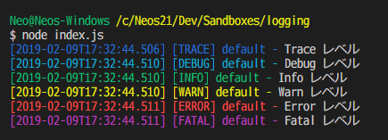

Node.js 製のアプリでログをファイル出力するライブラリである、**log4js** を使ってみた。

- [log4js - npm](https://www.npmjs.com/package/log4js)
- [log4js-node by log4js-node](https://log4js-node.github.io/log4js-node/)

以前、_log4javascript_ というライブラリは使ったことがあって、コチラはファイル出力するアペンダが標準にはなかったので自作したりしていたが、log4js はデフォルトで**ログローテート機能付きのファイル出力アペンダ**が搭載されていて、大変便利だ。

- [log4javascript でファイルにログを書き込む独自の Appender を作る方法](/blog/2017/09/01-01.html)

早速使ってみよう。

## 目次

## log4js のインストール

npm パッケージとして log4js をインストールするだけなので、いつもどおり。

```bash
$ npm install --save log4js
```

本稿執筆時点の最新バージョンは v4.0.2 だった。

## 標準出力するロガーを作成する

まずは最も簡単な構成で、`console.log` と同等の、標準出力するロガーを作ってみる。

```bash
$ touch index.js
```

- `index.js`

```javascript
const log4js = require('log4js');

// アペンダ・ロガーの定義
log4js.configure({
  // アペンダ定義
  appenders: {
    // 標準出力アペンダ
    stdout: {
      type: 'stdout'
    }
  },
  // ロガー定義 : コレが getLogger() の引数で指定する名称になる
  categories: {
    // 'default' は getLogger() の第1引数未指定時にも使用される
    default: {
      appenders: ['stdout'],
      level: 'trace'  // 出力する最低レベルを指定する
    }
  }
});

// ロガーを取得し使用する
const logger = log4js.getLogger('default');  // log4js.getLogger(); でも同じ

// こんな感じ
logger.trace('Trace レベル');
logger.debug('Debug レベル');
logger.info('Info レベル');
logger.warn('Warn レベル');
logger.error('Error レベル');
logger.fatal('Fatal レベル');
```

実行してみた結果が以下のとおり。コンソール出力時にレベル別に色分け表示されるのもありがたい。



## ファイルに出力してみる・ログファイルを日付ローテートさせる

続いて本命、ファイルへの出力。

先程、`appenders` の定義の中で、`type: 'stdout'` と指定していた部分が、アペンダの種類を設定する場所なのだが、単純なファイルへの出力は `type: 'file'` と指定し、_File Appender_ を使えば実現できる。

- [log4js-node by log4js-node](https://log4js-node.github.io/log4js-node/file.html)

この FileAppender の場合、1ファイルのサイズをしきい値に設定するので、日付でのローテートはできない。日付でのローテートをする場合は、`type: 'dateFile'` と指定する、**Date Rolling File Appender** を使う。

- [log4js-node by log4js-node](https://log4js-node.github.io/log4js-node/dateFile.html)

「Date Rolling」とは書いてあるものの、ローテートするファイル名パターンに「時間」や「分」を指定すると、_1時間単位とか1分単位とかでもログファイルを分割_してくれたので、1日単位でなくてもローテートが可能だ。

さっそく実装してみよう。

```javascript
const log4js = require('log4js');

log4js.configure({
  appenders: {
    // 標準出力
    stdout: {
      type: 'stdout'
    },
    // ファイル出力
    system: {
      type: 'dateFile',
      filename: './logs/system.log',  // プロジェクトルートディレクトリを起点とした相対パスで解釈される
      pattern: '.yyyy-MM-dd',         // `filename` の後ろにこのパターンでファイル名が付けられる
      keepFileExt: true,              // `true` を指定すると、ローテートしたファイル名の末尾に拡張子が付く
      compress: true,                 // `true` を指定すると、ローテートしたファイルを .gz 形式で圧縮してくれる
      daysToKeep: 5                   // この数以上にログファイルが溜まると、古いファイルを削除してくれる
    }
  },
  categories: {
    // 標準出力とファイルの両方に出力する
    default: {
      appenders: ['stdout', 'system'],
      level: 'info'
    }
  }
});

const logger = log4js.getLogger();
logger.info('Info レベル');
```

書き方はこんな感じ。`pattern` プロパティがミソだ。`yyyy-MM-dd-hh-mm` と、分単位での分割にも対応していたりして面白い。

`keepFileExt` プロパティは、未指定時は `false` と同じ。その場合は `system.log.2019-01-01` といったファイル名でローテートされるのだが、`keepFileExt: true` にした場合は、`system.2019-01-01.log` というファイル名でローテートされる。末尾に `.log` と拡張子が付くので、拡張子での関連付けが効いてファイルをエディタで開きやすかったりするが、ログファイルを正規表現で指定して操作するような場合は拡張子が後ろにない方が楽だったりするかもしれない。ココはお好みで。

`compress: true` を与えれば圧縮してくれたり、`daysToKeep` で残すファイル数を指定できたり、なかなか高機能だ。

## エラーログだけは別のログファイルに書き出したい : Log Level Filter

さて、基本的にはこの `type: 'dateFile'` なアペンダを使ったロガーを使用すれば良い。しかし、時には「エラーログだけは普段の動作ログと別のファイルに出力したい」という場合もあるだろう。

そんな時は、アペンダを複数作り、対応するロガーを複数作る、としても、一応実現はできる。

```javascript
const log4js = require('log4js');
log4js.configure({
  appenders: {
    // 全レベル出力するログ
    system: {
      type: 'dateFile',
      filename: './logs/system.log',
      pattern: '.yyyy-MM-dd'
    },
    // エラーログ
    systemError: {
      system: {
      type: 'dateFile',
      filename: './logs/error.log',
      pattern: '.yyyy-MM-dd'
    }
  },
  categories: {
    // 普段使用するロガー
    default: {
      appenders: ['system'],
      level: 'info'
    },
    // エラー出力用ロガー
    errors: {
      appenders: ['systemError'],
      level: 'info'
    }
  }
});

// それぞれのロガーを生成する
const defaultLogger = log4js.getLogger('default');
const errorsLogger  = log4js.getLogger('errors');

// 通常のロガーを使用
defaultLogger.info('Info レベル');
// エラー用ロガーを使用
errorsLogger.error('Error レベル');
}
```

…と、こんな風に使用すれば、`system.log` と `error.log` とにログを分けることはできる。

しかし、ログ出力時にどのロガーを使用するのか、毎回間違えないように実装せねばならず、人間がやることなので間違いが起こりやすい。

そこで、**Log Level Filter** という Appender を利用すると、_使用するロガーは1つだけで、あるログレベル以上のログは別のファイルにも出力する_、といったことを実現してくれる。

```javascript
const log4js = require('log4js');

log4js.configure({
  appenders: {
    // ログ (全レベル)
    system: {
      type: 'dateFile',
      filename: './logs/system.log',
      pattern: '.yyyy-MM-dd'
    },
    // エラーログ
    systemError: {
      type: 'dateFile',
      filename: './logs/error.log',
      pattern: '.yyyy-MM-dd'
    },
    // ERROR レベル以上のログのみ収集して systemError アペンダに流す
    justErrors: {
      type: 'logLevelFilter',
      appender: 'systemError',
      level: 'error'
    }
  },
  categories: {
    // ロガーは1つで良い
    default: {
      appenders: ['system', 'justErrors'],
      level: 'info'
    }
  }
});

const logger = log4js.getLogger('default');

logger.info('Info レベル');
logger.error('Error レベル');
```

`type: 'logLevelFilter'` を指定した Appender を用意し、コレをロガー定義の `appenders` に記載する。実際にエラーログのみをファイル出力する `systemError` アペンダ自体は、ロガー定義の `appenders` プロパティには登場しないことに注目して欲しい。

- [log4js-node by log4js-node](https://log4js-node.github.io/log4js-node/logLevelFilter.html)

使用する Logger は1つだけで良いので、実装もシンプルだ。

## 以上

今回紹介していないが、メール送信や Slack 連携ができる Appender の他、出力されるログのフォーマットを変更する Layout 機能など、まだまだ使いこなせていない機能がたくさんある log4js。ロギングに関する大抵のことはできるようになっているので、ぜひ利用してみてほしい。
