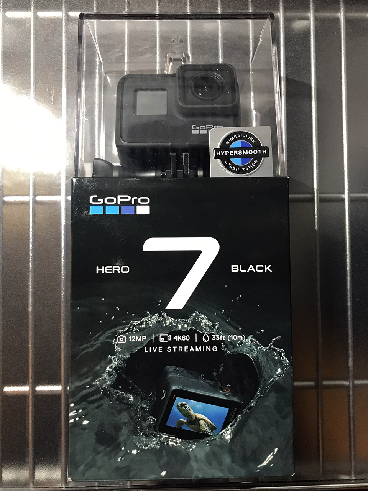
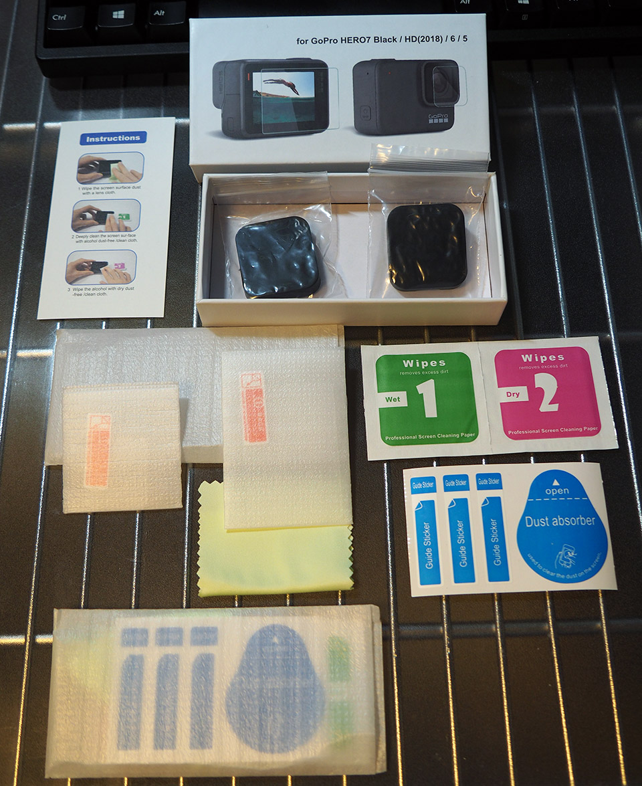
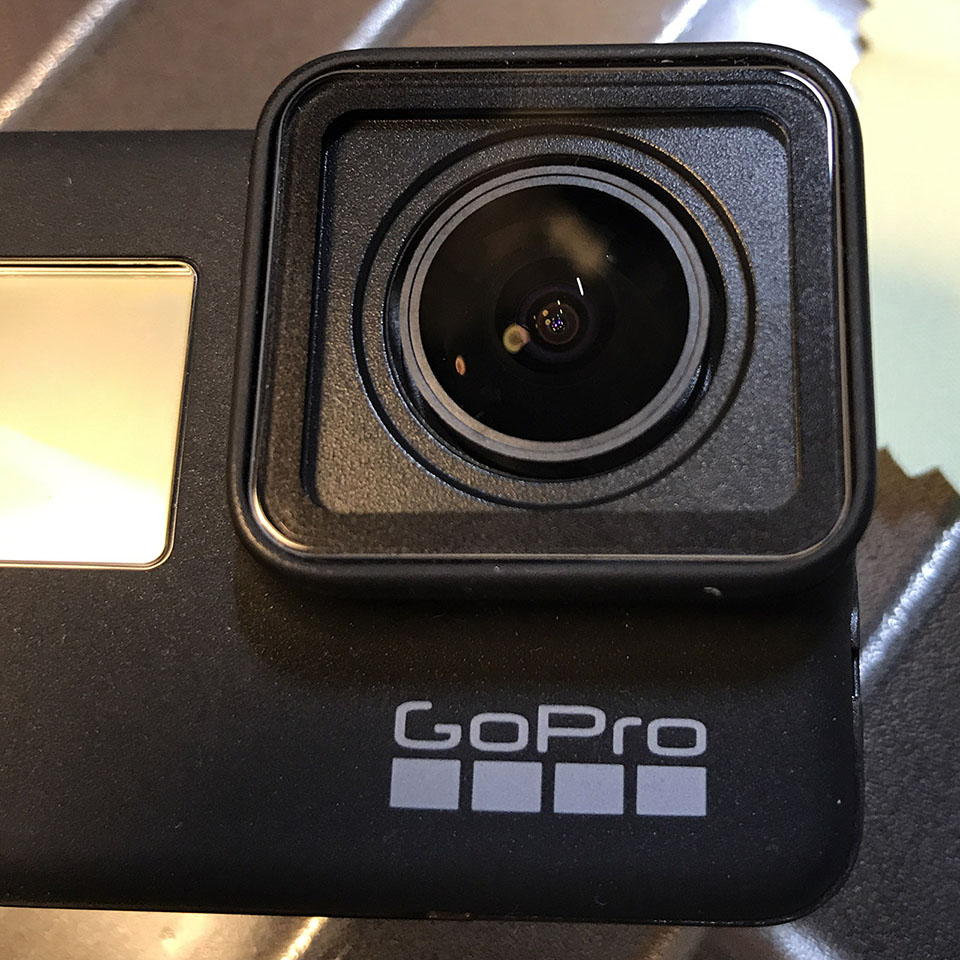
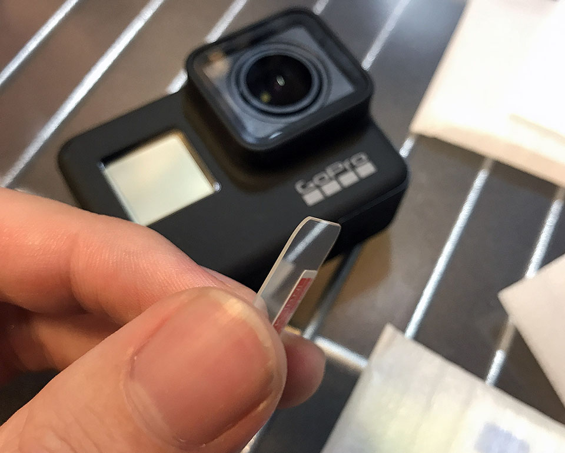
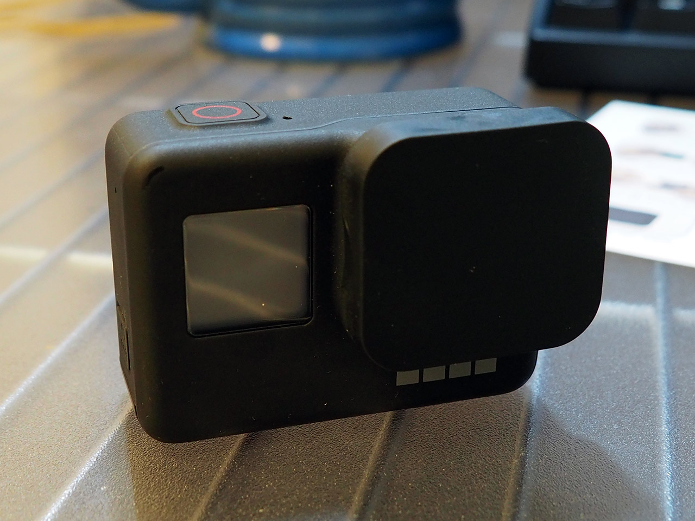
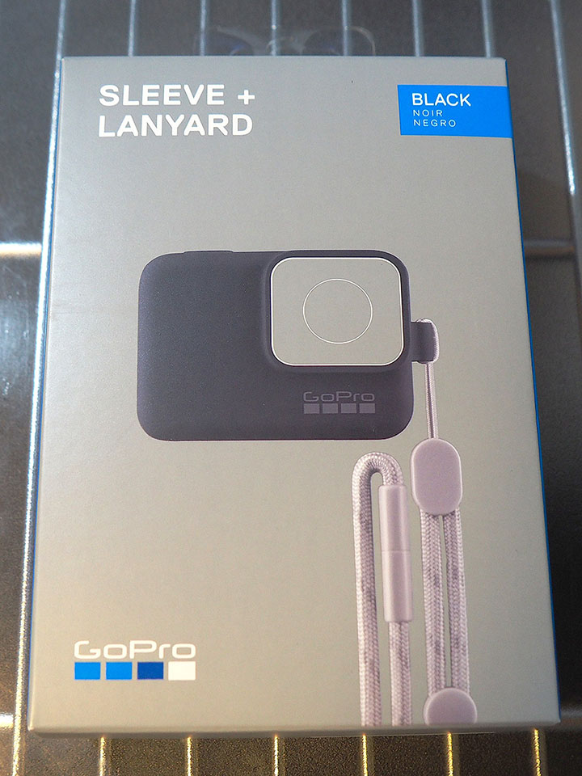
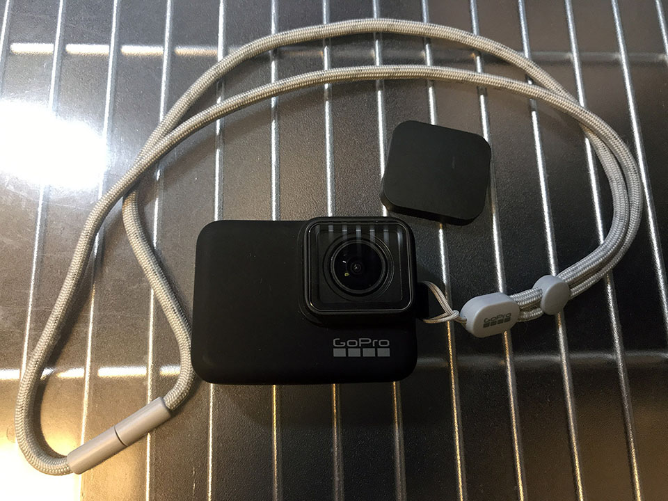

突然だが、2019年3月某日、**GoPro7 Black (CHDHX-701-FW)** を手に入れた。現時点の GoPro シリーズの中で最新かつ最上級のモデルだ。

  

    
  

  

    

      <a href="https://www.amazon.co.jp/dp/B07HC7Q545?tag=neos21-22&amp;linkCode=osi&amp;th=1&amp;psc=1">GoPro ブラツク</a>
    

  

  

    
  

  

    

      <a href="https://hb.afl.rakuten.co.jp/hgc/g00t39x2.waxyc1b7.g00t39x2.waxydf08/?pc=https%3A%2F%2Fitem.rakuten.co.jp%2Fxover-int%2Fgopro7-black%2F&amp;m=http%3A%2F%2Fm.rakuten.co.jp%2Fxover-int%2Fi%2F10001039%2F">GoPro HERO7 ゴープロ 7 ビデオ カメラ アクションカム スノーボード サーフィン アウトドア スポーツ 防水 手ぶれ補正 4K動画 アクセサリー BLACK ブラック 黒</a>
    

    

      <a href="https://hb.afl.rakuten.co.jp/hgc/g00t39x2.waxyc1b7.g00t39x2.waxydf08/?pc=https%3A%2F%2Fwww.rakuten.co.jp%2Fxover-int%2F&amp;m=http%3A%2F%2Fm.rakuten.co.jp%2Fxover-int%2F">マジック・アワー</a>
    

    
価格 : 45880円

  

もう既にあちこちのブログで詳細なレビューがなされているが、購入時点での個人メモとして記録する。

## 目次

## 開封の儀

↑ コレが外箱。

既に何やらマウント台にマウントされた状態で箱に入っている。このマウント部分が折れやすいと聞いたので慎重に取り外す。フレームとかもガッチリしているので指を挟んだりしないよう注意。

本体の重さは 116g。写真・映像の記録は MicroSD カードに行う。最大で 4K の映像も記録できるので、GoPro 公式が発表している推奨 MicroSD カードのスペックを確認し、それ以上のモデルを選んだ方が良いだろう。

バッテリーは取り外しができるが、バッテリー充電器は別売り。本体にバッテリーを付けたまま、本体の USB-C ポートにケーブルを繋ぐことでバッテリーの充電ができる。

## 個人的に気になった最新機能

今回どうして GoPro7 が欲しかったかというと、以下のような最新機能が気になったからである。

- *HyperSmooth* : ビデオの手ブレ補正
- *スローモーション* : 8倍まで対応 (30fps からの8倍 = 240fps に対応)
  - 4K : 60fps まで対応
  - 2.7K・1440p : 120fps まで対応
  - 1080p・960p・720p : *240fps* まで対応 (コレが8倍スロー対応の意)
- *スーパーフォト* : 写真を HDR 撮影できる
- *TimeWarp ビデオ* : 歩いたりしながらタイムラプス動画を撮影した時にビデオを安定化してくれる

HyperSmooth による手ブレ補正がかなり優秀で、手掴みで持ち歩いているのにスタビライザーを使ったかのような安定感が得られるというモノ。この機構を利用した TimeWarp ビデオというモードも面白そうだ。いわゆる「カメラが動くタイムラプス」を手持ち撮影でもキレイに実現できてしまう機能である。

スローモーションにもしっかり対応。常用するであろう 1080p サイズなら 240fps の撮影ができるので、iPhone8 以降と同等のスペックを満たしている。

## Silver・White との主な相違点

GoPro7 は最上位機種である Black の下に、中級モデルの Silver と最下位モデルの White というモノがある。これらとのスペックも簡単に比較しておこう。

- Black の重量は 116g だが、Silver は 94.4g、White は 92.4g。どれも筐体はサイズは同じなのだが重量が若干違う
- **電池が取り出せるのは Black だけ**で、Silver と White は内蔵電池オンリーみたい。電池の消耗が激しいので、バッテリーを複数個持ち歩きたいが、そうやってバッテリーを途中で差し替えられるのは Black だけである
- HyperSmooth や TimeWarp ビデオは Black のみ
- 240fps スローが撮れるのも Black のみ
- スーパーフォトも Black のみ

…と、こんな感じで、先程挙げた気になる機能の殆どが Black のみの機能だったので、自分が買うのは Black 一択だったのである。

- 参考 : <https://jp.gopro.com/help/articles/block/compare-cameras>

## 最低限必要そうな周辺アイテム

GoPro は本体だけ持っていても使いづらいことが多いので、まず使い始めるために最低限必要そうな周辺アイテムを買った。

### レンズ保護フィルム

GoPro のレンズ部分は回転させると取り外せて、交換パーツに取り替えられる。だからレンズ保護フィルムを付けないことも考えたのだが、とりあえず買ってみることにした。

レンズ保護フィルム、裏面の液晶保護フィルム、レンズカバーがセットになっている商品を買った。

全てが2つずつ同梱されているので、フィルムは2回貼り替えられるし、レンズカバーはスペアとして用意できる。コレで1,000円なのは安い。

レンズ保護フィルムを貼ってみた。レンズのガラス部分をピッタリ覆うサイズではないのだが、ガラスのフチの部分は画角的に映像には映らないので、気にしないで OK。

### 液晶保護フィルム

GoPro の裏面の液晶はタッチパネルになっていて、ココで全ての操作ができる。コチラはレンズ部分のように交換が利かないので、保護フィルムは必須だろう。

レンズ保護フィルムもそうだが、厚めのガラスになっていて安心感がある。コチラも液晶全体をピッタリ覆うワケではないが、まぁこんなもんだろう。

### レンズカバー

最後にシリコン製のレンズカバー。スポッとハマるのでお手軽。カバンの内ポケットに GoPro をしまったりする時も安心。

## スリーブ + ランヤード

レンズと液晶の保護はコレで完璧だが、持ち運びはどうしよう。

そう思って探してみると、GoPro 公式の「**スリーブ + ランヤード**」という商品が見つかった。シリコン製のケースに、ストラップが付属する商品だ。

シリコンケースはキツめなので、頑張って押し込む。シリコン素材にホコリが付きやすいものの、ストラップを首から下げても良いし、手首に留めたりしても良いだろう。

## 使ってみた感想

まだ全ての機能を使いこなせているワケではないので、簡単に使ってみただけだが、最初の感想を。

まず、*HyperSmooth による安定感は物凄い*。手持ちの iPhone7Plus なんかもそれなりに手ブレ補正が効くのだが、それよりもさらにヌルヌルと安定している。

このスタビライザー機能を使った *TimeWarp ビデオ*も楽しい。適当に持ち歩いているだけでそれっぽいタイムラプスが作れてしまう。コツとしては、大きめの被写体を一つ決めてそれを中心にカメラを移動させると良い感じ。

電池の消耗はそこまで激しいとは思わないが、10分くらい連続で撮影していたら熱を持ちそうで、電池もそれなりに消耗しそうな感じ。普段使わない GPS 機能を切っておく、液晶の明るさを抑えるなど、電力消費を抑えるための細かな設定が大事。

超広角レンズで、モノが歪んで映るのは面白い。広角だからかなり明るく映るのかと思いきや、普通の室内の明るさでも、カラーノイズが若干乗る。**暗所はそんなに得意ではないみたい**。レンズ自体の大きさは一眼なんかと比べてそこまで大きくないから、やはり暗所に強いモノではなさそうだ。シャッタースピードを自動調整してなるべく明るく映るようにしてくれる補正機能もあったりするので、適材適所で使ってみる。

デフォルトの H.264 形式のまま、1080p・60fps で動画を撮影してみたが、1・2分の動画でも数百 MB と、**かなりファイルサイズが大きくなる**。より効率的に圧縮してくれる HEVC (H.265) 形式も選べるので、再生デバイスの下位互換性を切り捨てて良ければ、積極的に HEVC 形式を選びたいところ。MicroSD カードの容量もかなり大きめなモノを入れておいた方が良いだろう。自分は 64GB のモノを挿している。

iPhone と Wi-Fi 接続できる公式アプリがあるので、コレを入れてみた。セットアップは殆ど不要。iPhone にプレビュー映像が映し出され、録画の開始や停止が iPhone からできる。プレビュー映像は1・2秒遅れて届く感じ。撮影した画像や動画もこの公式アプリで iPhone にダウンロードできるので、GoPro で撮ったモノをサクッと SNS にシェアしたりもできる。

## まだまだ楽しめそう

映像・写真ともに、自分でシャッタースピードやら写り具合やらをカスタマイズできるマニュアルモードもあり、コチラがまだ全然使いこなせていない。

色々な可能性がありそうなので、これからどんどん使っていこうと思う。
