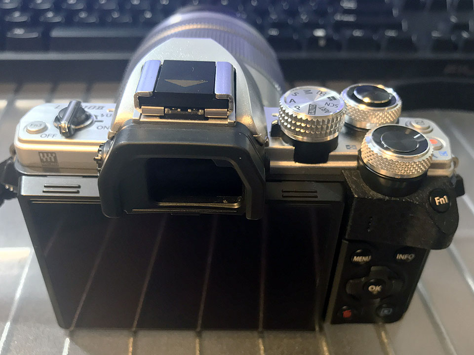

以前、「[TDS のショー撮影用に軽量なカメラ機材を考えた](/blog/2018/11/17-01.html)」という記事を書いた。

この記事の中で、僕は _Panasonic Lumix DC-GF9_ (重量 239g) と、**Olympus M.ZUIKO DIGITAL ED 14-150mm F4.0-5.6** (260g) という組み合わせが最軽量で使いやすいのではないか、と紹介した。

  

    
  

  

    

      <a href="https://hb.afl.rakuten.co.jp/hgc/g00scfj2.waxyc479.g00scfj2.waxyda42/?pc=https%3A%2F%2Fitem.rakuten.co.jp%2Femon-shop%2Fdc-gf9w-d%2F&amp;m=http%3A%2F%2Fm.rakuten.co.jp%2Femon-shop%2Fi%2F10005990%2F">【返品OK!条件付】パナソニック ミラーレス一眼カメラ ルミックス LUMIX Gシリーズ DC-GF9 ダブルレンズキット DC-GF9W-D オレンジ 【KK9N0D18P】【80サイズ】</a>
    

    

      <a href="https://hb.afl.rakuten.co.jp/hgc/g00scfj2.waxyc479.g00scfj2.waxyda42/?pc=https%3A%2F%2Fwww.rakuten.co.jp%2Femon-shop%2F&amp;m=http%3A%2F%2Fm.rakuten.co.jp%2Femon-shop%2F">家電と雑貨のemon（えもん）</a>
    

    
価格 : 57800円

  

カメラ本体は、大きな機能面の変更はないものの、細かな使い勝手が向上している _Lumix GF10/GF90_ という後継機種もある。コチラを選んでも重量は 1g しか変わらず 240g なので、値段が許せばコチラもアリだ。

  

    
  

  

    

      <a href="https://www.amazon.co.jp/dp/B07SYY2X5K?tag=neos21-22&amp;linkCode=osi&amp;th=1&amp;psc=1">パナソニック ミラーレス一眼カメラ ルミックス GF10 ダブルレンズキット 標準ズームレンズ/望遠ズームレンズ付属 オレンジ DC-GF10WA-D</a>
    

  

ただし Lumix はファインダーがないので、ファインダーが欲しければ **Olympus OM-D E-M10 Mark II** (351g) が軽量かつ性能も良い。

  

    
  

  

    

      <a href="https://www.amazon.co.jp/dp/B013QWFT2M?tag=neos21-22&amp;linkCode=osi&amp;th=1&amp;psc=1">OLYMPUS ミラーレス一眼カメラ OM-D E-M10 MarkII EZダブルズームキット シルバー</a>
    

  

さらに、前回の記事時点では調べが付いていなかったのだが、**Panasonic Lumix G Vario 14-140mm F3.5-5.6** というレンズがあった。M.ZUIKO 14-150mm と比べて望遠側が若干劣り、重量も 5g 重くなる 265g だ。しかし、最短焦点距離が約 30cm で、レンズ側で手ブレ補正に対応していて高機能なのだ。

  

    
  

  

    

      <a href="https://www.amazon.co.jp/dp/B00CRVX29G?tag=neos21-22&amp;linkCode=osi&amp;th=1&amp;psc=1">パナソニック 標準ズームレンズ マイクロフォーサーズ用 ルミックス G VARIO 14-140mm/F3.5-5.6 ASPH./POWER O.I.S. シルバー H-FS14140-S</a>
    

  

単に高倍率が欲しければ、2019年3月22日に _M.ZUIKO DIGITAL ED 12-200mm F3.5-6.3_ という新しいレンズが発売される。ただし重量は 455g とかなり重く、Lumix にするにせよ OM-D にするにせよ、本体の方が格段に軽い状態になり、バランスが悪そうだ。

  

    
  

  

    

      <a href="https://hb.afl.rakuten.co.jp/hgc/g00q3om2.waxyc8ad.g00q3om2.waxyd20f/?pc=https%3A%2F%2Fitem.rakuten.co.jp%2Femedama%2F4545350052546%2F&amp;m=http%3A%2F%2Fm.rakuten.co.jp%2Femedama%2Fi%2F10173175%2F">オリンパス M.ZUIKO DIGITAL ED 12-200mm F3.5-6.3</a>
    

    

      <a href="https://hb.afl.rakuten.co.jp/hgc/g00q3om2.waxyc8ad.g00q3om2.waxyd20f/?pc=https%3A%2F%2Fwww.rakuten.co.jp%2Femedama%2F&amp;m=http%3A%2F%2Fm.rakuten.co.jp%2Femedama%2F">カメラのキタムラ</a>
    

    
価格 : 91062円

  

---

…などなど、軽量かつ快適な一眼カメラ環境を考えていたところ…。

…

…

…こ、これは一体……！？

## ゲットしちゃいました。

何やら手元にカメラとレンズが…。

- カメラ : **Olympus OM-D E-M10 Mark II Silver** (351g)
- レンズ : _Panasonic Lumix G Vario 14-140mm F3.5-5.6 ASPH./POWER O.I.S. H-FS14140-S Silver_ (265g)

というセット。両方合わせて 616g なり。

本体が Lumix GF10/GF90 (240g) だったら合計 505g とペットボトル1本分の重さに留められたが、ファインダーがあった方が良いよなーと思って OM-D になった次第。

これまで使ってきた Nikon D5600 と比較すると、本体 415g + 18-55mm レンズが 205g なので 620g。70-300mm レンズは 415g なので、合計 830g。大抵はこの2本のレンズを同時に持ち運んでいるので、415g + 205g + 415g = 1,035g という重さだった。616g というと首から下げた時の重さとしても一番軽く、それでいて高倍率ズームレンズなので使いやすいと思う。

Nikon DX レンズは2本で 18〜300mm、35mm 換算にすると 27〜450mm の範囲をカバーしていたが、今回選んだ Lumix G Vario はマイクロフォーサーズレンズで 14-140mm。コレは 35mm 換算にすると 28-280mm となる。Nikon のレンズからすると望遠側が 170mm ほど足りないが、実のところ TDS に行く頻度も少なくなってきて、時たま行っている TDR の方ならそこまで望遠も必要ない、おまけに撮影後トリミングしちゃえばあんまり変わらない。

というか、マイクロフォーサーズレンズは全体的に「高倍率ズームレンズ」が少なくて、35mm 換算の 450mm 相当が撮れるレンズはほとんどが望遠専門のレンズばかりなのだ。前述の 12-200mm がようやく高倍率なレンズとして登場してくれたぐらいで、あとは 35mm 換算で 300mm ぐらいまでの高倍率レンズが多いのである。今回選んだ 14-140mm も、ほとんど「コレしかない」状態なのだ。

…そんなこんなでこのカメラとレンズの組み合わせになったワケだが、実はカタログスペックをちょっと見ただけで、それ以上のスペックは知らないのだ。その実力やいかに…。

## Olympus OM-D E-M10 Mark II : 多機能・高性能！

まずはカメラ本体、_Olympus OM-D E-M10 Mark II_ を見てみる。

- [OM-D E-M10 Mark II | デジタル一眼カメラ OM-D | オリンパス](https://www.olympus-imaging.jp/product/dslr/em10mk2/)

今回購入したのはシルバーカラー。ライカ的な「オシャレカメラ」の雰囲気漂う。

電源が本体左側、シャッターとは逆側にあり、_一旦両手で握らないと電源を入れられない_、というのはちょっとイマイチか。

ボタンが色々付いていて、まだ使いこなせていない。モード選択も何やらいっぱいあって、説明書をガッツリ読まないと使いこなせない感ある。とりあえずフルオートで撮ってみたが、素直で使いやすい。

「Menu」ボタンを押すと開く_設定画面はちょっと複雑。_多機能かつ高機能なので、出来ることが多く、設定項目も多い。モード選択ダイヤルの位置によって、設定可能な項目も変わるので最初は混乱した。

**カメラ本体に手ブレ補正**機構があり、さすがに手ブレには強い。室内で適当に撮ってもブレずに撮影できるのは素晴らしい。

ただし、電源を入れてから切るまで、_ずっと本体から「キコキコ」「ピー」といった音が鳴っている。_ボディ内手ブレ補正がない Nikon D3100 や D5600 ではこんな音はしたことなかったので、この音が正常なのか異常なのか、区別が付かなかった。中古品だったので、ワンチャン故障してるか…？とも思ったのだが、調べてみると_こういう仕様_らしい。

- 参考：[価格.com - 『オートフォーカスの音』 オリンパス OM-D E-M10 Mark II 14-42mm EZレンズキット のクチコミ掲示板](https://bbs.kakaku.com/bbs/J0000017175/SortID=21219417/)

カメラに一番顔を近付ける撮影者としては、この動作音は結構気になるところ。オートフォーカスの設定次第で、シャッターを切るまでは手ブレ補正しない、とか選べるみたいではあるが、こういう仕様だということで諦めよう。

電子ファインダーは自然に見える。タッチパネル液晶を親指でグリグリするとフォーカスポイントが選べ、コレも使いやすい。この辺の操作性は D5600 とそんなに変わらないので嬉しい。

動画性能は、事前に調べていたとおり、1080p・60fps 撮影ができるので十分。4K は撮れないが、4K なんて撮ったところで使わないのでおけおけ。

商品を購入した直後、電源を入れると「日時を設定してください」と表示されたので、素直に設定した。しばらく使った後、バッテリーを本体から取り出して充電していたのだが、バッテリーを入れ直して本体を再起動すると、また「日時を設定してください」と表示されてしまった。_何でこんなに頻繁に日時を設定しろと云われるのだ？_中古品だったからワンチャン故障してるか？と思ったら、コレも**そういう仕様**みたい。

- 参考：[000567カメラに設定した日付がクリアされてしまう。 | オリンパス](https://digital-faq.olympus.co.jp/faq/public/app/servlet/qadoc?QID=000567)

Nikon の時はバッテリーなんかしばらく外しておいても日時を再設定しろなんて云われたことなかったのに、_OM-D はバッテリー電池を抜いて1日もすると、内蔵時計がリセットされてしまう_らしいのだ。**何だこの残念ポイントは。**

多機能・高機能なのに、変なところに欠点がある、不思議なカメラだ。

## Panasonic Lumix G Vario 14-140mm F3.5-5.6 ASPH./POWER O.I.S. H-FS14140-S : 高倍率なのに AF 速め！

続いて高倍率ズームレンズ、_Lumix G Vario 14-140mm_ を中心に見てみる。

- [デジタル一眼カメラ用交換レンズ H-FS14140 詳細(スペック) | ムービー／カメラ | Panasonic](https://panasonic.jp/dc/p-db/H-FS14140_spec.html)

この商品は F 値が F3.5〜5.6 なのだが、このレンズの前モデルに、

- Panasonic Lumix G Vario HD 14-140mm **F4.0-5.8** ASPH./MEGA O.I.S. H-VS014140

というモノがある。コチラの旧モデルは F 値が少し暗く、最短撮影距離は約 50cm、重量も 460g とかなり重い。今回僕が入手した新しい方のレンズとはかなり機能差があるので、中古品を漁る時は間違えないようにご注意を。

  

    
  

  

    

      <a href="https://www.amazon.co.jp/dp/B0021L90JS?tag=neos21-22&amp;linkCode=osi&amp;th=1&amp;psc=1">パナソニック 望遠ズームレンズ マイクロフォーサーズ用 ルミックス G VARIO HD 14-140mm/F4.0-5.8 ASPH/MEGA O.I.S. H-VS014140</a>
    

  

自分は今回、OM-D のボディカラーと合わせるため `H-FS14140-S` というシルバーカラーのモノを選んだ。同モデルにはブラックカラーもあるのだが、コチラには `H-FS14140-K` と `H-FS14140-KA` という2つの型番がある。両者は見た目の仕上げが若干違うだけで性能は同じ。見た目の黒色に強いコダワリがないのであれば別に好きな方を買って大丈夫だ。

- 参考：[価格.com - 『KとKAとは何が違うのでしょうか？』 パナソニック LUMIX G VARIO 14-140mm/F3.5-5.6 ASPH./POWER O.I.S. H-FS14140-S シルバー のクチコミ掲示板](https://bbs.kakaku.com/bbs/K0000510132/SortID=21500512/)

このレンズは _Power O.I.S_ という光学式手ブレ補正が付いているので、カメラ本体に手ブレ補正が付いていなくても大丈夫。本体の手ブレ補正同様、性能は申し分ないのだが、**電源を入れている間、レンズからも「ピーー」「キリキリ」といった音が聞こえる。**本体の手ブレ補正の動作音もそうだが、このような動作音は Nikon D5600 の時にはほとんどなかった (シャッターを半押しした時にレンズがキリキリッと鳴る程度) ので、ちょっと慣れない。

最短撮影可能距離が**約 30cm** と、高倍率ズームレンズの中では珍しく_近付いて撮影できる。_大抵の高倍率ズームレンズは最短撮影距離が 50cm 程度なのでコレは嬉しい。Nikon DX AF-P 18-55mm でも最短撮影距離は 25cm なので、通常のズームレンズのように使えて便利だ。

フィルター経は 58mm。レンズキャップにはタムロン同様の取り外しやすい機構が付いているのが嬉しい。

中古品だったのだが、幸いにも美品で、使い勝手も良さげだった。

## 周辺アイテムを買った

ココまでだとカメラ本体とレンズしかないので、カメラを買った時に必ず揃える周辺アイテムを同時購入した。

### 液晶保護フィルム

OM-D E-M10 Mark II の液晶は、Nikon D5600 のように回転して閉じられないので、常に液晶がむき出しになる。タッチパネルでもあるので、大きなキズが付いては困る。

そこで、本機専用の液晶保護フィルムを買った。

貼ってみた。

普通！

### レンズ保護フィルタ

次はレンズ保護のためのフィルタ。ケンコーの 58mm 経の保護フィルタを買った。

付けてみた。

良いね！

### ストラップ

せっかくオシャンティな銀色カメラを買ったので、ストラップもオシャンにしたいと思い、細めのヤツを購入。

いつもこのフックに通すところのやり方が分からなくなるので、箱に説明図があるのは嬉しい。

ココを通して…

内側に持ってきて…

ハニカムなパーツはちょっとキツめなので、頑張ってストラップを押し込んでいく。

できた！

## Nikon D5600 と並べてみる

機材の_軽量化_が目的だった本機だが、Nikon D5600 と比べると**小型化**も実現できて、持ち運びやすくなったと思う。

本体が薄くなっているのが写真でも分かるだろう。Lumix レンズのズーム回転方向は Nikon と同じで嬉しい。

ついでに GoPro7 Black も並べてみた。わーいv

## 今のところ不満なし！

レンズ性能としてはコレまでと比べて望遠側が足りない気がするし、本体も電池を抜くと一晩で日時を忘れやがるオチャメなところもあったりする。カメラ・レンズともに動作音が気になるところではあるが、今のところそれ以上の大きな不満はない。写真も動画もキレイに撮れてるし、手ブレ補正は上出来だ。

まだまだカメラ本体の設定を網羅できていないので、一つずつ説明書を読みながら試していきたい。

