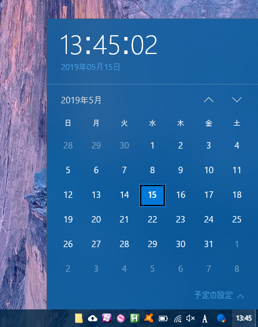
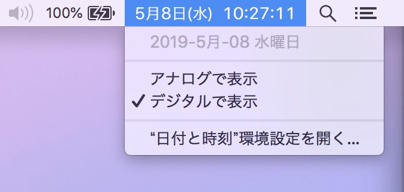
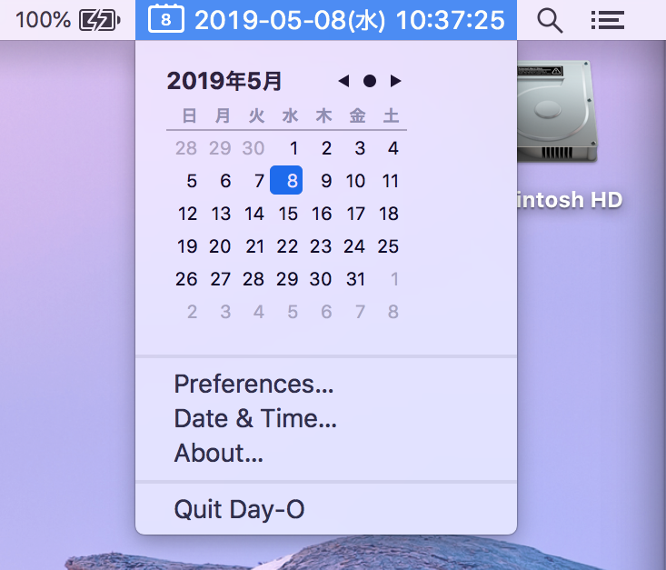
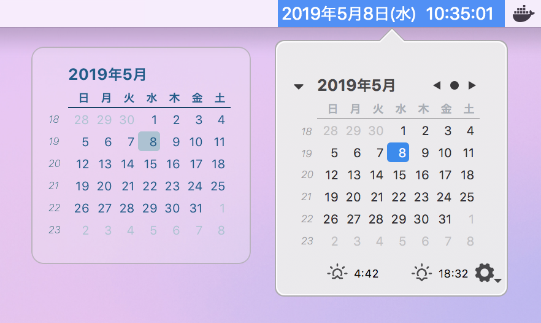
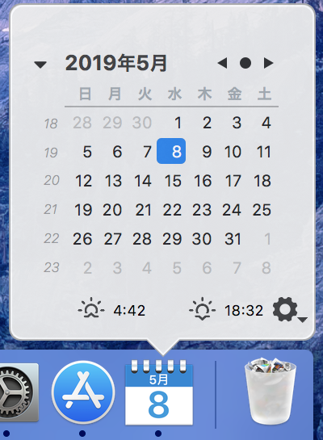

Windows のタスクバーにある時刻をクリックすると、月表示のカレンダーが開く。

一方 MacOS の標準時計にはそのような機能はない。

カレンダーを見るためだけにターミナルを開いて `$ cal` と打って確認するのも面倒な時がある。

そこで、Windows 同様、クリックするとカレンダーが表示できるメニューバーを配置するためのフリーソフト「**Day-O 2**」を紹介する。

Day-O 2 は以下のページよりダウンロードできる。

- [Day-O 2 // ShaunInman.com](https://shauninman.com/archive/2016/10/20/day_o_2_mac_menu_bar_clock)

DL した Zip ファイルを解凍し、出てきた `.app` ファイルを `Applications` に移して起動する。

起動すると、メニューバーに Day-O 2 の日付表示が現れるが、恐らくは既存のアイコン群の一番左に配置されるかと思う。メニューバーのアイコンの並びは、**Command キーを押しておいてからアイコンをドラッグすれば移動できる**ので、右端に移動しておこう。そして、標準の時刻表示は「システム環境設定」の「日付と時刻」より「メニューバーに日付と時刻を表示」のチェックを外すことで非表示にすれば、Day-O 2 が標準の時計の代わりになってくれる。

-----

似たようなアプリは他にもいくつかあるようだ。

App Store よりダウンロードできる **Mini Calendar** は、デスクトップ上、ドックアイコン、メニューバーのどこにでも配置できるのだが、月日のゼロパディングや表示書式の細かな設定ができないので個人的にはちょっと微妙。気にならない人ならコチラでも良いかも。

-----

以上。コレで少し Mac の時刻確認が便利になった。
