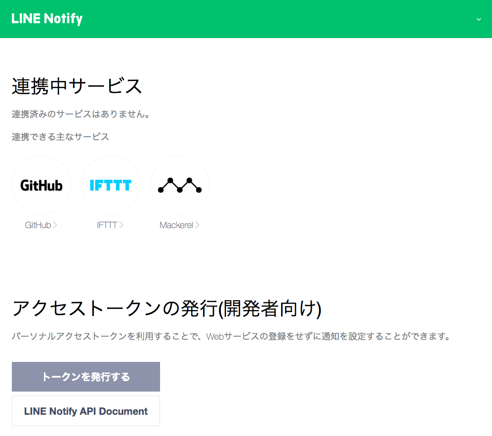
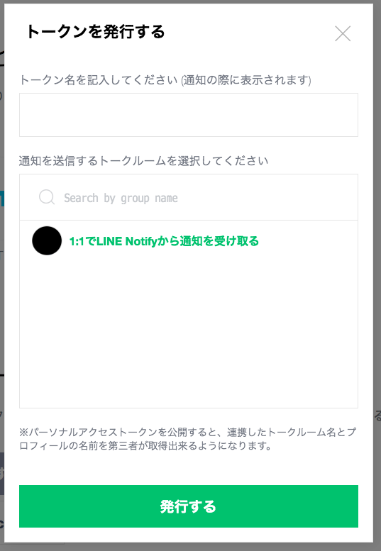
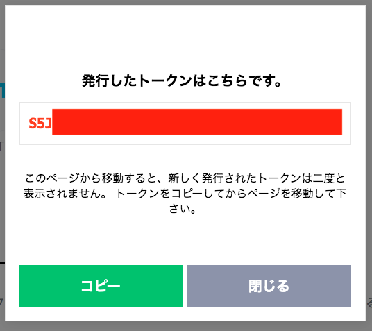
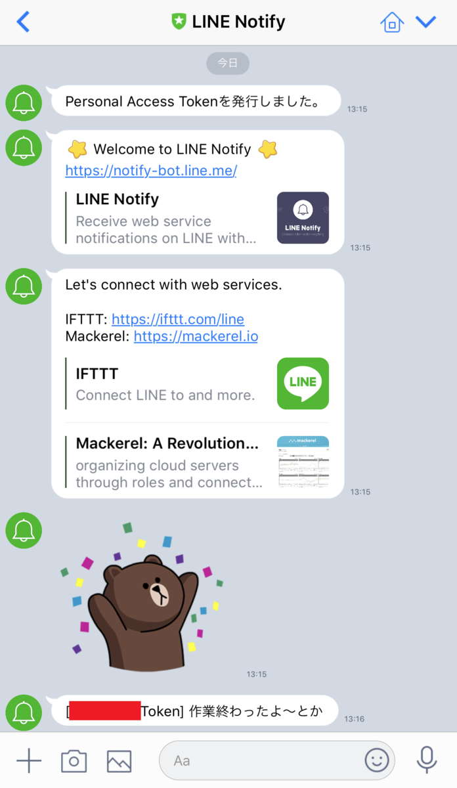

**LINE Notify** というサービスを利用すると、コマンドラインから LINE アプリに対して通知を送れたりするので試してみた。

## 目次

## パーソナルアクセストークンを発行する

まずは LINE Notify API をコールするためのトークンを発行する。次のページに移動し、自分の LINE ID でログインする。

- [LINE](https://notify-bot.line.me/my/)

すると「トークンを発行する」というボタンがあるのでコレを押下する。



トークン名を任意で決め、送信先を選ぶ。今回は自分自身に1対1で送信するようにしてみる。トークン名は受信メッセージの冒頭に表示されるので、それを意識して書いておくと良い。



トークンを発行すると次のような画面が表示されるので、トークン文字列をコピーしておく



## `curl` でメッセージを送ってみる

先ほど生成したトークンを加えて、次のようなコマンドを作ってみる。なんとなく「作業が終わった通知」みたいなテイで適当にメッセージを入れておく。

```bash
$ curl -X POST -H 'Authorization: Bearer 【トークン】' -F 'message=作業終わったよ〜とか' https://notify-api.line.me/api/notify
```

実行すると次のようなレスポンスが受け取れるはずだ。

```json
{"status":200,"message":"ok"}
```

そしてスマホで LINE を開くと、以下のようにメッセージが届いているはずだ。



## 以上

コレで簡単に LINE への通知が送れるようになった。長時間かかる処理の結果を外出先で取得する、といったスクリプトも書けるようになるだろう。

- 参考 : [Using LINE Notify to send messages to LINE from the command-line - LINE ENGINEERING](https://engineering.linecorp.com/ja/blog/detail/88/)
- 参考 : [【ShellScript】LINE Notifyを使ってコマンドラインから通知をさせる - Qiita](https://qiita.com/shutokawabata0723/items/a5a193c1dfe76c488f92)
